# AI Coaching System

<cite>
**Referenced Files in This Document**
- [backend/main.py](file://backend/main.py)
- [backend/requirements.txt](file://backend/requirements.txt)
- [frontend/learning.php](file://frontend/learning.php)
- [frontend/index.php](file://frontend/index.php)
- [frontend/css/style.css](file://frontend/css/style.css)
- [frontend/includes/header.php](file://frontend/includes/header.php)
- [frontend/includes/footer.php](file://frontend/includes/footer.php)
</cite>

## Table of Contents
1. [Introduction](#introduction)
2. [Project Structure](#project-structure)
3. [Core Components](#core-components)
4. [Architecture Overview](#architecture-overview)
5. [Detailed Component Analysis](#detailed-component-analysis)
6. [Dependency Analysis](#dependency-analysis)
7. [Performance Considerations](#performance-considerations)
8. [Troubleshooting Guide](#troubleshooting-guide)
9. [Conclusion](#conclusion)

## Introduction

The AI Coaching System is a real-time assistance component integrated into the Octal Foundry learning platform. This system provides intelligent coaching suggestions to learners working on code exercises, particularly in computer vision and machine learning contexts. The system consists of two primary components: a backend API service built with FastAPI that generates coaching hints, and a frontend widget that displays these suggestions to users in an interactive floating action button interface.

The coaching system is designed to enhance the learning experience by providing contextual, real-time feedback during code exercises. It integrates seamlessly with the learning interface, offering immediate assistance when learners encounter challenges in implementing neural network architectures and other programming tasks.

## Project Structure

The AI Coaching System follows a clear separation of concerns with distinct backend and frontend components:

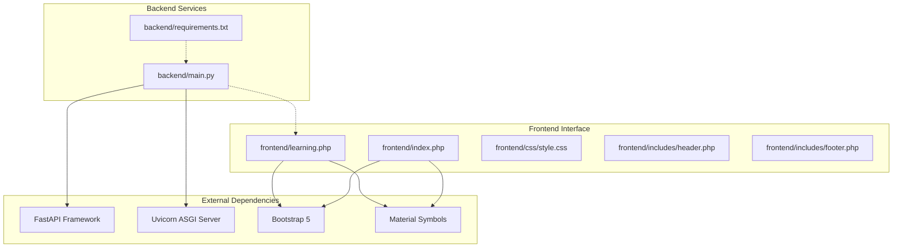

**Diagram sources**
- [backend/main.py](file://backend/main.py#L1-L30)
- [backend/requirements.txt](file://backend/requirements.txt#L1-L3)
- [frontend/learning.php](file://frontend/learning.php#L1-L215)

The project structure demonstrates a clean separation between the AI coaching backend service and the frontend learning interface. The backend provides a RESTful API endpoint for coaching suggestions, while the frontend implements an interactive widget that users can activate to receive real-time assistance.

**Section sources**
- [backend/main.py](file://backend/main.py#L1-L30)
- [frontend/learning.php](file://frontend/learning.php#L1-L215)

## Core Components

### Backend API Service

The backend component is implemented using FastAPI, providing a lightweight and efficient REST API for coaching suggestions. The service includes comprehensive CORS configuration to support development environments and handles cross-origin requests from the frontend.

Key backend features include:
- **CORS Middleware**: Configured to allow requests from localhost domains
- **Health Check Endpoint**: Basic status verification
- **Coaching Hint Endpoint**: `/api/coach/hint` returning structured coaching suggestions

### Frontend Coaching Widget

The frontend implements a sophisticated floating action button (FAB) widget that provides an intuitive interface for accessing AI coaching suggestions. The widget includes:

- **Interactive Toggle Button**: Smart Toy icon that activates the coaching interface
- **Tooltip Bubble**: Contextual suggestion display with AI coach branding
- **Real-time Integration**: Dynamic loading of coaching suggestions via API calls
- **Responsive Design**: Mobile-first approach with Bootstrap framework

### Integration Architecture

The system maintains loose coupling between components through well-defined interfaces:

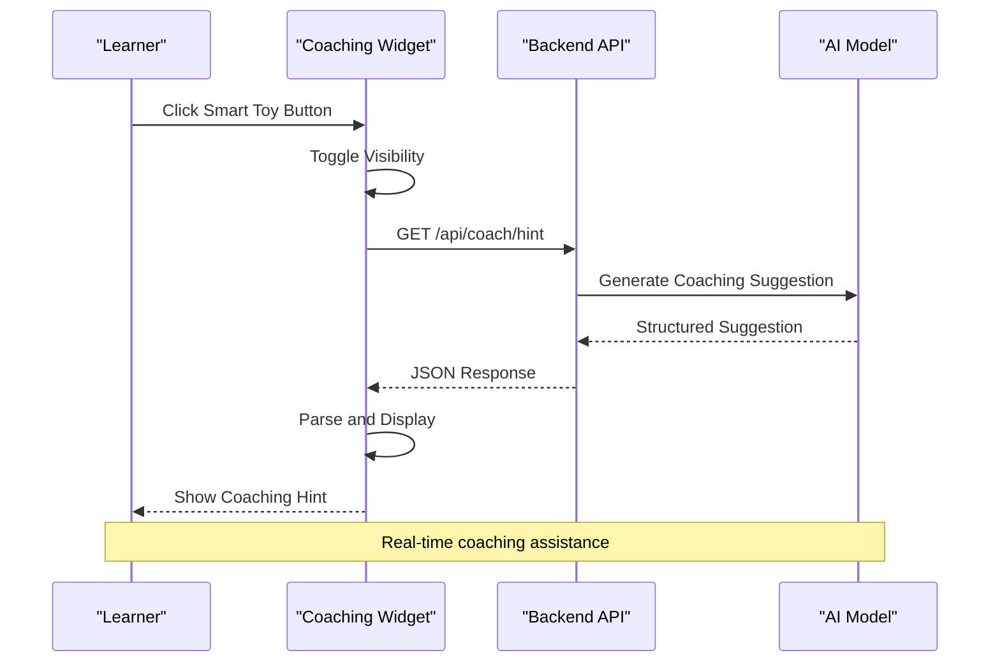

**Diagram sources**
- [backend/main.py](file://backend/main.py#L23-L29)
- [frontend/learning.php](file://frontend/learning.php#L177-L212)

**Section sources**
- [backend/main.py](file://backend/main.py#L1-L30)
- [frontend/learning.php](file://frontend/learning.php#L152-L214)

## Architecture Overview

The AI Coaching System employs a client-server architecture with clear separation of concerns:

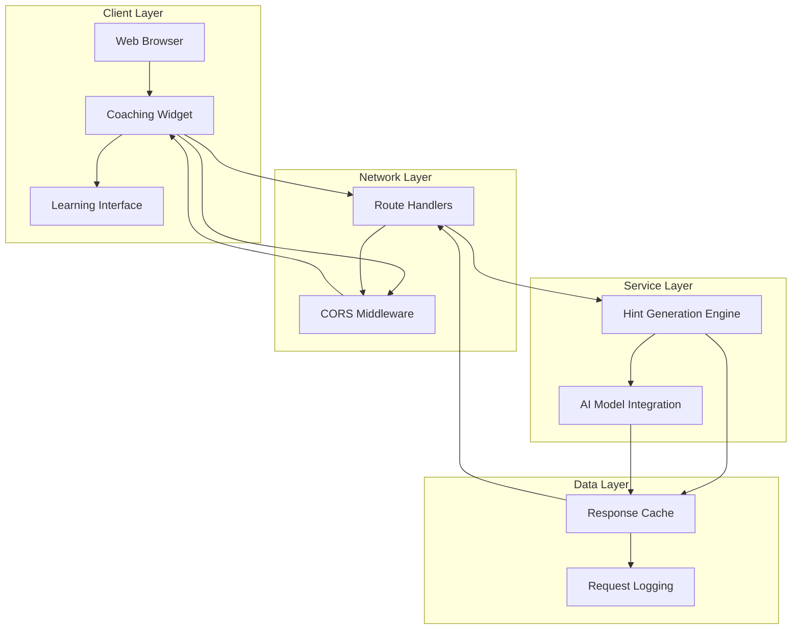

**Diagram sources**
- [backend/main.py](file://backend/main.py#L1-L30)
- [frontend/learning.php](file://frontend/learning.php#L177-L212)

The architecture supports scalability through modular design, allowing individual components to be enhanced or replaced without affecting the entire system. The CORS configuration enables flexible deployment scenarios, while the API endpoint structure provides a foundation for future expansion.

**Section sources**
- [backend/main.py](file://backend/main.py#L1-L30)
- [frontend/learning.php](file://frontend/learning.php#L177-L212)

## Detailed Component Analysis

### Backend API Implementation

The backend service is implemented using FastAPI, providing modern Python web framework capabilities with automatic OpenAPI documentation generation.

#### API Endpoint Definition

The `/api/coach/hint` endpoint serves as the primary interface for coaching suggestions:

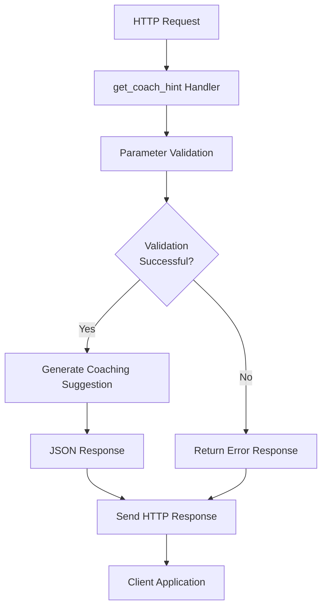

**Diagram sources**
- [backend/main.py](file://backend/main.py#L23-L29)

#### Response Format Specification

The coaching API returns a structured JSON response containing three essential fields:

| Field | Type | Description | Example |
|-------|------|-------------|---------|
| `message` | String | Human-readable coaching suggestion | "Your code is missing a BatchNorm2d layer after the first convolution." |
| `layer` | String | Neural network layer reference | "BatchNorm2d" |
| `position` | String | Positional context within model architecture | "after first Conv2d" |

#### CORS Configuration

The backend implements comprehensive CORS middleware configuration:

```python
origins = [
    "http://localhost",
    "http://localhost:8080",
]

app.add_middleware(
    CORSMiddleware,
    allow_origins=["*"], # Allow all for now to avoid issues in dev
    allow_credentials=True,
    allow_methods=["*"],
    allow_headers=["*"],
)
```

**Section sources**
- [backend/main.py](file://backend/main.py#L1-L30)

### Frontend Widget Implementation

The frontend widget provides an intuitive interface for accessing coaching suggestions through a floating action button design.

#### Widget Structure

The widget consists of several key components:

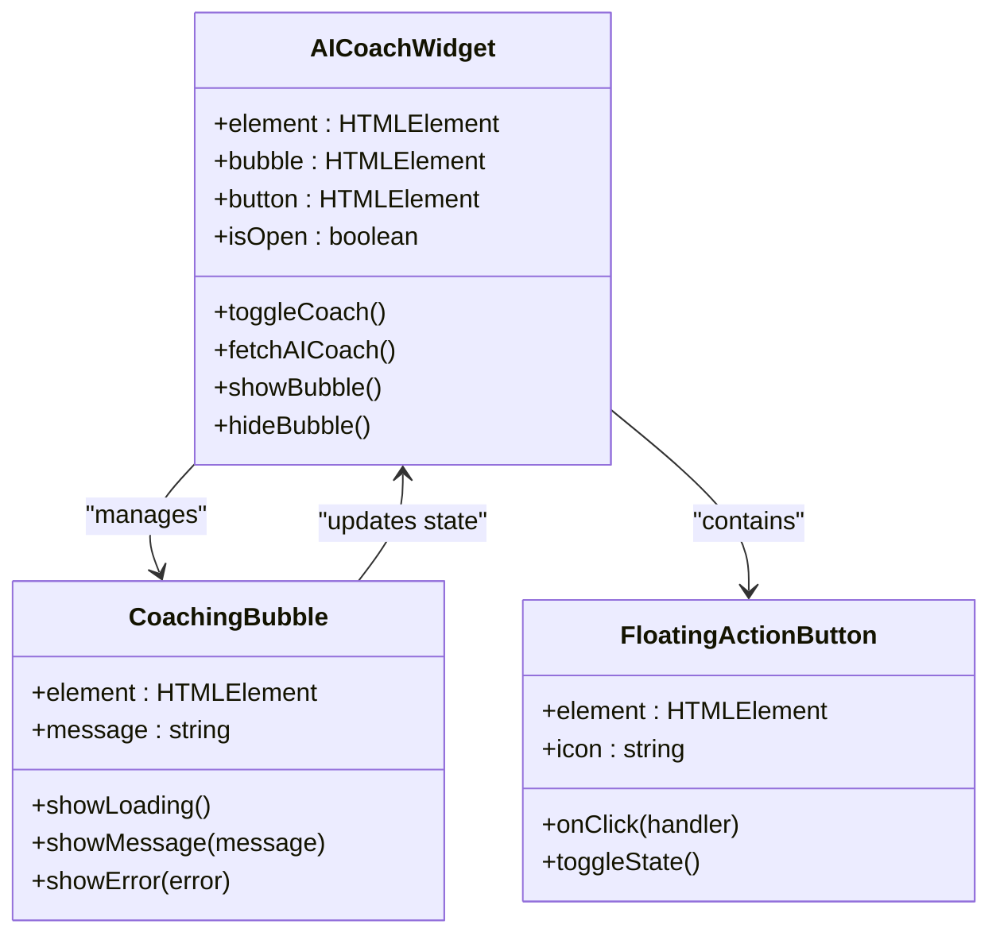

**Diagram sources**
- [frontend/learning.php](file://frontend/learning.php#L152-L175)

#### Interactive Behavior

The widget implements sophisticated user interaction patterns:

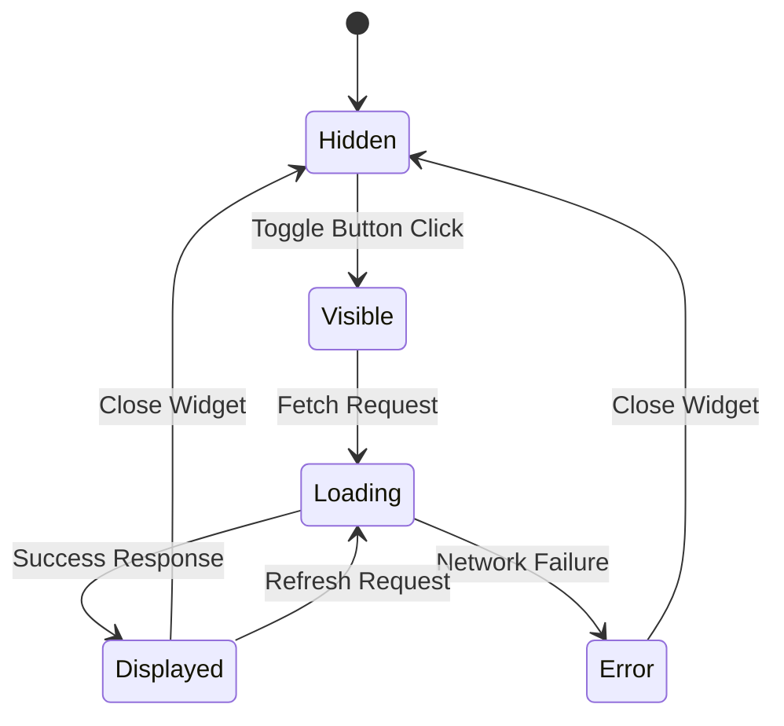

**Diagram sources**
- [frontend/learning.php](file://frontend/learning.php#L198-L212)

#### Styling and Theming

The widget integrates with the application's design system through comprehensive CSS customization:

- **Color Scheme**: Primary blue (#0d7ff2) for brand consistency
- **Typography**: Space Grotesk font family for modern aesthetic
- **Responsive Design**: Mobile-first approach with Bootstrap grid system
- **Material Design**: Google Material Symbols integration for icons

**Section sources**
- [frontend/learning.php](file://frontend/learning.php#L152-L214)
- [frontend/css/style.css](file://frontend/css/style.css#L1-L114)

### Learning Interface Integration

The coaching system integrates seamlessly with the broader learning platform through strategic placement within the learning interface.

#### Navigation Integration

The system connects to the main learning navigation:

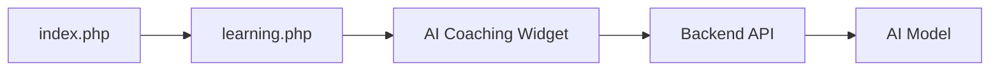

**Diagram sources**
- [frontend/index.php](file://frontend/index.php#L163-L166)
- [frontend/learning.php](file://frontend/learning.php#L152-L175)

#### Exercise Context

The coaching system is positioned strategically within code exercise interfaces:

- **IDE Integration**: Placed near the code editor area
- **Task Context**: Available during active learning sessions
- **Progress Tracking**: Supports completion of learning objectives

**Section sources**
- [frontend/index.php](file://frontend/index.php#L163-L166)
- [frontend/learning.php](file://frontend/learning.php#L90-L150)

## Dependency Analysis

The AI Coaching System maintains minimal external dependencies while providing robust functionality.

### Backend Dependencies

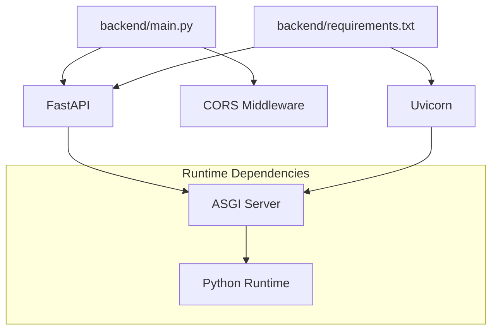

**Diagram sources**
- [backend/requirements.txt](file://backend/requirements.txt#L1-L3)
- [backend/main.py](file://backend/main.py#L1-L4)

### Frontend Dependencies

The frontend relies on established web technologies for optimal compatibility:

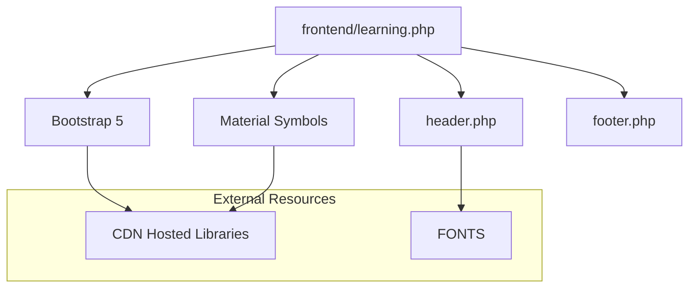

**Diagram sources**
- [frontend/learning.php](file://frontend/learning.php#L12-L18)
- [frontend/includes/header.php](file://frontend/includes/header.php#L12-L18)

### Internal Component Dependencies

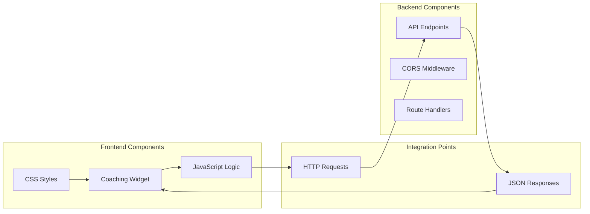

**Diagram sources**
- [frontend/learning.php](file://frontend/learning.php#L177-L212)
- [backend/main.py](file://backend/main.py#L23-L29)

**Section sources**
- [backend/requirements.txt](file://backend/requirements.txt#L1-L3)
- [frontend/learning.php](file://frontend/learning.php#L12-L18)

## Performance Considerations

### Backend Performance Optimization

The FastAPI implementation provides several performance benefits:

- **Async Processing**: Native support for asynchronous request handling
- **Automatic Documentation**: Built-in OpenAPI specification generation
- **Type Safety**: Runtime type checking reduces errors
- **Minimal Overhead**: Lightweight framework with low resource consumption

### Frontend Performance Strategies

The widget implementation incorporates several optimization techniques:

- **Lazy Loading**: JavaScript loaded only when needed
- **Efficient DOM Manipulation**: Minimal DOM updates for smooth animations
- **Responsive Design**: Optimized for mobile devices with touch-friendly interactions
- **Resource Optimization**: CDN-hosted libraries reduce load times

### Caching and Persistence

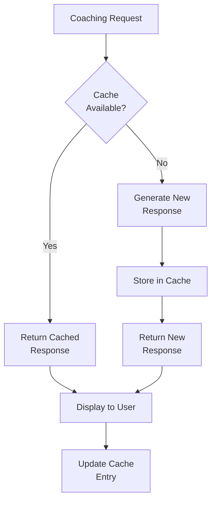

### Scalability Considerations

The system architecture supports horizontal scaling through:

- **Stateless Design**: API endpoints don't maintain session state
- **Load Balancing**: Multiple backend instances can handle increased load
- **Database Independence**: AI model integration can be scaled independently
- **CDN Distribution**: Static assets distributed globally

## Troubleshooting Guide

### Common Integration Issues

#### CORS Configuration Problems

**Issue**: Cross-origin requests blocked by browser security policies

**Solution**: Verify CORS configuration includes all required origins:
- Localhost development servers
- Production domain configurations
- HTTPS protocol requirements for production

**Section sources**
- [backend/main.py](file://backend/main.py#L6-L17)

#### API Endpoint Accessibility

**Issue**: Frontend cannot reach the coaching API endpoint

**Diagnostic Steps**:
1. Verify backend server is running on expected port
2. Check network connectivity between frontend and backend
3. Confirm API endpoint path matches frontend request URL
4. Validate CORS headers in response

**Section sources**
- [frontend/learning.php](file://frontend/learning.php#L182-L185)

#### Widget Display Issues

**Issue**: Coaching widget not appearing or functioning correctly

**Troubleshooting Checklist**:
1. Verify JavaScript execution in browser console
2. Check CSS styling conflicts with existing styles
3. Ensure proper HTML structure and element IDs
4. Validate event listener attachment

**Section sources**
- [frontend/learning.php](file://frontend/learning.php#L152-L175)

### Performance Troubleshooting

#### Slow Response Times

**Symptoms**: Delayed coaching suggestions or widget loading

**Potential Causes**:
- Network latency between frontend and backend
- AI model processing time
- Browser rendering performance
- CDN delivery issues

**Optimization Recommendations**:
- Implement request debouncing for frequent widget interactions
- Add local caching for frequently requested suggestions
- Optimize AI model inference time
- Use browser caching for static resources

#### Memory Leaks

**Issue**: Progressive memory usage increase in browser

**Prevention Measures**:
- Proper event listener cleanup
- DOM element removal when widget closes
- Image resource management
- WebSocket connection handling

### Error Handling Patterns

The system implements comprehensive error handling:

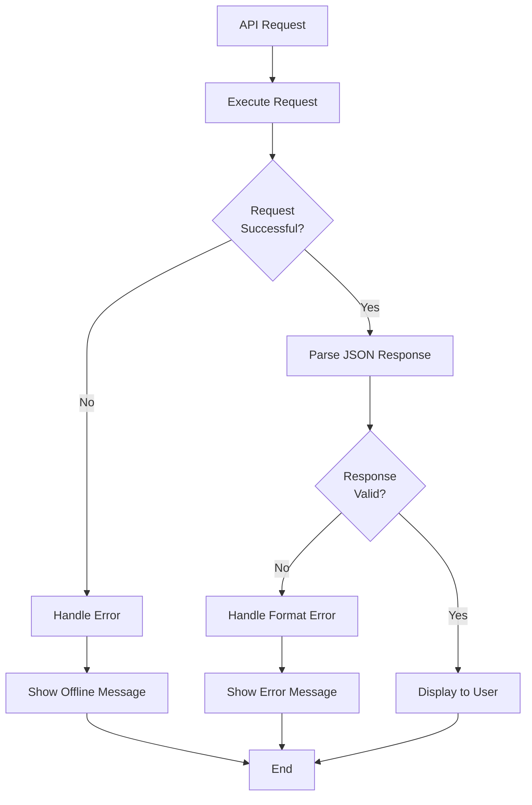

**Diagram sources**
- [frontend/learning.php](file://frontend/learning.php#L182-L195)

**Section sources**
- [frontend/learning.php](file://frontend/learning.php#L177-L212)

## Conclusion

The AI Coaching System represents a well-architected solution for providing real-time assistance in educational programming contexts. The system successfully balances simplicity with functionality, offering learners immediate access to coaching suggestions through an intuitive interface.

Key strengths of the implementation include:

- **Clean Architecture**: Clear separation between frontend and backend components
- **Modern Technology Stack**: Utilization of contemporary web frameworks and design patterns
- **Scalable Design**: Foundation for future enhancements and expanded functionality
- **User Experience Focus**: Intuitive interface design with responsive behavior
- **Development Efficiency**: FastAPI backend provides rapid development capabilities

The system provides a solid foundation for AI-assisted learning experiences, with room for expansion into more sophisticated coaching capabilities, personalized learning paths, and integration with broader educational platforms. The modular design ensures that future enhancements can be implemented without disrupting existing functionality.

Future development opportunities include expanding the coaching scope beyond neural network layers, integrating with learning analytics, and implementing adaptive suggestion systems based on learner progress and performance patterns.