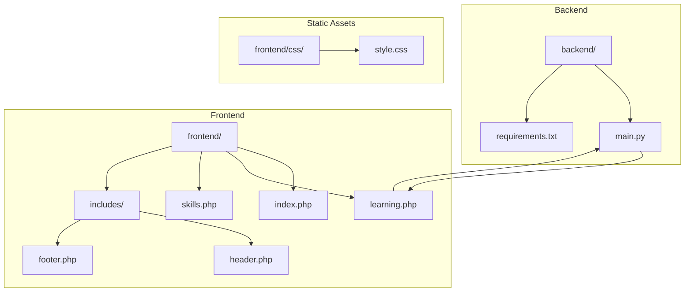
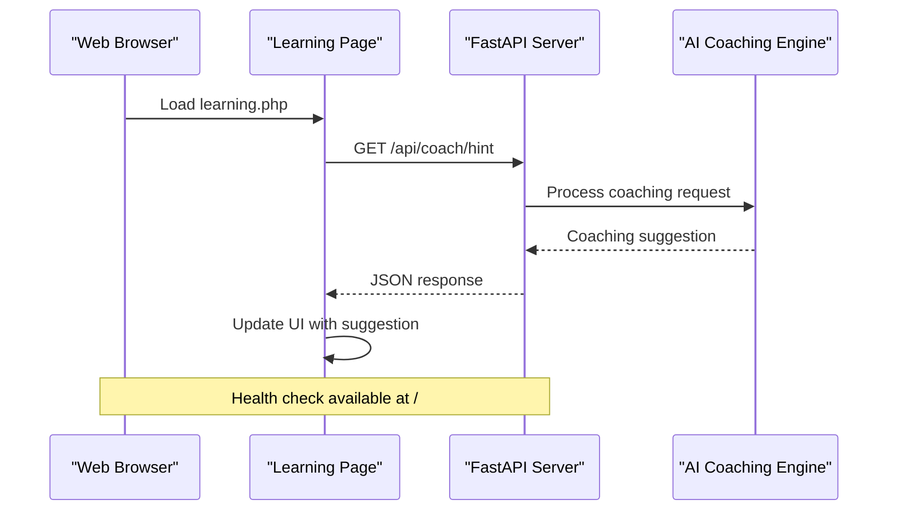
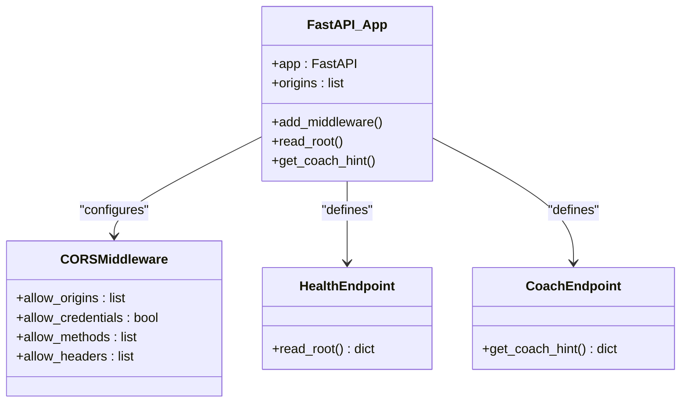
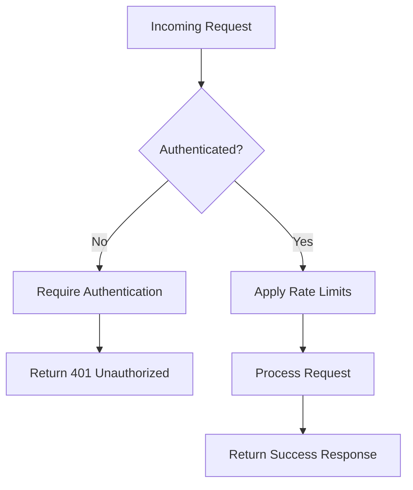
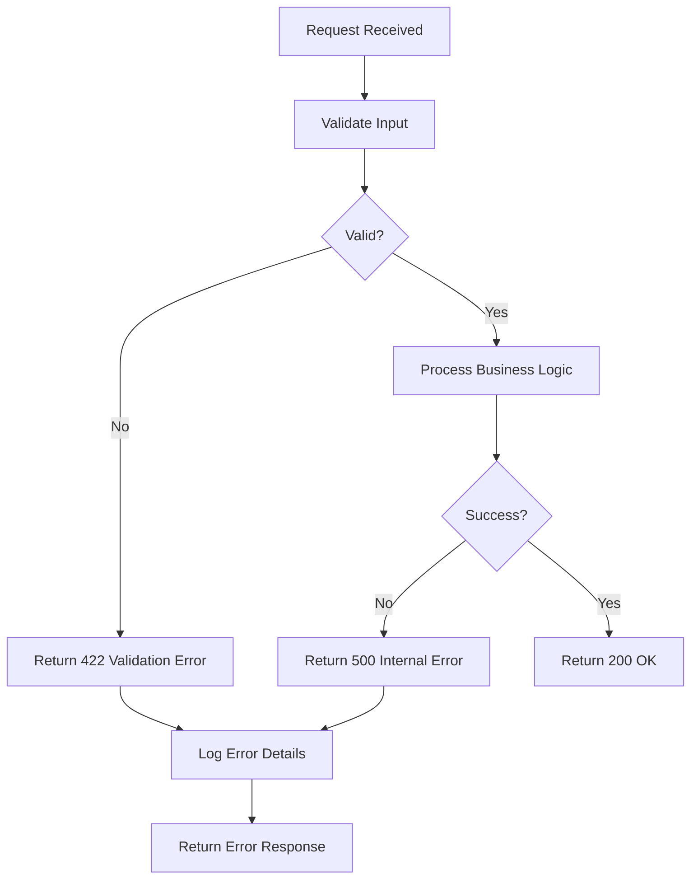
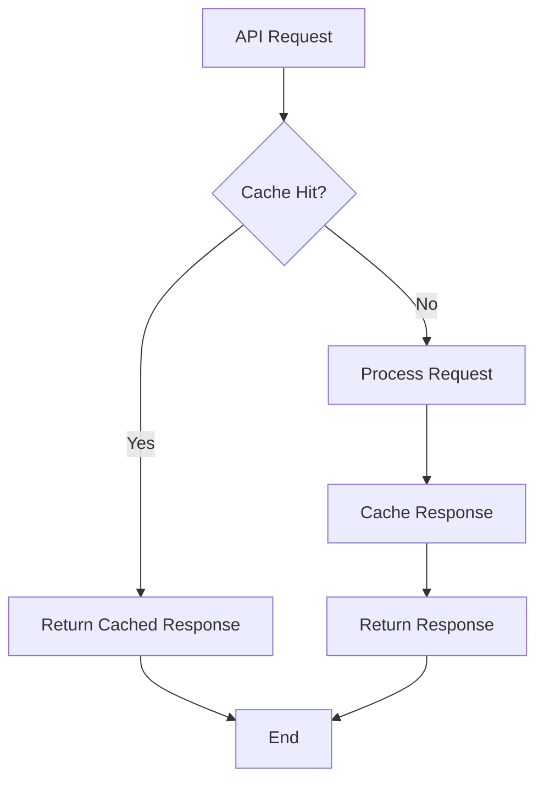
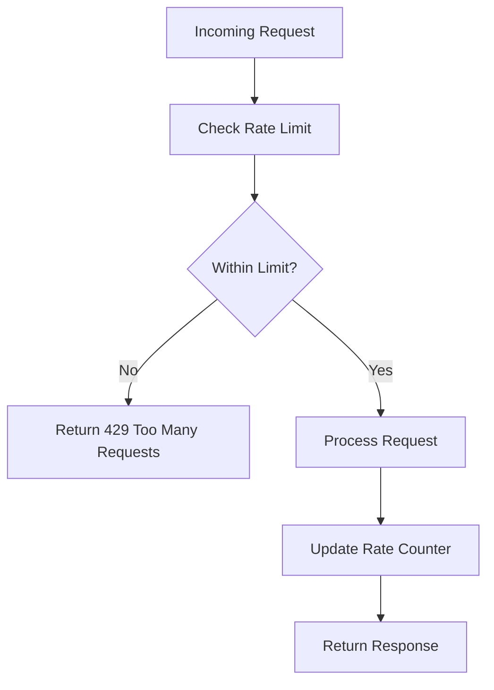
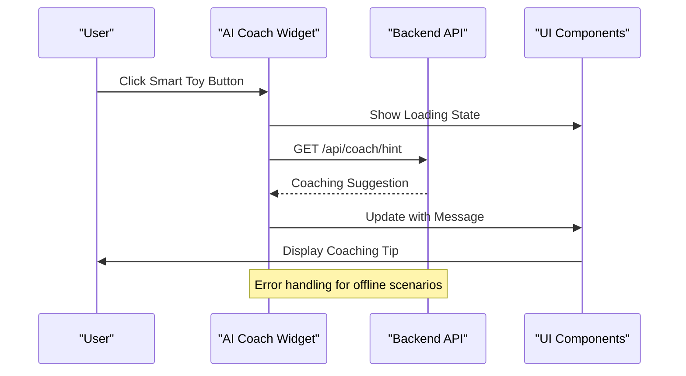
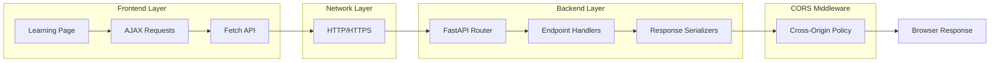
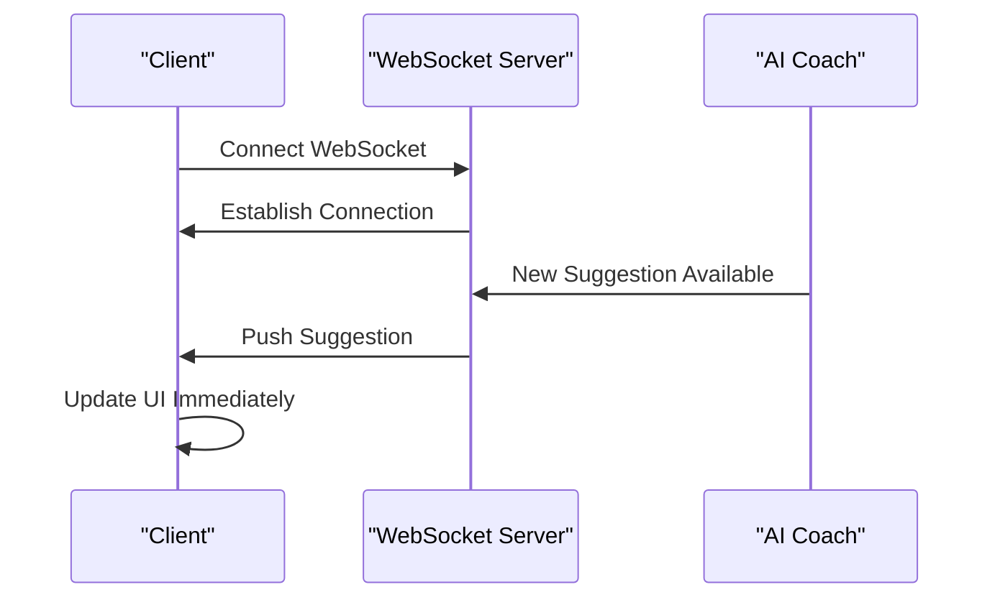

# Backend API Reference

<cite>
**Referenced Files in This Document**
- [main.py](file://backend/main.py)
- [requirements.txt](file://backend/requirements.txt)
- [learning.php](file://frontend/learning.php)
- [header.php](file://frontend/includes/header.php)
</cite>

## Table of Contents
1. [Introduction](#introduction)
2. [Project Structure](#project-structure)
3. [Core Components](#core-components)
4. [Architecture Overview](#architecture-overview)
5. [Detailed Component Analysis](#detailed-component-analysis)
6. [API Endpoints](#api-endpoints)
7. [CORS Configuration](#cors-configuration)
8. [Authentication Methods](#authentication-methods)
9. [Error Handling Strategies](#error-handling-strategies)
10. [Performance Considerations](#performance-considerations)
11. [Client Implementation Guidelines](#client-implementation-guidelines)
12. [Integration Patterns](#integration-patterns)
13. [Troubleshooting Guide](#troubleshooting-guide)
14. [Conclusion](#conclusion)

## Introduction

Octal Foundry is an AI-powered educational platform designed to provide intelligent coaching and guidance for learners pursuing technology education. The backend API serves as the foundation for delivering personalized AI coaching suggestions, health monitoring, and interactive learning experiences.

This documentation covers the complete API specification for the FastAPI backend, including endpoint definitions, request/response schemas, CORS configuration, and integration guidelines for frontend components.

## Project Structure

The project follows a modular structure with clear separation between backend and frontend components:



**Diagram sources**
- [main.py](file://backend/main.py#L1-L30)
- [learning.php](file://frontend/learning.php#L1-L215)

**Section sources**
- [main.py](file://backend/main.py#L1-L30)
- [requirements.txt](file://backend/requirements.txt#L1-L3)

## Core Components

The backend consists of a minimal FastAPI application with essential middleware and two primary endpoints:

### Application Configuration
- **Framework**: FastAPI 0.x with ASGI server
- **Runtime**: Python 3.x
- **Server**: uvicorn ASGI server
- **Development**: Localhost development server

### Middleware Stack
- **CORS Middleware**: Configured for cross-origin resource sharing
- **Default FastAPI**: Built-in request/response handling

**Section sources**
- [main.py](file://backend/main.py#L1-L30)
- [requirements.txt](file://backend/requirements.txt#L1-L3)

## Architecture Overview

The system architecture follows a client-server model with the frontend consuming RESTful APIs from the backend:



**Diagram sources**
- [main.py](file://backend/main.py#L19-L29)
- [learning.php](file://frontend/learning.php#L177-L212)

## Detailed Component Analysis

### FastAPI Application Instance

The application initializes with default FastAPI configuration and extends it with CORS middleware for cross-origin communication.



**Diagram sources**
- [main.py](file://backend/main.py#L1-L30)

**Section sources**
- [main.py](file://backend/main.py#L1-L30)

## API Endpoints

### Health Check Endpoint

The root endpoint provides system health status and availability information.

#### Endpoint Definition
- **Method**: GET
- **URL**: `/`
- **Description**: Returns system health status and availability information

#### Response Schema
```json
{
  "status": "string"
}
```

#### Response Fields
- `status`: String indicating system status message

#### Example Response
```json
{
  "status": "Octal Foundry AI Backend Online"
}
```

**Section sources**
- [main.py](file://backend/main.py#L19-L21)

### AI Coaching Endpoint

The coaching endpoint provides intelligent suggestions and guidance for learners.

#### Endpoint Definition
- **Method**: GET
- **URL**: `/api/coach/hint`
- **Description**: Returns AI-powered coaching suggestions with contextual guidance

#### Response Schema
```json
{
  "message": "string",
  "layer": "string", 
  "position": "string"
}
```

#### Response Fields
- `message`: String containing the coaching suggestion or guidance
- `layer`: String identifying the specific neural network layer or concept
- `position`: String describing the recommended placement or context

#### Example Response
```json
{
  "message": "Your code is missing a BatchNorm2d layer after the first convolution.",
  "layer": "BatchNorm2d",
  "position": "after first Conv2d"
}
```

**Section sources**
- [main.py](file://backend/main.py#L23-L29)

## CORS Configuration

The application implements comprehensive CORS configuration to enable cross-origin communication during development and production environments.

### CORS Settings
- **Allowed Origins**: `["*"]` (All origins permitted)
- **Credentials**: Enabled (`allow_credentials=True`)
- **Allowed Methods**: `["*"]` (All HTTP methods permitted)
- **Allowed Headers**: `["*"]` (All headers permitted)

### Security Considerations
The current configuration allows all origins for development convenience. In production environments, restrict origins to specific domains:

```python
# Production example
app.add_middleware(
    CORSMiddleware,
    allow_origins=["https://yourdomain.com"],
    allow_credentials=True,
    allow_methods=["GET", "POST", "PUT", "DELETE"],
    allow_headers=["Content-Type", "Authorization"]
)
```

**Section sources**
- [main.py](file://backend/main.py#L6-L17)

## Authentication Methods

The current API implementation does not include authentication mechanisms. All endpoints are publicly accessible for demonstration purposes.

### Current State
- **Authentication**: Not implemented
- **Authorization**: No access controls
- **Security**: Open endpoints

### Recommended Implementation
For production deployment, consider implementing:



## Error Handling Strategies

The current implementation follows FastAPI's default error handling behavior:

### Default Error Handling
- **HTTP Status Codes**: Standard HTTP status codes
- **Error Responses**: JSON error messages with details
- **Validation Errors**: Automatic validation error responses

### Production Error Handling
Recommended enhancements for production:



## Performance Considerations

### Current Performance Characteristics
- **Response Time**: Minimal latency for simple endpoints
- **Memory Usage**: Low memory footprint for basic FastAPI application
- **Scalability**: Single-process deployment suitable for development

### Optimization Recommendations
For improved performance in production:

#### Caching Strategy


#### Rate Limiting Implementation


## Client Implementation Guidelines

### Frontend Integration Pattern

The frontend implements a floating AI coach widget that communicates with the backend API:



**Diagram sources**
- [learning.php](file://frontend/learning.php#L177-L212)

### JavaScript Implementation Example

The frontend uses a simple fetch-based approach for API communication:

```javascript
async function fetchAICoach() {
    const bubble = document.getElementById('aiCoachBubble');
    const textElement = document.getElementById('aiCoachText');

    try {
        const response = await fetch('http://localhost:8000/api/coach/hint');
        if (response.ok) {
            const data = await response.json();
            textElement.innerHTML = `${data.message}`;
        } else {
            textElement.innerText = "Coach is offline.";
        }
    } catch (error) {
        console.error('Error fetching AI coach:', error);
        textElement.innerText = "Coach connection failed.";
    }
}
```

### Environment Configuration
For production deployments, configure the API base URL through environment variables:

```javascript
const API_BASE_URL = process.env.REACT_APP_API_BASE_URL || 'http://localhost:8000';
const response = await fetch(`${API_BASE_URL}/api/coach/hint`);
```

**Section sources**
- [learning.php](file://frontend/learning.php#L177-L212)

## Integration Patterns

### Frontend-Backend Communication

The system implements a unidirectional communication pattern where the frontend consumes backend services:



**Diagram sources**
- [main.py](file://backend/main.py#L1-L30)
- [learning.php](file://frontend/learning.php#L177-L212)

### Real-time Updates Pattern
For future enhancements, consider implementing WebSocket connections for real-time coaching updates:



## Troubleshooting Guide

### Common Issues and Solutions

#### API Not Responding
**Symptoms**: 500 Internal Server Error or timeout
**Causes**: 
- Server not running
- Incorrect port configuration
- CORS policy blocking requests

**Solutions**:
1. Verify server is running on correct port
2. Check CORS configuration for development
3. Validate network connectivity

#### CORS Errors in Development
**Symptoms**: Cross-origin request blocked
**Causes**: 
- Strict CORS policy
- Incorrect origin configuration

**Solutions**:
1. Update allowed origins in CORS middleware
2. Use wildcard for development only
3. Configure proper proxy settings

#### Frontend API Integration Issues
**Symptoms**: Empty coaching suggestions or errors
**Causes**:
- Incorrect API endpoint URL
- Network connectivity issues
- Response parsing errors

**Solutions**:
1. Verify API endpoint URL matches backend configuration
2. Check browser developer tools for network errors
3. Implement proper error handling in frontend

### Debugging Checklist

1. **Server Status**: Verify FastAPI server is running
2. **Endpoint Accessibility**: Test root endpoint `/`
3. **CORS Configuration**: Confirm allowed origins
4. **Frontend Integration**: Validate API calls from frontend
5. **Error Logging**: Check server logs for exceptions

**Section sources**
- [main.py](file://backend/main.py#L1-L30)
- [learning.php](file://frontend/learning.php#L177-L212)

## Conclusion

The Octal Foundry FastAPI backend provides a solid foundation for AI-powered educational applications. With its minimal yet effective architecture, the system demonstrates key concepts of modern API design while maintaining simplicity for educational purposes.

### Key Features
- **Minimal API Surface**: Two focused endpoints for health monitoring and AI coaching
- **Flexible CORS Configuration**: Development-friendly cross-origin policies
- **Simple Integration**: Straightforward frontend-backend communication pattern
- **Extensible Architecture**: Foundation for adding authentication, rate limiting, and advanced features

### Future Enhancement Opportunities
- **Authentication System**: Implement user authentication and authorization
- **Rate Limiting**: Add request throttling for production stability
- **Caching Layer**: Introduce caching for improved performance
- **Monitoring and Logging**: Comprehensive observability implementation
- **Real-time Features**: WebSocket support for live coaching updates

The current implementation serves as an excellent starting point for developers building AI-powered educational platforms, demonstrating clean architecture principles and practical API design patterns.