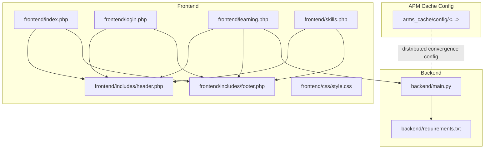
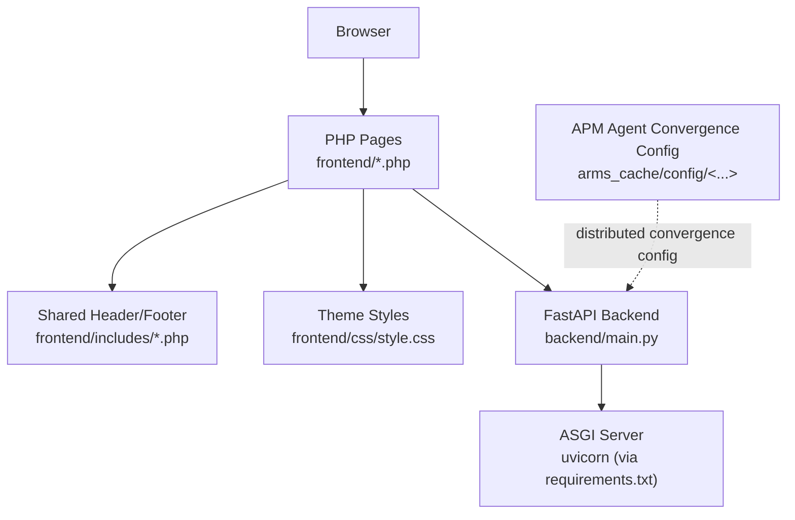
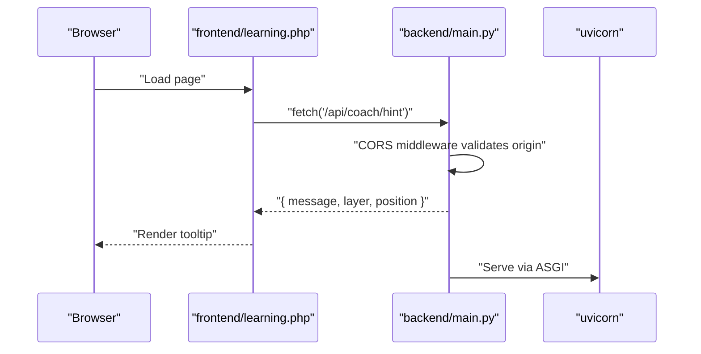
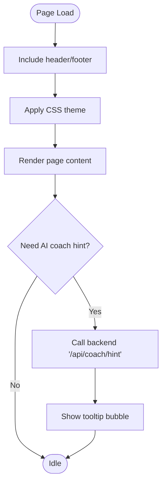
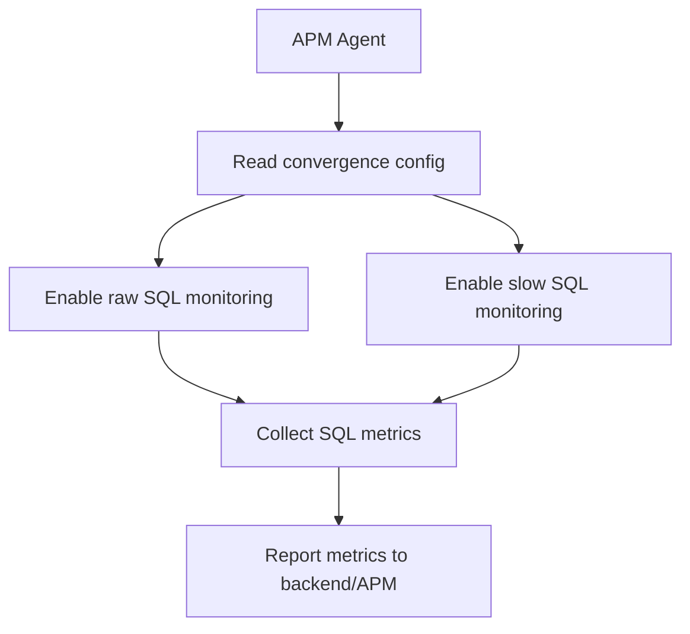
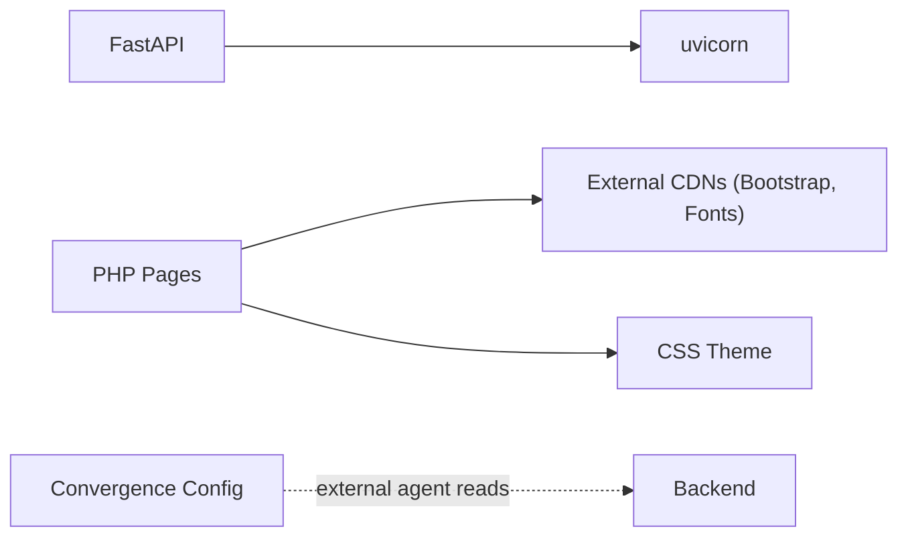

# Configuration and Deployment

<cite>
**Referenced Files in This Document**
- [backend/main.py](file://backend/main.py)
- [backend/requirements.txt](file://backend/requirements.txt)
- [frontend/index.php](file://frontend/index.php)
- [frontend/login.php](file://frontend/login.php)
- [frontend/learning.php](file://frontend/learning.php)
- [frontend/skills.php](file://frontend/skills.php)
- [frontend/includes/header.php](file://frontend/includes/header.php)
- [frontend/includes/footer.php](file://frontend/includes/footer.php)
- [frontend/css/style.css](file://frontend/css/style.css)
- [arms_cache/config/arms.converge.config.arms_agent.apm_1576452733059910.fit0dygksm_5deca4ebd39a6e7@@arms.convergence.config@@c845a7b4-23a1-4f28-a380-5ab30d8a280f](file://arms_cache/config/arms.converge.config.arms_agent.apm_1576452733059910.fit0dygksm_5deca4ebd39a6e7@@arms.convergence.config@@c845a7b4-23a1-4f28-a380-5ab30d8a280f)
</cite>

## Table of Contents
1. [Introduction](#introduction)
2. [Project Structure](#project-structure)
3. [Core Components](#core-components)
4. [Architecture Overview](#architecture-overview)
5. [Detailed Component Analysis](#detailed-component-analysis)
6. [Dependency Analysis](#dependency-analysis)
7. [Performance Considerations](#performance-considerations)
8. [Troubleshooting Guide](#troubleshooting-guide)
9. [Conclusion](#conclusion)
10. [Appendices](#appendices)

## Introduction
This document explains how to configure and deploy the Octal Foundry platform, which consists of a FastAPI backend and a PHP/HTML/CSS frontend. It covers CORS and security considerations for development and production, the distributed convergence configuration system present in the repository, cache management, environment configuration options, dependency management via requirements.txt, and deployment topology. It also provides production hardening guidance for CORS middleware, monitoring setup ideas, environment customization, cache invalidation strategies, troubleshooting, migration guidance for configuration changes, and backwards compatibility notes.

## Project Structure
The repository is organized into three primary areas:
- backend: FastAPI server with CORS middleware and basic endpoints
- frontend: PHP pages with shared header/footer includes and a CSS theme
- arms_cache/config: a convergence configuration file used by an APM agent

**Diagram sources**
- [backend/main.py](file://backend/main.py#L1-L30)
- [backend/requirements.txt](file://backend/requirements.txt#L1-L3)
- [frontend/index.php](file://frontend/index.php#L1-L174)
- [frontend/login.php](file://frontend/login.php#L1-L94)
- [frontend/learning.php](file://frontend/learning.php#L1-L215)
- [frontend/skills.php](file://frontend/skills.php#L1-L189)
- [frontend/includes/header.php](file://frontend/includes/header.php#L1-L23)
- [frontend/includes/footer.php](file://frontend/includes/footer.php#L1-L7)
- [frontend/css/style.css](file://frontend/css/style.css#L1-L114)
- [arms_cache/config/arms.converge.config.arms_agent.apm_1576452733059910.fit0dygksm_5deca4ebd39a6e7@@arms.convergence.config@@c845a7b4-23a1-4f28-a380-5ab30d8a280f](file://arms_cache/config/arms.converge.config.arms_agent.apm_1576452733059910.fit0dygksm_5deca4ebd39a6e7@@arms.convergence.config@@c845a7b4-23a1-4f28-a380-5ab30d8a280f#L1-L1)

**Section sources**
- [backend/main.py](file://backend/main.py#L1-L30)
- [backend/requirements.txt](file://backend/requirements.txt#L1-L3)
- [frontend/index.php](file://frontend/index.php#L1-L174)
- [frontend/login.php](file://frontend/login.php#L1-L94)
- [frontend/learning.php](file://frontend/learning.php#L1-L215)
- [frontend/skills.php](file://frontend/skills.php#L1-L189)
- [frontend/includes/header.php](file://frontend/includes/header.php#L1-L23)
- [frontend/includes/footer.php](file://frontend/includes/footer.php#L1-L7)
- [frontend/css/style.css](file://frontend/css/style.css#L1-L114)
- [arms_cache/config/arms.converge.config.arms_agent.apm_1576452733059910.fit0dygksm_5deca4ebd39a6e7@@arms.convergence.config@@c845a7b4-23a1-4f28-a380-5ab30d8a280f](file://arms_cache/config/arms.converge.config.arms_agent.apm_1576452733059910.fit0dygksm_5deca4ebd39a6e7@@arms.convergence.config@@c845a7b4-23a1-4f28-a380-5ab30d8a280f#L1-L1)

## Core Components
- FastAPI backend with CORS middleware and two endpoints:
  - Root endpoint returning service status
  - AI coach hint endpoint used by the frontend
- PHP/HTML/CSS frontend with shared includes and a cohesive dark theme
- Distributed convergence configuration file for an APM agent

Key implementation references:
- Backend app initialization and CORS middleware
- Endpoint definitions
- Frontend pages consuming the backend API
- APM convergence configuration

**Section sources**
- [backend/main.py](file://backend/main.py#L1-L30)
- [frontend/learning.php](file://frontend/learning.php#L177-L212)
- [arms_cache/config/arms.converge.config.arms_agent.apm_1576452733059910.fit0dygksm_5deca4ebd39a6e7@@arms.convergence.config@@c845a7b4-23a1-4f28-a380-5ab30d8a280f](file://arms_cache/config/arms.converge.config.arms_agent.apm_1576452733059910.fit0dygksm_5deca4ebd39a6e7@@arms.convergence.config@@c845a7b4-23a1-4f28-a380-5ab30d8a280f#L1-L1)

## Architecture Overview
The system follows a classic FastAPI backend serving a PHP/HTML/CSS frontend. The frontend makes asynchronous requests to the backend API. The convergence configuration file indicates the presence of an APM agent that monitors SQL and related metrics.

**Diagram sources**
- [backend/main.py](file://backend/main.py#L1-L30)
- [backend/requirements.txt](file://backend/requirements.txt#L1-L3)
- [frontend/index.php](file://frontend/index.php#L1-L174)
- [frontend/includes/header.php](file://frontend/includes/header.php#L1-L23)
- [frontend/css/style.css](file://frontend/css/style.css#L1-L114)
- [arms_cache/config/arms.converge.config.arms_agent.apm_1576452733059910.fit0dygksm_5deca4ebd39a6e7@@arms.convergence.config@@c845a7b4-23a1-4f28-a380-5ab30d8a280f](file://arms_cache/config/arms.converge.config.arms_agent.apm_1576452733059910.fit0dygksm_5deca4ebd39a6e7@@arms.convergence.config@@c845a7b4-23a1-4f28-a380-5ab30d8a280f#L1-L1)

## Detailed Component Analysis

### Backend: FastAPI App and CORS Middleware
- App initialization and endpoint definitions
- CORS configuration allowing credentials and wildcard methods/headers
- Development origins list and wildcard origin allowance

**Diagram sources**
- [backend/main.py](file://backend/main.py#L1-L30)
- [frontend/learning.php](file://frontend/learning.php#L177-L212)

**Section sources**
- [backend/main.py](file://backend/main.py#L1-L30)

### Frontend: PHP Pages and Shared Includes
- Shared header and footer includes
- Dark theme CSS variables and reusable styles
- Learning page integrates AI coach hints via asynchronous fetch to the backend

**Diagram sources**
- [frontend/includes/header.php](file://frontend/includes/header.php#L1-L23)
- [frontend/includes/footer.php](file://frontend/includes/footer.php#L1-L7)
- [frontend/css/style.css](file://frontend/css/style.css#L1-L114)
- [frontend/learning.php](file://frontend/learning.php#L177-L212)

**Section sources**
- [frontend/index.php](file://frontend/index.php#L1-L174)
- [frontend/login.php](file://frontend/login.php#L1-L94)
- [frontend/learning.php](file://frontend/learning.php#L1-L215)
- [frontend/skills.php](file://frontend/skills.php#L1-L189)
- [frontend/includes/header.php](file://frontend/includes/header.php#L1-L23)
- [frontend/includes/footer.php](file://frontend/includes/footer.php#L1-L7)
- [frontend/css/style.css](file://frontend/css/style.css#L1-L114)

### Distributed Convergence Configuration System
- Presence of a convergence configuration file used by an APM agent
- Configuration keys indicate raw SQL and slow SQL monitoring settings
- This supports distributed monitoring and convergence of runtime metrics

**Diagram sources**
- [arms_cache/config/arms.converge.config.arms_agent.apm_1576452733059910.fit0dygksm_5deca4ebd39a6e7@@arms.convergence.config@@c845a7b4-23a1-4f28-a380-5ab30d8a280f](file://arms_cache/config/arms.converge.config.arms_agent.apm_1576452733059910.fit0dygksm_5deca4ebd39a6e7@@arms.convergence.config@@c845a7b4-23a1-4f28-a380-5ab30d8a280f#L1-L1)

**Section sources**
- [arms_cache/config/arms.converge.config.arms_agent.apm_1576452733059910.fit0dygksm_5deca4ebd39a6e7@@arms.convergence.config@@c845a7b4-23a1-4f28-a380-5ab30d8a280f](file://arms_cache/config/arms.converge.config.arms_agent.apm_1576452733059910.fit0dygksm_5deca4ebd39a6e7@@arms.convergence.config@@c845a7b4-23a1-4f28-a380-5ab30d8a280f#L1-L1)

## Dependency Analysis
- Backend depends on FastAPI and uvicorn for serving
- Frontend is static HTML/CSS with PHP includes and relies on external CDN resources
- APM convergence configuration is separate from the backend code

**Diagram sources**
- [backend/requirements.txt](file://backend/requirements.txt#L1-L3)
- [frontend/includes/header.php](file://frontend/includes/header.php#L14-L18)
- [frontend/css/style.css](file://frontend/css/style.css#L1-L114)
- [arms_cache/config/arms.converge.config.arms_agent.apm_1576452733059910.fit0dygksm_5deca4ebd39a6e7@@arms.convergence.config@@c845a7b4-23a1-4f28-a380-5ab30d8a280f](file://arms_cache/config/arms.converge.config.arms_agent.apm_1576452733059910.fit0dygksm_5deca4ebd39a6e7@@arms.convergence.config@@c845a7b4-23a1-4f28-a380-5ab30d8a280f#L1-L1)

**Section sources**
- [backend/requirements.txt](file://backend/requirements.txt#L1-L3)
- [frontend/includes/header.php](file://frontend/includes/header.php#L14-L18)

## Performance Considerations
- CORS wildcard settings simplify development but should be narrowed in production
- Frontend assets are served via CDNs; ensure caching headers are configured appropriately
- The convergence configuration enables SQL monitoring; monitor overhead and tune thresholds
- Keep uvicorn workers and timeouts tuned for expected load

## Troubleshooting Guide
Common issues and remedies:
- CORS errors in browser console:
  - Verify backend allows the frontend origin and credentials
  - Confirm wildcard origins are acceptable during development; lock down in production
- Frontend not loading backend data:
  - Ensure the backend is reachable at the configured host/port
  - Check that the endpoint exists and returns JSON
- APM convergence config not applied:
  - Confirm the agent is configured to read from the provided path
  - Validate JSON validity and permissions

**Section sources**
- [backend/main.py](file://backend/main.py#L11-L17)
- [frontend/learning.php](file://frontend/learning.php#L177-L212)
- [arms_cache/config/arms.converge.config.arms_agent.apm_1576452733059910.fit0dygksm_5deca4ebd39a6e7@@arms.convergence.config@@c845a7b4-23a1-4f28-a380-5ab30d8a280f](file://arms_cache/config/arms.converge.config.arms_agent.apm_1576452733059910.fit0dygksm_5deca4ebd39a6e7@@arms.convergence.config@@c845a7b4-23a1-4f28-a380-5ab30d8a280f#L1-L1)

## Conclusion
Octal Foundry’s backend and frontend are intentionally minimal, enabling straightforward deployment and iteration. The CORS configuration supports rapid development, while the convergence configuration file indicates a monitoring layer suitable for production observability. Security hardening, environment-specific configuration, and robust monitoring should be prioritized for production readiness.

## Appendices

### Environment Configuration Options
- CORS configuration:
  - Development: wildcard origins acceptable for local testing
  - Production: restrict allow_origins to trusted domains and ports
- Backend port and host:
  - uvicorn defaults can be overridden via environment variables or command-line arguments
- Frontend base URL for API calls:
  - Currently hardcoded to a localhost address; replace with an environment variable for flexibility

**Section sources**
- [backend/main.py](file://backend/main.py#L6-L17)
- [frontend/learning.php](file://frontend/learning.php#L184-L185)

### Dependency Management Using requirements.txt
- FastAPI and uvicorn are declared as runtime dependencies
- Pin versions in production for reproducibility and stability

**Section sources**
- [backend/requirements.txt](file://backend/requirements.txt#L1-L3)

### Deployment Topology for FastAPI Backend with PHP Frontend
- Backend:
  - Run uvicorn with appropriate workers and timeout settings
  - Place behind a reverse proxy (e.g., Nginx) for TLS and load balancing
- Frontend:
  - Serve PHP pages via a web server with PHP support
  - Host static assets (CSS/JS) via CDN or web server with caching headers
- Monitoring:
  - Use the convergence configuration to enable SQL and performance metrics collection

**Section sources**
- [backend/requirements.txt](file://backend/requirements.txt#L1-L3)
- [frontend/includes/header.php](file://frontend/includes/header.php#L14-L18)
- [arms_cache/config/arms.converge.config.arms_agent.apm_1576452733059910.fit0dygksm_5deca4ebd39a6e7@@arms.convergence.config@@c845a7b4-23a1-4f28-a380-5ab30d8a280f](file://arms_cache/config/arms.converge.config.arms_agent.apm_1576452733059910.fit0dygksm_5deca4ebd39a6e7@@arms.convergence.config@@c845a7b4-23a1-4f28-a380-5ab30d8a280f#L1-L1)

### Production Deployment Considerations and Security Hardening
- CORS hardening:
  - Replace wildcard origins with explicit allowed origins
  - Restrict methods and headers to those required by the frontend
- TLS and reverse proxy:
  - Terminate TLS at the reverse proxy and enforce HTTPS
- Secrets and environment variables:
  - Externalize configuration (e.g., allowed origins, API base URL) via environment variables
- Rate limiting and timeouts:
  - Configure uvicorn worker count and timeouts based on traffic expectations
- Observability:
  - Enable SQL and slow SQL monitoring via the convergence configuration
  - Set up logs aggregation and alerting for backend and frontend

**Section sources**
- [backend/main.py](file://backend/main.py#L11-L17)
- [arms_cache/config/arms.converge.config.arms_agent.apm_1576452733059910.fit0dygksm_5deca4ebd39a6e7@@arms.convergence.config@@c845a7b4-23a1-4f28-a380-5ab30d8a280f](file://arms_cache/config/arms.converge.config.arms_agent.apm_1576452733059910.fit0dygksm_5deca4ebd39a6e7@@arms.convergence.config@@c845a7b4-23a1-4f28-a380-5ab30d8a280f#L1-L1)

### Monitoring Setup
- Backend:
  - uvicorn access logs and error logs
  - Application-level logging for API endpoints
- Frontend:
  - Client-side error reporting and performance metrics
- APM:
  - SQL and slow SQL metrics from the convergence configuration
  - Dashboard and alerts for anomalies

**Section sources**
- [arms_cache/config/arms.converge.config.arms_agent.apm_1576452733059910.fit0dygksm_5deca4ebd39a6e7@@arms.convergence.config@@c845a7b4-23a1-4f28-a380-5ab30d8a280f](file://arms_cache/config/arms.converge.config.arms_agent.apm_1576452733059910.fit0dygksm_5deca4ebd39a6e7@@arms.convergence.config@@c845a7b4-23a1-4f28-a380-5ab30d8a280f#L1-L1)

### Configuration Customization for Different Environments
- Development:
  - Wildcard CORS for convenience
  - Localhost backend URL
- Staging:
  - Restricted CORS for staging domain
  - Dedicated backend URL
- Production:
  - Strict CORS for production domain(s)
  - TLS termination and hardened security headers

**Section sources**
- [backend/main.py](file://backend/main.py#L6-L17)
- [frontend/learning.php](file://frontend/learning.php#L184-L185)

### Cache Management and Invalidation Strategies
- Frontend:
  - Leverage CDN caching for CSS/JS; use cache-busting filenames or ETags
- Backend:
  - Use HTTP caching headers for static responses
  - Consider application-level cache for repeated API responses (optional)
- APM:
  - Monitor cache hit ratios and adjust convergence thresholds accordingly

**Section sources**
- [frontend/includes/header.php](file://frontend/includes/header.php#L14-L18)
- [arms_cache/config/arms.converge.config.arms_agent.apm_1576452733059910.fit0dygksm_5deca4ebd39a6e7@@arms.convergence.config@@c845a7b4-23a1-4f28-a380-5ab30d8a280f](file://arms_cache/config/arms.converge.config.arms_agent.apm_1576452733059910.fit0dygksm_5deca4ebd39a6e7@@arms.convergence.config@@c845a7b4-23a1-4f28-a380-5ab30d8a280f#L1-L1)

### Migration Guides for Configuration Changes
- CORS policy updates:
  - Start with wildcard origins in development; migrate to strict allowlist before promoting to production
- API base URL changes:
  - Externalize the backend URL into an environment variable consumed by the frontend
- APM configuration:
  - Review convergence thresholds and enable/disable specific monitors based on environment needs

**Section sources**
- [backend/main.py](file://backend/main.py#L11-L17)
- [frontend/learning.php](file://frontend/learning.php#L184-L185)
- [arms_cache/config/arms.converge.config.arms_agent.apm_1576452733059910.fit0dygksm_5deca4ebd39a6e7@@arms.convergence.config@@c845a7b4-23a1-4f28-a380-5ab30d8a280f](file://arms_cache/config/arms.converge.config.arms_agent.apm_1576452733059910.fit0dygksm_5deca4ebd39a6e7@@arms.convergence.config@@c845a7b4-23a1-4f28-a380-5ab30d8a280f#L1-L1)

### Backwards Compatibility Notes
- Endpoint stability:
  - Maintain backward-compatible endpoint paths and response shapes
- CORS evolution:
  - Avoid breaking changes to allowed origins; introduce new origins gradually
- APM configuration:
  - Preserve existing keys and values; add new keys without removing old ones until migration completes

**Section sources**
- [backend/main.py](file://backend/main.py#L19-L29)
- [arms_cache/config/arms.converge.config.arms_agent.apm_1576452733059910.fit0dygksm_5deca4ebd39a6e7@@arms.convergence.config@@c845a7b4-23a1-4f28-a380-5ab30d8a280f](file://arms_cache/config/arms.converge.config.arms_agent.apm_1576452733059910.fit0dygksm_5deca4ebd39a6e7@@arms.convergence.config@@c845a7b4-23a1-4f28-a380-5ab30d8a280f#L1-L1)