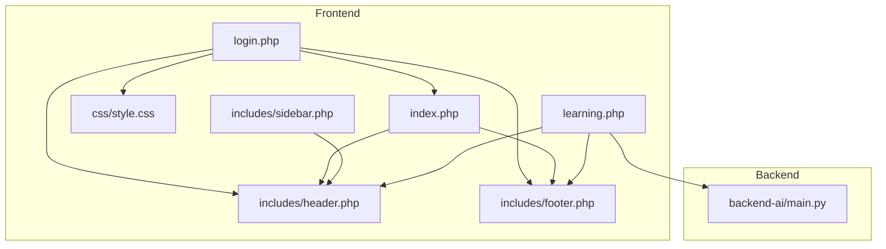
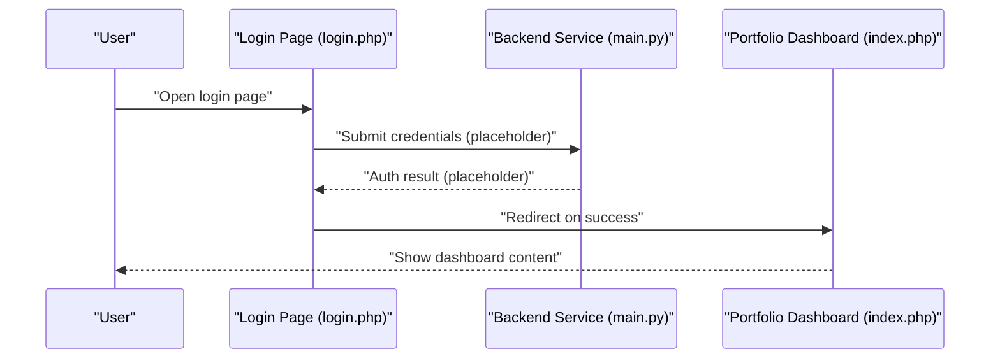
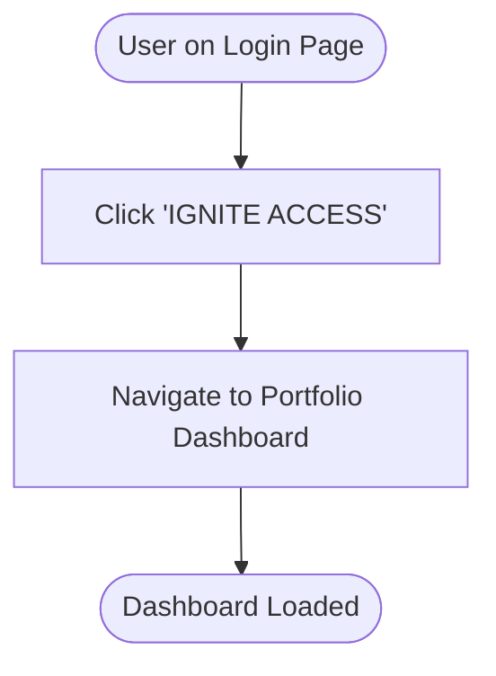
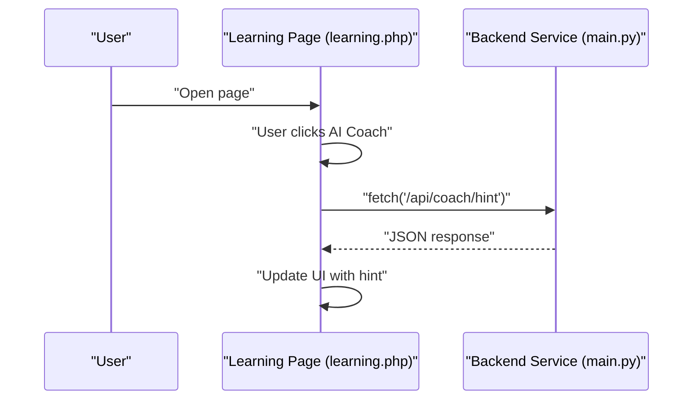
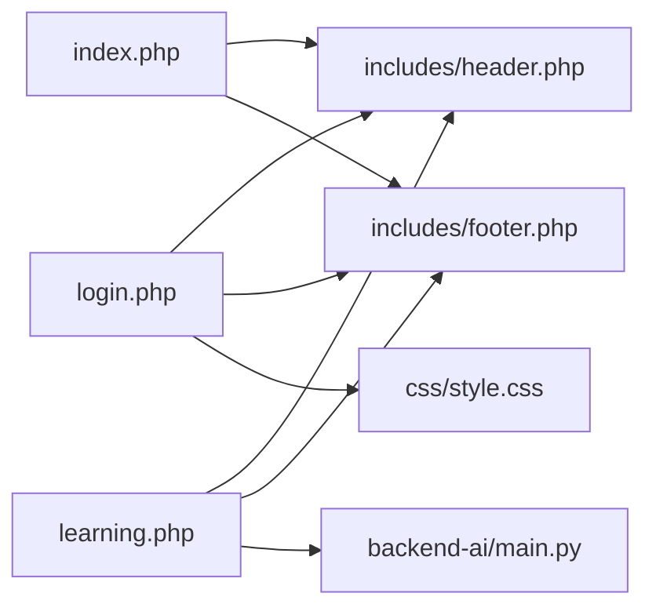

# Authentication & Login System

<cite>
**Referenced Files in This Document**
- [login.php](file://frontend-php/login.php)
- [index.php](file://frontend-php/index.php)
- [header.php](file://frontend-php/includes/header.php)
- [footer.php](file://frontend-php/includes/footer.php)
- [style.css](file://frontend-php/css/style.css)
- [main.py](file://backend-ai/main.py)
- [learning.php](file://frontend-php/learning.php)
- [sidebar.php](file://frontend-php/includes/sidebar.php)
</cite>

## Table of Contents
1. [Introduction](#introduction)
2. [Project Structure](#project-structure)
3. [Core Components](#core-components)
4. [Architecture Overview](#architecture-overview)
5. [Detailed Component Analysis](#detailed-component-analysis)
6. [Dependency Analysis](#dependency-analysis)
7. [Performance Considerations](#performance-considerations)
8. [Troubleshooting Guide](#troubleshooting-guide)
9. [Conclusion](#conclusion)

## Introduction
This document describes the Octal Foundry authentication and login system as implemented in the provided frontend and backend assets. It focuses on the login interface design, social login integration options, session management patterns, user verification flows, authentication state handling, redirect mechanisms to the portfolio dashboard, and security considerations for credential storage. It also covers responsive login form design, error handling patterns, and integration with backend authentication services.

## Project Structure
The authentication and login system spans a small set of PHP pages and supporting assets:
- Login page with form fields, social login button, and navigation
- Portfolio dashboard page that acts as the post-login destination
- Shared header and footer partials for layout and navigation
- Global CSS for theming and form styling
- A minimal backend service (FastAPI) used for demonstration and integration examples

**Diagram sources**
- [login.php](file://frontend-php/login.php#L1-L94)
- [index.php](file://frontend-php/index.php#L1-L174)
- [header.php](file://frontend-php/includes/header.php#L1-L71)
- [footer.php](file://frontend-php/includes/footer.php#L1-L31)
- [style.css](file://frontend-php/css/style.css#L1-L289)
- [sidebar.php](file://frontend-php/includes/sidebar.php#L1-L81)
- [learning.php](file://frontend-php/learning.php#L1-L215)
- [main.py](file://backend-ai/main.py#L1-L30)

**Section sources**
- [login.php](file://frontend-php/login.php#L1-L94)
- [index.php](file://frontend-php/index.php#L1-L174)
- [header.php](file://frontend-php/includes/header.php#L1-L71)
- [footer.php](file://frontend-php/includes/footer.php#L1-L31)
- [style.css](file://frontend-php/css/style.css#L1-L289)
- [sidebar.php](file://frontend-php/includes/sidebar.php#L1-L81)
- [learning.php](file://frontend-php/learning.php#L1-L215)
- [main.py](file://backend-ai/main.py#L1-L30)

## Core Components
- Login page: Contains the login form, “Remember me” option, forgot-password link, social login button, and navigation to join the cohort.
- Portfolio dashboard: Post-login destination showcasing profile, projects, certifications, and endorsements.
- Shared layout: Header and footer partials provide consistent navigation and theme.
- Styling: Global CSS defines dark theme, form controls, buttons, and responsive layout tokens.
- Backend integration: A FastAPI service demonstrates client-side integration via JavaScript fetch calls.

Key implementation references:
- Login form fields and social login button: [login.php](file://frontend-php/login.php#L26-L78)
- Portfolio dashboard content and navigation: [index.php](file://frontend-php/index.php#L23-L171)
- Shared layout and sidebar navigation: [header.php](file://frontend-php/includes/header.php#L22-L67), [sidebar.php](file://frontend-php/includes/sidebar.php#L1-L81)
- Theme and form styles: [style.css](file://frontend-php/css/style.css#L1-L289)
- Backend endpoint used by the learning page: [main.py](file://backend-ai/main.py#L19-L30), [learning.php](file://frontend-php/learning.php#L177-L212)

**Section sources**
- [login.php](file://frontend-php/login.php#L26-L78)
- [index.php](file://frontend-php/index.php#L23-L171)
- [header.php](file://frontend-php/includes/header.php#L22-L67)
- [sidebar.php](file://frontend-php/includes/sidebar.php#L62-L76)
- [style.css](file://frontend-php/css/style.css#L99-L114)
- [main.py](file://backend-ai/main.py#L19-L30)
- [learning.php](file://frontend-php/learning.php#L177-L212)

## Architecture Overview
The authentication flow is front-end driven with placeholders for backend integration. The login page posts credentials to a backend endpoint (not implemented in the provided files), and successful authentication redirects to the portfolio dashboard. The learning page demonstrates a client-side integration pattern with the backend service.

**Diagram sources**
- [login.php](file://frontend-php/login.php#L57-L60)
- [index.php](file://frontend-php/index.php#L1-L174)
- [main.py](file://backend-ai/main.py#L19-L30)

## Detailed Component Analysis

### Login Interface Design
- Form fields:
  - University email field with icon and placeholder
  - Security key (password) field with show/hide affordance and icon
  - “Forgot?” link
  - “Remember me” switch (default checked)
- Primary action: “IGNITE ACCESS” button linking to the portfolio dashboard
- Divider and “OR JOIN WITH”
- Social login button with Google branding
- Footer link to join the cohort

Responsive design:
- Flexbox layout with gap spacing and centered hero section
- Dark theme with themed colors and glass effects
- Bootstrap utility classes for alignment and sizing

Accessibility and UX:
- Clear labels and icons for inputs
- Focus styles for form controls
- Hover states for interactive elements

Security considerations:
- Password masking and show/hide toggle
- Placeholder text for inputs
- No client-side validation is present; server-side validation is implied

Integration points:
- Redirect link from login to dashboard
- Social login button placeholder for provider integration

**Section sources**
- [login.php](file://frontend-php/login.php#L26-L86)
- [style.css](file://frontend-php/css/style.css#L99-L114)
- [header.php](file://frontend-php/includes/header.php#L1-L71)

### Social Login Integration Options
- Social login button uses Google branding with colored SVG segments
- Button is styled as an outlined secondary button with hover effects
- Placeholder for provider-specific integration (OAuth flow, SDK, or redirect)

Implementation guidance:
- Integrate OAuth provider SDK or redirect-based flow
- Store returned identity token securely
- Validate token server-side before establishing session

**Section sources**
- [login.php](file://frontend-php/login.php#L69-L78)
- [style.css](file://frontend-php/css/style.css#L250-L271)

### Session Management Patterns
Observed patterns:
- Redirect-based navigation post-authentication
- Persistent “Remember me” switch (default checked)
- Dashboard page includes navigation and user profile area

Recommended implementation:
- Establish session on successful authentication
- Persist session cookie with secure attributes (HttpOnly, SameSite, Secure in production)
- Implement session timeout and renewal
- Provide logout action that invalidates session and clears cookies

**Section sources**
- [login.php](file://frontend-php/login.php#L48-L54)
- [login.php](file://frontend-php/login.php#L57-L60)
- [index.php](file://frontend-php/index.php#L1-L174)
- [sidebar.php](file://frontend-php/includes/sidebar.php#L62-L76)

### User Verification Flows
- Verified badge and label present on the portfolio dashboard
- Verification status is displayed prominently in the profile header

Recommended backend integration:
- Verify user identity via email domain or external verification service
- Store verification status in user record
- Reflect verification state in dashboard UI

**Section sources**
- [index.php](file://frontend-php/index.php#L30-L43)

### Authentication State Handling
- Navigation links to login from dashboard and sidebar
- Sidebar includes a logout link

State transitions:
- Unauthenticated: Show login link and public content
- Authenticated: Hide login link and show dashboard/profile

**Section sources**
- [header.php](file://frontend-php/includes/header.php#L6-L10)
- [sidebar.php](file://frontend-php/includes/sidebar.php#L62-L76)

### Redirect Mechanisms to Portfolio Dashboard
- Login page’s primary button links to the portfolio dashboard
- Dashboard page includes navigation back to login

**Diagram sources**
- [login.php](file://frontend-php/login.php#L57-L60)
- [index.php](file://frontend-php/index.php#L1-L174)

### Security Considerations for Credential Storage
- Use HTTPS in production to protect credentials in transit
- Enforce strong password policies server-side
- Hash passwords with a modern, salted algorithm
- Implement rate limiting and account lockout
- Use CSRF protection for forms
- Sanitize and validate all inputs server-side
- Avoid storing sensitive data client-side; rely on server-managed sessions/tokens

[No sources needed since this section provides general guidance]

### Responsive Login Form Design
- Flexbox-based layout with appropriate spacing
- Dark theme with themed colors and glass effects
- Bootstrap utility classes for responsive alignment
- Focus and hover states for accessibility and usability

**Section sources**
- [login.php](file://frontend-php/login.php#L11-L91)
- [style.css](file://frontend-php/css/style.css#L1-L289)

### Error Handling Patterns
- No explicit client-side validation or error display is present in the login page
- Recommended approach:
  - Validate inputs on the client for immediate feedback
  - Surface server-side errors in a user-friendly manner
  - Provide retry and recovery actions (e.g., resend verification, reset password)

**Section sources**
- [login.php](file://frontend-php/login.php#L26-L86)

### Integration with Backend Authentication Services
- The learning page demonstrates a client-side integration pattern with the backend service
- Uses fetch to call a backend endpoint and update UI dynamically

**Diagram sources**
- [learning.php](file://frontend-php/learning.php#L177-L212)
- [main.py](file://backend-ai/main.py#L23-L29)

## Dependency Analysis
- The login page depends on shared header and footer partials and global CSS
- The portfolio dashboard depends on shared header and footer partials
- The learning page depends on shared header and footer partials and integrates with the backend service
- The backend service exposes endpoints consumed by the frontend

**Diagram sources**
- [login.php](file://frontend-php/login.php#L1-L94)
- [index.php](file://frontend-php/index.php#L1-L174)
- [header.php](file://frontend-php/includes/header.php#L1-L71)
- [footer.php](file://frontend-php/includes/footer.php#L1-L31)
- [style.css](file://frontend-php/css/style.css#L1-L289)
- [learning.php](file://frontend-php/learning.php#L1-L215)
- [main.py](file://backend-ai/main.py#L1-L30)

**Section sources**
- [login.php](file://frontend-php/login.php#L1-L94)
- [index.php](file://frontend-php/index.php#L1-L174)
- [header.php](file://frontend-php/includes/header.php#L1-L71)
- [footer.php](file://frontend-php/includes/footer.php#L1-L31)
- [style.css](file://frontend-php/css/style.css#L1-L289)
- [learning.php](file://frontend-php/learning.php#L1-L215)
- [main.py](file://backend-ai/main.py#L1-L30)

## Performance Considerations
- Minimize DOM updates during form interactions
- Defer non-critical JavaScript to reduce render-blocking
- Use efficient CSS selectors and avoid heavy animations on low-end devices
- Lazy-load images and background assets where appropriate

[No sources needed since this section provides general guidance]

## Troubleshooting Guide
Common issues and resolutions:
- Login button does nothing:
  - Ensure the backend endpoint is reachable and CORS is configured
  - Verify the redirect URL is correct
- Social login button does nothing:
  - Confirm provider integration is wired up
  - Check browser console for errors
- Dashboard not loading after login:
  - Confirm session establishment and cookie settings
  - Validate server-side authentication logic
- Backend integration failures:
  - Check CORS configuration and allowed origins
  - Inspect network tab for request/response details

**Section sources**
- [main.py](file://backend-ai/main.py#L6-L17)
- [login.php](file://frontend-php/login.php#L57-L60)
- [index.php](file://frontend-php/index.php#L1-L174)

## Conclusion
The Octal Foundry authentication and login system currently provides a polished, responsive login interface with social login placeholders and a clear redirect to the portfolio dashboard. While the backend integration is demonstrated conceptually, full authentication state management, credential storage, and robust error handling require server-side implementation. By implementing secure session management, server-side validation, and proper CORS configuration, the system can become a secure and reliable foundation for user access and navigation.