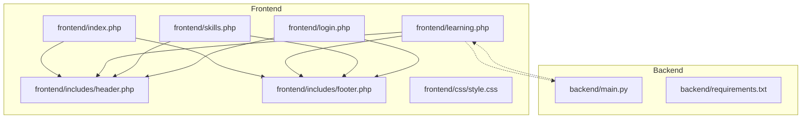
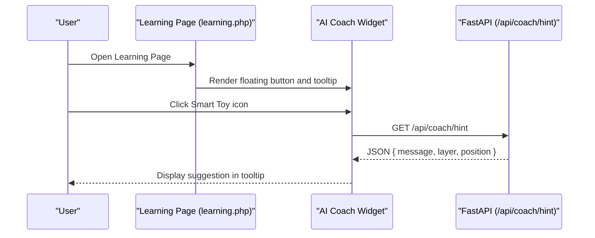
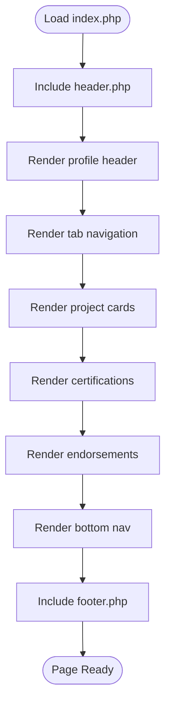
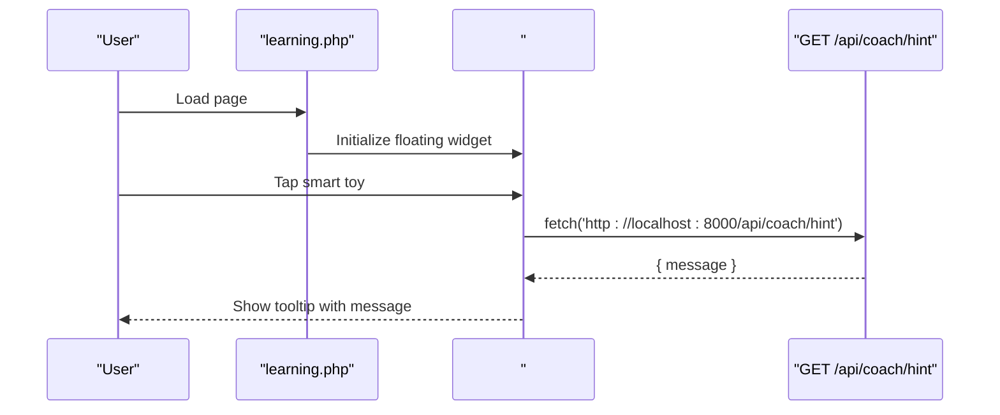
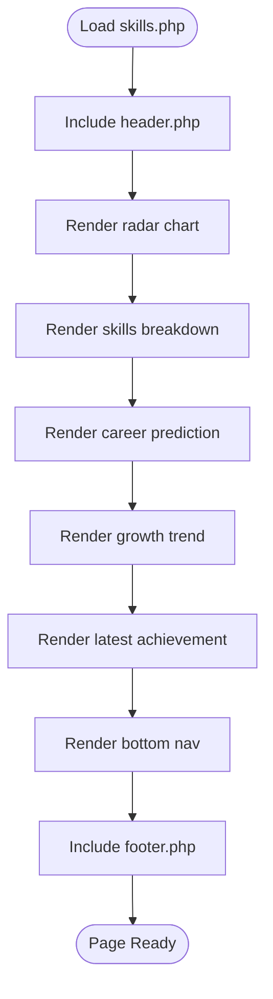
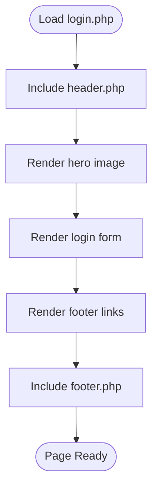
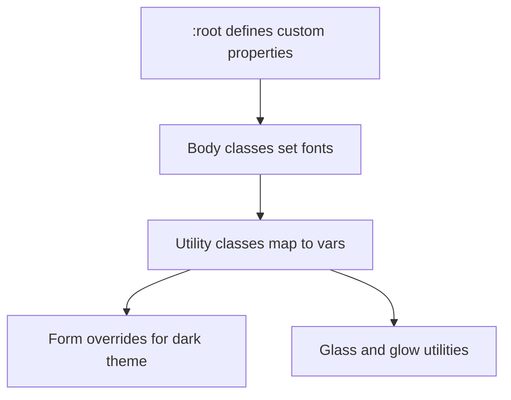
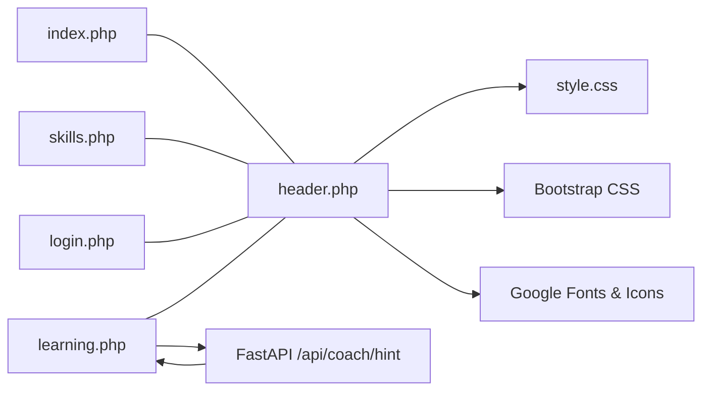

# Frontend Architecture

<cite>
**Referenced Files in This Document**
- [frontend/index.php](file://frontend/index.php)
- [frontend/learning.php](file://frontend/learning.php)
- [frontend/skills.php](file://frontend/skills.php)
- [frontend/login.php](file://frontend/login.php)
- [frontend/includes/header.php](file://frontend/includes/header.php)
- [frontend/includes/footer.php](file://frontend/includes/footer.php)
- [frontend/css/style.css](file://frontend/css/style.css)
- [backend/main.py](file://backend/main.py)
- [backend/requirements.txt](file://backend/requirements.txt)
</cite>

## Table of Contents
1. [Introduction](#introduction)
2. [Project Structure](#project-structure)
3. [Core Components](#core-components)
4. [Architecture Overview](#architecture-overview)
5. [Detailed Component Analysis](#detailed-component-analysis)
6. [Dependency Analysis](#dependency-analysis)
7. [Performance Considerations](#performance-considerations)
8. [Troubleshooting Guide](#troubleshooting-guide)
9. [Conclusion](#conclusion)
10. [Appendices](#appendices)

## Introduction
This document describes the frontend architecture of the Octal Foundry PHP system. It explains how the system implements an MVC-like pattern with PHP templates as views, shared header/footer components, and a responsive design powered by Bootstrap 5. It documents component interactions among the portfolio dashboard, learning interface, skills visualization, and authentication pages. It also details data flows from the FastAPI backend to frontend components, template inclusion patterns, and the CSS custom property system. Finally, it outlines infrastructure requirements for PHP environments, web server configuration, and asset loading, and shows how frontend pages integrate with the FastAPI backend services and AI coaching functionality.

## Project Structure
The frontend is organized around PHP template files and shared layout includes. Each page is a self-contained template that includes a shared header and footer. Styles are centralized in a single CSS file that leverages CSS custom properties for theming. The backend is a minimal FastAPI service exposing endpoints used by the frontend.

**Diagram sources**
- [frontend/index.php](file://frontend/index.php#L1-L174)
- [frontend/learning.php](file://frontend/learning.php#L1-L215)
- [frontend/skills.php](file://frontend/skills.php#L1-L189)
- [frontend/login.php](file://frontend/login.php#L1-L94)
- [frontend/includes/header.php](file://frontend/includes/header.php#L1-L23)
- [frontend/includes/footer.php](file://frontend/includes/footer.php#L1-L7)
- [frontend/css/style.css](file://frontend/css/style.css#L1-L114)
- [backend/main.py](file://backend/main.py#L1-L30)
- [backend/requirements.txt](file://backend/requirements.txt#L1-L3)

**Section sources**
- [frontend/index.php](file://frontend/index.php#L1-L174)
- [frontend/learning.php](file://frontend/learning.php#L1-L215)
- [frontend/skills.php](file://frontend/skills.php#L1-L189)
- [frontend/login.php](file://frontend/login.php#L1-L94)
- [frontend/includes/header.php](file://frontend/includes/header.php#L1-L23)
- [frontend/includes/footer.php](file://frontend/includes/footer.php#L1-L7)
- [frontend/css/style.css](file://frontend/css/style.css#L1-L114)
- [backend/main.py](file://backend/main.py#L1-L30)
- [backend/requirements.txt](file://backend/requirements.txt#L1-L3)

## Core Components
- Shared Layout Includes
  - Header: Provides HTML head, fonts, Bootstrap CSS, and custom CSS link. It also sets the dark theme attribute and wraps content in a flex column container.
  - Footer: Closes the wrapper and loads Bootstrap JS bundle.
- Pages as Templates
  - Portfolio Dashboard: Displays profile, tabs, project cards, certifications, and endorsements.
  - Learning Interface: Video player, transcript, task area, and an AI coach widget that calls the backend.
  - Skills Visualization: Radar chart, skill breakdown, career prediction, growth trend, and latest achievement.
  - Authentication Page: Login form with social login option.
- CSS Custom Property System
  - Centralized theme tokens in :root and derived utility classes for backgrounds, text, and interactive elements.
- Bootstrap 5 Integration
  - Responsive grid, utilities, and dark theme via data attribute.
- Backend Integration
  - FastAPI endpoint consumed by the AI coach widget in the learning interface.

**Section sources**
- [frontend/includes/header.php](file://frontend/includes/header.php#L1-L23)
- [frontend/includes/footer.php](file://frontend/includes/footer.php#L1-L7)
- [frontend/index.php](file://frontend/index.php#L1-L174)
- [frontend/learning.php](file://frontend/learning.php#L1-L215)
- [frontend/skills.php](file://frontend/skills.php#L1-L189)
- [frontend/login.php](file://frontend/login.php#L1-L94)
- [frontend/css/style.css](file://frontend/css/style.css#L1-L114)
- [backend/main.py](file://backend/main.py#L23-L29)

## Architecture Overview
The frontend follows a template-driven MVC-like pattern:
- Model: Not represented in PHP templates; data is either static or fetched from backend APIs.
- View: PHP files render HTML with embedded styles and Bootstrap utilities.
- Controller: Minimal; navigation links and lightweight client-side interactions (e.g., AI coach toggle).

The AI coach widget demonstrates a frontend-to-backend data flow to a FastAPI service. The backend exposes a hint endpoint that the frontend consumes asynchronously.

**Diagram sources**
- [frontend/learning.php](file://frontend/learning.php#L177-L212)
- [backend/main.py](file://backend/main.py#L23-L29)

## Detailed Component Analysis

### Portfolio Dashboard (index.php)
- Structure
  - Sticky top navigation bar with back link and actions.
  - Profile header with avatar, verification badge, and download action.
  - Tabbed navigation to Projects, Certificates, and Skills.
  - Project cards grid with metadata and links.
  - Horizontal scrollable certifications and industry endorsements.
  - Fixed bottom navigation bar linking to learning.
- Template Inclusion Pattern
  - Includes header and footer partials.
- Styling
  - Uses CSS custom properties for primary colors and backgrounds.
  - Leverages Bootstrap utilities for responsive layout and spacing.

**Diagram sources**
- [frontend/index.php](file://frontend/index.php#L1-L174)
- [frontend/includes/header.php](file://frontend/includes/header.php#L1-L23)
- [frontend/includes/footer.php](file://frontend/includes/footer.php#L1-L7)

**Section sources**
- [frontend/index.php](file://frontend/index.php#L1-L174)

### Learning Interface (learning.php)
- Structure
  - Top app bar with back link and course title.
  - Media player section with play overlay and progress bar.
  - Transcript, notes, and resources tabs.
  - Foundry task section with highlighted instruction.
  - IDE/code area with syntax-like rendering.
  - AI Coach floating action button and tooltip bubble.
- Data Flow
  - On widget open, fetches a hint from the backend endpoint.
- Template Inclusion Pattern
  - Includes header and footer partials.
- Styling
  - Dark theme with glass effects and custom shadows.

**Diagram sources**
- [frontend/learning.php](file://frontend/learning.php#L177-L212)
- [backend/main.py](file://backend/main.py#L23-L29)

**Section sources**
- [frontend/learning.php](file://frontend/learning.php#L1-L215)
- [backend/main.py](file://backend/main.py#L23-L29)

### Skills Visualization (skills.php)
- Structure
  - Top app bar with menu and notifications.
  - Radar chart visualization with hexagonal grid and glow effect.
  - Current mastery vs target benchmark legend.
  - Top skills breakdown with progress bars.
  - AI Career Prediction panel with gradient background.
  - Skill growth trend bar chart.
  - Latest achievement banner.
  - Fixed bottom navigation bar.
- Template Inclusion Pattern
  - Includes header and footer partials.
- Styling
  - Uses CSS custom properties and utility classes for consistent theming.

**Diagram sources**
- [frontend/skills.php](file://frontend/skills.php#L1-L189)
- [frontend/includes/header.php](file://frontend/includes/header.php#L1-L23)
- [frontend/includes/footer.php](file://frontend/includes/footer.php#L1-L7)

**Section sources**
- [frontend/skills.php](file://frontend/skills.php#L1-L189)

### Authentication Page (login.php)
- Structure
  - Back button and branding header.
  - Hero image with gradient overlay.
  - Login form with university email, password, remember me, and social login.
  - Footer link and bottom indicator.
- Template Inclusion Pattern
  - Includes header and footer partials.
- Styling
  - Dark theme with form controls styled via custom classes.

**Diagram sources**
- [frontend/login.php](file://frontend/login.php#L1-L94)
- [frontend/includes/header.php](file://frontend/includes/header.php#L1-L23)
- [frontend/includes/footer.php](file://frontend/includes/footer.php#L1-L7)

**Section sources**
- [frontend/login.php](file://frontend/login.php#L1-L94)

### CSS Custom Property System (style.css)
- Theming
  - Defines primary colors, background shades, card background, and text palette in :root.
  - Exposes Bootstrap body colors to custom variables for seamless Bootstrap dark theme.
- Utilities
  - Background and text utilities mapped to custom properties.
  - Glass effect and blur utilities for modern UI panels.
- Overrides
  - Dark-themed form controls with focus glow and placeholder styling.

**Diagram sources**
- [frontend/css/style.css](file://frontend/css/style.css#L1-L114)

**Section sources**
- [frontend/css/style.css](file://frontend/css/style.css#L1-L114)

## Dependency Analysis
- Template Inclusion Dependencies
  - All pages depend on header and footer includes for consistent layout and assets.
- Asset Dependencies
  - Fonts and icons loaded via Google Fonts and Material Symbols.
  - Bootstrap CSS and JS loaded via CDN.
  - Local CSS linked from /css/style.css.
- Backend Dependencies
  - The learning page depends on the backend endpoint for AI hints.
- Backend Dependencies
  - FastAPI CORS configured to allow frontend origins.

**Diagram sources**
- [frontend/includes/header.php](file://frontend/includes/header.php#L8-L18)
- [frontend/css/style.css](file://frontend/css/style.css#L1-L114)
- [frontend/index.php](file://frontend/index.php#L1-L174)
- [frontend/learning.php](file://frontend/learning.php#L1-L215)
- [frontend/skills.php](file://frontend/skills.php#L1-L189)
- [frontend/login.php](file://frontend/login.php#L1-L94)
- [backend/main.py](file://backend/main.py#L23-L29)

**Section sources**
- [frontend/includes/header.php](file://frontend/includes/header.php#L8-L18)
- [frontend/css/style.css](file://frontend/css/style.css#L1-L114)
- [frontend/index.php](file://frontend/index.php#L1-L174)
- [frontend/learning.php](file://frontend/learning.php#L1-L215)
- [frontend/skills.php](file://frontend/skills.php#L1-L189)
- [frontend/login.php](file://frontend/login.php#L1-L94)
- [backend/main.py](file://backend/main.py#L6-L17)

## Performance Considerations
- Asset Loading
  - Prefer preloading critical fonts and deferring non-critical scripts.
  - Minimize inline styles; keep most styling in centralized CSS.
- Rendering
  - Use lazy loading for images and videos.
  - Limit heavy DOM manipulation; rely on CSS transforms for animations.
- Network
  - Cache static assets and leverage browser caching headers.
  - Consider localizing or self-hosting assets to reduce external dependencies.
- Theming
  - Centralized CSS variables reduce duplication and improve maintainability.

[No sources needed since this section provides general guidance]

## Troubleshooting Guide
- AI Coach Widget Issues
  - Verify the backend endpoint is reachable at http://localhost:8000/api/coach/hint.
  - Check browser console for network errors or CORS-related messages.
  - Confirm the backend allows requests from the frontend origin.
- Missing Assets
  - Ensure the custom CSS path /css/style.css is correct and accessible.
  - Confirm CDN URLs for Bootstrap and fonts are reachable.
- Template Inclusion
  - If pages appear unstyled, check that header and footer includes are properly included and paths are correct.
- Styling Consistency
  - If colors or backgrounds look incorrect, verify CSS custom properties are defined and utilities are applied consistently.

**Section sources**
- [frontend/learning.php](file://frontend/learning.php#L177-L212)
- [backend/main.py](file://backend/main.py#L6-L17)

## Conclusion
The Octal Foundry frontend employs a clean, template-driven approach with shared layout includes and a cohesive CSS custom property system. The learning interface integrates with the FastAPI backend to deliver contextual AI coaching, while the portfolio and skills pages present rich visualizations using Bootstrap 5 utilities. The architecture supports responsive design and a consistent dark theme across pages, with straightforward integration points for future enhancements.

[No sources needed since this section summarizes without analyzing specific files]

## Appendices

### Infrastructure Requirements
- PHP Environment
  - Web server capable of serving PHP files (Apache or Nginx with PHP-FPM).
  - PHP runtime with short tags disabled (templates use standard PHP include syntax).
- Web Server Configuration
  - Ensure the frontend directory is served as the document root.
  - Configure static asset paths (/css/style.css) to resolve correctly.
- Backend Services
  - FastAPI service running locally or remotely, exposing /api/coach/hint.
  - CORS configured to allow frontend origins.
- Assets
  - Internet connectivity for CDN-hosted Bootstrap and Google Fonts.
  - Optional: Self-host assets to reduce external dependencies.

**Section sources**
- [backend/requirements.txt](file://backend/requirements.txt#L1-L3)
- [backend/main.py](file://backend/main.py#L6-L17)