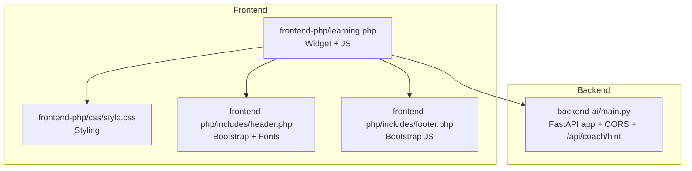
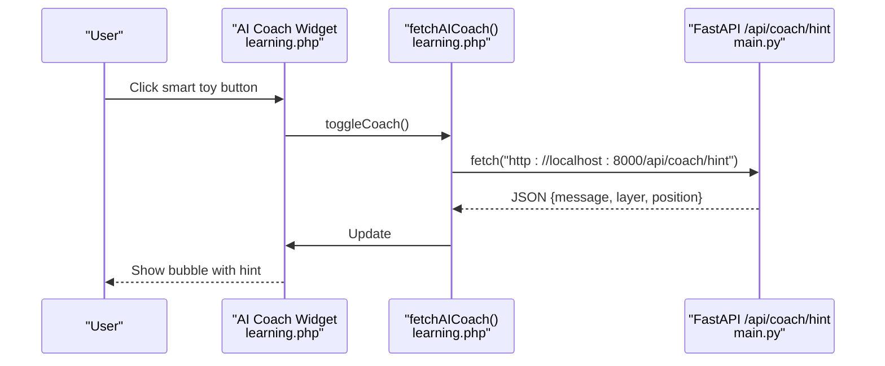
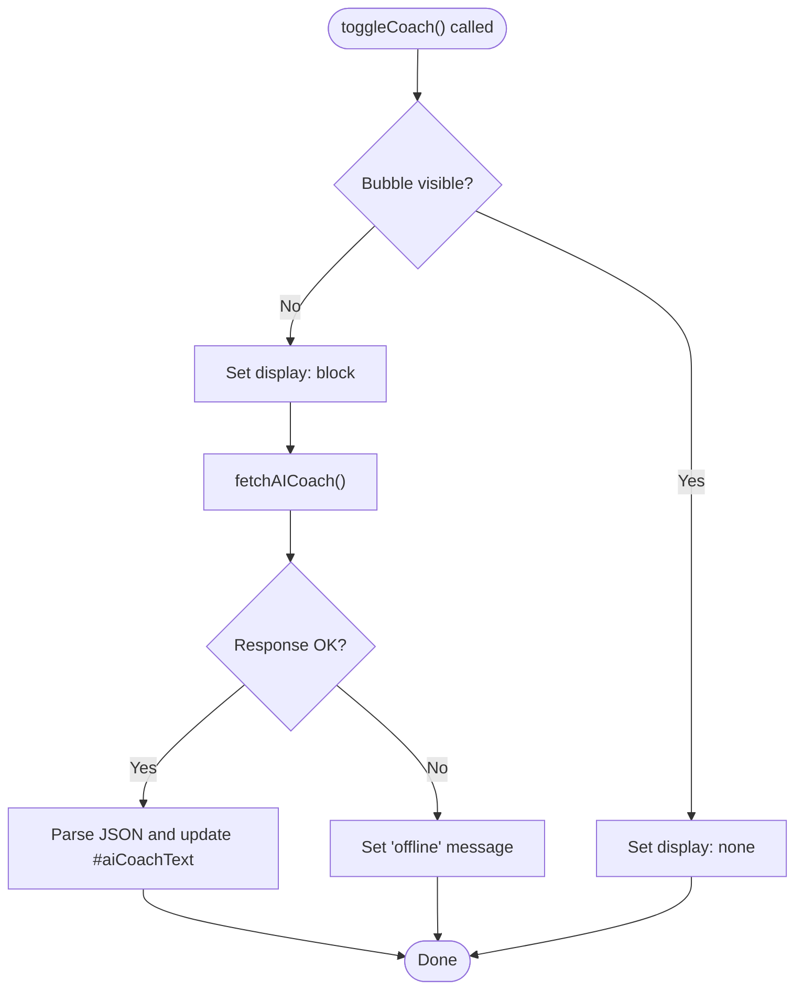
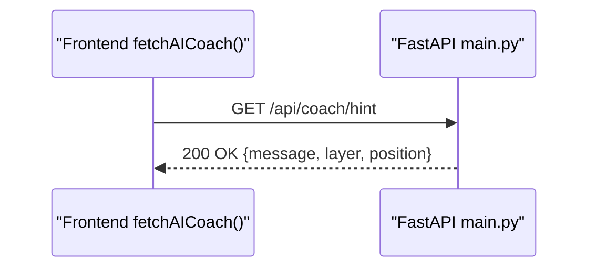
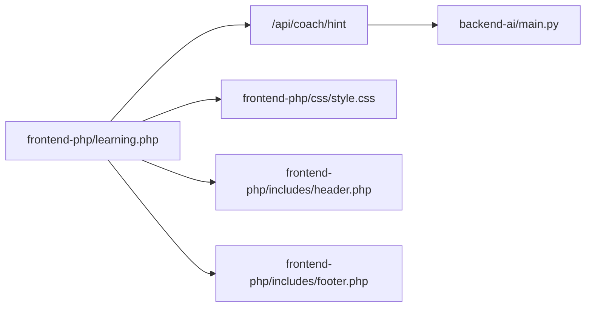

# AI Coaching Integration

<cite>
**Referenced Files in This Document**
- [learning.php](file://frontend-php/learning.php)
- [style.css](file://frontend-php/css/style.css)
- [main.py](file://backend-ai/main.py)
- [header.php](file://frontend-php/includes/header.php)
- [footer.php](file://frontend-php/includes/footer.php)
</cite>

## Table of Contents
1. [Introduction](#introduction)
2. [Project Structure](#project-structure)
3. [Core Components](#core-components)
4. [Architecture Overview](#architecture-overview)
5. [Detailed Component Analysis](#detailed-component-analysis)
6. [Dependency Analysis](#dependency-analysis)
7. [Performance Considerations](#performance-considerations)
8. [Troubleshooting Guide](#troubleshooting-guide)
9. [Conclusion](#conclusion)

## Introduction
This document explains the AI coaching system integrated into the learning interface. It covers the floating AI coach widget, tooltip bubble system, and hint generation functionality. It documents the JavaScript fetch API implementation for calling the FastAPI coaching endpoint, error handling for offline scenarios, and dynamic content updates. Interaction patterns such as coach activation, hint requests, and response display are described, along with bubble styling, arrow positioning, animation effects, and responsive positioning. Real-time assistance workflows and user feedback mechanisms are included.

## Project Structure
The AI coaching integration spans the frontend learning page and the backend FastAPI service:
- Frontend: Floating AI coach widget and bubble UI live in the learning page.
- Backend: A FastAPI service exposes the coaching endpoint.

**Diagram sources**
- [learning.php](file://frontend-php/learning.php#L152-L214)
- [style.css](file://frontend-php/css/style.css#L1-L289)
- [header.php](file://frontend-php/includes/header.php#L1-L71)
- [footer.php](file://frontend-php/includes/footer.php#L1-L31)
- [main.py](file://backend-ai/main.py#L1-L30)

**Section sources**
- [learning.php](file://frontend-php/learning.php#L152-L214)
- [main.py](file://backend-ai/main.py#L1-L30)

## Core Components
- Floating AI coach widget
  - Smart toy icon button triggers the coach bubble.
  - Clicking toggles visibility and initiates a hint fetch.
- Tooltip/bubble system
  - Positioned near the floating button with a directional arrow.
  - Displays AI-generated hints and loading states.
- JavaScript integration
  - fetchAICoach(): Calls the backend endpoint and updates the bubble content.
  - toggleCoach(): Controls visibility and triggers hint retrieval.
- Backend endpoint
  - FastAPI GET /api/coach/hint returns structured hint data.

Key implementation references:
- Widget and bubble HTML: [learning.php](file://frontend-php/learning.php#L152-L175)
- fetchAICoach() function: [learning.php](file://frontend-php/learning.php#L177-L196)
- toggleCoach() function: [learning.php](file://frontend-php/learning.php#L198-L206)
- Auto-open demo: [learning.php](file://frontend-php/learning.php#L208-L212)
- Backend endpoint: [main.py](file://backend-ai/main.py#L23-L29)

**Section sources**
- [learning.php](file://frontend-php/learning.php#L152-L214)
- [main.py](file://backend-ai/main.py#L23-L29)

## Architecture Overview
The AI coaching workflow connects the frontend widget to the backend service via a fetch call.

**Diagram sources**
- [learning.php](file://frontend-php/learning.php#L177-L212)
- [main.py](file://backend-ai/main.py#L23-L29)

## Detailed Component Analysis

### Floating AI Coach Widget
- Structure
  - Fixed-position container at bottom-right corner.
  - Inner group allows pointer events only on interactive elements.
  - Tooltip bubble positioned above the button with a triangular arrow.
  - Main floating action button uses a smart toy icon.
- Behavior
  - Visibility controlled by toggleCoach().
  - On open, fetchAICoach() is invoked to populate the bubble.
- Styling
  - Uses theme variables and glass-like backgrounds from shared styles.
  - Bubble width and arrow geometry defined inline.

Implementation references:
- Container and bubble: [learning.php](file://frontend-php/learning.php#L152-L175)
- Toggle handler: [learning.php](file://frontend-php/learning.php#L198-L206)
- Auto-open demo: [learning.php](file://frontend-php/learning.php#L208-L212)
- Theme variables: [style.css](file://frontend-php/css/style.css#L1-L11)

**Section sources**
- [learning.php](file://frontend-php/learning.php#L152-L175)
- [learning.php](file://frontend-php/learning.php#L198-L212)
- [style.css](file://frontend-php/css/style.css#L1-L11)

### Tooltip Bubble System
- Content area
  - Displays a small title, icon, and the AI message.
  - Loading text shown while fetching.
- Arrow and positioning
  - Arrow implemented as a rotated square behind the bubble.
  - Positioned absolutely below the bubble and aligned to the button.
- Responsiveness
  - Bubble width is fixed; arrow placement is adjusted via inline styles.

Implementation references:
- Bubble markup and arrow: [learning.php](file://frontend-php/learning.php#L155-L168)
- Text element update: [learning.php](file://frontend-php/learning.php#L180-L189)

**Section sources**
- [learning.php](file://frontend-php/learning.php#L155-L168)
- [learning.php](file://frontend-php/learning.php#L180-L189)

### Hint Generation and Dynamic Updates
- fetchAICoach()
  - Performs a fetch against the backend endpoint.
  - Parses JSON and updates the bubble text element.
  - Handles non-OK responses and exceptions with user-friendly messages.
- toggleCoach()
  - Switches bubble visibility.
  - Triggers a hint fetch upon opening.

Implementation references:
- fetchAICoach(): [learning.php](file://frontend-php/learning.php#L177-L196)
- toggleCoach(): [learning.php](file://frontend-php/learning.php#L198-L206)

**Diagram sources**
- [learning.php](file://frontend-php/learning.php#L177-L206)

**Section sources**
- [learning.php](file://frontend-php/learning.php#L177-L206)

### JavaScript Fetch API Implementation
- Endpoint: http://localhost:8000/api/coach/hint
- Request method: GET
- Response handling:
  - On success: extracts message and updates the bubble.
  - On non-OK status: shows an offline message.
  - On exception: logs error and shows a connection failure message.
- Auto-open demo: The bubble opens automatically after a short delay for demonstration.

Implementation references:
- fetchAICoach() body: [learning.php](file://frontend-php/learning.php#L177-L196)
- Auto-open: [learning.php](file://frontend-php/learning.php#L208-L212)

**Section sources**
- [learning.php](file://frontend-php/learning.php#L177-L212)

### Backend FastAPI Integration
- Endpoint: GET /api/coach/hint
- Returns structured data containing a hint message and contextual metadata.
- CORS configuration allows development access from localhost and 8080.

Implementation references:
- Endpoint definition: [main.py](file://backend-ai/main.py#L23-L29)
- CORS setup: [main.py](file://backend-ai/main.py#L6-L17)

**Diagram sources**
- [learning.php](file://frontend-php/learning.php#L185-L188)
- [main.py](file://backend-ai/main.py#L23-L29)

**Section sources**
- [main.py](file://backend-ai/main.py#L23-L29)
- [main.py](file://backend-ai/main.py#L6-L17)

### User Interaction Patterns
- Activation
  - Click the smart toy floating button to toggle the bubble.
- Hint Request
  - On first open, the system fetches a hint from the backend.
- Response Display
  - The bubble shows the AI message; arrow points toward the button.
- Feedback Mechanisms
  - Offline and connection failure messages inform the user when the backend is unreachable.

Implementation references:
- Toggle and fetch: [learning.php](file://frontend-php/learning.php#L198-L206)
- Auto-open demo: [learning.php](file://frontend-php/learning.php#L208-L212)

**Section sources**
- [learning.php](file://frontend-php/learning.php#L198-L212)

### Coach Bubble Styling and Positioning
- Bubble
  - Rounded corners, subtle borders, light background for contrast.
  - Fixed width for readability.
- Arrow
  - Implemented as a small rotated square placed beneath the bubble.
  - Positioned using absolute coordinates and transform.
- Animation and responsiveness
  - No explicit animations are present; transitions rely on display toggling.
  - Bubble remains fixed in position relative to the viewport.

Implementation references:
- Bubble and arrow: [learning.php](file://frontend-php/learning.php#L155-L168)
- Theme variables: [style.css](file://frontend-php/css/style.css#L1-L11)

**Section sources**
- [learning.php](file://frontend-php/learning.php#L155-L168)
- [style.css](file://frontend-php/css/style.css#L1-L11)

## Dependency Analysis
- Frontend depends on:
  - Backend endpoint availability at http://localhost:8000.
  - Bootstrap and custom CSS for styling and layout.
- Backend depends on:
  - FastAPI runtime and CORS middleware configuration.

**Diagram sources**
- [learning.php](file://frontend-php/learning.php#L152-L214)
- [style.css](file://frontend-php/css/style.css#L1-L289)
- [header.php](file://frontend-php/includes/header.php#L1-L71)
- [footer.php](file://frontend-php/includes/footer.php#L1-L31)
- [main.py](file://backend-ai/main.py#L1-L30)

**Section sources**
- [learning.php](file://frontend-php/learning.php#L152-L214)
- [main.py](file://backend-ai/main.py#L1-L30)

## Performance Considerations
- Network latency
  - The fetch call occurs on demand (when the bubble opens) to minimize unnecessary requests.
- Rendering
  - Bubble content is updated via DOM manipulation; keep messages concise for quick rendering.
- Styling
  - Inline styles are used for positioning; consider extracting to CSS for maintainability if reused widely.

## Troubleshooting Guide
Common issues and resolutions:
- Backend not reachable
  - Symptom: Bubble shows an offline or connection failed message.
  - Cause: Backend server not running or blocked by CORS.
  - Resolution: Start the backend service and verify the endpoint responds.
- Incorrect host/port
  - Symptom: Fetch fails due to wrong URL.
  - Resolution: Ensure the endpoint URL matches the backend deployment.
- CORS errors
  - Symptom: Browser blocks the request.
  - Resolution: Confirm CORS configuration allows the frontend origin.

References:
- fetchAICoach() error handling: [learning.php](file://frontend-php/learning.php#L182-L195)
- Backend CORS configuration: [main.py](file://backend-ai/main.py#L6-L17)

**Section sources**
- [learning.php](file://frontend-php/learning.php#L182-L195)
- [main.py](file://backend-ai/main.py#L6-L17)

## Conclusion
The AI coaching integration delivers a lightweight, user-driven assistant within the learning interface. The floating widget toggles a styled bubble that displays AI-generated hints fetched from the backend. The implementation leverages a simple fetch pattern with robust offline handling and straightforward styling. Extending the system could involve adding persistent hints, user feedback loops, and richer animations.