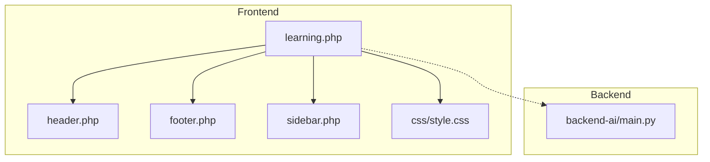
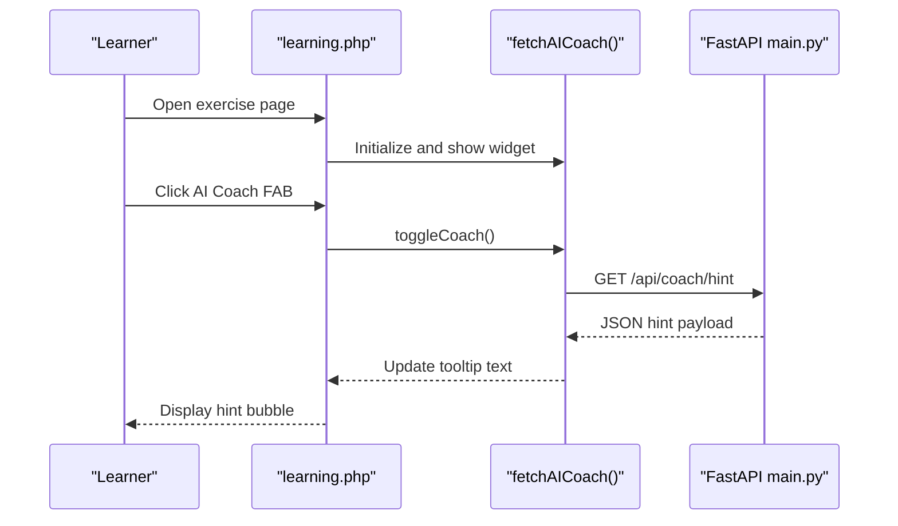
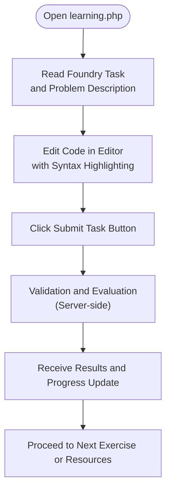
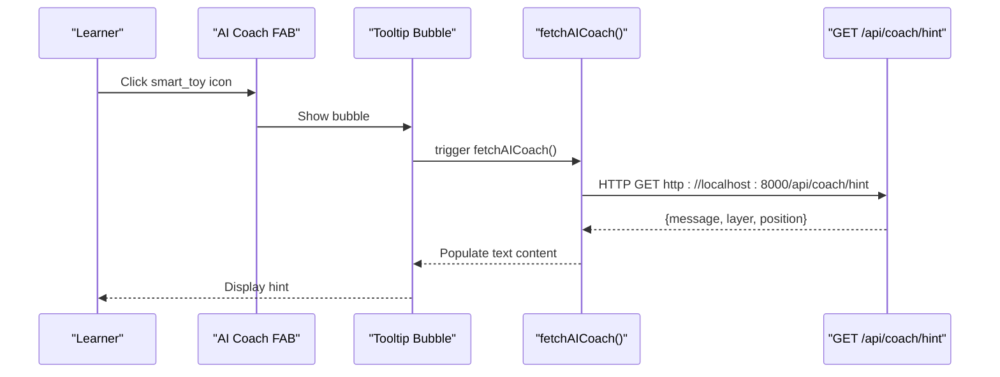
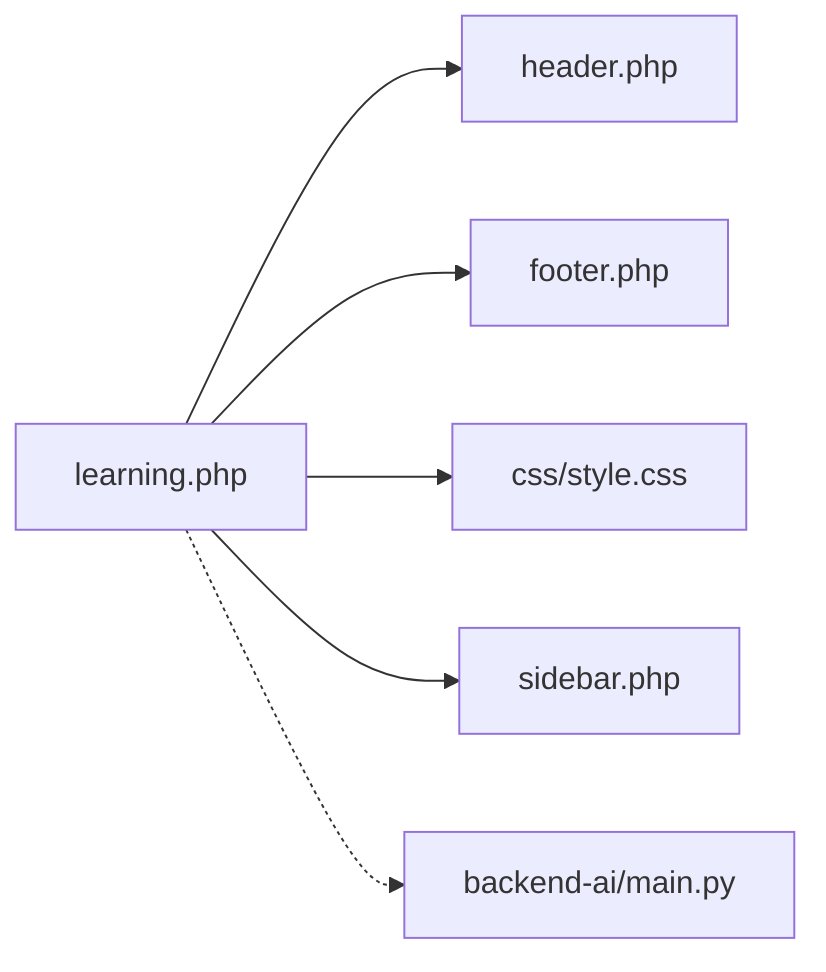

# Interactive Exercise Environment

<cite>
**Referenced Files in This Document**
- [learning.php](file://frontend-php/learning.php)
- [style.css](file://frontend-php/css/style.css)
- [header.php](file://frontend-php/includes/header.php)
- [footer.php](file://frontend-php/includes/footer.php)
- [sidebar.php](file://frontend-php/includes/sidebar.php)
- [main.py](file://backend-ai/main.py)
</cite>

## Table of Contents
1. [Introduction](#introduction)
2. [Project Structure](#project-structure)
3. [Core Components](#core-components)
4. [Architecture Overview](#architecture-overview)
5. [Detailed Component Analysis](#detailed-component-analysis)
6. [Dependency Analysis](#dependency-analysis)
7. [Performance Considerations](#performance-considerations)
8. [Troubleshooting Guide](#troubleshooting-guide)
9. [Conclusion](#conclusion)

## Introduction
This document describes the interactive coding exercise environment centered on an IDE-like interface for completing machine learning tasks. It covers the dark-themed code editor with syntax highlighting, line numbers, and cursor positioning; the Foundry Task area with critical task badges and problem descriptions; the submission workflow; and the integration with backend services for hints and coaching. The document also outlines the styling approach using monospace fonts and the DOM structure of the code editor.

## Project Structure
The environment is implemented using PHP front-end pages with shared header and footer templates, a dedicated CSS stylesheet for theming and layout, and a Python FastAPI backend for serving hints.

**Diagram sources**
- [learning.php](file://frontend-php/learning.php#L1-L215)
- [header.php](file://frontend-php/includes/header.php#L1-L71)
- [footer.php](file://frontend-php/includes/footer.php#L1-L31)
- [sidebar.php](file://frontend-php/includes/sidebar.php#L1-L81)
- [style.css](file://frontend-php/css/style.css#L1-L289)
- [main.py](file://backend-ai/main.py#L1-L30)

**Section sources**
- [learning.php](file://frontend-php/learning.php#L1-L215)
- [header.php](file://frontend-php/includes/header.php#L1-L71)
- [footer.php](file://frontend-php/includes/footer.php#L1-L31)
- [sidebar.php](file://frontend-php/includes/sidebar.php#L1-L81)
- [style.css](file://frontend-php/css/style.css#L1-L289)
- [main.py](file://backend-ai/main.py#L1-L30)

## Core Components
- Dark theme and layout: The environment uses a dark color palette with glass effects and monospace typography for code readability.
- Foundry Task area: Presents the task title, critical badge, and problem statement.
- Code editor: A styled container with line numbers, syntax-colored tokens, and a blinking cursor indicator.
- Submission controls: Buttons for submitting the task and requesting help.
- AI coach widget: A floating action button that fetches hints from the backend.

**Section sources**
- [style.css](file://frontend-php/css/style.css#L1-L289)
- [learning.php](file://frontend-php/learning.php#L90-L149)
- [main.py](file://backend-ai/main.py#L23-L29)

## Architecture Overview
The exercise page composes the UI from reusable templates and applies styles via CSS. JavaScript in the page triggers asynchronous requests to the backend to retrieve hints. The backend exposes a simple endpoint returning structured hint data.

**Diagram sources**
- [learning.php](file://frontend-php/learning.php#L177-L212)
- [main.py](file://backend-ai/main.py#L23-L29)

## Detailed Component Analysis

### Dark-Themed Code Editor
The code editor is a styled container with:
- Window controls: A row of colored dots representing typical OS window controls.
- File tab: Displays the active filename with a monospace font.
- Line numbers: A narrow gutter with right-aligned numbers.
- Syntax highlighting: Inline color spans for keywords and identifiers.
- Cursor indicator: A highlighted line with a cursor bar for the caret position.
- Execution buttons: Submit and Help actions below the editor.

DOM structure highlights:
- Container with dark background and border.
- Title bar with window controls, filename, and copy icon.
- Editor body containing line-numbered rows and a cursor row.
- Action buttons for submission and help.

Styling characteristics:
- Monospace font applied to the editor body and transcript.
- Dark theme variables define background and text colors.
- Hover and focus states for interactive elements.

**Section sources**
- [learning.php](file://frontend-php/learning.php#L105-L149)
- [style.css](file://frontend-php/css/style.css#L13-L24)
- [style.css](file://frontend-php/css/style.css#L273-L279)

### Foundry Task Area
The task area displays:
- A prominent title with a small dot marker.
- A critical badge indicating task importance.
- A concise problem description aligned with the lesson content.

This section anchors the learner’s focus on the objective and encourages careful attention to detail.

**Section sources**
- [learning.php](file://frontend-php/learning.php#L90-L102)

### IDE-like Interface Elements
The interface includes:
- Top navigation bar with back navigation and schedule actions.
- Media player section with playback controls and progress visualization.
- Transcript panel with monospace text and current timestamp highlighting.
- Sidebar navigation for dashboard and learning pathways.
- Floating AI coach widget with a tooltip bubble and toggle behavior.

These elements collectively emulate an IDE-like environment tailored for educational content consumption and task completion.

**Section sources**
- [learning.php](file://frontend-php/learning.php#L3-L17)
- [learning.php](file://frontend-php/learning.php#L20-L88)
- [sidebar.php](file://frontend-php/includes/sidebar.php#L1-L81)
- [header.php](file://frontend-php/includes/header.php#L37-L67)

### Submission Workflow
The workflow centers on the “Submit Task” button:
- Located beneath the editor with prominent styling.
- Triggers the task submission process (UI presence indicates intent; server-side handling is external to this page).
- A secondary “Help” button provides quick access to hints.

[No sources needed since this diagram shows conceptual workflow, not actual code structure]

### AI Coach Integration
The AI coach widget:
- Is a floating action button that toggles a tooltip bubble.
- On open, it asynchronously fetches a hint from the backend endpoint.
- Displays a friendly message and arrow decoration when visible.

Backend endpoint:
- Returns structured JSON with a hint message, suggested layer, and position.

**Diagram sources**
- [learning.php](file://frontend-php/learning.php#L177-L212)
- [main.py](file://backend-ai/main.py#L23-L29)

**Section sources**
- [learning.php](file://frontend-php/learning.php#L152-L175)
- [learning.php](file://frontend-php/learning.php#L177-L212)
- [main.py](file://backend-ai/main.py#L23-L29)

## Dependency Analysis
The frontend depends on:
- Shared header and footer templates for consistent layout and navigation.
- CSS for theming, typography, and responsive behavior.
- Sidebar partial for dashboard navigation.
- Backend service for hints.

**Diagram sources**
- [learning.php](file://frontend-php/learning.php#L1-L215)
- [header.php](file://frontend-php/includes/header.php#L1-L71)
- [footer.php](file://frontend-php/includes/footer.php#L1-L31)
- [sidebar.php](file://frontend-php/includes/sidebar.php#L1-L81)
- [style.css](file://frontend-php/css/style.css#L1-L289)
- [main.py](file://backend-ai/main.py#L1-L30)

**Section sources**
- [learning.php](file://frontend-php/learning.php#L1-L215)
- [header.php](file://frontend-php/includes/header.php#L1-L71)
- [footer.php](file://frontend-php/includes/footer.php#L1-L31)
- [sidebar.php](file://frontend-php/includes/sidebar.php#L1-L81)
- [style.css](file://frontend-php/css/style.css#L1-L289)
- [main.py](file://backend-ai/main.py#L1-L30)

## Performance Considerations
- Minimize DOM updates during editor interactions by batching changes and avoiding unnecessary reflows.
- Use efficient CSS selectors and avoid deep nesting in the editor container to keep rendering smooth.
- Defer heavy computations off the main thread; leverage browser APIs for animations and transitions.
- Keep the AI coach tooltip lightweight; cache fetched hints per session to reduce network overhead.

[No sources needed since this section provides general guidance]

## Troubleshooting Guide
Common issues and resolutions:
- AI coach tooltip not appearing:
  - Verify the backend endpoint is reachable at the configured host/port.
  - Confirm CORS settings allow the origin from the frontend.
- Incorrect or stale hint content:
  - Ensure the backend returns the expected JSON structure.
  - Check for network errors and handle fallback messages gracefully.
- Editor not displaying monospace font:
  - Confirm the monospace class is applied to the editor body.
  - Validate that the CSS variables for dark theme are present.

**Section sources**
- [learning.php](file://frontend-php/learning.php#L177-L212)
- [main.py](file://backend-ai/main.py#L6-L17)

## Conclusion
The interactive exercise environment combines a cohesive dark-themed UI with an embedded code editor, a focused Foundry Task area, and integrated AI assistance. The modular PHP templates and centralized CSS enable consistent styling and layout, while the backend provides contextual hints to support learning. The submission pathway and progress tracking are anchored to the page’s primary actions, encouraging iterative task completion and continuous feedback.