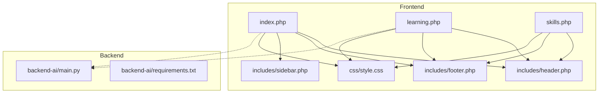
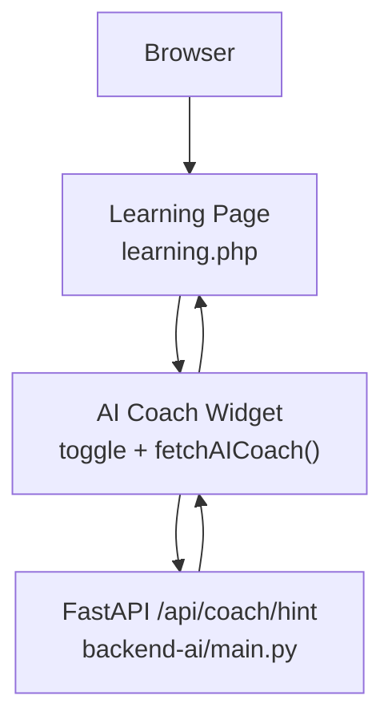
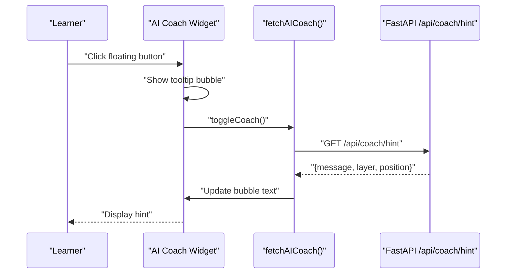
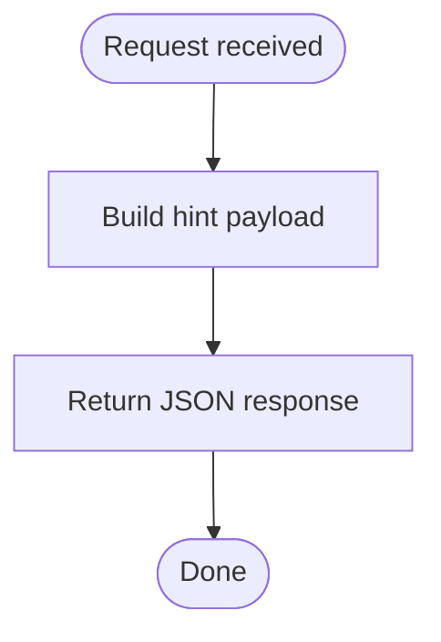
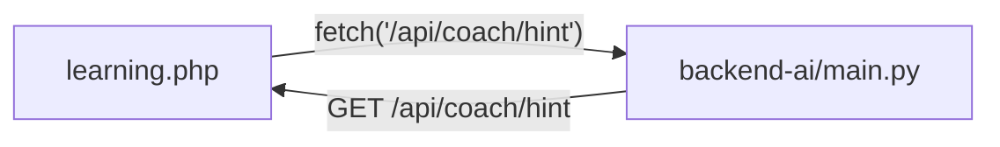

# Learning Interface & AI Coaching

<cite>
**Referenced Files in This Document**
- [frontend-php/index.php](file://frontend-php/index.php)
- [frontend-php/learning.php](file://frontend-php/learning.php)
- [frontend-php/skills.php](file://frontend-php/skills.php)
- [frontend-php/css/style.css](file://frontend-php/css/style.css)
- [frontend-php/includes/header.php](file://frontend-php/includes/header.php)
- [frontend-php/includes/footer.php](file://frontend-php/includes/footer.php)
- [frontend-php/includes/sidebar.php](file://frontend-php/includes/sidebar.php)
- [backend-ai/main.py](file://backend-ai/main.py)
- [backend-ai/requirements.txt](file://backend-ai/requirements.txt)
</cite>

## Table of Contents
1. [Introduction](#introduction)
2. [Project Structure](#project-structure)
3. [Core Components](#core-components)
4. [Architecture Overview](#architecture-overview)
5. [Detailed Component Analysis](#detailed-component-analysis)
6. [Dependency Analysis](#dependency-analysis)
7. [Performance Considerations](#performance-considerations)
8. [Troubleshooting Guide](#troubleshooting-guide)
9. [Conclusion](#conclusion)
10. [Appendices](#appendices)

## Introduction
This document describes the Octal Foundry learning interface and AI coaching integration. It covers the video lesson player, code exercise environment, AI coaching assistant widget, and the hint generation system. It explains the real-time AI assistance API integration, user interaction patterns for requesting hints, and the coaching workflow. It also documents the responsive layout for learning on different devices, exercise submission mechanisms, and progress tracking integration. Finally, it outlines integration patterns between frontend learning components and backend FastAPI services, including example API requests, response handling, and user feedback loops.

## Project Structure
The project is split into two primary parts:
- Frontend (PHP + HTML/CSS/JS): Provides the learning pages, responsive UI, and client-side interactions for the AI coach.
- Backend (FastAPI): Exposes a minimal API endpoint for AI coaching hints.

**Diagram sources**
- [frontend-php/index.php](file://frontend-php/index.php#L1-L174)
- [frontend-php/learning.php](file://frontend-php/learning.php#L1-L215)
- [frontend-php/skills.php](file://frontend-php/skills.php#L1-L189)
- [frontend-php/css/style.css](file://frontend-php/css/style.css#L1-L114)
- [frontend-php/includes/header.php](file://frontend-php/includes/header.php#L1-L71)
- [frontend-php/includes/footer.php](file://frontend-php/includes/footer.php#L1-L31)
- [frontend-php/includes/sidebar.php](file://frontend-php/includes/sidebar.php#L1-L81)
- [backend-ai/main.py](file://backend-ai/main.py#L1-L30)
- [backend-ai/requirements.txt](file://backend-ai/requirements.txt#L1-L3)

**Section sources**
- [frontend-php/index.php](file://frontend-php/index.php#L1-L174)
- [frontend-php/learning.php](file://frontend-php/learning.php#L1-L215)
- [frontend-php/skills.php](file://frontend-php/skills.php#L1-L189)
- [frontend-php/css/style.css](file://frontend-php/css/style.css#L1-L114)
- [frontend-php/includes/header.php](file://frontend-php/includes/header.php#L1-L71)
- [frontend-php/includes/footer.php](file://frontend-php/includes/footer.php#L1-L31)
- [frontend-php/includes/sidebar.php](file://frontend-php/includes/sidebar.php#L1-L81)
- [backend-ai/main.py](file://backend-ai/main.py#L1-L30)
- [backend-ai/requirements.txt](file://backend-ai/requirements.txt#L1-L3)

## Core Components
- Video Lesson Player: A responsive media player with playback controls, progress bar, captions, settings, and fullscreen affordances.
- Transcript Panel: Scrollable transcript synchronized to the current playback position.
- Foundry Task Exercise: An embedded code editor area with a submit action and a help button.
- AI Coaching Assistant Widget: A floating action button that toggles a tooltip bubble displaying AI-generated hints.
- Backend AI Hint Endpoint: A FastAPI endpoint that returns structured hint data for the AI coach.

Key integration points:
- The AI coach widget triggers a fetch to the backend endpoint and updates the UI with the returned message.
- The submit button initiates an exercise submission flow (UI present; backend integration to be implemented).
- Responsive layout adapts across mobile and desktop via CSS utilities and Bootstrap classes.

**Section sources**
- [frontend-php/learning.php](file://frontend-php/learning.php#L20-L88)
- [frontend-php/learning.php](file://frontend-php/learning.php#L104-L149)
- [frontend-php/learning.php](file://frontend-php/learning.php#L152-L175)
- [backend-ai/main.py](file://backend-ai/main.py#L23-L29)

## Architecture Overview
The learning interface is a static PHP-driven SPA-like experience with a floating AI coach. The AI coach communicates with a local FastAPI service exposed at a fixed port. The backend is minimal and intended for development/demo use.

**Diagram sources**
- [frontend-php/learning.php](file://frontend-php/learning.php#L177-L212)
- [backend-ai/main.py](file://backend-ai/main.py#L23-L29)

## Detailed Component Analysis

### Video Lesson Player
Responsibilities:
- Display a lesson thumbnail with a centered play button.
- Show a gradient-drawn progress bar and time indicators.
- Provide controls for captions, settings, and fullscreen.
- Integrate with a transcript panel synchronized to the current playback position.

Responsive behavior:
- Uses aspect-ratio utilities and percentage-based sizing to maintain a 16:9 ratio.
- Controls and progress overlay adapt to smaller screens.

Accessibility and UX:
- Play button is prominent and centered.
- Progress bar includes a draggable handle indicator.
- Time labels update during playback.

**Section sources**
- [frontend-php/learning.php](file://frontend-php/learning.php#L20-L49)
- [frontend-php/learning.php](file://frontend-php/learning.php#L67-L88)

### Transcript Panel
Responsibilities:
- Display timed segments of the lesson transcript.
- Highlight the current segment with a distinct background and label.
- Enable scrolling for long transcripts.

Integration:
- The current segment marker indicates the learner’s position in the lesson.

**Section sources**
- [frontend-php/learning.php](file://frontend-php/learning.php#L67-L88)

### Foundry Task Exercise
Responsibilities:
- Present a code editor area with a filename header and line numbers.
- Provide a “Submit Task” action to finalize the exercise.
- Provide a “Help” action to request AI coaching hints.

Exercise submission:
- The submit button exists in the UI; backend integration is pending.

Help button:
- Opens the AI coach widget and triggers a fetch to the backend.

**Section sources**
- [frontend-php/learning.php](file://frontend-php/learning.php#L104-L149)

### AI Coaching Assistant Widget
Responsibilities:
- Floating action button to toggle the AI coach tooltip.
- Tooltip bubble displays AI-generated hints with metadata.
- On open, fetches a hint from the backend and updates the bubble content.

User interaction pattern:
- Click the floating button to reveal the bubble.
- The bubble shows a message and optional metadata (e.g., suggested layer and position).
- On failure or offline, displays a friendly fallback message.

Real-time integration:
- Uses a fetch to the backend endpoint.
- Handles network errors gracefully.

**Diagram sources**
- [frontend-php/learning.php](file://frontend-php/learning.php#L177-L212)
- [backend-ai/main.py](file://backend-ai/main.py#L23-L29)

**Section sources**
- [frontend-php/learning.php](file://frontend-php/learning.php#L152-L175)
- [frontend-php/learning.php](file://frontend-php/learning.php#L177-L212)
- [backend-ai/main.py](file://backend-ai/main.py#L23-L29)

### Hint Generation System
Responsibilities:
- Return a structured hint payload containing a human-readable message and optional metadata.
- Support future expansion with contextual hints based on learner state.

Response format:
- message: Textual hint for the learner.
- layer: Optional model layer suggestion.
- position: Optional placement guidance.

**Diagram sources**
- [backend-ai/main.py](file://backend-ai/main.py#L23-L29)

**Section sources**
- [backend-ai/main.py](file://backend-ai/main.py#L23-L29)

### Responsive Layout and Navigation
Responsibilities:
- Provide a cohesive layout across devices using CSS custom properties and Bootstrap utilities.
- Offer navigation bars and sidebars appropriate to the page context.

Key elements:
- Sticky top app bars with back actions and branding.
- Bottom navigation for mobile-style access.
- Sidebar navigation for dashboard-style pages.
- CSS utilities for glass effects, rounded corners, and typography.

**Section sources**
- [frontend-php/index.php](file://frontend-php/index.php#L4-L21)
- [frontend-php/learning.php](file://frontend-php/learning.php#L4-L17)
- [frontend-php/skills.php](file://frontend-php/skills.php#L4-L16)
- [frontend-php/includes/sidebar.php](file://frontend-php/includes/sidebar.php#L1-L81)
- [frontend-php/css/style.css](file://frontend-php/css/style.css#L1-L114)

### Progress Tracking Integration
Responsibilities:
- Visualize progress through progress bars and timelines.
- Provide trend visualization for skill growth over time.

Examples:
- Transcript panel highlights the current segment.
- Skill breakdown cards show mastery percentages.
- Growth chart displays historical progress.

Note: These are UI-only visualizations; backend progress persistence is not implemented in the provided files.

**Section sources**
- [frontend-php/learning.php](file://frontend-php/learning.php#L67-L88)
- [frontend-php/skills.php](file://frontend-php/skills.php#L64-L95)
- [frontend-php/skills.php](file://frontend-php/skills.php#L127-L152)

## Dependency Analysis
Frontend-to-backend integration:
- The learning page calls the backend endpoint to retrieve hints.
- The backend exposes a single GET route for hints.

**Diagram sources**
- [frontend-php/learning.php](file://frontend-php/learning.php#L177-L212)
- [backend-ai/main.py](file://backend-ai/main.py#L23-L29)

Backend dependencies:
- FastAPI and Uvicorn are declared as requirements.

**Section sources**
- [backend-ai/requirements.txt](file://backend-ai/requirements.txt#L1-L3)
- [backend-ai/main.py](file://backend-ai/main.py#L1-L30)

## Performance Considerations
- Network latency: The AI coach fetch occurs on demand to avoid unnecessary requests.
- UI responsiveness: The tooltip bubble is lightweight and toggled via DOM manipulation.
- Asset delivery: CSS and Bootstrap are loaded from CDNs; ensure caching and preloading for optimal load times.
- Rendering: The transcript and skill charts use simple DOM structures; keep content sizes reasonable for mobile devices.

## Troubleshooting Guide
Common issues and resolutions:
- Coach bubble shows offline or connection failed:
  - Verify the backend is running locally on the expected port.
  - Confirm CORS configuration allows the frontend origin.
- No hint appears:
  - Ensure the endpoint returns a valid JSON payload with a message field.
  - Check browser console for fetch errors.
- Layout anomalies on mobile:
  - Confirm viewport meta tag is present and responsive utilities are applied.
  - Validate CSS custom property usage and media queries.

**Section sources**
- [frontend-php/learning.php](file://frontend-php/learning.php#L177-L212)
- [backend-ai/main.py](file://backend-ai/main.py#L11-L17)

## Conclusion
The Octal Foundry learning interface integrates a video lesson player, a code exercise environment, and an AI coaching assistant widget. The AI coach communicates with a minimal FastAPI backend to deliver contextual hints. The frontend is designed with responsive layouts and clear user interaction patterns. Future enhancements can focus on backend exercise submission, persistent progress tracking, and richer AI hint contexts.

## Appendices

### API Reference: AI Coaching Hint
- Endpoint: GET /api/coach/hint
- Purpose: Returns a hint payload for the AI coach.
- Example response fields:
  - message: Human-readable hint text.
  - layer: Optional model layer suggestion.
  - position: Optional placement guidance.

**Section sources**
- [backend-ai/main.py](file://backend-ai/main.py#L23-L29)

### Frontend Integration Notes
- The AI coach fetch uses a hardcoded localhost address; in production, replace with an environment variable or configuration.
- The submit button exists in the UI; wire it to a backend endpoint for exercise completion.
- The transcript panel highlights the current segment; extend it to drive the media player scrubbing if needed.

**Section sources**
- [frontend-php/learning.php](file://frontend-php/learning.php#L177-L212)
- [frontend-php/learning.php](file://frontend-php/learning.php#L140-L149)