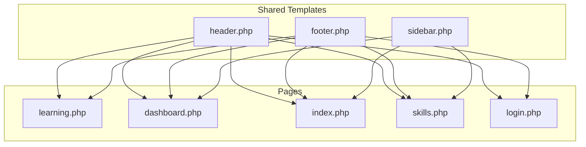
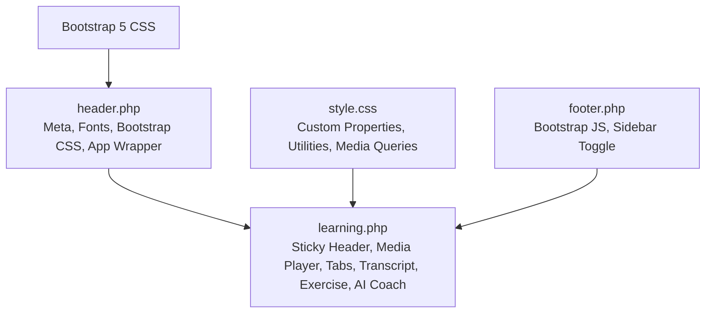
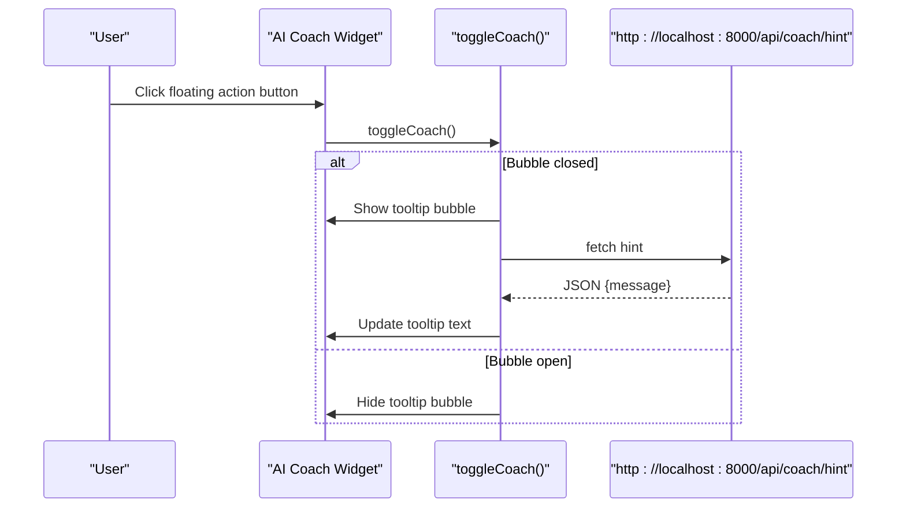
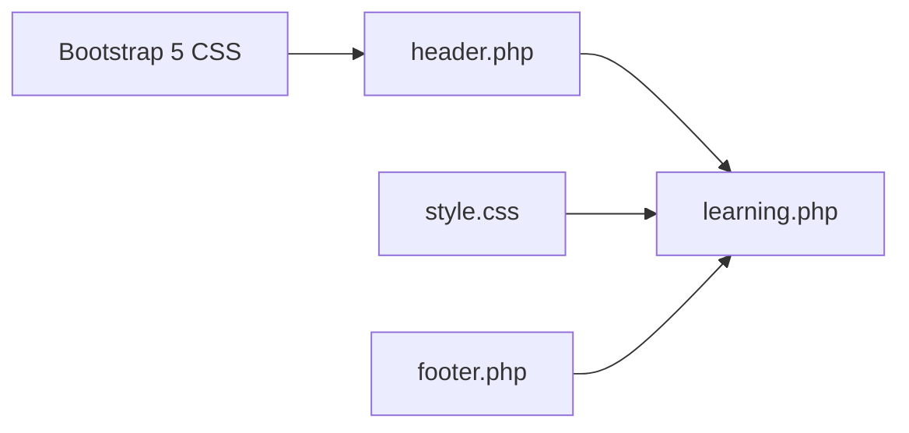

# Responsive Learning Layout

<cite>
**Referenced Files in This Document**
- [learning.php](file://frontend-php/learning.php)
- [style.css](file://frontend-php/css/style.css)
- [header.php](file://frontend-php/includes/header.php)
- [footer.php](file://frontend-php/includes/footer.php)
- [index.php](file://frontend-php/index.php)
- [dashboard.php](file://frontend-php/dashboard.php)
- [sidebar.php](file://frontend-php/includes/sidebar.php)
- [skills.php](file://frontend-php/skills.php)
- [login.php](file://frontend-php/login.php)
</cite>

## Table of Contents
1. [Introduction](#introduction)
2. [Project Structure](#project-structure)
3. [Core Components](#core-components)
4. [Architecture Overview](#architecture-overview)
5. [Detailed Component Analysis](#detailed-component-analysis)
6. [Dependency Analysis](#dependency-analysis)
7. [Performance Considerations](#performance-considerations)
8. [Troubleshooting Guide](#troubleshooting-guide)
9. [Conclusion](#conclusion)

## Introduction
This document describes the responsive learning interface layout, focusing on the sticky header with navigation controls, course title display, schedule integration, flexible grid system, and the fixed-position AI coach widget. It explains Bootstrap-based responsive design, custom CSS custom properties, media queries, and cross-device compatibility patterns used across the learning experience.

## Project Structure
The learning interface is implemented as a PHP-driven single-page experience with shared header and footer templates. The learning page composes:
- Sticky top bar with back navigation, course title, and schedule button
- Media player section with progress controls and overlays
- Tabbed content area for transcript, notes, and resources
- Transcript body with current playback highlighting
- Foundry task header and interactive code editor area
- Fixed-position AI coach widget in the bottom-right corner
- Shared header template for global styles and Bootstrap integration

**Diagram sources**
- [header.php](file://frontend-php/includes/header.php#L1-L71)
- [footer.php](file://frontend-php/includes/footer.php#L1-L31)
- [sidebar.php](file://frontend-php/includes/sidebar.php#L1-L81)
- [learning.php](file://frontend-php/learning.php#L1-L215)
- [dashboard.php](file://frontend-php/dashboard.php#L1-L279)
- [index.php](file://frontend-php/index.php#L1-L174)
- [skills.php](file://frontend-php/skills.php#L1-L189)
- [login.php](file://frontend-php/login.php#L1-L94)

**Section sources**
- [header.php](file://frontend-php/includes/header.php#L1-L71)
- [footer.php](file://frontend-php/includes/footer.php#L1-L31)
- [sidebar.php](file://frontend-php/includes/sidebar.php#L1-L81)

## Core Components
- Sticky header with navigation controls and schedule integration
- Flexible grid system using Bootstrap utilities and responsive breakpoints
- Main content sections: video player, tabs, transcript, and exercise area
- Fixed-position AI coach widget with bottom-right placement and z-index stacking
- CSS custom properties for theme tokens and cross-device compatibility

Key implementation references:
- Sticky header and schedule button: [learning.php](file://frontend-php/learning.php#L4-L17)
- Media player with progress and controls: [learning.php](file://frontend-php/learning.php#L21-L49)
- Tabs and transcript area: [learning.php](file://frontend-php/learning.php#L51-L88)
- Foundry task and code editor: [learning.php](file://frontend-php/learning.php#L90-L149)
- AI coach widget: [learning.php](file://frontend-php/learning.php#L152-L175)
- CSS custom properties and utilities: [style.css](file://frontend-php/css/style.css#L1-L11)
- Bootstrap integration and responsive utilities: [header.php](file://frontend-php/includes/header.php#L14-L18)

**Section sources**
- [learning.php](file://frontend-php/learning.php#L4-L17)
- [learning.php](file://frontend-php/learning.php#L21-L49)
- [learning.php](file://frontend-php/learning.php#L51-L88)
- [learning.php](file://frontend-php/learning.php#L90-L149)
- [learning.php](file://frontend-php/learning.php#L152-L175)
- [style.css](file://frontend-php/css/style.css#L1-L11)
- [header.php](file://frontend-php/includes/header.php#L14-L18)

## Architecture Overview
The learning interface follows a mobile-first, Bootstrap-based responsive architecture:
- Global styles and custom CSS custom properties define theme tokens
- Sticky header ensures consistent navigation across pages
- Grid system uses Bootstrap’s flex utilities and responsive breakpoints
- Fixed-position widgets use z-index stacking for layered UI
- Media queries support sidebar layout and responsive sidebar behavior

**Diagram sources**
- [style.css](file://frontend-php/css/style.css#L1-L289)
- [header.php](file://frontend-php/includes/header.php#L1-L71)
- [learning.php](file://frontend-php/learning.php#L1-L215)
- [footer.php](file://frontend-php/includes/footer.php#L1-L31)

## Detailed Component Analysis

### Sticky Header with Navigation Controls and Schedule Integration
- The sticky header uses Bootstrap utilities for alignment and spacing, with z-index stacking to appear above content.
- Back navigation uses a circular button with Material Symbols iconography.
- Course title and subtitle are centered with uppercase typography and tracking.
- Schedule button is aligned to the right for quick access to calendar integration.

Responsive behavior:
- On smaller screens, the header remains compact with minimal spacing adjustments.
- The header is part of the main content flow and benefits from the app wrapper’s flex layout.

Implementation references:
- Header container and controls: [learning.php](file://frontend-php/learning.php#L4-L17)
- Back button and schedule button: [learning.php](file://frontend-php/learning.php#L5-L16)
- Course title display: [learning.php](file://frontend-php/learning.php#L8-L11)

**Section sources**
- [learning.php](file://frontend-php/learning.php#L4-L17)

### Flexible Grid System and Responsive Breakpoints
- The learning page uses Bootstrap utility classes for spacing, alignment, and responsive behavior.
- Sections use padding and margins that adapt across breakpoints.
- The AI coach widget is positioned absolutely within a fixed container for bottom-right alignment.

Responsive patterns:
- Flex utilities for alignment and wrapping
- Gap utilities for consistent spacing
- Container and padding classes for content gutters

Implementation references:
- Main content container and spacing: [learning.php](file://frontend-php/learning.php#L19-L150)
- AI coach fixed positioning: [learning.php](file://frontend-php/learning.php#L152-L175)
- Utility classes for alignment and spacing: [learning.php](file://frontend-php/learning.php#L21-L49)

**Section sources**
- [learning.php](file://frontend-php/learning.php#L19-L150)
- [learning.php](file://frontend-php/learning.php#L152-L175)

### Media Player Section
- Ratio-based responsive container maintains 16:9 aspect ratio.
- Play button overlay with prominent call-to-action.
- Progress bar with draggable indicator and time display.
- Control icons for captions, settings, and fullscreen.

Accessibility and UX:
- Overlay play button provides clear affordance.
- Progress bar communicates completion and allows seeking.
- Control icons are spaced for touch targets.

Implementation references:
- Player container and overlay: [learning.php](file://frontend-php/learning.php#L21-L49)
- Progress bar and time display: [learning.php](file://frontend-php/learning.php#L30-L46)

**Section sources**
- [learning.php](file://frontend-php/learning.php#L21-L49)

### Tabs and Transcript Areas
- Tab navigation uses link buttons with active state styling.
- Transcript body displays timed segments with current segment highlighted.
- Scrollable transcript area with max height for readability.

Implementation references:
- Tabs container: [learning.php](file://frontend-php/learning.php#L51-L64)
- Transcript content: [learning.php](file://frontend-php/learning.php#L67-L88)

**Section sources**
- [learning.php](file://frontend-php/learning.php#L51-L64)
- [learning.php](file://frontend-php/learning.php#L67-L88)

### Foundry Task and Exercise Area
- Task header with critical badge and descriptive title.
- Code editor area styled with dark theme and monospace typography.
- Editor controls mirror a terminal-like interface.
- Action buttons for submission and help.

Implementation references:
- Task header and description: [learning.php](file://frontend-php/learning.php#L90-L102)
- Code editor panel: [learning.php](file://frontend-php/learning.php#L105-L149)

**Section sources**
- [learning.php](file://frontend-php/learning.php#L90-L102)
- [learning.php](file://frontend-php/learning.php#L105-L149)

### Fixed-Position AI Coach Widget
- Positioned at the bottom-right using fixed positioning and z-index stacking.
- Tooltip bubble appears on toggle with arrow pointing to the widget.
- Uses CSS custom property for primary blue color and Material Symbols.
- JavaScript toggles visibility and fetches dynamic hints from a local API endpoint.

Widget behavior:
- Pointer events disabled on the container to allow clicking through to underlying content.
- Pointer events re-enabled on the tooltip and button for interaction.
- Auto-open on page load for demonstration.

Implementation references:
- Widget container and tooltip: [learning.php](file://frontend-php/learning.php#L152-L175)
- Toggle and fetch logic: [learning.php](file://frontend-php/learning.php#L177-L212)
- Custom property usage: [style.css](file://frontend-php/css/style.css#L1-L11)

**Diagram sources**
- [learning.php](file://frontend-php/learning.php#L177-L212)

**Section sources**
- [learning.php](file://frontend-php/learning.php#L152-L175)
- [learning.php](file://frontend-php/learning.php#L177-L212)
- [style.css](file://frontend-php/css/style.css#L1-L11)

### Navigation Flow Between Learning Interface and Platform Sections
- Learning page links back to portfolio and includes a bottom navigation bar for quick access to learning.
- Portfolio page provides project cards and tabs navigation, linking to the learning interface.
- Dashboard page demonstrates a two-column layout with video player and AI coach widget.
- Skills page includes a bottom navigation bar and radar visualization.

Navigation references:
- Learning back to portfolio: [learning.php](file://frontend-php/learning.php#L5-L7)
- Portfolio tabs and project cards: [index.php](file://frontend-php/index.php#L51-L102)
- Dashboard two-column layout: [dashboard.php](file://frontend-php/dashboard.php#L31-L213)
- Skills bottom navigation: [skills.php](file://frontend-php/skills.php#L169-L186)

**Section sources**
- [learning.php](file://frontend-php/learning.php#L5-L7)
- [index.php](file://frontend-php/index.php#L51-L102)
- [dashboard.php](file://frontend-php/dashboard.php#L31-L213)
- [skills.php](file://frontend-php/skills.php#L169-L186)

### CSS Custom Properties and Cross-Device Compatibility
- Custom properties define theme tokens for primary colors, backgrounds, and typography.
- Utilities leverage Bootstrap classes for responsive behavior and consistent spacing.
- Media queries adjust sidebar layout and responsive behavior for desktop and mobile.

Cross-device patterns:
- Custom properties enable consistent theming across devices.
- Bootstrap’s grid and utility classes ensure predictable layouts.
- Fixed positioning and z-index stacking provide reliable widget placement.

Implementation references:
- Custom properties: [style.css](file://frontend-php/css/style.css#L1-L11)
- Utilities and effects: [style.css](file://frontend-php/css/style.css#L26-L87)
- Sidebar responsive behavior: [style.css](file://frontend-php/css/style.css#L203-L233)

**Section sources**
- [style.css](file://frontend-php/css/style.css#L1-L11)
- [style.css](file://frontend-php/css/style.css#L26-L87)
- [style.css](file://frontend-php/css/style.css#L203-L233)

## Dependency Analysis
The learning interface depends on:
- Bootstrap 5 CSS for responsive utilities and components
- Custom CSS for theme tokens and specialized utilities
- Shared header and footer templates for consistent layout and scripts
- Local API endpoint for AI coach hints

**Diagram sources**
- [header.php](file://frontend-php/includes/header.php#L14-L18)
- [style.css](file://frontend-php/css/style.css#L1-L289)
- [learning.php](file://frontend-php/learning.php#L1-L215)
- [footer.php](file://frontend-php/includes/footer.php#L5-L28)

**Section sources**
- [header.php](file://frontend-php/includes/header.php#L14-L18)
- [style.css](file://frontend-php/css/style.css#L1-L289)
- [learning.php](file://frontend-php/learning.php#L1-L215)
- [footer.php](file://frontend-php/includes/footer.php#L5-L28)

## Performance Considerations
- Use of ratio-based containers ensures efficient rendering of media elements.
- Fixed-position widgets minimize layout shifts when toggled.
- CSS custom properties reduce repeated color definitions and improve maintainability.
- Bootstrap utilities promote efficient layout composition without heavy JavaScript.

## Troubleshooting Guide
Common issues and resolutions:
- AI coach not responding: Verify the local API endpoint is reachable and CORS settings permit requests from the client origin.
- Transcripts not scrolling: Ensure the transcript container has a max-height and overflow-auto utility applied.
- Sidebar not toggling: Confirm the sidebar toggle script runs after DOMContentLoaded and that overlay and sidebar elements exist.
- Progress bar not updating: Check that the progress bar width is dynamically set and that the tooltip indicator updates on user interaction.

References:
- AI coach toggle and fetch: [learning.php](file://frontend-php/learning.php#L177-L212)
- Transcript scroll area: [learning.php](file://frontend-php/learning.php#L67-L88)
- Sidebar toggle script: [footer.php](file://frontend-php/includes/footer.php#L8-L28)

**Section sources**
- [learning.php](file://frontend-php/learning.php#L177-L212)
- [learning.php](file://frontend-php/learning.php#L67-L88)
- [footer.php](file://frontend-php/includes/footer.php#L8-L28)

## Conclusion
The responsive learning layout integrates a sticky header, flexible grid system, media player, tabbed transcript, and a fixed-position AI coach widget. It leverages Bootstrap utilities, CSS custom properties, and media queries to deliver a cohesive experience across devices. The modular structure using shared templates ensures consistency and maintainability while enabling targeted enhancements for the learning interface.