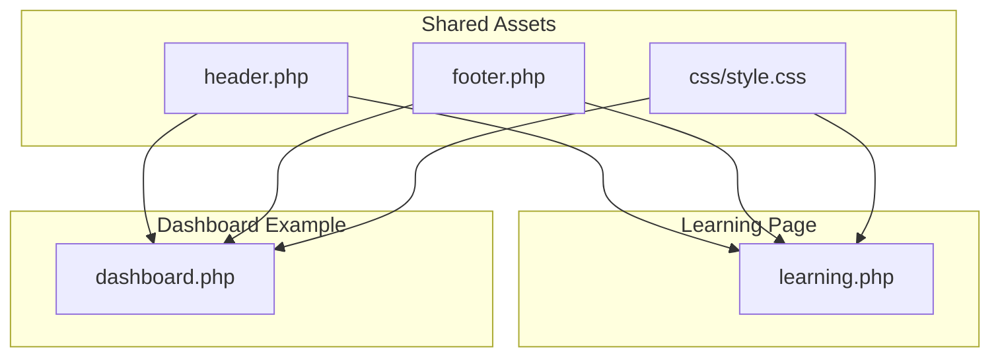
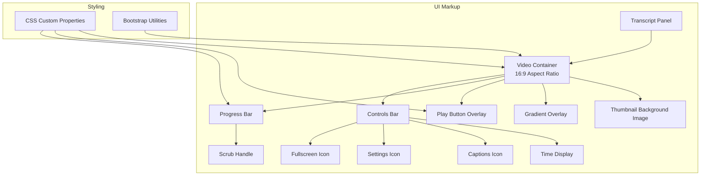
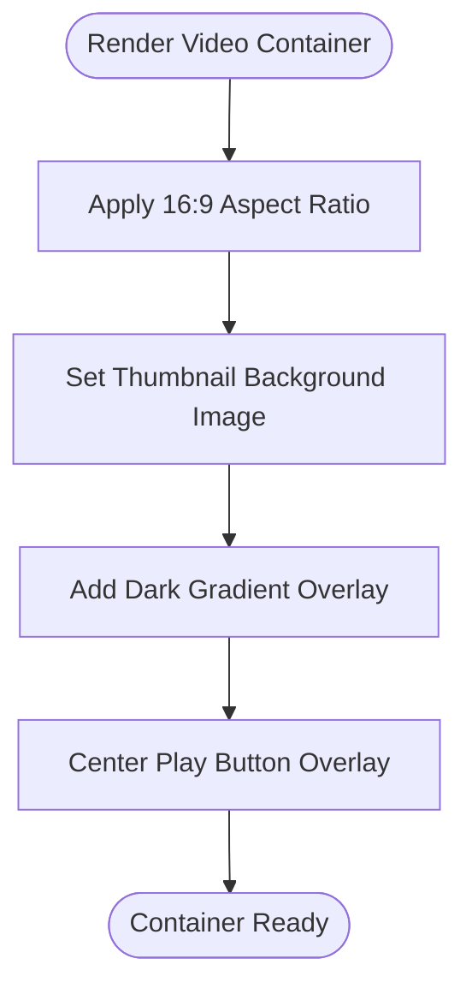
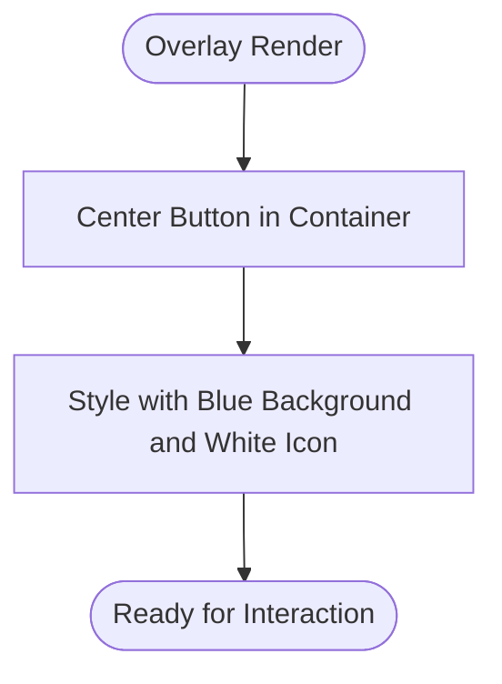
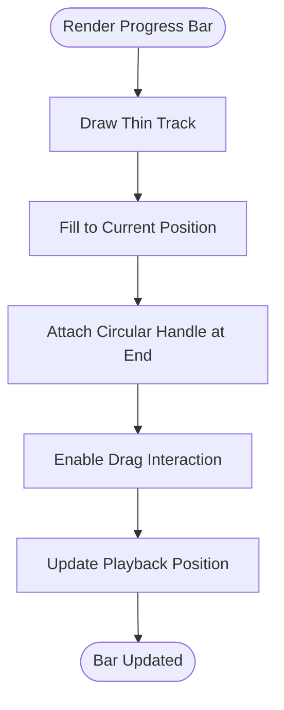
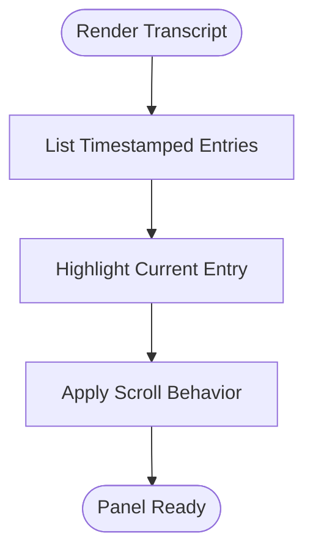
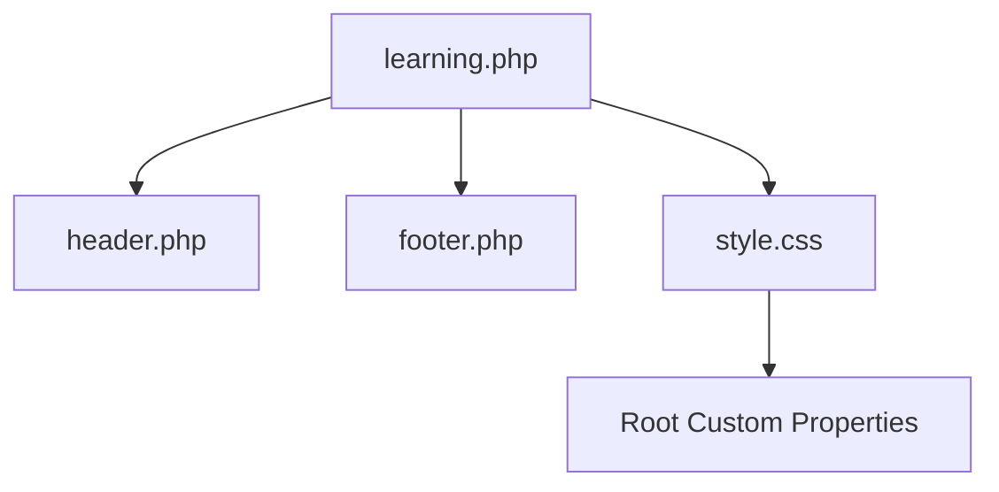

# Video Player System

<cite>
**Referenced Files in This Document**
- [learning.php](file://frontend-php/learning.php)
- [style.css](file://frontend-php/css/style.css)
- [header.php](file://frontend-php/includes/header.php)
- [footer.php](file://frontend-php/includes/footer.php)
- [dashboard.php](file://frontend-php/dashboard.php)
</cite>

## Table of Contents
1. [Introduction](#introduction)
2. [Project Structure](#project-structure)
3. [Core Components](#core-components)
4. [Architecture Overview](#architecture-overview)
5. [Detailed Component Analysis](#detailed-component-analysis)
6. [Dependency Analysis](#dependency-analysis)
7. [Performance Considerations](#performance-considerations)
8. [Troubleshooting Guide](#troubleshooting-guide)
9. [Conclusion](#conclusion)

## Introduction
This document describes the video lesson player system in the Octal Foundry learning interface. It focuses on the responsive 16:9 video container, play button overlay, progress bar with timeline scrubbing affordance, subtitle/caption controls, video thumbnail background system, gradient overlays, fullscreen mode integration, and the transcript display with synchronized timestamps and highlighted current playback position. It also documents the DOM structure, CSS styling using CSS custom properties, responsive design patterns, and user interaction behaviors. Where applicable, it clarifies whether the implementation relies on native HTML media elements or external libraries such as video.js.

## Project Structure
The learning interface is implemented with PHP-driven templates and Bootstrap 5 for layout and components. The video player is primarily built with:
- A responsive 16:9 container using Bootstrap’s aspect-ratio utilities
- Inline styles for background thumbnails and gradient overlays
- A play button overlay positioned absolutely over the container
- A progress bar with a draggable handle indicator
- Control icons for captions, settings, and fullscreen
- A transcript panel with timestamped entries and a highlighted “CURRENT” item

**Diagram sources**
- [learning.php](file://frontend-php/learning.php#L1-L215)
- [header.php](file://frontend-php/includes/header.php#L1-L71)
- [footer.php](file://frontend-php/includes/footer.php#L1-L31)
- [style.css](file://frontend-php/css/style.css#L1-L289)
- [dashboard.php](file://frontend-php/dashboard.php#L1-L279)

**Section sources**
- [learning.php](file://frontend-php/learning.php#L1-L215)
- [header.php](file://frontend-php/includes/header.php#L1-L71)
- [footer.php](file://frontend-php/includes/footer.php#L1-L31)
- [style.css](file://frontend-php/css/style.css#L1-L289)
- [dashboard.php](file://frontend-php/dashboard.php#L1-L279)

## Core Components
- Responsive 16:9 video container: Implemented via a wrapper with a 16:9 aspect ratio and a background image serving as the video thumbnail. The container holds overlays for the play button and progress bar.
- Play button overlay: A large circular button centered over the video area, styled with a semi-opaque blue background and white icon.
- Progress bar and scrubbing: A horizontal progress bar with a draggable handle indicator. The handle is a circle positioned absolutely at the end of the progress fill.
- Controls bar: Positioned at the bottom with a thin progress track and time display, plus control icons for captions, settings, and fullscreen.
- Gradient overlay: A top-to-bottom linear gradient applied to the video container to improve text legibility for control labels.
- Transcript panel: A scrollable panel below the video with timestamped entries; one entry is highlighted to indicate the current playback position.
- Fullscreen integration: The video container uses a responsive container pattern suitable for expanding to fullscreen via browser APIs or CSS.

Key implementation references:
- Container and overlays: [learning.php](file://frontend-php/learning.php#L22-L48)
- Play button overlay: [learning.php](file://frontend-php/learning.php#L24-L28)
- Progress bar and scrub handle: [learning.php](file://frontend-php/learning.php#L32-L36)
- Time display and control icons: [learning.php](file://frontend-php/learning.php#L38-L46)
- Gradient overlay: [learning.php](file://frontend-php/learning.php#L30)
- Transcript panel: [learning.php](file://frontend-php/learning.php#L67-L88)
- CSS custom properties and utilities: [style.css](file://frontend-php/css/style.css#L1-L11), [style.css](file://frontend-php/css/style.css#L281-L288)

**Section sources**
- [learning.php](file://frontend-php/learning.php#L22-L48)
- [style.css](file://frontend-php/css/style.css#L1-L11)
- [style.css](file://frontend-php/css/style.css#L281-L288)

## Architecture Overview
The video player is composed of static HTML markup templated in PHP and styled with CSS custom properties. There is no explicit JavaScript library integration for the player in the learning page. Instead, the UI leverages:
- Bootstrap 5 for responsive layout and utilities (e.g., aspect ratio)
- CSS custom properties for theming
- Pure CSS for overlays and gradients
- Semantic HTML and inline styles for background images and positioning

**Diagram sources**
- [learning.php](file://frontend-php/learning.php#L22-L48)
- [style.css](file://frontend-php/css/style.css#L1-L11)

**Section sources**
- [learning.php](file://frontend-php/learning.php#L22-L48)
- [style.css](file://frontend-php/css/style.css#L1-L11)

## Detailed Component Analysis

### Responsive 16:9 Video Container
- The container uses a responsive aspect-ratio class to maintain a 16:9 shape.
- A background image serves as the video thumbnail.
- A semi-transparent black overlay enhances contrast for control labels.
- A large play button overlay is centered within the container.

Implementation references:
- Container and background: [learning.php](file://frontend-php/learning.php#L22-L28)
- Gradient overlay: [learning.php](file://frontend-php/learning.php#L30)

**Diagram sources**
- [learning.php](file://frontend-php/learning.php#L22-L30)

**Section sources**
- [learning.php](file://frontend-php/learning.php#L22-L30)

### Play Button Overlay
- The play button is a large circular button centered over the video container.
- It uses a semi-opaque blue background and a white play icon.
- Interaction: Clicking the button triggers playback (in a real implementation, this would be bound to a click handler).

Implementation references:
- Play button markup: [learning.php](file://frontend-php/learning.php#L24-L28)

**Diagram sources**
- [learning.php](file://frontend-php/learning.php#L24-L28)

**Section sources**
- [learning.php](file://frontend-php/learning.php#L24-L28)

### Progress Bar and Timeline Scrubbing
- The progress bar is a thin horizontal bar at the bottom of the container.
- The progress fill represents watched time; a circular handle indicates the current position.
- The handle is absolutely positioned at the end of the progress fill and is visually interactive.

Implementation references:
- Progress bar and handle: [learning.php](file://frontend-php/learning.php#L32-L36)
- Time label: [learning.php](file://frontend-php/learning.php#L38-L40)

**Diagram sources**
- [learning.php](file://frontend-php/learning.php#L32-L36)

**Section sources**
- [learning.php](file://frontend-php/learning.php#L32-L36)

### Subtitles/Captions Controls
- Captions control is represented by a closed caption icon in the controls bar.
- The icon is styled consistently with other control icons.

Implementation references:
- Captions icon: [learning.php](file://frontend-php/learning.php#L41)

**Section sources**
- [learning.php](file://frontend-php/learning.php#L41)

### Transcript Display with Timestamps
- The transcript panel displays timestamped entries in monospace text.
- One entry is highlighted to indicate the current playback position.
- The panel is scrollable and sized to a fixed height.

Implementation references:
- Transcript container: [learning.php](file://frontend-php/learning.php#L67-L88)
- Timestamped entry: [learning.php](file://frontend-php/learning.php#L70)
- Highlighted current entry: [learning.php](file://frontend-php/learning.php#L75-L80)

**Diagram sources**
- [learning.php](file://frontend-php/learning.php#L67-L88)

**Section sources**
- [learning.php](file://frontend-php/learning.php#L67-L88)

### Fullscreen Mode Integration
- The container uses a responsive pattern suitable for expanding to fullscreen.
- Fullscreen behavior is typically handled by the browser’s fullscreen API or CSS, triggered by the fullscreen icon.

Implementation references:
- Fullscreen icon: [learning.php](file://frontend-php/learning.php#L44)

**Section sources**
- [learning.php](file://frontend-php/learning.php#L44)

### CSS Styling and Custom Properties
- CSS custom properties define primary colors, backgrounds, and text colors.
- Utility classes support progress bars and rounded corners.
- The theme is applied globally via the root element and propagated through custom properties.

Implementation references:
- Custom properties: [style.css](file://frontend-php/css/style.css#L1-L11)
- Progress bar utilities: [style.css](file://frontend-php/css/style.css#L281-L288)

**Section sources**
- [style.css](file://frontend-php/css/style.css#L1-L11)
- [style.css](file://frontend-php/css/style.css#L281-L288)

### Library Integration Notes
- The learning page does not include video.js or other media libraries. The player is implemented with native HTML and CSS.
- The dashboard page demonstrates a YouTube embed player using an iframe, which is a separate implementation relying on external media.

Implementation references:
- Learning page native player: [learning.php](file://frontend-php/learning.php#L22-L48)
- Dashboard YouTube embed: [dashboard.php](file://frontend-php/dashboard.php#L56-L65)

**Section sources**
- [learning.php](file://frontend-php/learning.php#L22-L48)
- [dashboard.php](file://frontend-php/dashboard.php#L56-L65)

## Dependency Analysis
- The learning page depends on shared assets for theming and layout:
  - Global CSS custom properties for consistent theming
  - Shared header and footer for navigation and scripts
- The transcript panel is independent of the video player but shares the same dark theme.

**Diagram sources**
- [learning.php](file://frontend-php/learning.php#L1-L215)
- [header.php](file://frontend-php/includes/header.php#L1-L71)
- [footer.php](file://frontend-php/includes/footer.php#L1-L31)
- [style.css](file://frontend-php/css/style.css#L1-L11)

**Section sources**
- [learning.php](file://frontend-php/learning.php#L1-L215)
- [header.php](file://frontend-php/includes/header.php#L1-L71)
- [footer.php](file://frontend-php/includes/footer.php#L1-L31)
- [style.css](file://frontend-php/css/style.css#L1-L11)

## Performance Considerations
- Background images for thumbnails are set via inline styles; ensure appropriate image sizes and compression to minimize bandwidth.
- CSS custom properties reduce duplication and enable efficient theme updates.
- The transcript panel is scrollable and capped at a fixed height to avoid layout thrashing during long transcripts.
- Avoid heavy animations on the progress bar handle to maintain smooth scrubbing.

## Troubleshooting Guide
- Play button not visible:
  - Verify the overlay and gradient styles are applied correctly.
  - Confirm the button is centered within the container.
  - References: [learning.php](file://frontend-php/learning.php#L24-L28), [learning.php](file://frontend-php/learning.php#L30)
- Progress bar not filling:
  - Ensure the progress fill percentage is applied to the inner progress bar element.
  - Confirm the handle is positioned absolutely at the end of the fill.
  - References: [learning.php](file://frontend-php/learning.php#L32-L36)
- Transcript highlighting incorrect:
  - Check the highlighted entry class and ensure it matches the current playback position.
  - References: [learning.php](file://frontend-php/learning.php#L75-L80)
- Fullscreen icon inactive:
  - Implement a click handler to toggle fullscreen using the browser API.
  - References: [learning.php](file://frontend-php/learning.php#L44)

**Section sources**
- [learning.php](file://frontend-php/learning.php#L24-L28)
- [learning.php](file://frontend-php/learning.php#L32-L36)
- [learning.php](file://frontend-php/learning.php#L75-L80)
- [learning.php](file://frontend-php/learning.php#L44)

## Conclusion
The Octal Foundry learning interface implements a clean, responsive video player using native HTML and CSS with a strong theming foundation via CSS custom properties. The 16:9 container, play button overlay, progress bar with scrub handle, gradient overlays, and transcript panel provide a cohesive learning experience. While the learning page does not integrate video.js, the dashboard demonstrates an alternative YouTube-based player. The design emphasizes accessibility through overlays and clear typography, and the modular structure supports easy extension for interactive features such as fullscreen toggles and caption controls.