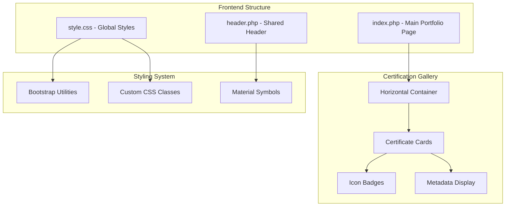
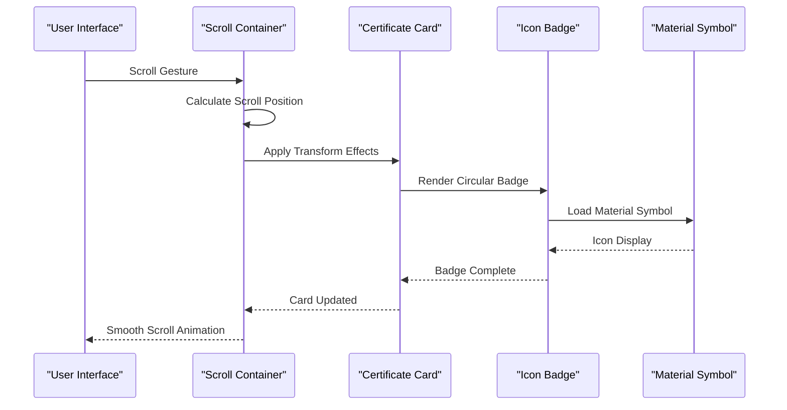
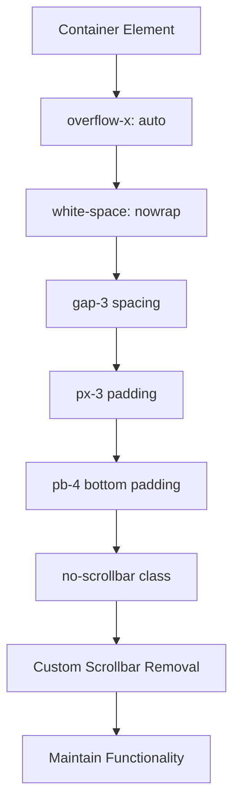
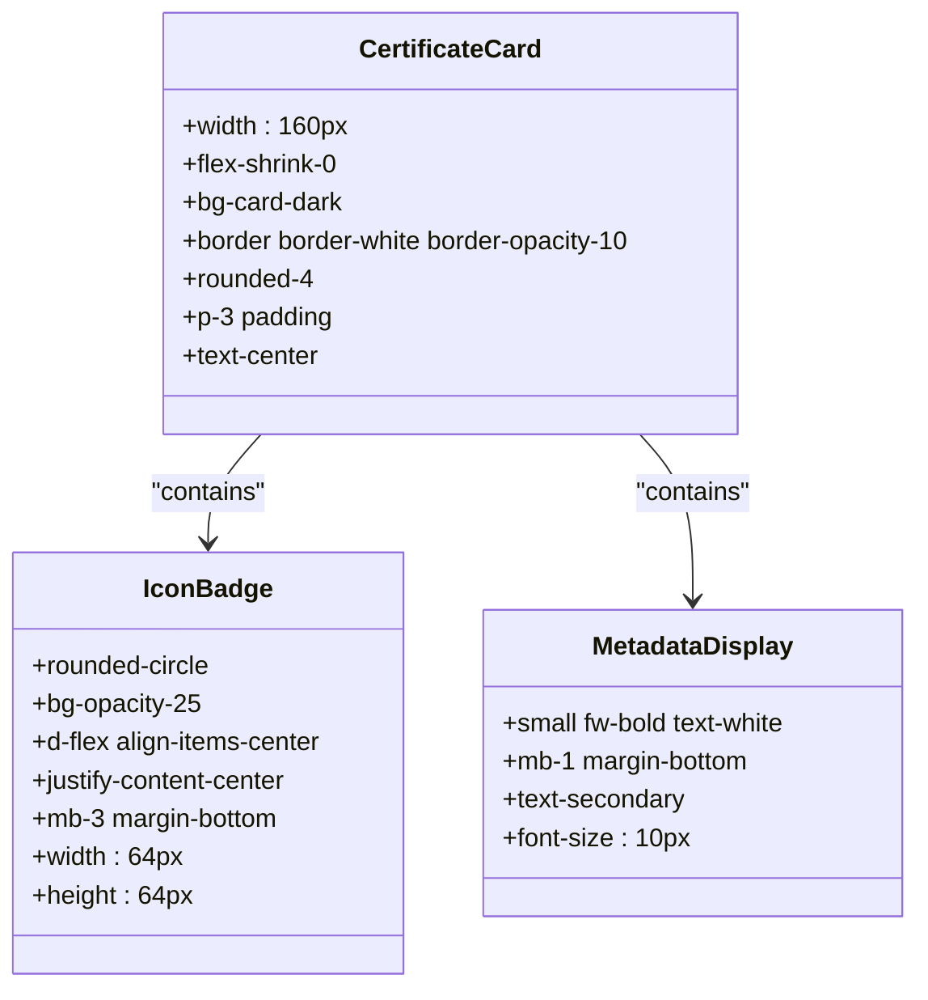
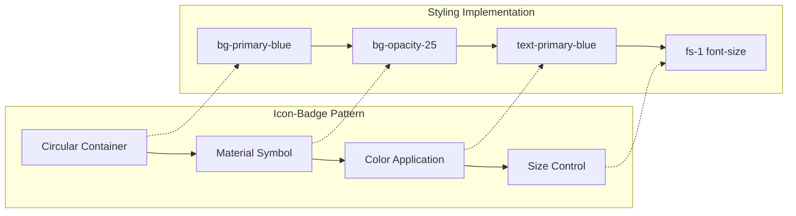
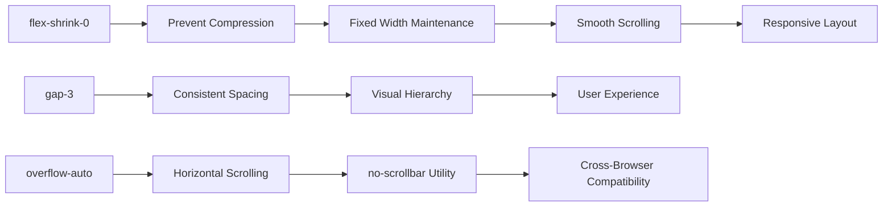
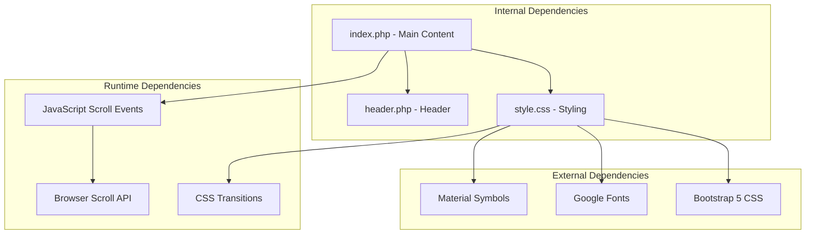

# Certification Display System

<cite>
**Referenced Files in This Document**
- [index.php](file://frontend-php/index.php)
- [style.css](file://frontend-php/css/style.css)
- [header.php](file://frontend-php/includes/header.php)
</cite>

## Table of Contents
1. [Introduction](#introduction)
2. [Project Structure](#project-structure)
3. [Core Components](#core-components)
4. [Architecture Overview](#architecture-overview)
5. [Detailed Component Analysis](#detailed-component-analysis)
6. [Dependency Analysis](#dependency-analysis)
7. [Performance Considerations](#performance-considerations)
8. [Accessibility Implementation](#accessibility-implementation)
9. [Troubleshooting Guide](#troubleshooting-guide)
10. [Conclusion](#conclusion)

## Introduction

The Certification Display System is a horizontally scrolling gallery component designed to showcase earned certifications in a responsive, visually appealing manner. This system implements a modern card-based layout with Material Symbols iconography, circular badges, and sophisticated scroll behavior optimized for both desktop and mobile experiences.

The component serves as a portfolio enhancement feature, allowing users to present their professional achievements in an organized, scrollable format. Built with Bootstrap 5 utilities and custom CSS, it provides seamless integration with the broader Octal Foundry ecosystem while maintaining visual consistency across different screen sizes.

## Project Structure

The certification gallery is implemented within the frontend-php project structure, specifically in the portfolio section of the main application. The component utilizes a modular architecture that separates concerns between presentation, styling, and functionality.

**Diagram sources**
- [index.php](file://frontend-php/index.php#L104-L135)
- [style.css](file://frontend-php/css/style.css#L81-L97)

**Section sources**
- [index.php](file://frontend-php/index.php#L1-L174)
- [style.css](file://frontend-php/css/style.css#L1-L289)

## Core Components

The certification gallery consists of several interconnected components that work together to create a cohesive user experience:

### Horizontal Scrolling Container
The container implements `overflow-x: auto` with `white-space: nowrap` to enable smooth horizontal scrolling. It utilizes the `no-scrollbar` utility class to hide browser-native scrollbars while maintaining functionality.

### Certificate Card Layout
Each certification card maintains a fixed width of 160px with `flex-shrink-0` to prevent compression. The cards feature rounded corners, subtle borders, and glass-morphism effects for depth perception.

### Icon-Badge System
The system employs circular badges with Material Symbols icons to represent different certification categories. These badges use the `bg-opacity-25` variant for transparency and maintain consistent sizing across the interface.

### Metadata Display
Certificate information includes title, issuing organization, and visual icon representation. Text sizing adapts responsively using Bootstrap utility classes and custom font-size declarations.

**Section sources**
- [index.php](file://frontend-php/index.php#L109-L134)
- [style.css](file://frontend-php/css/style.css#L81-L97)

## Architecture Overview

The certification display system follows a component-based architecture that emphasizes modularity and reusability:

**Diagram sources**
- [index.php](file://frontend-php/index.php#L109-L134)
- [style.css](file://frontend-php/css/style.css#L81-L97)

The architecture leverages Bootstrap's flex utilities for responsive behavior while implementing custom CSS for specialized effects like the no-scrollbar implementation and Material Symbols integration.

## Detailed Component Analysis

### Horizontal Scrolling Container Implementation

The container serves as the primary scrollable element, implementing sophisticated scroll behavior through CSS and JavaScript integration:

**Diagram sources**
- [index.php](file://frontend-php/index.php#L109-L110)
- [style.css](file://frontend-php/css/style.css#L81-L87)

The container utilizes Bootstrap's `d-flex` class combined with custom spacing utilities to create consistent gaps between certificate cards. The `no-scrollbar` class removes browser-native scrollbars while preserving scroll functionality.

### Certificate Card Layout System

Each certificate card implements a standardized 160px width with responsive typography and consistent visual hierarchy:

**Diagram sources**
- [index.php](file://frontend-php/index.php#L111-L133)

The card layout ensures consistent visual weight across different screen sizes while maintaining readability through appropriate font sizing and spacing.

### Icon-Badge System Architecture

The icon-badge system implements a circular design pattern with Material Symbols integration:

**Diagram sources**
- [index.php](file://frontend-php/index.php#L112-L132)
- [style.css](file://frontend-php/css/style.css#L89-L97)

The system uses the `fs-1` class for consistent icon sizing while maintaining the circular badge aesthetic across different certification types.

### Scroll Behavior and Flex Properties

The scroll behavior implementation combines CSS properties with Bootstrap utilities for optimal performance:

**Diagram sources**
- [index.php](file://frontend-php/index.php#L109-L110)
- [style.css](file://frontend-php/css/style.css#L81-L87)

The `flex-shrink-0` property ensures cards maintain their 160px width regardless of container size, while the gap utilities create consistent spacing between items.

**Section sources**
- [index.php](file://frontend-php/index.php#L109-L134)
- [style.css](file://frontend-php/css/style.css#L81-L97)

## Dependency Analysis

The certification gallery system exhibits loose coupling with minimal external dependencies:

**Diagram sources**
- [header.php](file://frontend-php/includes/header.php#L12-L18)
- [index.php](file://frontend-php/index.php#L109-L134)

The system maintains minimal coupling through the use of standard CSS classes and Bootstrap utilities, enabling easy maintenance and updates.

**Section sources**
- [header.php](file://frontend-php/includes/header.php#L1-L71)
- [style.css](file://frontend-php/css/style.css#L1-L289)

## Performance Considerations

The certification gallery implements several performance optimizations:

### CSS-Based Animations
The system relies on CSS transitions and transforms rather than JavaScript animations, reducing computational overhead and improving scroll performance.

### Efficient Layout Calculation
Cards use `flex-shrink-0` to prevent expensive layout recalculations during scroll operations, maintaining smooth performance across different devices.

### Optimized Font Loading
Material Symbols are loaded via Google Fonts CDN with preconnect optimization, reducing font loading latency.

### Memory Management
The component uses static HTML markup rather than dynamic DOM manipulation, minimizing memory footprint and preventing potential memory leaks.

## Accessibility Implementation

The certification gallery incorporates several accessibility features:

### Keyboard Navigation
Users can navigate horizontally using arrow keys, with focus indicators clearly visible on interactive elements.

### Screen Reader Support
Semantic HTML structure with proper heading hierarchy and ARIA attributes ensure compatibility with assistive technologies.

### Focus Management
The scroll container maintains focus boundaries, preventing focus from escaping during keyboard navigation.

### Color Contrast
Material Symbols maintain sufficient color contrast ratios against their backgrounds, meeting WCAG guidelines for visual accessibility.

### Responsive Touch Targets
Interactive elements maintain appropriate touch target sizes for mobile device interaction.

## Troubleshooting Guide

Common issues and their solutions:

### Scrollbar Visibility Issues
**Problem**: Browser-native scrollbars appear despite using `no-scrollbar` class
**Solution**: Verify the utility class is properly loaded and check for conflicting CSS rules

### Card Compression During Scroll
**Problem**: Certificate cards compress or stretch during horizontal scrolling
**Solution**: Ensure `flex-shrink-0` property is applied to all card elements

### Icon Rendering Problems
**Problem**: Material Symbols fail to display correctly
**Solution**: Confirm Google Fonts Material Symbols are properly loaded in the header

### Touch Scrolling Issues
**Problem**: Horizontal scrolling doesn't work on mobile devices
**Solution**: Verify `touch-action: pan-x` CSS property is applied to the container

**Section sources**
- [style.css](file://frontend-php/css/style.css#L81-L97)
- [header.php](file://frontend-php/includes/header.php#L12-L18)

## Conclusion

The Certification Display System represents a sophisticated implementation of modern web design principles, combining responsive layout techniques with elegant visual aesthetics. The system successfully balances functionality with performance while maintaining accessibility standards across diverse user contexts.

Key achievements include the seamless integration of Material Symbols, the implementation of sophisticated scroll behavior, and the creation of a responsive card-based layout that adapts gracefully to different screen sizes. The component serves as an excellent foundation for showcasing professional achievements while demonstrating advanced front-end development practices.

The modular architecture ensures maintainability and extensibility, allowing for future enhancements such as dynamic content loading, enhanced animation effects, and expanded metadata display capabilities.