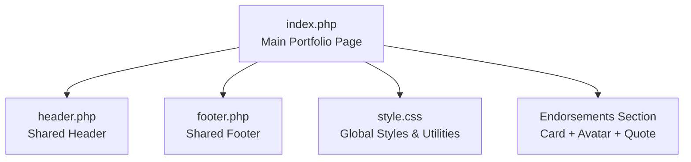
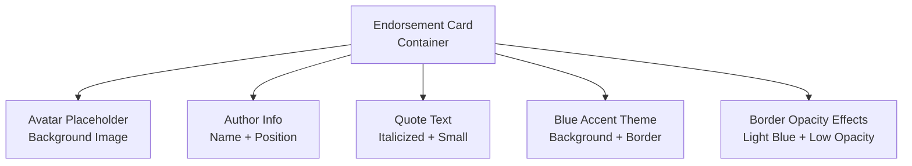
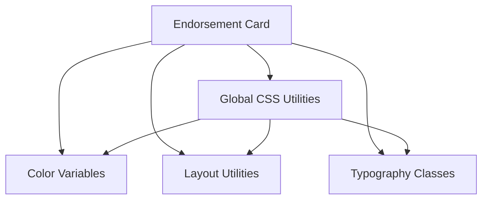

# Industry Endorsement Section

<cite>
**Referenced Files in This Document**
- [index.php](file://frontend-php/index.php)
- [style.css](file://frontend-php/css/style.css)
- [header.php](file://frontend-php/includes/header.php)
- [footer.php](file://frontend-php/includes/footer.php)
</cite>

## Table of Contents
1. [Introduction](#introduction)
2. [Project Structure](#project-structure)
3. [Core Components](#core-components)
4. [Architecture Overview](#architecture-overview)
5. [Detailed Component Analysis](#detailed-component-analysis)
6. [Dependency Analysis](#dependency-analysis)
7. [Performance Considerations](#performance-considerations)
8. [Troubleshooting Guide](#troubleshooting-guide)
9. [Conclusion](#conclusion)

## Introduction
This document describes the Industry Endorsement display component featured in the portfolio interface. It focuses on the card-based layout, avatar handling, author information presentation, and quote formatting. The component showcases professional testimonials with a blue accent theme, subtle border opacity effects, and italicized quote text. The documentation covers the HTML structure, styling approach, responsive typography, and integration with the overall portfolio aesthetic.

## Project Structure
The endorsement component resides within the main portfolio page and is styled using shared CSS utilities. The page includes a navigation bar, profile header, project showcase, certifications carousel, and the endorsements section.

**Diagram sources**
- [index.php](file://frontend-php/index.php#L1-L174)
- [header.php](file://frontend-php/includes/header.php#L1-L71)
- [footer.php](file://frontend-php/includes/footer.php#L1-L31)
- [style.css](file://frontend-php/css/style.css#L1-L289)

**Section sources**
- [index.php](file://frontend-php/index.php#L1-L174)
- [header.php](file://frontend-php/includes/header.php#L1-L71)
- [footer.php](file://frontend-php/includes/footer.php#L1-L31)
- [style.css](file://frontend-php/css/style.css#L1-L289)

## Core Components
The Industry Endorsements section is implemented as a single card containing:
- Avatar placeholder with background image handling
- Author information (name and position)
- Recommendation text in italicized format

Key characteristics:
- Blue accent styling with light blue background and border
- Subtle border opacity for depth and cohesion
- Responsive text sizing using small font classes and inline styles
- Integration with the dark theme and glass effect navigation

**Section sources**
- [index.php](file://frontend-php/index.php#L137-L150)
- [style.css](file://frontend-php/css/style.css#L1-L11)

## Architecture Overview
The endorsement card is embedded within the main portfolio page and styled using global CSS utilities. The card uses:
- A container with blue background and border
- Flex layout for avatar and author information
- Small-sized text classes for readability
- Inline styles for precise avatar sizing and font scaling

**Diagram sources**
- [index.php](file://frontend-php/index.php#L137-L150)
- [style.css](file://frontend-php/css/style.css#L1-L11)

**Section sources**
- [index.php](file://frontend-php/index.php#L137-L150)
- [style.css](file://frontend-php/css/style.css#L1-L11)

## Detailed Component Analysis

### Endorsement Card Structure
The endorsement card follows a clean, minimal layout:
- Container: Card with blue background, low-opacity blue border, rounded corners, and padding
- Avatar: Circular placeholder with background image and cover/center positioning
- Author: Name and position displayed in small text
- Quote: Italicized recommendation text in small size

Markup highlights:
- Container uses blue background and border classes
- Avatar uses rounded-circle with background-image and cover/center positioning
- Author info uses small font classes and reduced font size via inline style
- Quote uses small class and italic formatting

**Section sources**
- [index.php](file://frontend-php/index.php#L137-L150)

### Styling and Theming
The component leverages the global color palette and utilities:
- Primary blue color variable defines the accent color
- Blue background and border utilities create cohesive styling
- Border-opacity utilities provide subtle depth
- Small text classes ensure readable, compact presentation
- Inline styles fine-tune avatar size and font scaling

Color and utility references:
- Primary blue variable and utilities
- Background and border utilities
- Text color utilities
- Rounded and opacity utilities

**Section sources**
- [style.css](file://frontend-php/css/style.css#L1-L11)
- [style.css](file://frontend-php/css/style.css#L52-L75)

### Responsive Typography
Typography is handled through a combination of utility classes and inline styles:
- Small text classes for consistent sizing
- Inline font-size adjustments for specific elements
- Flexible container sizing for various viewport widths
- Consistent spacing using padding and gap utilities

Responsive considerations:
- Small classes adapt to mobile and desktop contexts
- Inline styles accommodate specific component needs
- Flex layout maintains alignment across sizes

**Section sources**
- [index.php](file://frontend-php/index.php#L137-L150)

### Integration with Portfolio Aesthetic
The endorsement card integrates seamlessly with the portfolio design:
- Dark theme background and card utilities
- Glass effect navigation and dark backgrounds
- Consistent spacing and typography
- Blue accent color aligns with brand identity
- Rounded corners and shadows maintain visual coherence

Integration points:
- Shared header and footer layouts
- Global CSS utilities and variables
- Consistent spacing and typography scales
- Brand color usage throughout

**Section sources**
- [header.php](file://frontend-php/includes/header.php#L1-L71)
- [footer.php](file://frontend-php/includes/footer.php#L1-L31)
- [style.css](file://frontend-php/css/style.css#L1-L289)

## Dependency Analysis
The endorsement component depends on shared resources and follows established patterns:

**Diagram sources**
- [index.php](file://frontend-php/index.php#L137-L150)
- [style.css](file://frontend-php/css/style.css#L1-L289)

**Section sources**
- [index.php](file://frontend-php/index.php#L137-L150)
- [style.css](file://frontend-php/css/style.css#L1-L289)

## Performance Considerations
- Avatar images are loaded via background-image URLs; ensure appropriate image sizes for performance
- Inline styles are minimal and focused; consider consolidating repeated styles if scaling
- CSS utilities promote efficient rendering; avoid excessive custom styles
- The component uses lightweight HTML and minimal JavaScript dependencies

## Troubleshooting Guide
Common issues and resolutions:
- Avatar not displaying: Verify background-image URL is accessible and image loads correctly
- Text overflow: Adjust small font classes or consider responsive breakpoints
- Color inconsistencies: Ensure primary blue variable is defined and utilities are applied
- Spacing issues: Check padding and gap utilities; adjust container padding as needed
- Border opacity: Confirm border-opacity utilities are applied consistently

**Section sources**
- [index.php](file://frontend-php/index.php#L137-L150)
- [style.css](file://frontend-php/css/style.css#L1-L11)

## Conclusion
The Industry Endorsement component demonstrates a clean, accessible implementation of professional testimonials. Its card-based design, blue accent styling, and responsive typography integrate smoothly with the portfolio's dark theme and glass effect navigation. The component leverages shared CSS utilities and color variables, ensuring consistency and maintainability while providing a visually appealing showcase of industry recognition.