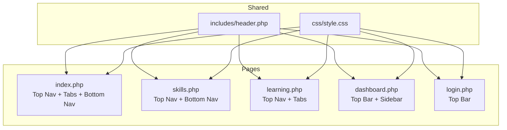
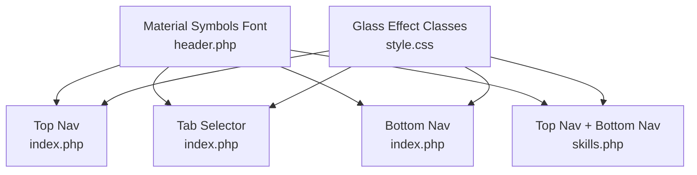
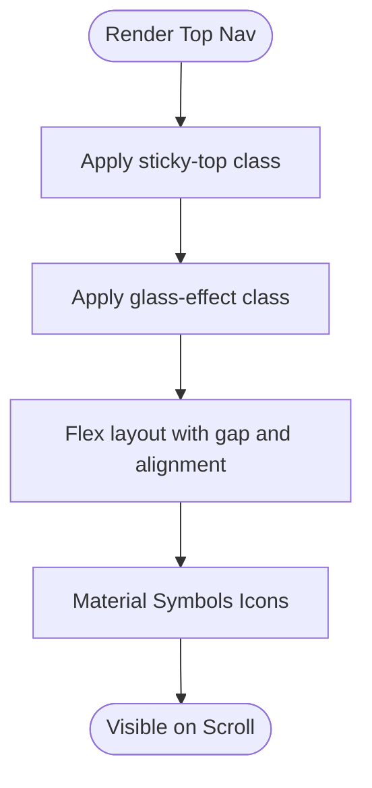
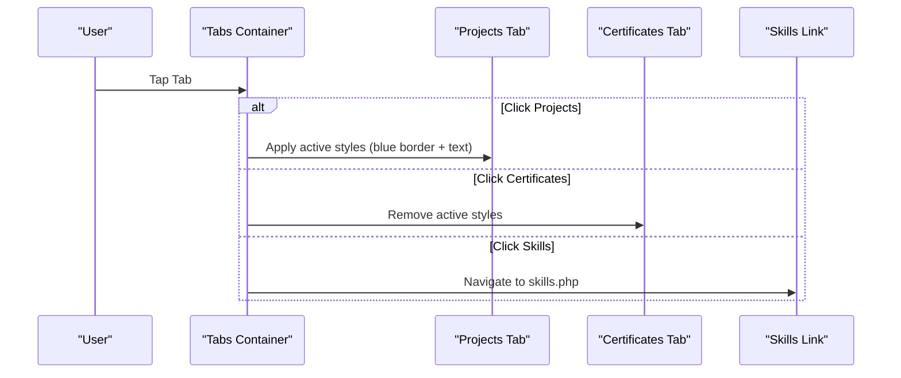
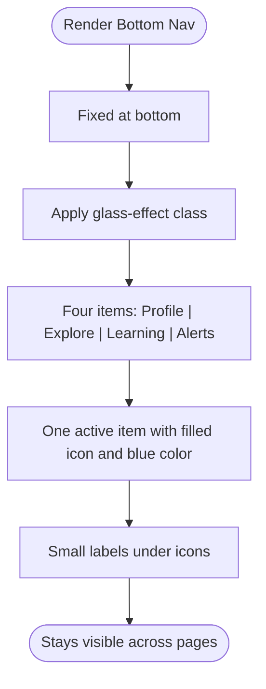
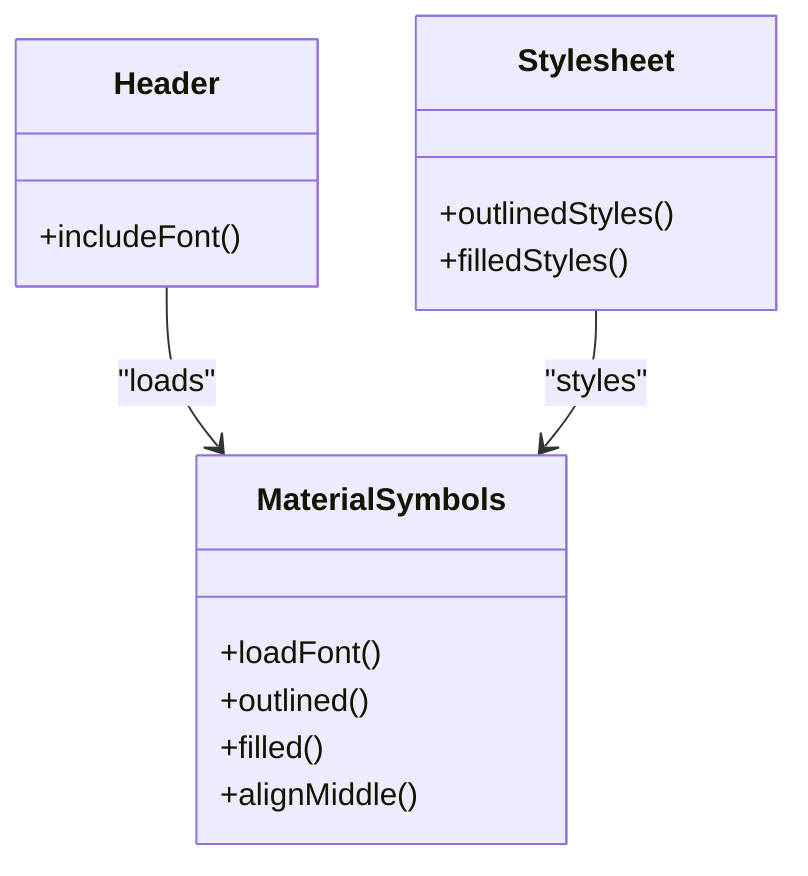
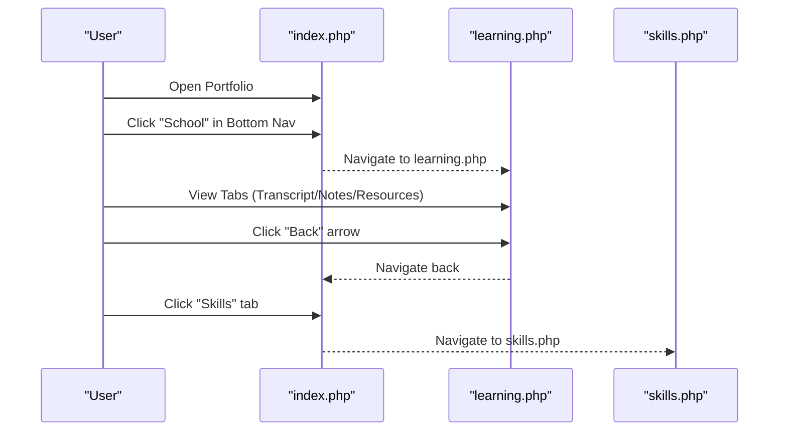
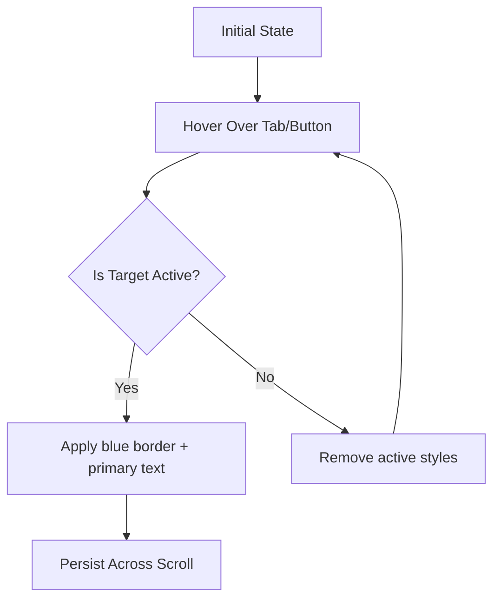
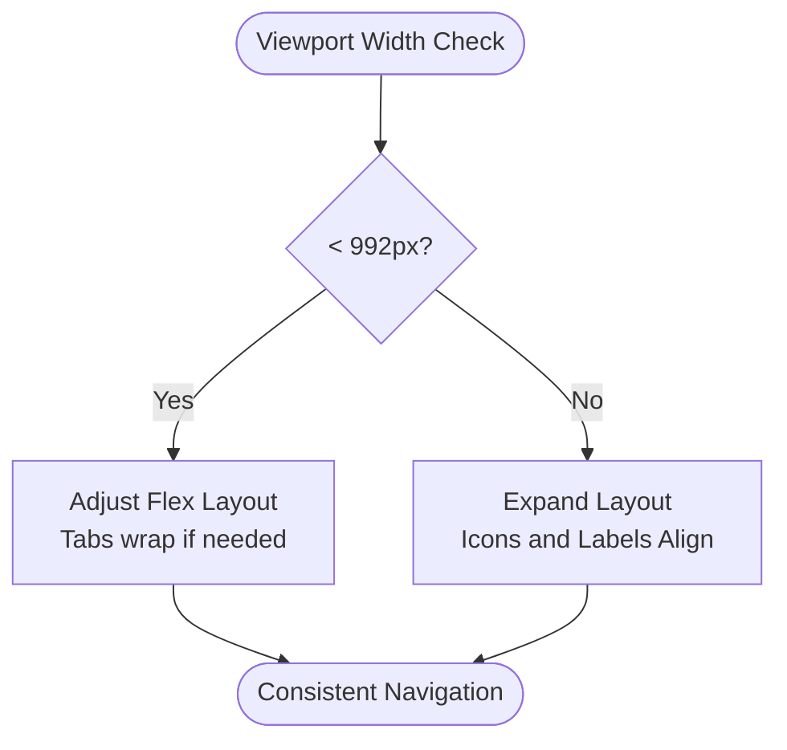
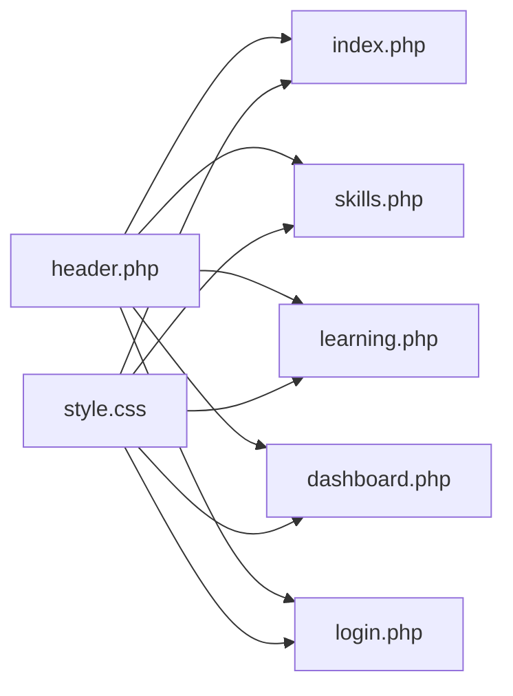

# Navigation and Tab System

<cite>
**Referenced Files in This Document**
- [index.php](file://frontend-php/index.php)
- [skills.php](file://frontend-php/skills.php)
- [header.php](file://frontend-php/includes/header.php)
- [footer.php](file://frontend-php/includes/footer.php)
- [style.css](file://frontend-php/css/style.css)
- [learning.php](file://frontend-php/learning.php)
- [dashboard.php](file://frontend-php/dashboard.php)
- [login.php](file://frontend-php/login.php)
</cite>

## Table of Contents
1. [Introduction](#introduction)
2. [Project Structure](#project-structure)
3. [Core Components](#core-components)
4. [Architecture Overview](#architecture-overview)
5. [Detailed Component Analysis](#detailed-component-analysis)
6. [Dependency Analysis](#dependency-analysis)
7. [Performance Considerations](#performance-considerations)
8. [Troubleshooting Guide](#troubleshooting-guide)
9. [Conclusion](#conclusion)

## Introduction
This document describes the portfolio navigation system across the frontend pages. It covers:
- Top navigation bar with sticky positioning and glass effect styling
- Tab selector for switching between Projects, Certificates, and Skills
- Bottom iOS-style navigation with active state indicators and icon labeling
- Material Symbols integration for navigation icons
- Navigation flow patterns, anchor link implementations, and responsive behavior
- Examples of navigation markup structure, active state management, and integration with the overall user experience

## Project Structure
The navigation system spans several PHP pages and a shared stylesheet:
- Shared header injects global styles, fonts, and Material Symbols
- Page-specific navigation bars and tabs are embedded in each page
- Glass effect and typography are centralized in the stylesheet

**Diagram sources**
- [header.php](file://frontend-php/includes/header.php#L1-L71)
- [style.css](file://frontend-php/css/style.css#L1-L289)
- [index.php](file://frontend-php/index.php#L1-L174)
- [skills.php](file://frontend-php/skills.php#L1-L189)
- [learning.php](file://frontend-php/learning.php#L1-L215)
- [dashboard.php](file://frontend-php/dashboard.php#L1-L279)
- [login.php](file://frontend-php/login.php#L1-L94)

**Section sources**
- [header.php](file://frontend-php/includes/header.php#L1-L71)
- [style.css](file://frontend-php/css/style.css#L1-L289)

## Core Components
- Top navigation bar: Sticky, glass-effect, and responsive with Material Symbols
- Tab selector: Horizontal tabs for switching content sections
- Bottom navigation: iOS-style fixed bar with active state indicators
- Material Symbols: Consistent iconography across navigation elements
- Responsive behavior: Adapts to mobile and desktop breakpoints via shared styles

**Section sources**
- [index.php](file://frontend-php/index.php#L4-L21)
- [index.php](file://frontend-php/index.php#L52-L58)
- [index.php](file://frontend-php/index.php#L153-L171)
- [skills.php](file://frontend-php/skills.php#L4-L16)
- [skills.php](file://frontend-php/skills.php#L168-L186)
- [style.css](file://frontend-php/css/style.css#L39-L50)
- [style.css](file://frontend-php/css/style.css#L89-L97)

## Architecture Overview
The navigation architecture combines shared assets and page-specific markup:
- Global assets: Material Symbols font and custom CSS classes
- Page-level navigation: Top bar, tabs, and bottom bar per page
- Interaction model: Anchor links and buttons trigger navigation actions

**Diagram sources**
- [header.php](file://frontend-php/includes/header.php#L12-L12)
- [style.css](file://frontend-php/css/style.css#L39-L50)
- [index.php](file://frontend-php/index.php#L4-L21)
- [index.php](file://frontend-php/index.php#L52-L58)
- [index.php](file://frontend-php/index.php#L153-L171)
- [skills.php](file://frontend-php/skills.php#L4-L16)
- [skills.php](file://frontend-php/skills.php#L168-L186)

## Detailed Component Analysis

### Top Navigation Bar
- Sticky positioning: Uses a sticky class to remain at the top during scroll
- Glass effect: Applies backdrop blur and semi-transparent background
- Material Symbols: Icons for share, settings, and back navigation
- Responsive alignment: Flexbox layout adapts to screen size

**Diagram sources**
- [index.php](file://frontend-php/index.php#L4-L21)
- [header.php](file://frontend-php/includes/header.php#L37-L67)
- [style.css](file://frontend-php/css/style.css#L39-L50)

**Section sources**
- [index.php](file://frontend-php/index.php#L4-L21)
- [header.php](file://frontend-php/includes/header.php#L37-L67)
- [style.css](file://frontend-php/css/style.css#L39-L50)

### Tab Selector (Projects, Certificates, Skills)
- Horizontal tab layout: Evenly distributed anchors/buttons
- Active state: Projects tab has a blue bottom border and primary text
- Navigation targets: Links to external pages (e.g., Skills page) and internal sections

**Diagram sources**
- [index.php](file://frontend-php/index.php#L52-L58)

**Section sources**
- [index.php](file://frontend-php/index.php#L52-L58)

### Bottom Navigation (iOS Style)
- Fixed positioning: Stays at the bottom of the viewport
- Glass effect: Same backdrop blur and border styling
- Active state: One item highlighted with a filled icon and blue color
- Icon labeling: Small label beneath each icon for clarity

**Diagram sources**
- [index.php](file://frontend-php/index.php#L153-L171)
- [skills.php](file://frontend-php/skills.php#L168-L186)
- [style.css](file://frontend-php/css/style.css#L39-L50)

**Section sources**
- [index.php](file://frontend-php/index.php#L153-L171)
- [skills.php](file://frontend-php/skills.php#L168-L186)
- [style.css](file://frontend-php/css/style.css#L39-L50)

### Material Symbols Integration
- Font inclusion: Loaded via Google Fonts in the shared header
- Outlined vs filled variants: Used to indicate active states
- Consistent sizing and alignment: Standardized via CSS classes

**Diagram sources**
- [header.php](file://frontend-php/includes/header.php#L12-L12)
- [style.css](file://frontend-php/css/style.css#L89-L97)

**Section sources**
- [header.php](file://frontend-php/includes/header.php#L12-L12)
- [style.css](file://frontend-php/css/style.css#L89-L97)

### Navigation Flow Patterns and Anchor Links
- Internal navigation: Links within the portfolio (e.g., Skills tab)
- Cross-page navigation: Links to external pages (e.g., learning.php)
- Back navigation: Arrow icons for returning to previous contexts
- Responsive behavior: On smaller screens, tabs and bottom nav adapt to available space

**Diagram sources**
- [index.php](file://frontend-php/index.php#L163-L166)
- [index.php](file://frontend-php/index.php#L56-L56)
- [learning.php](file://frontend-php/learning.php#L5-L7)
- [skills.php](file://frontend-php/skills.php#L170-L172)

**Section sources**
- [index.php](file://frontend-php/index.php#L163-L166)
- [index.php](file://frontend-php/index.php#L56-L56)
- [learning.php](file://frontend-php/learning.php#L5-L7)
- [skills.php](file://frontend-php/skills.php#L170-L172)

### Active State Management
- Projects tab: Blue bottom border and primary text color indicate active state
- Bottom navigation: One item is visually active (filled icon + blue color)
- Consistency: Active styles rely on shared CSS classes for uniformity

**Diagram sources**
- [index.php](file://frontend-php/index.php#L54-L56)
- [index.php](file://frontend-php/index.php#L155-L169)
- [skills.php](file://frontend-php/skills.php#L174-L174)

**Section sources**
- [index.php](file://frontend-php/index.php#L54-L56)
- [index.php](file://frontend-php/index.php#L155-L169)
- [skills.php](file://frontend-php/skills.php#L174-L174)

### Responsive Behavior
- Sticky top bars: Remain visible while scrolling
- Bottom navigation: Fixed at the viewport bottom
- Flex layouts: Adapt to narrow widths on mobile devices
- Shared breakpoints: Tailored via media queries in the stylesheet

**Diagram sources**
- [style.css](file://frontend-php/css/style.css#L204-L233)
- [index.php](file://frontend-php/index.php#L52-L58)
- [index.php](file://frontend-php/index.php#L153-L171)

**Section sources**
- [style.css](file://frontend-php/css/style.css#L204-L233)
- [index.php](file://frontend-php/index.php#L52-L58)
- [index.php](file://frontend-php/index.php#L153-L171)

## Dependency Analysis
- Shared assets: header.php loads Material Symbols and Bootstrap; style.css defines glass effect and typography
- Page-level dependencies: Each page embeds its own navigation components
- Inter-page navigation: Anchor links connect pages and tabs

**Diagram sources**
- [header.php](file://frontend-php/includes/header.php#L1-L71)
- [style.css](file://frontend-php/css/style.css#L1-L289)
- [index.php](file://frontend-php/index.php#L1-L174)
- [skills.php](file://frontend-php/skills.php#L1-L189)
- [learning.php](file://frontend-php/learning.php#L1-L215)
- [dashboard.php](file://frontend-php/dashboard.php#L1-L279)
- [login.php](file://frontend-php/login.php#L1-L94)

**Section sources**
- [header.php](file://frontend-php/includes/header.php#L1-L71)
- [style.css](file://frontend-php/css/style.css#L1-L289)

## Performance Considerations
- Minimize repaints: Sticky and fixed positions reduce layout shifts
- Efficient icons: Material Symbols font loaded once globally
- CSS reuse: Centralized glass effect and typography improve maintainability
- Avoid heavy animations: Keep transitions subtle for smooth scrolling

## Troubleshooting Guide
- Icons not rendering:
  - Verify Material Symbols font is included in the header
  - Confirm CSS classes for outlined/filled variants are applied
- Glass effect not visible:
  - Ensure backdrop-filter and rgba background are present
  - Check z-index stacking context for overlapping elements
- Active state not updating:
  - Confirm active classes are toggled on click
  - Validate CSS specificity for active styles
- Bottom navigation overlaps content:
  - Adjust bottom spacing on the main content area
  - Ensure fixed positioning does not interfere with scrollable regions

**Section sources**
- [header.php](file://frontend-php/includes/header.php#L12-L12)
- [style.css](file://frontend-php/css/style.css#L39-L50)
- [index.php](file://frontend-php/index.php#L54-L56)
- [index.php](file://frontend-php/index.php#L153-L171)

## Conclusion
The navigation system integrates sticky top bars, tab selectors, and iOS-style bottom navigation with a cohesive glass effect and Material Symbols styling. It supports seamless cross-page navigation and remains responsive across device sizes. By centralizing shared assets and reusing consistent classes, the system balances maintainability and user experience.