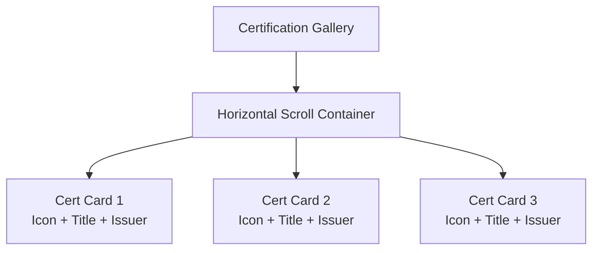

# Portfolio Dashboard Interface

<cite>
**Referenced Files in This Document**
- [index.php](file://frontend-php/index.php)
- [style.css](file://frontend-php/css/style.css)
- [header.php](file://frontend-php/includes/header.php)
- [footer.php](file://frontend-php/includes/footer.php)
- [sidebar.php](file://frontend-php/includes/sidebar.php)
- [skills.php](file://frontend-php/skills.php)
- [learning.php](file://frontend-php/learning.php)
- [main.py](file://backend-ai/main.py)
</cite>

## Table of Contents
1. [Introduction](#introduction)
2. [Project Structure](#project-structure)
3. [Core Components](#core-components)
4. [Architecture Overview](#architecture-overview)
5. [Detailed Component Analysis](#detailed-component-analysis)
6. [Dependency Analysis](#dependency-analysis)
7. [Performance Considerations](#performance-considerations)
8. [Troubleshooting Guide](#troubleshooting-guide)
9. [Conclusion](#conclusion)

## Introduction
This document describes the Octal Foundry portfolio dashboard interface, focusing on the profile header with verification badges, project showcase grid, certification gallery, industry endorsements, tab navigation system, interactive project cards, technology badge tagging, responsive design using Bootstrap utilities, CSS custom properties for theming, and Material Symbols integration. It also covers navigation flows to the learning and skills sections, glass effect styling, gradient backgrounds, and mobile-first responsive behavior.

## Project Structure
The portfolio dashboard is implemented as a PHP-driven frontend with shared header and footer includes, styled with custom CSS and Bootstrap 5 utilities. The backend provides a minimal FastAPI service for AI coaching hints used in the learning page.

**Diagram sources**
- [index.php](file://frontend-php/index.php#L1-L174)
- [skills.php](file://frontend-php/skills.php#L1-L189)
- [learning.php](file://frontend-php/learning.php#L1-L215)
- [header.php](file://frontend-php/includes/header.php#L1-L23)
- [footer.php](file://frontend-php/includes/footer.php#L1-L7)
- [sidebar.php](file://frontend-php/includes/sidebar.php#L1-L81)
- [style.css](file://frontend-php/css/style.css#L1-L114)
- [main.py](file://backend-ai/main.py#L1-L30)

**Section sources**
- [index.php](file://frontend-php/index.php#L1-L174)
- [header.php](file://frontend-php/includes/header.php#L1-L23)
- [footer.php](file://frontend-php/includes/footer.php#L1-L7)
- [style.css](file://frontend-php/css/style.css#L1-L114)
- [sidebar.php](file://frontend-php/includes/sidebar.php#L1-L81)
- [skills.php](file://frontend-php/skills.php#L1-L189)
- [learning.php](file://frontend-php/learning.php#L1-L215)
- [main.py](file://backend-ai/main.py#L1-L30)

## Core Components
- Profile Header: Avatar with verification badge, verified label, and action button.
- Tab Navigation: Sticky tabs for Projects, Certificates, and Skills.
- Project Showcase Grid: Responsive cards with media ratios, metadata, tech badges, and actions.
- Certification Gallery: Horizontal scrollable cards with icons and issuer labels.
- Industry Endorsements: Testimonial card with avatar and quote.
- Bottom Navigation: iOS-style bar for quick access to Profile, Explore, Learning, Alerts.
- Theming and Effects: CSS custom properties, glass effect, glow effects, and Material Symbols.

**Section sources**
- [index.php](file://frontend-php/index.php#L24-L151)
- [style.css](file://frontend-php/css/style.css#L1-L114)

## Architecture Overview
The dashboard is a client-side PHP application that loads shared assets and renders the portfolio UI. The learning page integrates with a backend service for AI coaching hints.

**Diagram sources**
- [index.php](file://frontend-php/index.php#L1-L174)
- [header.php](file://frontend-php/includes/header.php#L1-L23)
- [footer.php](file://frontend-php/includes/footer.php#L1-L7)
- [style.css](file://frontend-php/css/style.css#L1-L114)
- [skills.php](file://frontend-php/skills.php#L1-L189)
- [learning.php](file://frontend-php/learning.php#L1-L215)
- [main.py](file://backend-ai/main.py#L23-L29)

## Detailed Component Analysis

### Profile Header
- Avatar: Circular border with primary blue accent and cover image.
- Verification Badge: Positioned absolutely at bottom-right with Material Symbols verified icon.
- Verified Label: Premium badge with glow effect and primary blue styling.
- Action Button: Download CV with orange glow and shadow.

**Diagram sources**
- [index.php](file://frontend-php/index.php#L25-L49)
- [style.css](file://frontend-php/css/style.css#L69-L75)

**Section sources**
- [index.php](file://frontend-php/index.php#L25-L49)
- [style.css](file://frontend-php/css/style.css#L69-L75)

### Tab Navigation System
- Sticky tabs positioned below the top navigation.
- Active state for Projects with primary blue underline.
- Certificates and Skills tabs inactive by default.
- Skills tab links to skills.php.

**Diagram sources**
- [index.php](file://frontend-php/index.php#L51-L58)

**Section sources**
- [index.php](file://frontend-php/index.php#L51-L58)

### Project Showcase Grid
- Responsive grid layout with gap spacing.
- Each card includes:
  - Ratio container for media aspect ratio.
  - Title with external link icon.
  - Description paragraph.
  - Technology badges with uppercase labels.
  - Action button to view source code.

**Diagram sources**
- [index.php](file://frontend-php/index.php#L67-L102)

**Section sources**
- [index.php](file://frontend-php/index.php#L67-L102)

### Certification Gallery
- Horizontal scroll container with no scrollbar.
- Each certification card:
  - Icon circle with primary blue background.
  - Title and issuer text.
  - Fixed width for consistent layout.

**Diagram sources**
- [index.php](file://frontend-php/index.php#L104-L135)
- [style.css](file://frontend-php/css/style.css#L81-L87)

**Section sources**
- [index.php](file://frontend-php/index.php#L104-L135)
- [style.css](file://frontend-php/css/style.css#L81-L87)

### Industry Endorsements
- Testimonial card with:
  - Avatar placeholder.
  - Author name and title.
  - Italicized quote text.

**Diagram sources**
- [index.php](file://frontend-php/index.php#L137-L150)

**Section sources**
- [index.php](file://frontend-php/index.php#L137-L150)

### Bottom Navigation Bar
- iOS-style fixed bottom bar with four items.
- Icons and labels for Profile, Explore, Learning, Alerts.
- Active state for Profile; others inactive by default.
- Learning item links to learning.php.

**Diagram sources**
- [index.php](file://frontend-php/index.php#L153-L171)

**Section sources**
- [index.php](file://frontend-php/index.php#L153-L171)

### Navigation Flows
- From Portfolio to Skills: Clicking the Skills tab navigates to skills.php.
- From Portfolio to Learning: Clicking the Learning bottom nav item navigates to learning.php.
- From Learning back to Portfolio: Back arrow in top app bar navigates to index.php.

**Diagram sources**
- [index.php](file://frontend-php/index.php#L56-L57)
- [index.php](file://frontend-php/index.php#L163-L166)
- [index.php](file://frontend-php/index.php#L5-L7)
- [learning.php](file://frontend-php/learning.php#L4-L7)

**Section sources**
- [index.php](file://frontend-php/index.php#L56-L57)
- [index.php](file://frontend-php/index.php#L163-L166)
- [index.php](file://frontend-php/index.php#L5-L7)
- [learning.php](file://frontend-php/learning.php#L4-L7)

### Technology Badge Tagging
- Badges use primary blue background with opacity and uppercase labels.
- Applied consistently across project cards for tech stack representation.

**Diagram sources**
- [index.php](file://frontend-php/index.php#L77-L81)
- [style.css](file://frontend-php/css/style.css#L61-L67)

**Section sources**
- [index.php](file://frontend-php/index.php#L77-L81)
- [style.css](file://frontend-php/css/style.css#L61-L67)

### Responsive Design and Bootstrap Utilities
- Bootstrap 5 classes for layout, spacing, alignment, and responsive behavior.
- Flex utilities for alignment and distribution.
- Gap utilities for consistent spacing.
- Ratio utilities for media containers.
- Sticky positioning for top and bottom bars.

**Diagram sources**
- [index.php](file://frontend-php/index.php#L4-L21)
- [index.php](file://frontend-php/index.php#L23-L171)

**Section sources**
- [index.php](file://frontend-php/index.php#L4-L21)
- [index.php](file://frontend-php/index.php#L23-L171)

### CSS Custom Properties and Theming
- Root-level custom properties define primary colors, background shades, and card colors.
- Utility classes map properties to color tokens for consistent theming.
- Variables are referenced throughout components for cohesive styling.

**Diagram sources**
- [style.css](file://frontend-php/css/style.css#L1-L11)
- [style.css](file://frontend-php/css/style.css#L53-L67)

**Section sources**
- [style.css](file://frontend-php/css/style.css#L1-L11)
- [style.css](file://frontend-php/css/style.css#L53-L67)

### Material Symbols Integration
- Google Fonts Material Symbols included in header.
- Outlined and filled variants used for icons across components.
- Consistent sizing and alignment via utility classes.

**Diagram sources**
- [header.php](file://frontend-php/includes/header.php#L12-L12)
- [index.php](file://frontend-php/index.php#L32-L34)
- [index.php](file://frontend-php/index.php#L74-L74)

**Section sources**
- [header.php](file://frontend-php/includes/header.php#L12-L12)
- [index.php](file://frontend-php/index.php#L32-L34)
- [index.php](file://frontend-php/index.php#L74-L74)

### Glass Effect Styling
- Glass effect applied to top and bottom navigation bars.
- Uses backdrop blur and semi-transparent backgrounds.
- Subtle borders for depth perception.

**Diagram sources**
- [style.css](file://frontend-php/css/style.css#L40-L50)
- [index.php](file://frontend-php/index.php#L4-L4)
- [index.php](file://frontend-php/index.php#L154-L154)

**Section sources**
- [style.css](file://frontend-php/css/style.css#L40-L50)
- [index.php](file://frontend-php/index.php#L4-L4)
- [index.php](file://frontend-php/index.php#L154-L154)

### Gradient Backgrounds
- Gradient overlays used for skill prediction and latest achievement sections.
- Linear gradients combine primary and secondary colors for visual emphasis.

**Diagram sources**
- [skills.php](file://frontend-php/skills.php#L100-L101)
- [skills.php](file://frontend-php/skills.php#L158-L164)

**Section sources**
- [skills.php](file://frontend-php/skills.php#L100-L101)
- [skills.php](file://frontend-php/skills.php#L158-L164)

### Mobile-First Responsive Behavior
- Bootstrap utilities ensure mobile-first layout.
- Sticky positioning for top and bottom bars adapts to viewport.
- Horizontal scrolling for certification gallery accommodates small screens.

**Diagram sources**
- [index.php](file://frontend-php/index.php#L4-L21)
- [index.php](file://frontend-php/index.php#L109-L109)
- [index.php](file://frontend-php/index.php#L154-L171)

**Section sources**
- [index.php](file://frontend-php/index.php#L4-L21)
- [index.php](file://frontend-php/index.php#L109-L109)
- [index.php](file://frontend-php/index.php#L154-L171)

## Dependency Analysis
- Frontend depends on Bootstrap 5 CSS and JavaScript bundles.
- Custom CSS defines theming tokens and reusable utilities.
- Header includes Google Fonts and Material Symbols fonts.
- Learning page consumes backend API for AI coaching hints.

**Diagram sources**
- [header.php](file://frontend-php/includes/header.php#L14-L18)
- [footer.php](file://frontend-php/includes/footer.php#L3-L4)
- [style.css](file://frontend-php/css/style.css#L1-L11)
- [index.php](file://frontend-php/index.php#L1-L174)
- [skills.php](file://frontend-php/skills.php#L1-L189)
- [learning.php](file://frontend-php/learning.php#L1-L215)
- [main.py](file://backend-ai/main.py#L1-L30)

**Section sources**
- [header.php](file://frontend-php/includes/header.php#L14-L18)
- [footer.php](file://frontend-php/includes/footer.php#L3-L4)
- [style.css](file://frontend-php/css/style.css#L1-L11)
- [index.php](file://frontend-php/index.php#L1-L174)
- [skills.php](file://frontend-php/skills.php#L1-L189)
- [learning.php](file://frontend-php/learning.php#L1-L215)
- [main.py](file://backend-ai/main.py#L1-L30)

## Performance Considerations
- Lazy loading of images is not implemented; consider adding loading="lazy" for project media.
- CSS custom properties reduce duplication but increase runtime calculations; keep theme variables minimal.
- Horizontal scroll containers should avoid excessive child count to prevent layout thrashing.
- Material Symbols icons are loaded once via fonts; avoid redundant icon sets.

## Troubleshooting Guide
- If icons do not render, verify Material Symbols font inclusion in the header.
- If glass effect appears opaque, adjust backdrop-filter and border transparency in the glass-effect class.
- If tabs do not highlight correctly, ensure active class is applied conditionally and primary blue color tokens are set.
- If learning page fails to fetch hints, confirm backend server is running and CORS settings allow the origin.

**Section sources**
- [header.php](file://frontend-php/includes/header.php#L12-L12)
- [style.css](file://frontend-php/css/style.css#L40-L50)
- [index.php](file://frontend-php/index.php#L54-L56)
- [learning.php](file://frontend-php/learning.php#L177-L212)
- [main.py](file://backend-ai/main.py#L6-L17)

## Conclusion
The Octal Foundry portfolio dashboard combines a modern dark theme with glass effects, responsive Bootstrap utilities, and Material Symbols for a cohesive, mobile-first experience. The profile header establishes identity and verification, while the project grid, certification gallery, and endorsements present professional accomplishments. The tabbed navigation and bottom bar streamline access to skills and learning, supported by a lightweight backend for AI coaching hints.