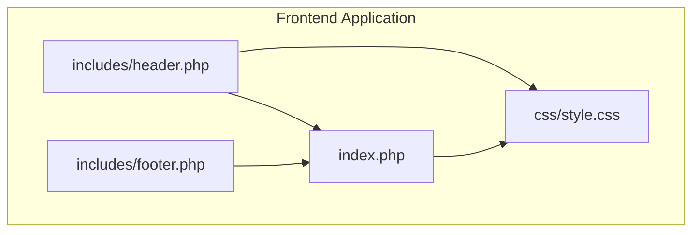
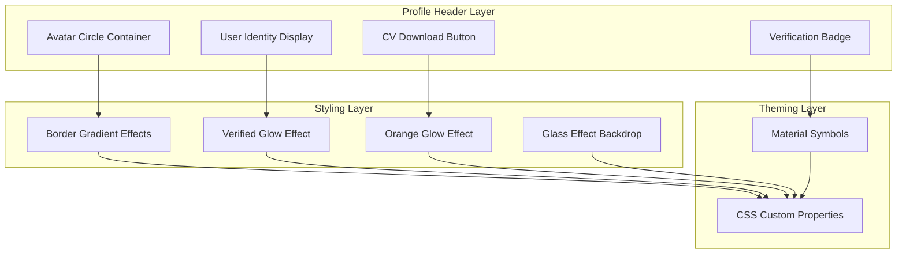
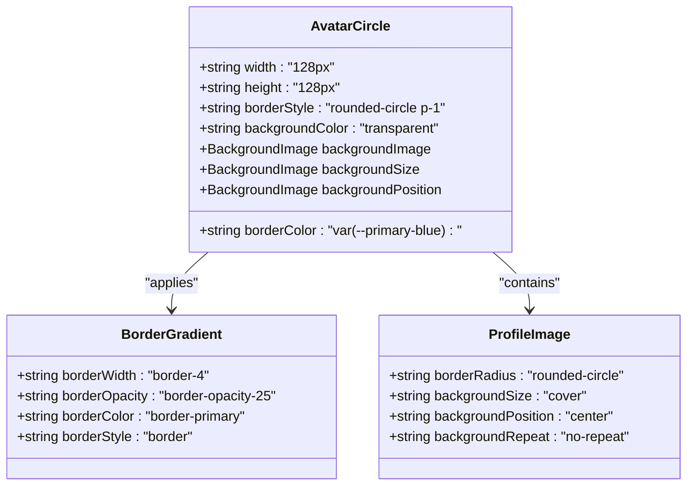
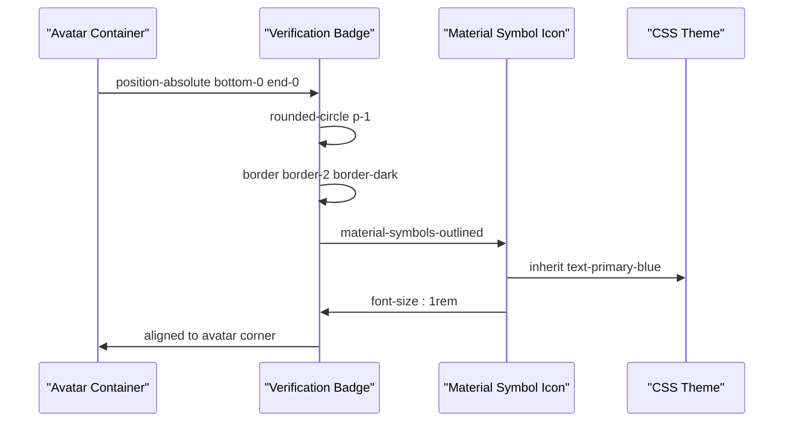
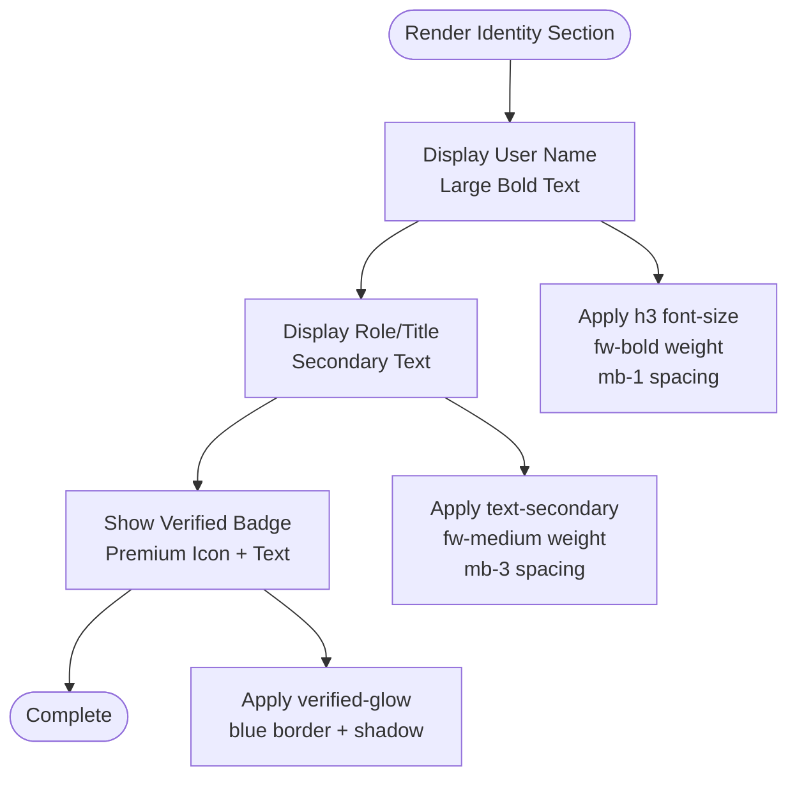
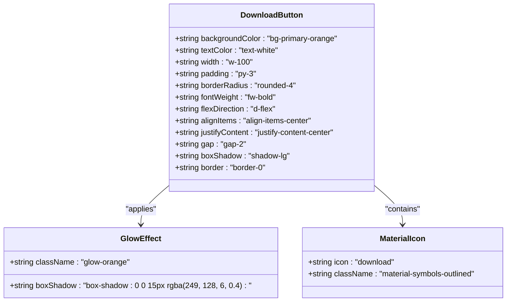
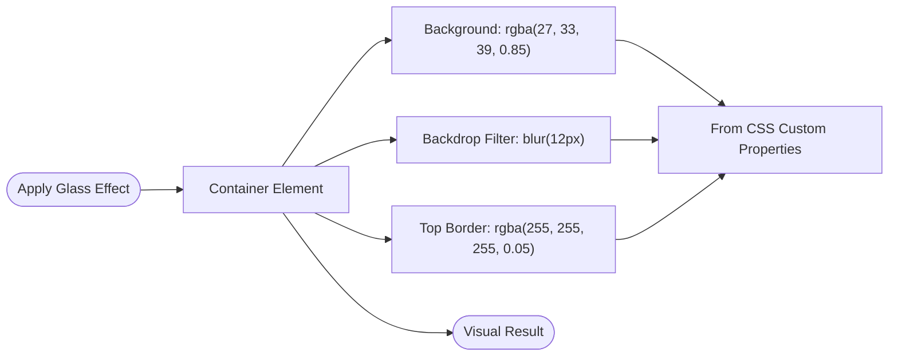
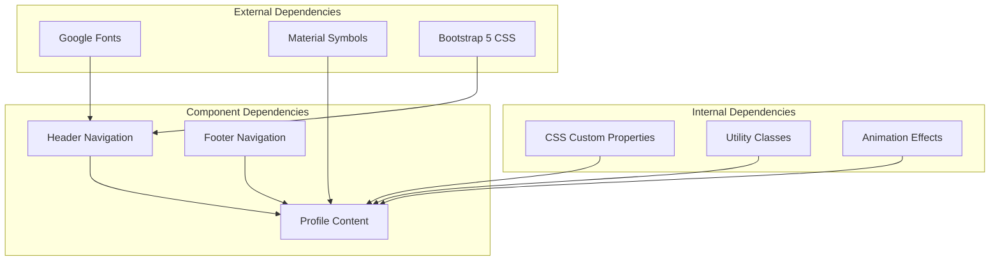

# Profile Header Component

<cite>
**Referenced Files in This Document**
- [index.php](file://frontend-php/index.php)
- [style.css](file://frontend-php/css/style.css)
- [header.php](file://frontend-php/includes/header.php)
- [footer.php](file://frontend-php/includes/footer.php)
</cite>

## Table of Contents
1. [Introduction](#introduction)
2. [Project Structure](#project-structure)
3. [Core Components](#core-components)
4. [Architecture Overview](#architecture-overview)
5. [Detailed Component Analysis](#detailed-component-analysis)
6. [Dependency Analysis](#dependency-analysis)
7. [Performance Considerations](#performance-considerations)
8. [Troubleshooting Guide](#troubleshooting-guide)
9. [Conclusion](#conclusion)

## Introduction
This document provides comprehensive documentation for the portfolio profile header component. It covers the avatar circle with border styling, verification badge positioning system, glow effects, user identity display, CV download button functionality, responsive avatar sizing, border gradient effects, Material Symbols integration, theming with CSS custom properties, and glass effect backdrop styling.

## Project Structure
The profile header component resides within the frontend PHP application. The primary HTML markup is located in the main index page, while styling and theming are managed through the centralized stylesheet. The header includes Material Symbols integration for verification icons and other UI elements.



**Diagram sources**
- [index.php](file://frontend-php/index.php#L1-L174)
- [header.php](file://frontend-php/includes/header.php#L1-L71)
- [style.css](file://frontend-php/css/style.css#L1-L289)

**Section sources**
- [index.php](file://frontend-php/index.php#L1-L174)
- [header.php](file://frontend-php/includes/header.php#L1-L71)
- [style.css](file://frontend-php/css/style.css#L1-L289)

## Core Components
The profile header consists of four primary elements:
- Avatar circle with responsive sizing (128px square)
- Verification badge positioned at bottom-right
- Verified status indicator with glow effect
- CV download button with orange glow

**Section sources**
- [index.php](file://frontend-php/index.php#L25-L49)
- [style.css](file://frontend-php/css/style.css#L69-L75)

## Architecture Overview
The profile header follows a layered architecture with clear separation between presentation (HTML), styling (CSS), and theming (custom properties).



**Diagram sources**
- [index.php](file://frontend-php/index.php#L25-L49)
- [style.css](file://frontend-php/css/style.css#L1-L11)
- [style.css](file://frontend-php/css/style.css#L39-L75)

## Detailed Component Analysis

### Avatar Circle Component
The avatar circle serves as the central visual element with precise sizing and border styling.



**Diagram sources**
- [index.php](file://frontend-php/index.php#L27-L31)

#### Avatar Sizing and Positioning
- Fixed responsive sizing: 128px × 128px square avatar
- Centered alignment within the profile header section
- Relative positioning enables absolute positioning of verification badge
- Circular clipping with rounded corners for smooth edges

#### Border Gradient Effects
- Primary blue border color from CSS custom property `--primary-blue`
- Opacity-adjusted border (`border-opacity-25`) for subtle appearance
- Four-pixel border width (`border-4`) creates prominent outline
- Rounded circle shape maintains consistent border curvature

**Section sources**
- [index.php](file://frontend-php/index.php#L27-L31)
- [style.css](file://frontend-php/css/style.css#L1-L11)

### Verification Badge System
The verification badge implements a sophisticated positioning system with Material Symbols integration.



**Diagram sources**
- [index.php](file://frontend-php/index.php#L32-L34)

#### Badge Placement Logic
- Absolute positioning: `bottom-0 end-0` places badge at avatar's bottom-right corner
- Circular design: `rounded-circle` ensures badge maintains circular shape
- Dark border: `border border-2 border-dark` provides contrast against avatar
- Material Symbols integration: `verified` icon with 1rem font size
- Color theming: inherits `text-primary-blue` from theme variables

#### Verification Status Indicators
- Verified status display: premium workspace icon with "Verified by Octal AI" text
- Glowing effect: `verified-glow` class applies blue glow shadow
- Border styling: light blue border with 25% opacity
- Text styling: uppercase tracking and small font size for professional appearance

**Section sources**
- [index.php](file://frontend-php/index.php#L32-L43)
- [style.css](file://frontend-php/css/style.css#L69-L71)

### User Identity Display
The identity section presents user information with clear typography hierarchy.



**Diagram sources**
- [index.php](file://frontend-php/index.php#L37-L43)

#### Typography and Spacing
- Name: Large heading (h3) with bold weight and reduced bottom margin
- Role: Secondary text with medium weight and increased bottom spacing
- Verified indicator: Small text with uppercase tracking and professional spacing

#### Verification Status Styling
- Premium workspace icon with primary blue color
- Verified text with uppercase letter spacing
- Glowing effect enhances visual prominence
- Subtle background with blue opacity for contrast

**Section sources**
- [index.php](file://frontend-php/index.php#L37-L43)

### CV Download Button
The CV download button combines functional design with visual appeal.



**Diagram sources**
- [index.php](file://frontend-php/index.php#L45-L48)

#### Button Styling and Effects
- Primary orange background from theme variable `--primary-orange`
- Full-width responsive design (`w-100`)
- Enhanced padding for touch-friendly interaction (`py-3`)
- Rounded corners (`rounded-4`) for modern appearance
- Flexbox layout for icon-text alignment
- Shadow enhancement (`shadow-lg`) for depth perception
- No border for clean minimalist design

#### Glow Animation Effects
- Orange glow effect: `glow-orange` class with 15px blur radius
- RGBA color with 40% opacity for subtle luminosity
- Continuous glow effect without JavaScript animation
- Consistent with overall design system color palette

**Section sources**
- [index.php](file://frontend-php/index.php#L45-L48)
- [style.css](file://frontend-php/css/style.css#L73-L75)

### Theming and CSS Custom Properties
The component leverages a comprehensive theming system built on CSS custom properties.

```mermaid
erDiagram
THEME {
string --primary-blue "#0d7ff2"
string --primary-orange "#f98006"
string --bg-dark "#101922"
string --bg-darker "#0a0c10"
string --card-dark "#1b2127"
string --text-slate "#9cabba"
}
COMPONENTS {
string avatar-border-color "var(--primary-blue)"
string verified-badge-color "var(--primary-blue)"
string glow-blue-color "rgba(13, 127, 242, 0.2)"
string glow-orange-color "rgba(249, 128, 6, 0.4)"
string glass-backdrop "rgba(27, 33, 39, 0.85)"
}
THEME ||--|| COMPONENTS : "defines"
```

**Diagram sources**
- [style.css](file://frontend-php/css/style.css#L1-L11)

#### Color Palette Management
- Primary blue: `#0d7ff2` for borders, badges, and highlights
- Primary orange: `#f98006` for buttons and interactive elements
- Dark backgrounds: `#101922` and `#1b2127` for contrast
- Secondary text: `#9cabba` for muted elements

#### Utility Classes
- Text color utilities: `.text-primary-blue`, `.text-primary-orange`
- Background color utilities: `.bg-primary-blue`, `.bg-primary-orange`
- Border utilities: `.border-primary`, `.border-opacity-25`
- Shadow utilities: `.verified-glow`, `.glow-orange`

**Section sources**
- [style.css](file://frontend-php/css/style.css#L1-L11)
- [style.css](file://frontend-php/css/style.css#L53-L67)

### Glass Effect Backdrop Styling
The glass effect provides a modern frosted glass appearance for navigation elements.



**Diagram sources**
- [style.css](file://frontend-php/css/style.css#L40-L44)

#### Implementation Details
- Semi-transparent dark background (`rgba(27, 33, 39, 0.85)`)
- 12px blur radius for soft focus effect
- Subtle white border (`rgba(255, 255, 255, 0.05)`) for depth
- Applied to navigation bars and header elements
- Maintains readability while providing visual separation

**Section sources**
- [style.css](file://frontend-php/css/style.css#L40-L44)

## Dependency Analysis
The profile header component depends on several external resources and internal styles.



**Diagram sources**
- [header.php](file://frontend-php/includes/header.php#L8-L18)
- [index.php](file://frontend-php/index.php#L1-L21)

### External Resource Integration
- Google Fonts: Space Grotesk and Inter for typography
- Material Symbols: Verified icons and interface elements
- Bootstrap 5: Utility classes and responsive framework

### Internal Styling Dependencies
- CSS custom properties for consistent theming
- Utility classes for rapid development
- Animation effects for enhanced user experience
- Responsive breakpoints for mobile optimization

**Section sources**
- [header.php](file://frontend-php/includes/header.php#L8-L18)
- [index.php](file://frontend-php/index.php#L1-L21)

## Performance Considerations
The profile header component is optimized for performance through efficient resource loading and minimal DOM complexity.

### Image Loading Optimization
- Lazy loading for profile images
- Optimized aspect ratios (1:1 square)
- CDN-hosted images for global distribution
- Efficient background-image rendering

### CSS Optimization
- Minimal custom CSS with utility-first approach
- Efficient use of CSS custom properties
- Hardware-accelerated animations where applicable
- Reduced repaint and reflow scenarios

### JavaScript Considerations
- Pure CSS animations eliminate JavaScript overhead
- Static positioning reduces layout calculations
- Efficient Material Symbols integration

## Troubleshooting Guide

### Avatar Display Issues
**Problem**: Avatar appears distorted or cropped
**Solution**: Verify background-size is set to "cover" and background-position is "center"
**Check**: Ensure 128px × 128px dimensions are maintained

### Verification Badge Positioning
**Problem**: Badge not visible or misaligned
**Solution**: Confirm absolute positioning with `bottom-0 end-0`
**Check**: Verify parent container has `position-relative` applied

### Glow Effect Not Appearing
**Problem**: Missing glow around verified badge or button
**Solution**: Ensure `verified-glow` or `glow-orange` classes are applied
**Check**: Verify CSS custom properties are loaded correctly

### Material Symbols Not Rendering
**Problem**: Icons appear as question marks
**Solution**: Confirm Google Fonts Material Symbols are loaded
**Check**: Verify font family includes "Material Symbols Outlined"

### Responsive Issues
**Problem**: Layout breaks on mobile devices
**Solution**: Utilize Bootstrap's responsive utility classes
**Check**: Ensure appropriate breakpoint classes are applied

**Section sources**
- [index.php](file://frontend-php/index.php#L27-L34)
- [style.css](file://frontend-php/css/style.css#L69-L75)
- [header.php](file://frontend-php/includes/header.php#L12-L12)

## Conclusion
The portfolio profile header component demonstrates a well-architected approach to modern web design. Through careful use of CSS custom properties, Material Symbols integration, and utility-first styling, it achieves both visual appeal and technical excellence. The component's modular design allows for easy customization while maintaining consistency with the overall application theme. The responsive avatar sizing, sophisticated verification badge system, and elegant glow effects contribute to a premium user experience that effectively communicates user identity and verification status.