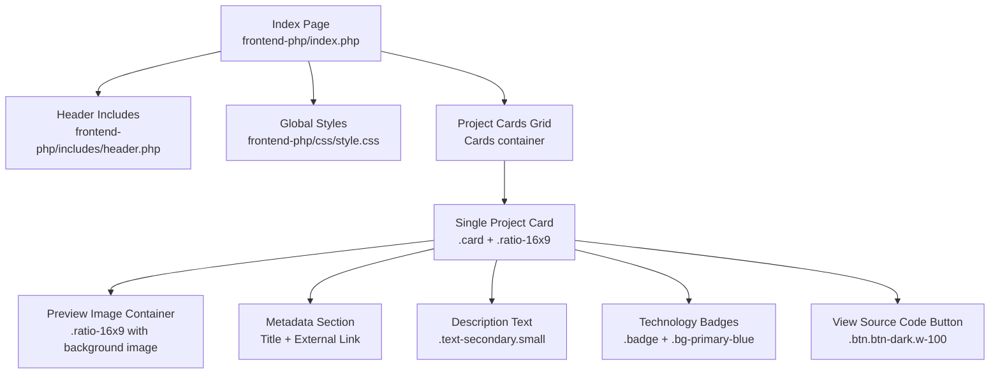
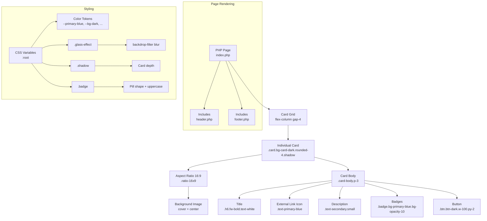
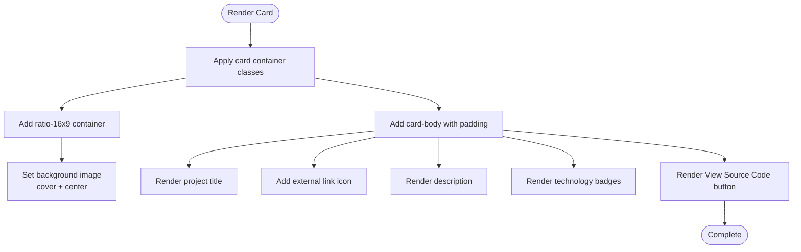
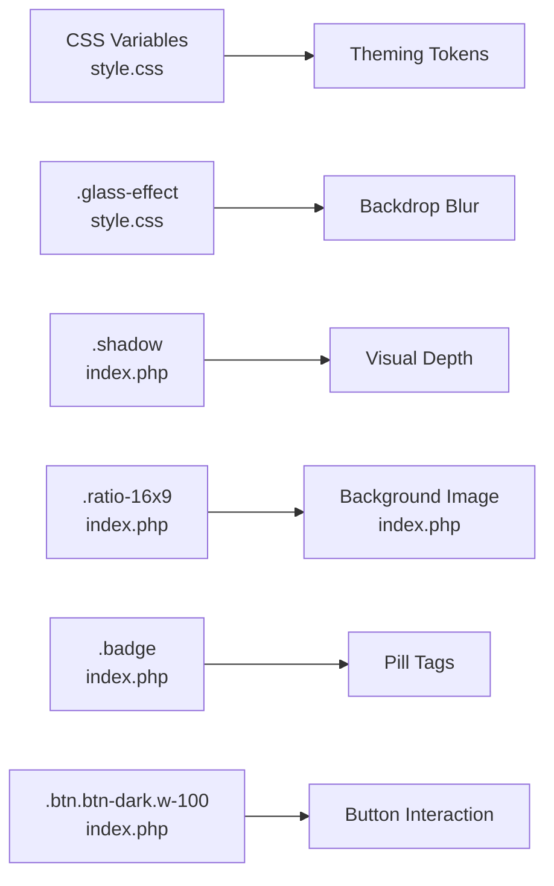

# Project Showcase Cards

<cite>
**Referenced Files in This Document**
- [index.php](file://frontend-php/index.php)
- [style.css](file://frontend-php/css/style.css)
- [header.php](file://frontend-php/includes/header.php)
- [footer.php](file://frontend-php/includes/footer.php)
- [learning.php](file://frontend-php/learning.php)
- [skills.php](file://frontend-php/skills.php)
- [dashboard.php](file://frontend-php/dashboard.php)
- [login.php](file://frontend-php/login.php)
</cite>

## Table of Contents
1. [Introduction](#introduction)
2. [Project Structure](#project-structure)
3. [Core Components](#core-components)
4. [Architecture Overview](#architecture-overview)
5. [Detailed Component Analysis](#detailed-component-analysis)
6. [Dependency Analysis](#dependency-analysis)
7. [Performance Considerations](#performance-considerations)
8. [Troubleshooting Guide](#troubleshooting-guide)
9. [Conclusion](#conclusion)
10. [Appendices](#appendices)

## Introduction
This document describes the project showcase card system used in the portfolio page. It explains the card layout structure, aspect ratio containers, preview images, metadata sections, project title display, external link behavior, description formatting, technology badge tagging, and the “View Source Code” button styling and interaction patterns. It also covers responsive grid behavior, card shadows, and glass effect styling, along with examples of markup and styling patterns for images and badges. Finally, it documents mobile-first responsive design and touch interaction considerations for project navigation.

## Project Structure
The showcase cards live in the main portfolio page and are built with a combination of HTML structure and CSS utilities. The page uses:
- Bootstrap 5 utilities for layout and spacing
- Custom CSS classes for theming, glass effects, and shadows
- Aspect ratio containers for consistent preview sizing
- Badge components for technology tags
- Interactive buttons styled with dark theme and glow accents

**Diagram sources**
- [index.php](file://frontend-php/index.php#L66-L102)
- [style.css](file://frontend-php/css/style.css#L1-L289)
- [header.php](file://frontend-php/includes/header.php#L1-L71)

**Section sources**
- [index.php](file://frontend-php/index.php#L66-L102)
- [style.css](file://frontend-php/css/style.css#L1-L289)
- [header.php](file://frontend-php/includes/header.php#L1-L71)

## Core Components
- Card container: A dark-themed card with rounded corners, subtle borders, and shadow for depth.
- Aspect ratio container: A responsive 16:9 preview area implemented via a ratio class and background image handling.
- Metadata section: Title, optional external link icon, and description.
- Technology badges: Small, pill-shaped tags with light blue background and text.
- “View Source Code” button: Full-width dark-styled button with border and bold typography.

Key implementation references:
- Card container and grid: [index.php](file://frontend-php/index.php#L66-L102)
- Aspect ratio container: [index.php](file://frontend-php/index.php#L69-L84)
- Preview image background: [index.php](file://frontend-php/index.php#L70)
- Title and external link: [index.php](file://frontend-php/index.php#L71-L76)
- Description: [index.php](file://frontend-php/index.php#L76)
- Badges: [index.php](file://frontend-php/index.php#L77-L81)
- View Source Code button: [index.php](file://frontend-php/index.php#L82)

**Section sources**
- [index.php](file://frontend-php/index.php#L66-L102)

## Architecture Overview
The showcase cards are rendered server-side in the portfolio page and styled client-side with global CSS. The card layout leverages:
- Bootstrap utility classes for spacing and alignment
- Custom CSS variables for consistent theming
- Glass effect utilities for translucent overlays
- Ratio utilities for maintaining consistent preview proportions

**Diagram sources**
- [index.php](file://frontend-php/index.php#L66-L102)
- [style.css](file://frontend-php/css/style.css#L1-L289)
- [header.php](file://frontend-php/includes/header.php#L1-L71)

## Detailed Component Analysis

### Card Layout Structure
- Outer container: A flex column with vertical spacing to form a grid-like layout.
- Individual card: Uses a dark background, rounded corners, thin white borders with low opacity, and a subtle shadow for depth.
- Spacing: Consistent padding inside the card body and controlled gaps between cards.

Implementation references:
- Card grid wrapper: [index.php](file://frontend-php/index.php#L66-L67)
- Card item: [index.php](file://frontend-php/index.php#L69-L84)

**Diagram sources**
- [index.php](file://frontend-php/index.php#L69-L84)

**Section sources**
- [index.php](file://frontend-php/index.php#L66-L102)

### Aspect Ratio Containers (16:9)
- The 16:9 preview area is implemented using a dedicated ratio class that maintains proportional scaling.
- Background image handling ensures the preview fills the container while staying centered and covering the area.

Implementation references:
- Ratio container: [index.php](file://frontend-php/index.php#L70)
- Background image styles: [index.php](file://frontend-php/index.php#L70)

Responsive behavior:
- The ratio container adapts to the parent’s width, ensuring consistent proportions on various screen sizes.

**Section sources**
- [index.php](file://frontend-php/index.php#L70)

### Project Preview Images
- The preview image is applied as a background to the ratio container.
- Background properties ensure the image covers the area and remains centered.

Implementation references:
- Background image assignment: [index.php](file://frontend-php/index.php#L70)

Best practices:
- Use appropriately sized images to avoid pixelation on larger screens.
- Prefer high-contrast imagery for accessibility.

**Section sources**
- [index.php](file://frontend-php/index.php#L70)

### Metadata Section
- Title: Large, bold, white text for readability against dark backgrounds.
- External link: An icon link aligned to the top-right of the metadata row, opening in a new tab context.
- Description: Secondary text with small font size for concise information.

Implementation references:
- Title and link: [index.php](file://frontend-php/index.php#L71-L76)
- Description: [index.php](file://frontend-php/index.php#L76)

Accessibility and UX:
- Ensure sufficient contrast between text and background.
- Keep descriptions concise and scannable.

**Section sources**
- [index.php](file://frontend-php/index.php#L71-L76)

### Technology Badge Tagging System
- Badge pattern: Pill-shaped tags with light blue background and text, uppercase typography, and tight padding.
- Badge creation: Repeated spans with badge classes for each technology.

Implementation references:
- Badge elements: [index.php](file://frontend-php/index.php#L77-L81)

Styling tokens:
- Color and opacity tokens are defined globally for consistent theming.

**Section sources**
- [index.php](file://frontend-php/index.php#L77-L81)
- [style.css](file://frontend-php/css/style.css#L1-L289)

### “View Source Code” Button
- Styling: Full-width dark-styled button with border, bold typography, and consistent padding.
- Interaction: No client-side script attached; intended to navigate to source code location.

Implementation references:
- Button element: [index.php](file://frontend-php/index.php#L82)

Touch and interaction:
- On mobile, ensure adequate tap targets; the button is full-width and spacious.

**Section sources**
- [index.php](file://frontend-php/index.php#L82)

### Responsive Grid Behavior
- The cards are arranged in a vertical flex container with a gap between items.
- While the grid is not explicitly defined with Bootstrap’s grid classes, the flex layout with gap provides a responsive stacking behavior on smaller screens.

Implementation references:
- Flex container with gap: [index.php](file://frontend-php/index.php#L66-L67)

Mobile-first considerations:
- The layout naturally stacks cards vertically on narrow screens due to the flex direction and gap.
- Ensure images remain visually appealing at smaller widths.

**Section sources**
- [index.php](file://frontend-php/index.php#L66-L67)

### Card Shadows and Glass Effect Styling
- Shadows: Cards use a subtle shadow utility for depth.
- Glass effect: A reusable utility class applies backdrop blur and translucent backgrounds for frosted panels.

Implementation references:
- Card shadow class: [index.php](file://frontend-php/index.php#L69)
- Glass effect utility: [style.css](file://frontend-php/css/style.css#L39-L50)

Theme tokens:
- CSS variables define primary colors and background tones for consistent theming across components.

**Section sources**
- [index.php](file://frontend-php/index.php#L69)
- [style.css](file://frontend-php/css/style.css#L1-L289)

### Examples of Markup and Styling Patterns
- Card container: [index.php](file://frontend-php/index.php#L69-L84)
- Aspect ratio preview: [index.php](file://frontend-php/index.php#L70)
- Badge creation: [index.php](file://frontend-php/index.php#L77-L81)
- Button pattern: [index.php](file://frontend-php/index.php#L82)

**Section sources**
- [index.php](file://frontend-php/index.php#L69-L84)

### Mobile-First Responsive Design and Touch Interactions
- Mobile-first: The page uses Bootstrap utilities and a flex layout that adapts to small screens.
- Touch targets: Buttons and links are sized for finger-friendly interaction.
- Navigation: External links open in new contexts; ensure appropriate behavior for in-app navigation.

Implementation references:
- Card layout and spacing: [index.php](file://frontend-php/index.php#L66-L102)
- External link icon: [index.php](file://frontend-php/index.php#L74)

**Section sources**
- [index.php](file://frontend-php/index.php#L66-L102)

## Dependency Analysis
The showcase cards depend on:
- Global CSS variables for consistent theming
- Utility classes for layout, shadows, and glass effects
- Bootstrap utilities for spacing and alignment

**Diagram sources**
- [style.css](file://frontend-php/css/style.css#L1-L289)
- [index.php](file://frontend-php/index.php#L69-L84)

**Section sources**
- [style.css](file://frontend-php/css/style.css#L1-L289)
- [index.php](file://frontend-php/index.php#L69-L84)

## Performance Considerations
- Image optimization: Use appropriately sized preview images to reduce bandwidth and improve load times.
- CSS efficiency: Reuse utility classes and avoid inline styles where possible to minimize CSS payload.
- Minimal interactivity: Buttons are static; avoid unnecessary JavaScript to keep rendering lightweight.

## Troubleshooting Guide
Common issues and resolutions:
- Preview image not filling container:
  - Verify the aspect ratio container class is applied and background image properties are set correctly.
  - Reference: [index.php](file://frontend-php/index.php#L70)
- Poor contrast for text:
  - Ensure text color utilities and background contrasts meet accessibility guidelines.
  - Reference: [style.css](file://frontend-php/css/style.css#L1-L289)
- Button not clickable:
  - Confirm the button element exists and is not overlapped by other elements.
  - Reference: [index.php](file://frontend-php/index.php#L82)
- Glass effect not visible:
  - Ensure the glass effect utility class is present and backdrop-filter is supported by the browser.
  - Reference: [style.css](file://frontend-php/css/style.css#L39-L50)

**Section sources**
- [index.php](file://frontend-php/index.php#L70-L82)
- [style.css](file://frontend-php/css/style.css#L1-L289)

## Conclusion
The project showcase cards are implemented with a clean, mobile-first approach using Bootstrap utilities and custom CSS. The 16:9 aspect ratio containers, background image handling, metadata layout, badge system, and “View Source Code” button combine to deliver a cohesive and accessible presentation. The glass effect and shadow utilities enhance the visual depth while maintaining performance and responsiveness.

## Appendices
- Related pages and patterns:
  - Ratio containers elsewhere in the app: [dashboard.php](file://frontend-php/dashboard.php#L56-L65), [learning.php](file://frontend-php/learning.php#L22-L48)
  - Glass effect usage: [style.css](file://frontend-php/css/style.css#L39-L50)
  - Header and includes structure: [header.php](file://frontend-php/includes/header.php#L1-L71), [footer.php](file://frontend-php/includes/footer.php#L1-L31)

**Section sources**
- [dashboard.php](file://frontend-php/dashboard.php#L56-L65)
- [learning.php](file://frontend-php/learning.php#L22-L48)
- [style.css](file://frontend-php/css/style.css#L39-L50)
- [header.php](file://frontend-php/includes/header.php#L1-L71)
- [footer.php](file://frontend-php/includes/footer.php#L1-L31)