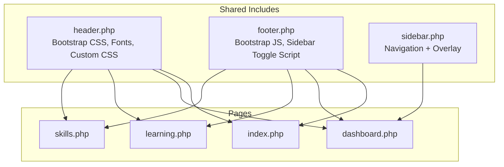
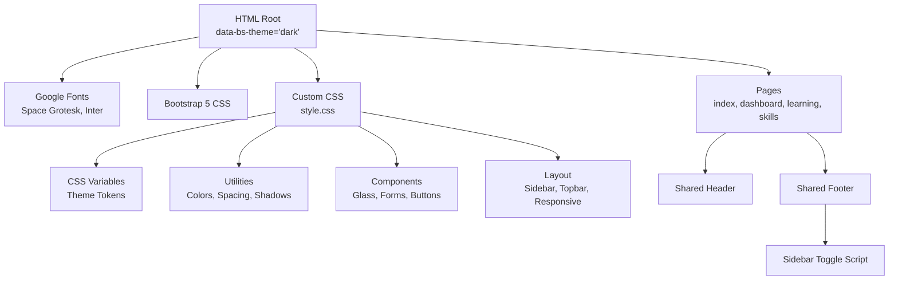
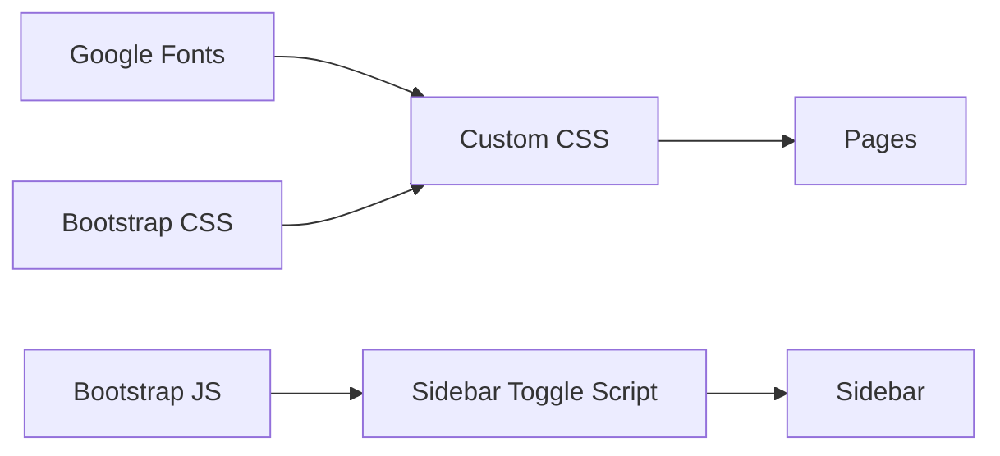

# Responsive Design & Styling System

<cite>
**Referenced Files in This Document**
- [style.css](file://frontend-php/css/style.css)
- [header.php](file://frontend-php/includes/header.php)
- [footer.php](file://frontend-php/includes/footer.php)
- [sidebar.php](file://frontend-php/includes/sidebar.php)
- [index.php](file://frontend-php/index.php)
- [dashboard.php](file://frontend-php/dashboard.php)
- [learning.php](file://frontend-php/learning.php)
- [skills.php](file://frontend-php/skills.php)
</cite>

## Table of Contents
1. [Introduction](#introduction)
2. [Project Structure](#project-structure)
3. [Core Components](#core-components)
4. [Architecture Overview](#architecture-overview)
5. [Detailed Component Analysis](#detailed-component-analysis)
6. [Dependency Analysis](#dependency-analysis)
7. [Performance Considerations](#performance-considerations)
8. [Troubleshooting Guide](#troubleshooting-guide)
9. [Conclusion](#conclusion)

## Introduction
This document describes the Octal Foundry responsive design and styling system. It explains how CSS custom properties manage themes, how Bootstrap 5 integrates with custom styles, how Material Symbols are integrated for iconography, and how responsive breakpoints are applied. It also covers the glass effect styling, gradient backgrounds, dark theme implementation, utility classes, spacing patterns, component styling consistency, responsive navigation, mobile-first design, cross-device compatibility, font loading strategy, icon integration, and performance optimization for styling assets.

## Project Structure
The styling system is organized around a shared header that loads fonts, Bootstrap 5, and custom CSS, a shared footer that loads Bootstrap’s JavaScript bundle and initializes sidebar interactions, and per-page templates that compose UI using Bootstrap utilities and custom classes.

**Diagram sources**
- [header.php](file://frontend-php/includes/header.php#L1-L71)
- [footer.php](file://frontend-php/includes/footer.php#L1-L31)
- [sidebar.php](file://frontend-php/includes/sidebar.php#L1-L81)
- [index.php](file://frontend-php/index.php#L1-L174)
- [dashboard.php](file://frontend-php/dashboard.php#L1-L279)
- [learning.php](file://frontend-php/learning.php#L1-L215)
- [skills.php](file://frontend-php/skills.php#L1-L189)

**Section sources**
- [header.php](file://frontend-php/includes/header.php#L1-L71)
- [footer.php](file://frontend-php/includes/footer.php#L1-L31)
- [sidebar.php](file://frontend-php/includes/sidebar.php#L1-L81)
- [index.php](file://frontend-php/index.php#L1-L174)
- [dashboard.php](file://frontend-php/dashboard.php#L1-L279)
- [learning.php](file://frontend-php/learning.php#L1-L215)
- [skills.php](file://frontend-php/skills.php#L1-L189)

## Core Components
- Theme management via CSS custom properties and Bootstrap 5 theme switching
- Bootstrap 5 integration with custom overrides and utility classes
- Material Symbols iconography for consistent icons
- Glass effect styling and gradient backgrounds
- Dark theme implementation with consistent color tokens
- Utility classes for spacing, colors, shadows, and rounded corners
- Responsive navigation patterns with mobile-first approach

**Section sources**
- [style.css](file://frontend-php/css/style.css#L1-L289)
- [header.php](file://frontend-php/includes/header.php#L2-L2)
- [footer.php](file://frontend-php/includes/footer.php#L8-L28)

## Architecture Overview
The front-end architecture separates concerns:
- Shared header injects fonts, Bootstrap CSS, and custom CSS
- Shared footer injects Bootstrap JS and initializes sidebar toggling
- Per-page templates assemble UI using Bootstrap utilities and custom classes
- Custom CSS defines theme tokens, utilities, components, and responsive rules

**Diagram sources**
- [header.php](file://frontend-php/includes/header.php#L2-L18)
- [style.css](file://frontend-php/css/style.css#L1-L289)
- [footer.php](file://frontend-php/includes/footer.php#L8-L28)

## Detailed Component Analysis

### Theme Management with CSS Custom Properties
- CSS custom properties define primary colors, background tokens, and Bootstrap body tokens
- Bootstrap body tokens are mapped to theme tokens for consistent theming across components
- The HTML root sets the Bootstrap theme to dark, ensuring components adopt dark variants

Key tokens and mappings:
- Primary brand colors: blue and orange
- Background palette: dark, darker, and card dark
- Text palette: slate gray for secondary text
- Bootstrap body background and color mapped to theme tokens

Implementation highlights:
- Theme tokens defined at root scope
- Bootstrap body tokens mapped to theme tokens
- Consistent usage across components and pages

**Section sources**
- [style.css](file://frontend-php/css/style.css#L1-L11)
- [header.php](file://frontend-php/includes/header.php#L2-L2)

### Bootstrap 5 Integration Patterns
- Bootstrap CSS loaded from CDN
- Custom CSS layered after Bootstrap to override defaults
- Bootstrap utilities used extensively for layout, spacing, and responsive behavior
- Custom overrides for form controls and progress bars

Integration patterns:
- Utility classes for layout and alignment
- Component classes for cards, buttons, badges, and progress bars
- Custom overrides for form controls and progress bar styling

**Section sources**
- [header.php](file://frontend-php/includes/header.php#L14-L18)
- [style.css](file://frontend-php/css/style.css#L100-L113)
- [style.css](file://frontend-php/css/style.css#L282-L288)

### Material Symbols Iconography
- Material Symbols Outlined and Filled variants are supported
- Icons are integrated via Google Fonts stylesheet
- Icons are used consistently across navigation, buttons, and interactive elements

Iconography patterns:
- Outlined icons for standard actions
- Filled icons for active states or emphasis
- Inline sizing and vertical alignment adjustments

**Section sources**
- [header.php](file://frontend-php/includes/header.php#L12-L12)
- [style.css](file://frontend-php/css/style.css#L89-L97)

### Glass Effect Styling
- Glass effect achieved with semi-transparent backgrounds, backdrop blur, and thin borders
- Panels use subtle borders and reduced opacity for depth
- Used in top bars, bottom navigation, and chat-like panels

Glass components:
- Glass effect base class for translucent backgrounds
- Glass panel variant for content areas
- Applied to top bars, bottom navigation, and AI coach bubbles

**Section sources**
- [style.css](file://frontend-php/css/style.css#L39-L50)

### Gradient Backgrounds and Visual Effects
- Linear gradients used for hero sections and career prediction cards
- Drop shadows and blur effects enhance depth and focus
- Radial and abstract glows support visual hierarchy

Gradient usage:
- Career prediction card with blue-to-orange gradient
- Abstract glow behind content for depth
- Linear gradient overlays on media players

**Section sources**
- [skills.php](file://frontend-php/skills.php#L100-L121)
- [learning.php](file://frontend-php/learning.php#L30-L30)
- [skills.php](file://frontend-php/skills.php#L120-L120)

### Dark Theme Implementation
- HTML root sets Bootstrap dark theme
- Custom CSS variables mirror Bootstrap body tokens
- Consistent color tokens across components and pages
- Form controls and inputs styled for dark theme

Dark theme patterns:
- Body background and text color mapped to theme tokens
- Form controls styled with dark variants
- Borders and opacities adjusted for contrast

**Section sources**
- [header.php](file://frontend-php/includes/header.php#L2-L2)
- [style.css](file://frontend-php/css/style.css#L7-L11)
- [style.css](file://frontend-php/css/style.css#L100-L113)

### Utility Class System and Spacing Patterns
- Utility classes for colors, shadows, rounded corners, and scroll behavior
- Consistent spacing using Bootstrap utilities
- Typography utilities for font families and weights

Utility patterns:
- Color utilities for primary and accent colors
- Shadow utilities for glow effects
- Rounded utilities for modern UI
- Scrollbar hiding for clean layouts

**Section sources**
- [style.css](file://frontend-php/css/style.css#L52-L87)
- [style.css](file://frontend-php/css/style.css#L19-L24)

### Component Styling Consistency
- Cards, buttons, badges, and progress bars styled consistently
- Active states and hover effects unified
- Consistent typography and spacing across components

Component patterns:
- Card styling with dark backgrounds and borders
- Button variants for primary and outline actions
- Badge styling for status and metadata
- Progress bars with rounded edges

**Section sources**
- [style.css](file://frontend-php/css/style.css#L69-L75)
- [style.css](file://frontend-php/css/style.css#L250-L271)
- [style.css](file://frontend-php/css/style.css#L282-L288)

### Responsive Navigation and Mobile-First Design
- Sidebar navigation with mobile overlay and toggle
- Responsive breakpoints for sidebar visibility and collapse
- Mobile bottom navigation bar with Material Symbols
- Sticky headers and top bars for consistent navigation

Responsive patterns:
- Sidebar hidden by default on small screens
- Sidebar slides in with overlay on toggle
- Desktop sidebar always visible with optional collapse
- Bottom navigation bar fixed at the bottom on small screens

**Section sources**
- [sidebar.php](file://frontend-php/includes/sidebar.php#L1-L81)
- [footer.php](file://frontend-php/includes/footer.php#L8-L28)
- [style.css](file://frontend-php/css/style.css#L203-L233)
- [index.php](file://frontend-php/index.php#L153-L171)

### Cross-Device Compatibility
- Preconnect and preloaded fonts for fast rendering
- Bootstrap responsive utilities for device adaptation
- Fixed positioning for bottom navigation on small screens
- Aspect-ratio and container utilities for consistent layouts

Compatibility patterns:
- Font preloading for Space Grotesk and Inter
- Bootstrap grid and utility classes for responsiveness
- Fixed bottom navigation for touch-friendly access

**Section sources**
- [header.php](file://frontend-php/includes/header.php#L8-L12)
- [index.php](file://frontend-php/index.php#L153-L171)

### Font Loading Strategy
- Fonts loaded via Google Fonts with preconnect for performance
- Two font families used: Space Grotesk for display and Inter for body
- Font-display utilities for consistent typography

Font strategy:
- Preconnect and preload for fast font loading
- Separate families for display and body text
- Utility classes for consistent font selection

**Section sources**
- [header.php](file://frontend-php/includes/header.php#L8-L12)
- [style.css](file://frontend-php/css/style.css#L18-L24)

### Icon Integration
- Material Symbols integrated via Google Fonts stylesheet
- Outlined and filled variants for different states
- Consistent sizing and alignment across components

Icon patterns:
- Outlined icons for standard actions
- Filled icons for active states
- Vertical alignment adjustments for consistent baseline

**Section sources**
- [header.php](file://frontend-php/includes/header.php#L12-L12)
- [style.css](file://frontend-php/css/style.css#L89-L97)

### Performance Optimization for Styling Assets
- CDN-hosted Bootstrap CSS and JS for caching and global availability
- Minimal inline styles; heavy emphasis on reusable classes
- Efficient use of CSS custom properties to reduce duplication
- Preloaded fonts to minimize render-blocking

Optimization strategies:
- CDN delivery for Bootstrap assets
- Reusable utility and component classes
- CSS variables for centralized theme management
- Preloaded fonts for instant text rendering

**Section sources**
- [header.php](file://frontend-php/includes/header.php#L14-L18)
- [header.php](file://frontend-php/includes/header.php#L8-L12)
- [style.css](file://frontend-php/css/style.css#L1-L11)

## Dependency Analysis
The styling system depends on:
- Bootstrap 5 for layout utilities and component defaults
- Google Fonts for typography
- Custom CSS for theme tokens, utilities, and overrides
- JavaScript for sidebar toggle interactions

**Diagram sources**
- [header.php](file://frontend-php/includes/header.php#L8-L18)
- [footer.php](file://frontend-php/includes/footer.php#L8-L28)
- [style.css](file://frontend-php/css/style.css#L1-L289)

**Section sources**
- [header.php](file://frontend-php/includes/header.php#L8-L18)
- [footer.php](file://frontend-php/includes/footer.php#L8-L28)
- [style.css](file://frontend-php/css/style.css#L1-L289)

## Performance Considerations
- Prefer utility classes over inline styles to reduce CSS duplication
- Use CSS custom properties for theme tokens to minimize repaints
- Keep custom CSS minimal and scoped to avoid specificity wars
- Ensure images use appropriate sizes and formats for performance
- Leverage browser caching with CDN-hosted assets

[No sources needed since this section provides general guidance]

## Troubleshooting Guide
Common issues and resolutions:
- Icons not rendering: Verify Material Symbols stylesheet is loaded
- Sidebar not toggling: Confirm sidebar toggle script runs after DOMContentLoaded
- Fonts slow to load: Ensure preconnect and preload directives are present
- Dark theme inconsistencies: Check that Bootstrap theme is set and CSS variables are defined

**Section sources**
- [header.php](file://frontend-php/includes/header.php#L12-L12)
- [footer.php](file://frontend-php/includes/footer.php#L8-L28)
- [header.php](file://frontend-php/includes/header.php#L8-L12)
- [style.css](file://frontend-php/css/style.css#L1-L11)

## Conclusion
Octal Foundry’s styling system combines Bootstrap 5 utilities with a cohesive custom CSS layer. CSS custom properties centralize theming, Material Symbols provide consistent iconography, and glass effects plus gradients deliver modern visuals. The mobile-first approach with responsive breakpoints ensures cross-device compatibility, while performance optimizations keep the interface snappy. The utility class system and component styling patterns promote consistency across pages.