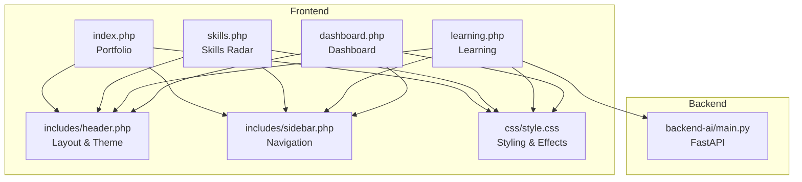
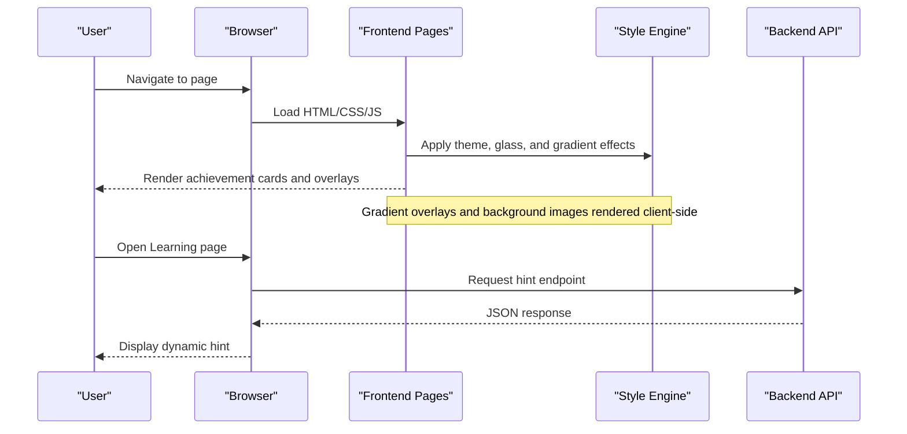
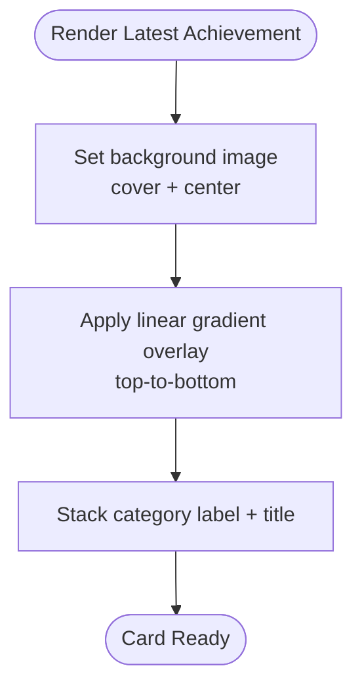
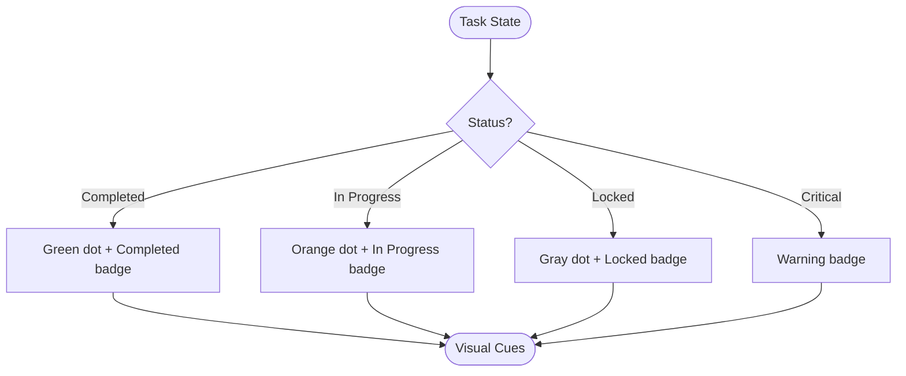
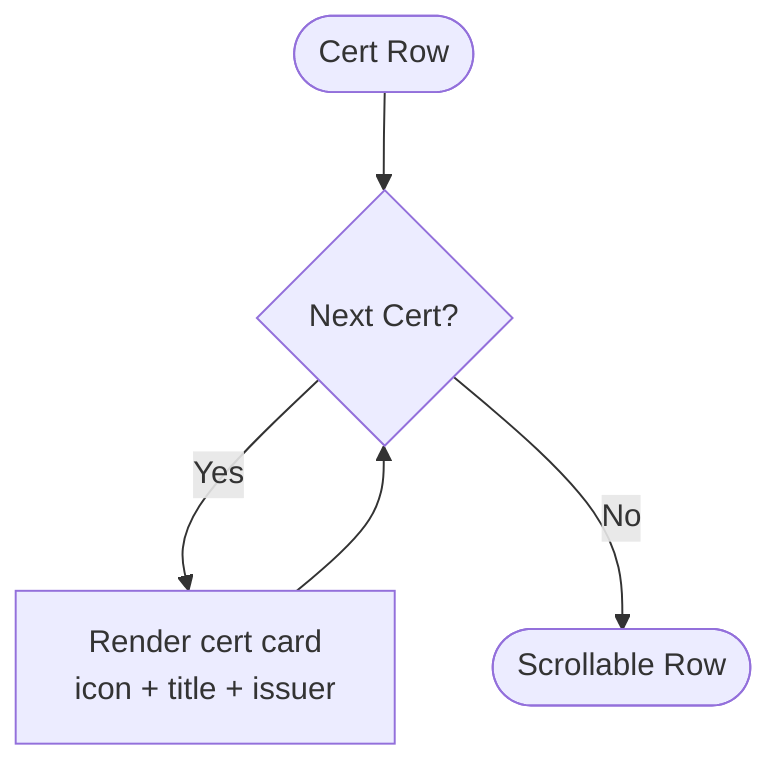
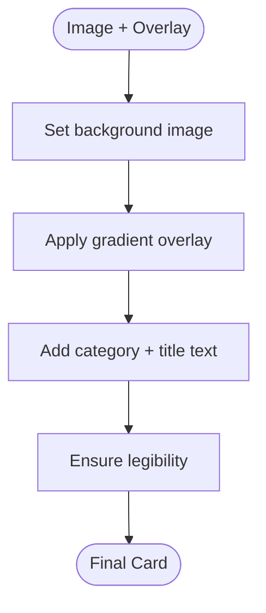
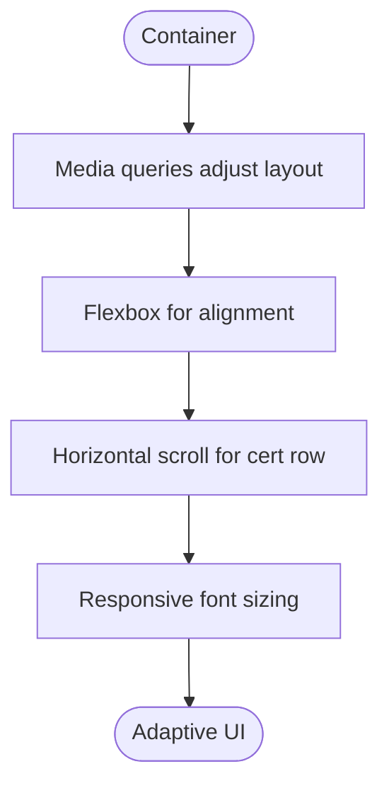
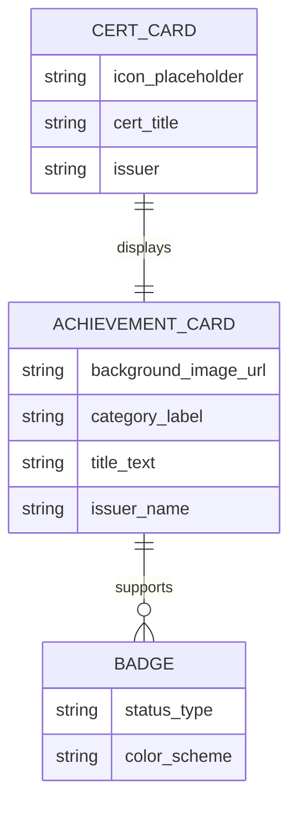
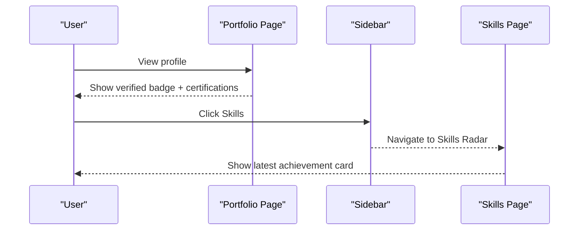
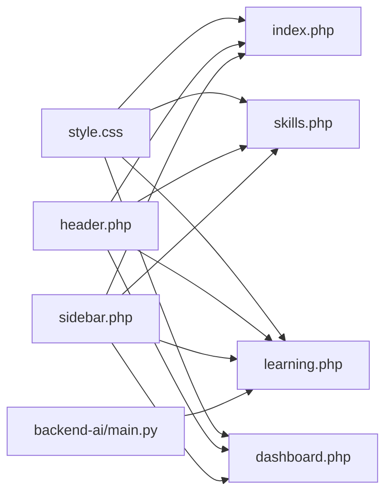

# Achievement Badges & Milestones

<cite>
**Referenced Files in This Document**
- [index.php](file://frontend-php/index.php)
- [skills.php](file://frontend-php/skills.php)
- [learning.php](file://frontend-php/learning.php)
- [dashboard.php](file://frontend-php/dashboard.php)
- [header.php](file://frontend-php/includes/header.php)
- [sidebar.php](file://frontend-php/includes/sidebar.php)
- [style.css](file://frontend-php/css/style.css)
- [main.py](file://backend-ai/main.py)
</cite>

## Table of Contents
1. [Introduction](#introduction)
2. [Project Structure](#project-structure)
3. [Core Components](#core-components)
4. [Architecture Overview](#architecture-overview)
5. [Detailed Component Analysis](#detailed-component-analysis)
6. [Dependency Analysis](#dependency-analysis)
7. [Performance Considerations](#performance-considerations)
8. [Troubleshooting Guide](#troubleshooting-guide)
9. [Conclusion](#conclusion)

## Introduction
This document explains the achievement system for displaying user milestones and certifications within the Octal Foundry platform. It focuses on:
- The latest achievement card with gradient overlays
- The milestone badge system
- The certification display format
- Image handling for achievement backgrounds
- Text overlay system with gradient effects
- Responsive design for achievement cards
- Achievement data structure and visual hierarchy
- Integration with user profile data
- Filtering and interaction patterns for viewing detailed achievement information

## Project Structure
The achievement system spans several frontend pages and shared styles:
- Portfolio page displays user profile and earned certifications
- Skills page showcases the latest achievement card with gradient overlay
- Learning page demonstrates media overlays and gradient text blocks
- Dashboard page includes badges and task statuses
- Shared styles define theme, glass effects, and typography
- Backend provides a simple API endpoint used by the learning page’s AI coach

**Diagram sources**
- [index.php](file://frontend-php/index.php#L1-L174)
- [skills.php](file://frontend-php/skills.php#L1-L189)
- [learning.php](file://frontend-php/learning.php#L1-L215)
- [dashboard.php](file://frontend-php/dashboard.php#L1-L279)
- [header.php](file://frontend-php/includes/header.php#L1-L71)
- [sidebar.php](file://frontend-php/includes/sidebar.php#L1-L81)
- [style.css](file://frontend-php/css/style.css#L1-L289)
- [main.py](file://backend-ai/main.py#L1-L30)

**Section sources**
- [index.php](file://frontend-php/index.php#L1-L174)
- [skills.php](file://frontend-php/skills.php#L1-L189)
- [learning.php](file://frontend-php/learning.php#L1-L215)
- [dashboard.php](file://frontend-php/dashboard.php#L1-L279)
- [header.php](file://frontend-php/includes/header.php#L1-L71)
- [sidebar.php](file://frontend-php/includes/sidebar.php#L1-L81)
- [style.css](file://frontend-php/css/style.css#L1-L289)
- [main.py](file://backend-ai/main.py#L1-L30)

## Core Components
- Latest achievement card with gradient overlay: A horizontally oriented card showing a background image with a top-to-bottom gradient overlay and two-line text stack (category label and title).
- Milestone badge system: Status badges indicating completion, in-progress, locked, and critical tasks, styled consistently with color-coded backgrounds and opacities.
- Certification display: Horizontal scrollable row of certification cards with icon placeholders, institution names, and compact typography.
- Image handling: Background images applied via inline styles with cover and center positioning; gradient overlays layered via pseudo-layers.
- Text overlay system: Gradient overlays implemented with CSS linear gradients to create readable text against varied background images.
- Responsive design: Flexbox and grid layouts adapt to mobile and desktop breakpoints; horizontal scrolling for certification rows.

**Section sources**
- [skills.php](file://frontend-php/skills.php#L155-L165)
- [dashboard.php](file://frontend-php/dashboard.php#L222-L273)
- [index.php](file://frontend-php/index.php#L109-L134)
- [style.css](file://frontend-php/css/style.css#L1-L289)

## Architecture Overview
The achievement system is primarily client-rendered with minimal backend integration:
- Frontend pages render achievement visuals using shared CSS utilities and theme variables.
- The learning page integrates with a backend service to fetch hints, demonstrating a pattern for dynamic content retrieval.
- Navigation and layout are centralized in shared includes.

**Diagram sources**
- [skills.php](file://frontend-php/skills.php#L155-L165)
- [learning.php](file://frontend-php/learning.php#L177-L212)
- [main.py](file://backend-ai/main.py#L23-L29)

## Detailed Component Analysis

### Latest Achievement Card with Gradient Overlay
- Purpose: Highlight the most recent milestone with a visually rich card.
- Implementation:
  - Background image set via inline style with cover and center positioning.
  - Gradient overlay uses a top-to-bottom linear gradient to darken the background and improve text legibility.
  - Typography: Category label and title placed at the bottom for emphasis.
- Visual hierarchy:
  - Background image anchors the card.
  - Gradient overlay ensures contrast for text.
  - Text is stacked vertically for readability.
- Responsiveness:
  - Fixed height with width-based layout; gradient overlay adapts to container size.

**Diagram sources**
- [skills.php](file://frontend-php/skills.php#L158-L164)

**Section sources**
- [skills.php](file://frontend-php/skills.php#L155-L165)

### Milestone Badge System
- Purpose: Communicate task and unit progress states.
- Implementation:
  - Completion: Green circle + "Completed" badge.
  - In-progress: Orange circle + "In Progress" badge.
  - Locked: Gray circle + "Locked" badge.
  - Critical: Warning-colored badge for task urgency.
- Styling:
  - Consistent dot indicators and badge backgrounds with opacity variants.
  - Color-coded text and borders for semantic meaning.

**Diagram sources**
- [dashboard.php](file://frontend-php/dashboard.php#L224-L273)

**Section sources**
- [dashboard.php](file://frontend-php/dashboard.php#L222-L273)

### Certification Display Format
- Purpose: Showcase earned certifications in a compact, scrollable format.
- Implementation:
  - Horizontal row with fixed-width cards and reduced font sizes.
  - Icon placeholder circles with primary blue tint.
  - Institution names displayed beneath titles.
- Interaction:
  - Horizontal scrolling allows viewing multiple certs on small screens.

**Diagram sources**
- [index.php](file://frontend-php/index.php#L109-L134)

**Section sources**
- [index.php](file://frontend-php/index.php#L109-L134)

### Image Handling and Gradient Overlays
- Background images:
  - Applied via inline styles with cover and center positioning to fill the card area.
- Gradient overlays:
  - Implemented using CSS linear gradients to create readable text against varying background images.
- Typography:
  - Category labels use uppercase and tight tracking; titles use bold weight.

**Diagram sources**
- [skills.php](file://frontend-php/skills.php#L158-L164)

**Section sources**
- [skills.php](file://frontend-php/skills.php#L155-L165)

### Responsive Design for Achievement Cards
- Layout:
  - Flexbox and grid layouts adapt to different screen sizes.
  - Horizontal scrolling for certification rows prevents overflow on small screens.
- Typography scaling:
  - Font sizes adjusted for mobile and desktop contexts.
- Glass and backdrop effects:
  - Used for overlays and panels to maintain depth and readability.

**Diagram sources**
- [style.css](file://frontend-php/css/style.css#L1-L289)
- [index.php](file://frontend-php/index.php#L109-L134)

**Section sources**
- [style.css](file://frontend-php/css/style.css#L1-L289)
- [index.php](file://frontend-php/index.php#L109-L134)

### Achievement Data Structure and Visual Hierarchy
- Data structure patterns:
  - Background image URL
  - Category label (milestone/certification)
  - Title text
  - Optional issuer/institution
- Visual hierarchy:
  - Background image anchors the card.
  - Gradient overlay ensures text contrast.
  - Stacked text emphasizes category and title.
  - Icons and badges provide supplementary context.

**Diagram sources**
- [skills.php](file://frontend-php/skills.php#L155-L165)
- [dashboard.php](file://frontend-php/dashboard.php#L222-L273)
- [index.php](file://frontend-php/index.php#L109-L134)

**Section sources**
- [skills.php](file://frontend-php/skills.php#L155-L165)
- [dashboard.php](file://frontend-php/dashboard.php#L222-L273)
- [index.php](file://frontend-php/index.php#L109-L134)

### Integration with User Profile Data
- Profile page integrates achievements alongside personal branding:
  - Verified badge and premium verification highlight identity.
  - Earned certifications displayed in a dedicated horizontal row.
- Navigation:
  - Sidebar links connect portfolio, learning, and skills pages, enabling seamless access to achievement-centric views.

**Diagram sources**
- [index.php](file://frontend-php/index.php#L25-L49)
- [index.php](file://frontend-php/index.php#L109-L134)
- [sidebar.php](file://frontend-php/includes/sidebar.php#L48-L58)
- [skills.php](file://frontend-php/skills.php#L155-L165)

**Section sources**
- [index.php](file://frontend-php/index.php#L25-L49)
- [index.php](file://frontend-php/index.php#L109-L134)
- [sidebar.php](file://frontend-php/includes/sidebar.php#L48-L58)
- [skills.php](file://frontend-php/skills.php#L155-L165)

### Achievement Filtering and Interaction
- Filtering:
  - Not implemented in the current codebase; visual states (completed, in-progress, locked) are static.
- Interaction:
  - Latest achievement card is presentational; no click-to-details behavior is shown.
  - Certifications are displayed as static cards; no filtering controls are present.
- Suggested enhancements:
  - Add tabbed views for milestones vs. certifications.
  - Implement interactive overlays or modals for detailed achievement info.
  - Introduce filters by date, category, or issuer.

[No sources needed since this section provides general guidance]

### User Interaction for Viewing Detailed Achievement Information
- Current behavior:
  - Static rendering of achievement cards and overlays.
- Recommended patterns:
  - Click handlers to expand details or open modals.
  - Hover states to reveal secondary actions (e.g., share, download).
  - Keyboard navigation support for accessibility.

[No sources needed since this section provides general guidance]

## Dependency Analysis
- Frontend dependencies:
  - Shared CSS defines theme variables, glass effects, and typography.
  - Includes centralize layout and navigation.
- Backend dependency:
  - Learning page consumes a backend endpoint for dynamic hints, demonstrating a pattern for integrating achievement-related data retrieval.

**Diagram sources**
- [style.css](file://frontend-php/css/style.css#L1-L289)
- [index.php](file://frontend-php/index.php#L1-L174)
- [skills.php](file://frontend-php/skills.php#L1-L189)
- [learning.php](file://frontend-php/learning.php#L1-L215)
- [dashboard.php](file://frontend-php/dashboard.php#L1-L279)
- [header.php](file://frontend-php/includes/header.php#L1-L71)
- [sidebar.php](file://frontend-php/includes/sidebar.php#L1-L81)
- [main.py](file://backend-ai/main.py#L1-L30)

**Section sources**
- [style.css](file://frontend-php/css/style.css#L1-L289)
- [header.php](file://frontend-php/includes/header.php#L1-L71)
- [sidebar.php](file://frontend-php/includes/sidebar.php#L1-L81)
- [main.py](file://backend-ai/main.py#L1-L30)

## Performance Considerations
- Background images:
  - Use appropriately sized assets to minimize bandwidth and rendering cost.
  - Lazy-load images if the number of achievement cards increases.
- Gradients and overlays:
  - Keep gradient definitions concise; avoid excessive repaints by reusing common color tokens.
- Layout:
  - Prefer transform-based animations for smoother interactions.
  - Minimize DOM nesting for achievement cards to reduce layout thrashing.

[No sources needed since this section provides general guidance]

## Troubleshooting Guide
- Gradient text not visible:
  - Verify the gradient overlay’s color contrast against the background image.
  - Ensure the overlay covers the entire text area.
- Images not filling the card:
  - Confirm background-size is set to cover and background-position is centered.
- Mobile layout issues:
  - Test horizontal scrolling for certification rows on small screens.
  - Adjust font sizes and spacing for smaller viewports.
- Dynamic content not loading:
  - Check CORS settings and endpoint availability when integrating backend data.

**Section sources**
- [skills.php](file://frontend-php/skills.php#L158-L164)
- [index.php](file://frontend-php/index.php#L109-L134)
- [main.py](file://backend-ai/main.py#L6-L17)

## Conclusion
The Octal Foundry achievement system currently emphasizes visual presentation with gradient overlays, consistent milestone badges, and compact certification displays. While the current implementation is static, the established patterns enable straightforward extension for filtering, interactivity, and backend integration. By leveraging shared styles and modular includes, future enhancements can scale efficiently while maintaining visual coherence.