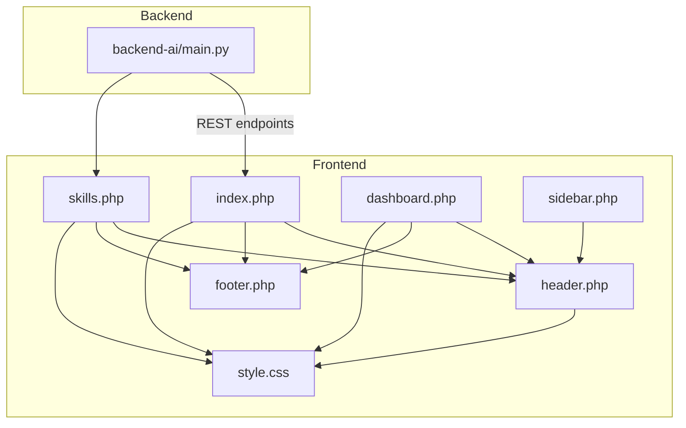
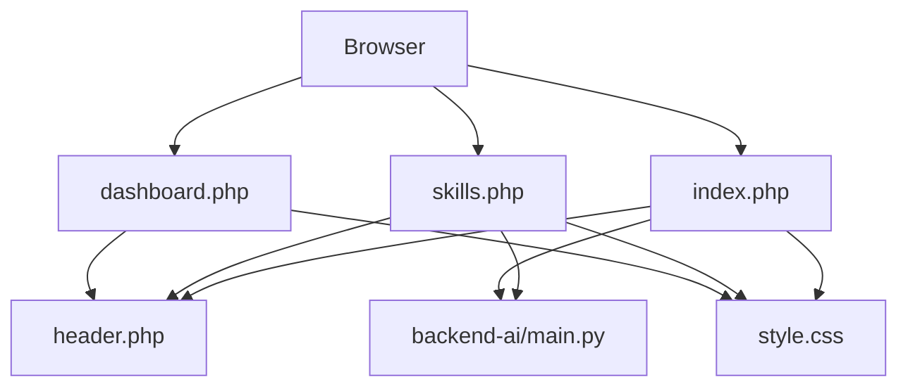
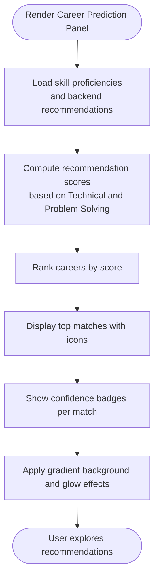
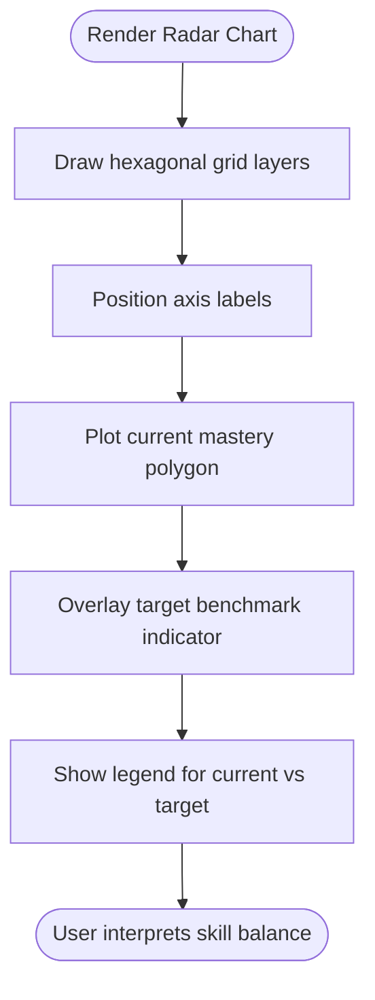
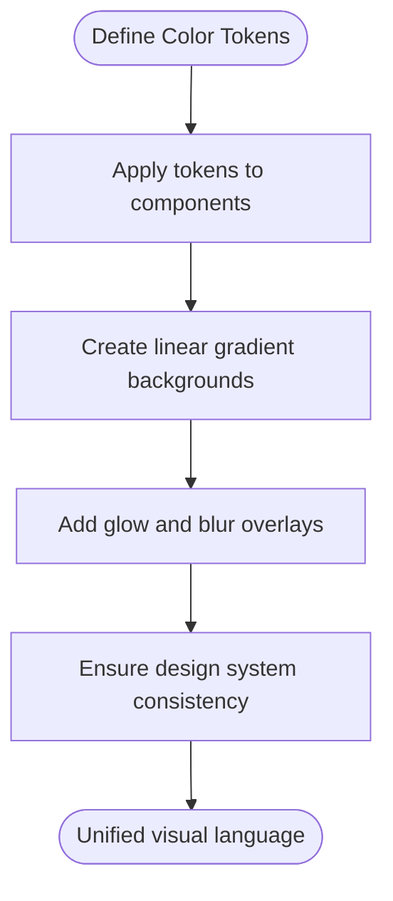
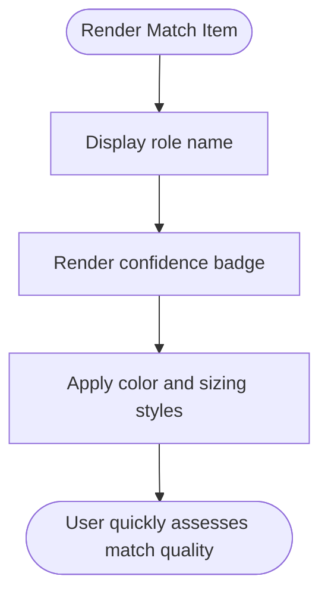
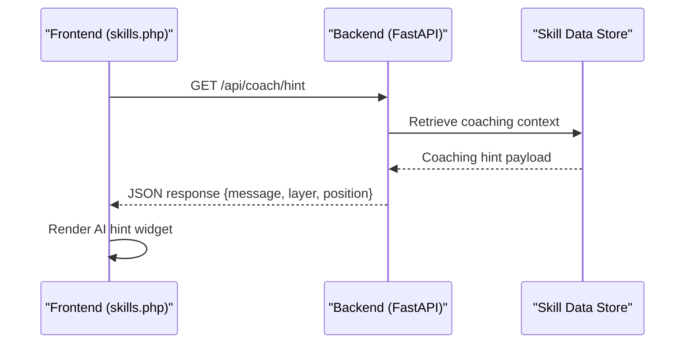
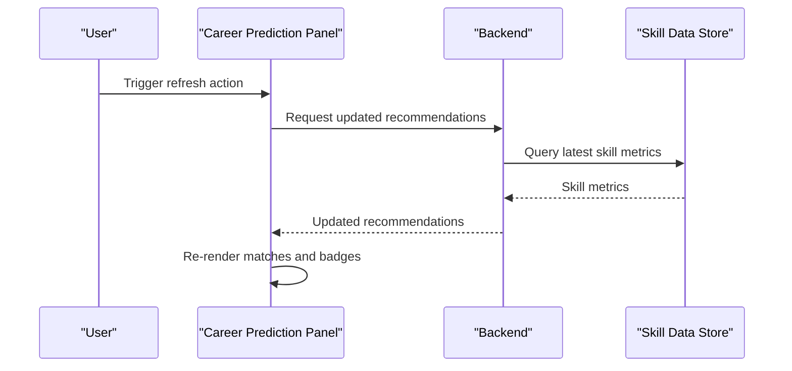
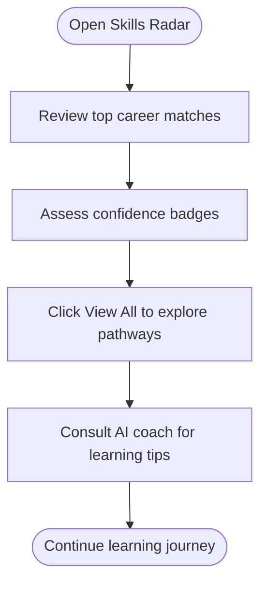
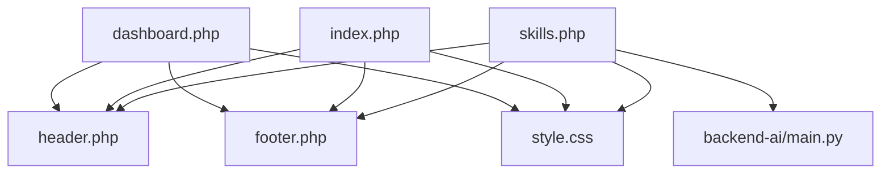

# Career Prediction System

<cite>
**Referenced Files in This Document**
- [index.php](file://frontend-php/index.php)
- [skills.php](file://frontend-php/skills.php)
- [dashboard.php](file://frontend-php/dashboard.php)
- [header.php](file://frontend-php/includes/header.php)
- [footer.php](file://frontend-php/includes/footer.php)
- [sidebar.php](file://frontend-php/includes/sidebar.php)
- [style.css](file://frontend-php/css/style.css)
- [main.py](file://backend-ai/main.py)
</cite>

## Table of Contents
1. [Introduction](#introduction)
2. [Project Structure](#project-structure)
3. [Core Components](#core-components)
4. [Architecture Overview](#architecture-overview)
5. [Detailed Component Analysis](#detailed-component-analysis)
6. [Dependency Analysis](#dependency-analysis)
7. [Performance Considerations](#performance-considerations)
8. [Troubleshooting Guide](#troubleshooting-guide)
9. [Conclusion](#conclusion)

## Introduction
This document describes the AI career prediction system implemented in the Octal Foundry platform. It focuses on how the system presents career recommendations derived from skill proficiencies in Technical and Problem Solving domains, how confidence scores are visualized via badges, and how the UI conveys gradient backgrounds and career pathway cues. It also outlines the integration points with backend skill data, mechanisms for real-time recommendation updates, and user interaction patterns for exploring career options.

## Project Structure
The system comprises:
- Frontend pages built with PHP and styled with custom CSS
- A responsive UI with navigation, dashboards, and skill visualization
- A minimal backend service exposing REST endpoints for AI coaching hints and future career prediction APIs

**Diagram sources**
- [index.php](file://frontend-php/index.php#L1-L174)
- [skills.php](file://frontend-php/skills.php#L1-L189)
- [dashboard.php](file://frontend-php/dashboard.php#L1-L279)
- [header.php](file://frontend-php/includes/header.php#L1-L71)
- [footer.php](file://frontend-php/includes/footer.php#L1-L31)
- [sidebar.php](file://frontend-php/includes/sidebar.php#L1-L81)
- [style.css](file://frontend-php/css/style.css#L1-L289)
- [main.py](file://backend-ai/main.py#L1-L30)

**Section sources**
- [index.php](file://frontend-php/index.php#L1-L174)
- [skills.php](file://frontend-php/skills.php#L1-L189)
- [dashboard.php](file://frontend-php/dashboard.php#L1-L279)
- [header.php](file://frontend-php/includes/header.php#L1-L71)
- [footer.php](file://frontend-php/includes/footer.php#L1-L31)
- [sidebar.php](file://frontend-php/includes/sidebar.php#L1-L81)
- [style.css](file://frontend-php/css/style.css#L1-L289)
- [main.py](file://backend-ai/main.py#L1-L30)

## Core Components
- Career Prediction Panel: Displays recommended careers based on Technical and Problem Solving skill proficiencies, with confidence badges and gradient background effects.
- Skills Radar: Visualizes six axes including Technical Proficiency, Problem Solving, Theory Knowledge, Practical, Soft Skills, and Analytical, with current mastery and target benchmark indicators.
- Gradient Background Effects: Uses layered radial and linear gradients to emphasize key insights and create a modern, immersive UI.
- Badge System: Confidence scores are shown as compact badges with distinct colors and typography for readability.
- Career Pathway Visualization: The panel highlights top matches and provides a “View All” affordance for deeper exploration.
- Backend Integration Points: REST endpoints for AI hints and placeholders for future career prediction APIs.

**Section sources**
- [skills.php](file://frontend-php/skills.php#L98-L122)
- [skills.php](file://frontend-php/skills.php#L20-L56)
- [style.css](file://frontend-php/css/style.css#L26-L50)
- [style.css](file://frontend-php/css/style.css#L61-L67)
- [main.py](file://backend-ai/main.py#L19-L30)

## Architecture Overview
The system follows a client-server pattern:
- Frontend pages render the UI and present career recommendations and skill visuals.
- Backend exposes REST endpoints for AI assistance and can be extended to serve career prediction data.
- The skills page integrates a radar chart and a career prediction panel with gradient backgrounds and badges.

**Diagram sources**
- [index.php](file://frontend-php/index.php#L1-L174)
- [skills.php](file://frontend-php/skills.php#L1-L189)
- [dashboard.php](file://frontend-php/dashboard.php#L1-L279)
- [header.php](file://frontend-php/includes/header.php#L1-L71)
- [style.css](file://frontend-php/css/style.css#L1-L289)
- [main.py](file://backend-ai/main.py#L1-L30)

## Detailed Component Analysis

### Career Prediction Panel
- Purpose: Presents AI-derived career recommendations aligned with Technical and Problem Solving skill strengths.
- Presentation:
  - Gradient background effect achieved via layered filters and linear gradients.
  - Recommendation items are presented as pill-shaped containers with embedded confidence badges.
  - Icons accompany each recommendation to visually distinguish roles.
- Interaction: Includes a “View All” link to explore broader pathways.

**Diagram sources**
- [skills.php](file://frontend-php/skills.php#L98-L122)

**Section sources**
- [skills.php](file://frontend-php/skills.php#L98-L122)

### Skills Radar Visualization
- Purpose: Visualize six-dimensional skill proficiencies with axes labeled for Technical Proficiency, Problem Solving, Theory Knowledge, Practical, Soft Skills, and Analytical.
- Presentation:
  - Hexagonal grid created via clip-path polygons.
  - Current mastery and target benchmark represented by colored markers and progress bars.
  - Labels positioned around the radar to indicate each axis.
- Interaction: Provides a contextual view of strengths and gaps to inform career decisions.

**Diagram sources**
- [skills.php](file://frontend-php/skills.php#L20-L56)

**Section sources**
- [skills.php](file://frontend-php/skills.php#L20-L56)

### Gradient Background Effects and Visual Design
- Purpose: Enhance perceived importance of insights and create a cohesive visual theme.
- Implementation:
  - Linear gradients for the Career Prediction panel background.
  - Glowing effects via backdrop blur and translucent circles.
  - Consistent color tokens for primary blue and orange accents.

**Diagram sources**
- [style.css](file://frontend-php/css/style.css#L1-L11)
- [style.css](file://frontend-php/css/style.css#L26-L50)
- [style.css](file://frontend-php/css/style.css#L69-L75)

**Section sources**
- [style.css](file://frontend-php/css/style.css#L1-L11)
- [style.css](file://frontend-php/css/style.css#L26-L50)
- [style.css](file://frontend-php/css/style.css#L69-L75)

### Badge System for Confidence Scores
- Purpose: Communicate recommendation confidence succinctly.
- Implementation:
  - Compact badges with numeric percentages.
  - Distinct colors for primary and secondary matches.
  - Typography and sizing optimized for readability.

**Diagram sources**
- [skills.php](file://frontend-php/skills.php#L108-L117)

**Section sources**
- [skills.php](file://frontend-php/skills.php#L108-L117)

### Backend Integration Points
- Current endpoints:
  - Root endpoint confirms backend availability.
  - AI coach hint endpoint returns a targeted suggestion for model improvements.
- Future extension:
  - Add endpoints to fetch skill data and compute career recommendations.
  - Expose recommendation scoring and pathway metadata.

**Diagram sources**
- [main.py](file://backend-ai/main.py#L19-L30)
- [skills.php](file://frontend-php/skills.php#L124-L153)

**Section sources**
- [main.py](file://backend-ai/main.py#L1-L30)
- [skills.php](file://frontend-php/skills.php#L124-L153)

### Real-Time Recommendation Updates
- Mechanism: The UI currently renders static recommendations. To enable real-time updates:
  - Fetch latest skill data from backend endpoints.
  - Recalculate recommendation scores client-side or via backend.
  - Re-render the Career Prediction Panel with new matches and confidence badges.

**Diagram sources**
- [skills.php](file://frontend-php/skills.php#L98-L122)
- [main.py](file://backend-ai/main.py#L19-L30)

**Section sources**
- [skills.php](file://frontend-php/skills.php#L98-L122)
- [main.py](file://backend-ai/main.py#L19-L30)

### User Interaction Patterns for Exploring Career Options
- Navigation:
  - Use the bottom navigation bar to switch between Home, Radar, Jobs, and Profile.
  - Access the Skills Radar from the dashboard or profile tabs.
- Exploration:
  - Review top matches and confidence badges.
  - Click “View All” to access broader career pathways.
  - Interact with AI coach hints for focused learning tips.

**Diagram sources**
- [skills.php](file://frontend-php/skills.php#L98-L122)
- [skills.php](file://frontend-php/skills.php#L168-L200)

**Section sources**
- [skills.php](file://frontend-php/skills.php#L98-L122)
- [skills.php](file://frontend-php/skills.php#L168-L200)

## Dependency Analysis
- Frontend dependencies:
  - Bootstrap 5 CSS for layout primitives.
  - Custom CSS for theming, glass effects, and gradient backgrounds.
  - PHP includes for header, footer, and sidebar composition.
- Backend dependencies:
  - FastAPI for lightweight REST service.
  - CORS middleware configured for development flexibility.

**Diagram sources**
- [skills.php](file://frontend-php/skills.php#L1-L189)
- [index.php](file://frontend-php/index.php#L1-L174)
- [dashboard.php](file://frontend-php/dashboard.php#L1-L279)
- [header.php](file://frontend-php/includes/header.php#L1-L71)
- [footer.php](file://frontend-php/includes/footer.php#L1-L31)
- [style.css](file://frontend-php/css/style.css#L1-L289)
- [main.py](file://backend-ai/main.py#L1-L30)

**Section sources**
- [header.php](file://frontend-php/includes/header.php#L14-L18)
- [style.css](file://frontend-php/css/style.css#L1-L289)
- [main.py](file://backend-ai/main.py#L1-L30)

## Performance Considerations
- Minimize reflows by avoiding frequent DOM manipulation in the Career Prediction Panel.
- Defer rendering of heavy visualizations until after initial page load.
- Cache backend responses for skill data to reduce latency during recommendation updates.
- Use CSS transforms and opacity changes for smooth animations instead of layout-affecting properties.

## Troubleshooting Guide
- If the Career Prediction Panel appears flat:
  - Verify gradient background styles are applied and color tokens are defined.
- If radar labels or polygons misalign:
  - Confirm clip-path shapes and absolute positioning are intact.
- If AI coach hints do not appear:
  - Ensure the backend endpoint is reachable and CORS settings permit requests.
- If navigation links are missing:
  - Check PHP include paths and ensure header and footer partials are present.

**Section sources**
- [style.css](file://frontend-php/css/style.css#L26-L50)
- [skills.php](file://frontend-php/skills.php#L20-L56)
- [main.py](file://backend-ai/main.py#L11-L17)

## Conclusion
The AI career prediction system combines a visually engaging UI with practical skill visualization to guide learners toward suitable career paths. The Career Prediction Panel, Skills Radar, gradient backgrounds, and badge system collectively communicate recommendation quality and direction. With backend integration points established, the system can evolve to support dynamic, real-time recommendations and deeper career pathway exploration.