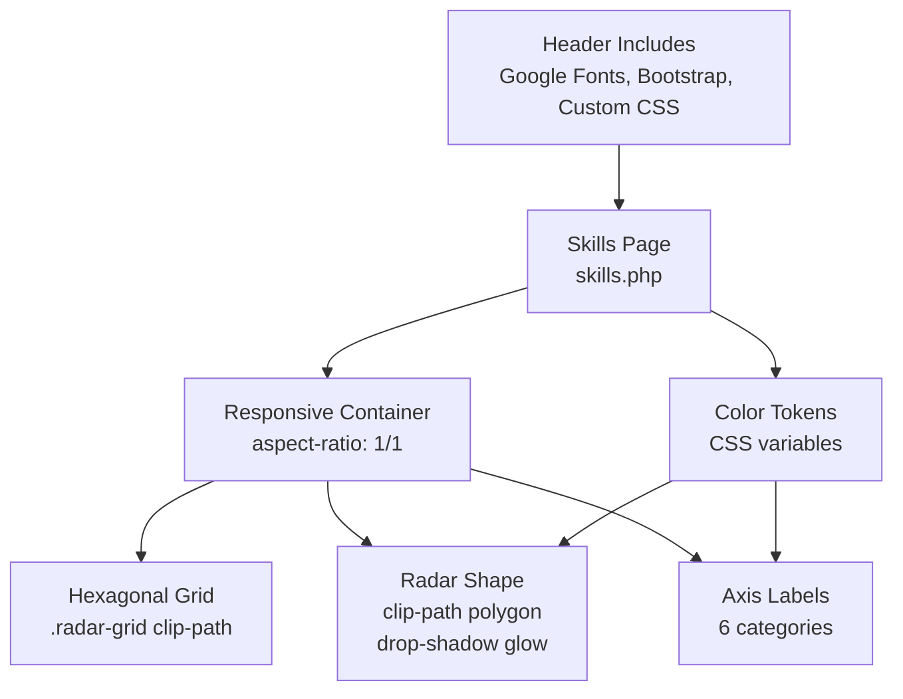
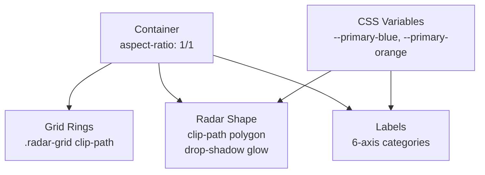
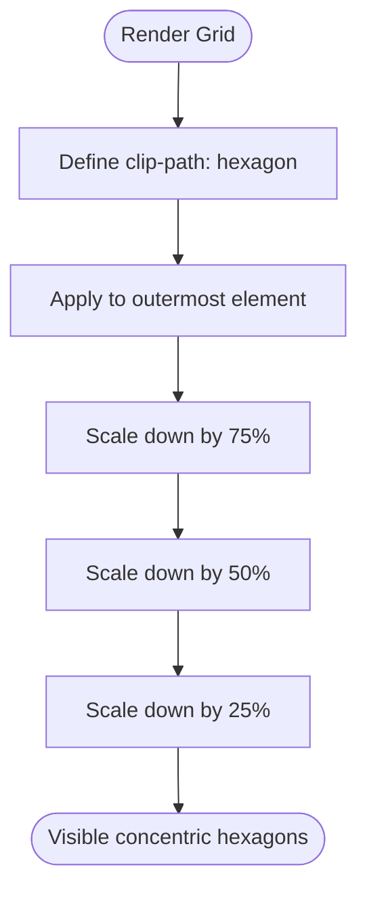
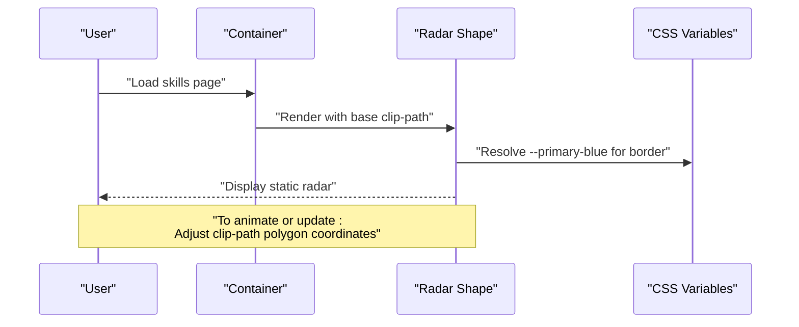
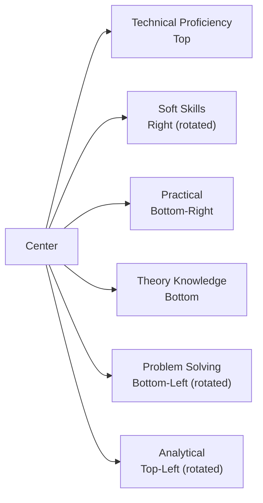
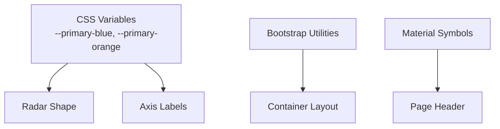

# Radar Chart Visualization

<cite>
**Referenced Files in This Document**
- [skills.php](file://frontend-php/skills.php)
- [style.css](file://frontend-php/css/style.css)
- [header.php](file://frontend-php/includes/header.php)
- [sidebar.php](file://frontend-php/includes/sidebar.php)
</cite>

## Table of Contents
1. [Introduction](#introduction)
2. [Project Structure](#project-structure)
3. [Core Components](#core-components)
4. [Architecture Overview](#architecture-overview)
5. [Detailed Component Analysis](#detailed-component-analysis)
6. [Dependency Analysis](#dependency-analysis)
7. [Performance Considerations](#performance-considerations)
8. [Troubleshooting Guide](#troubleshooting-guide)
9. [Conclusion](#conclusion)

## Introduction
This document explains the radar chart visualization system used in the skills assessment interface. It focuses on the hexagonal grid implementation using CSS clip-path polygons, the dynamic radar shape rendering with gradient backgrounds, and the six-axis skill categories. It also documents the CSS positioning system for labels, glow effects via drop-shadow filters, responsive aspect ratio maintenance, and the color coding system for current mastery versus target benchmark. Finally, it outlines the SVG-free implementation approach using pure CSS and provides performance optimization recommendations for smooth rendering.

## Project Structure
The radar chart is implemented within a PHP-driven frontend page and styled with a dedicated CSS stylesheet. The page includes a responsive container that maintains a square aspect ratio, a hexagonal grid composed of nested clip-path polygons, a glowing radar shape, and axis labels positioned around the perimeter.

**Diagram sources**
- [header.php](file://frontend-php/includes/header.php#L8-L18)
- [skills.php](file://frontend-php/skills.php#L21-L43)
- [style.css](file://frontend-php/css/style.css#L1-L11)

**Section sources**
- [header.php](file://frontend-php/includes/header.php#L8-L18)
- [skills.php](file://frontend-php/skills.php#L21-L43)
- [style.css](file://frontend-php/css/style.css#L1-L11)

## Core Components
- Responsive container with a 1:1 aspect ratio and maximum width constraint to ensure consistent sizing across devices.
- Hexagonal grid built from nested clip-path polygons to form concentric rings.
- Dynamic radar shape rendered as a clipped polygon with gradient-like background and border, simulating filled regions.
- Axis labels positioned absolutely around the container perimeter with rotation transforms to align text along axes.
- Color tokens for current mastery and target benchmark, enabling consistent theming.
- Glow effect applied via drop-shadow filter on the radar shape.

Key implementation references:
- Container and aspect ratio: [skills.php](file://frontend-php/skills.php#L21)
- Grid clip-path definition: [skills.php](file://frontend-php/skills.php#L24-L26)
- Nested grid rings: [skills.php](file://frontend-php/skills.php#L28-L31)
- Radar shape clip-path and glow: [skills.php](file://frontend-php/skills.php#L34-L35)
- Axis labels and color coding: [skills.php](file://frontend-php/skills.php#L38-L43)
- Color tokens: [style.css](file://frontend-php/css/style.css#L1-L11)

**Section sources**
- [skills.php](file://frontend-php/skills.php#L21-L43)
- [style.css](file://frontend-php/css/style.css#L1-L11)

## Architecture Overview
The radar visualization is a pure CSS/SVG-free composition:
- The container establishes layout and aspect ratio.
- The grid is constructed using clip-path polygons to create a hexagonal ring pattern.
- The radar shape overlays a clipped polygon whose vertices are adjusted to reflect skill scores.
- Labels are positioned absolutely and rotated to align with axes.
- Drop-shadow filter provides a soft glow effect around the radar shape.

**Diagram sources**
- [skills.php](file://frontend-php/skills.php#L21-L43)
- [style.css](file://frontend-php/css/style.css#L1-L11)

## Detailed Component Analysis

### Hexagonal Grid Implementation with CSS Clip-Path
The hexagonal grid is created by applying a clip-path polygon to multiple nested divs. Each ring reduces in size to produce concentric hexagons. The clip-path value defines a six-point polygon centered within the container.

Implementation highlights:
- Clip-path definition for hexagonal shape: [skills.php](file://frontend-php/skills.php#L24-L26)
- Outer ring: [skills.php](file://frontend-php/skills.php#L28)
- Three progressively smaller rings: [skills.php](file://frontend-php/skills.php#L29-L31)

**Diagram sources**
- [skills.php](file://frontend-php/skills.php#L24-L31)

**Section sources**
- [skills.php](file://frontend-php/skills.php#L24-L31)

### Dynamic Radar Shape Rendering
The radar shape is a clipped polygon overlaid on the grid. Its vertices are defined by a polygon list, and the shape is filled with a translucent background and bordered with a primary color. A drop-shadow filter creates a glow effect.

Implementation highlights:
- Glow filter class: [skills.php](file://frontend-php/skills.php#L26)
- Radar shape element and clip-path: [skills.php](file://frontend-php/skills.php#L34-L35)
- Color tokens for border and background: [style.css](file://frontend-php/css/style.css#L1-L11)

Dynamic update mechanism:
- To reflect changing skill scores, adjust the clip-path polygon coordinates so that the vertex closest to each axis moves proportionally to the score. This preserves the hexagonal grid while reshaping the inner polygon to represent performance.

**Diagram sources**
- [skills.php](file://frontend-php/skills.php#L21-L35)
- [style.css](file://frontend-php/css/style.css#L1-L11)

**Section sources**
- [skills.php](file://frontend-php/skills.php#L26-L35)
- [style.css](file://frontend-php/css/style.css#L1-L11)

### Six-Axis Skill Categories and Label Positioning
Six categories are mapped to the axes of the hexagon:
- Technical Proficiency (top)
- Soft Skills (right, rotated)
- Practical (bottom-right)
- Theory Knowledge (bottom)
- Problem Solving (bottom-left, rotated)
- Analytical (top-left, rotated)

Positioning system:
- Absolute positioning combined with transforms to rotate and translate labels into place.
- Color coding distinguishes current mastery (blue) from target benchmark (orange).

Implementation highlights:
- Axis labels and rotations: [skills.php](file://frontend-php/skills.php#L38-L43)
- Color tokens: [style.css](file://frontend-php/css/style.css#L1-L11)

**Diagram sources**
- [skills.php](file://frontend-php/skills.php#L38-L43)
- [style.css](file://frontend-php/css/style.css#L1-L11)

**Section sources**
- [skills.php](file://frontend-php/skills.php#L38-L43)
- [style.css](file://frontend-php/css/style.css#L1-L11)

### Glow Effects with Drop-Shadow Filters
The radar shape applies a drop-shadow filter to achieve a subtle blue glow. This enhances visual prominence without requiring raster graphics or JavaScript.

Implementation highlights:
- Glow filter class: [skills.php](file://frontend-php/skills.php#L26)
- Application to radar shape: [skills.php](file://frontend-php/skills.php#L34-L35)

**Section sources**
- [skills.php](file://frontend-php/skills.php#L26-L35)

### Responsive Aspect Ratio Maintenance
The container enforces a 1:1 aspect ratio and a maximum width to ensure consistent rendering across devices. This prevents distortion of the hexagonal grid and radar shape.

Implementation highlights:
- Aspect ratio and max width: [skills.php](file://frontend-php/skills.php#L21)

**Section sources**
- [skills.php](file://frontend-php/skills.php#L21)

### Color Coding System: Current Mastery vs Target Benchmark
The color scheme differentiates between current performance and target goals:
- Current mastery: primary blue token
- Target benchmark: primary orange token

Usage:
- Radar border and label emphasis use the blue token.
- Target indicators and badges use the orange token.

Implementation highlights:
- Color tokens: [style.css](file://frontend-php/css/style.css#L1-L11)
- Usage in labels and shapes: [skills.php](file://frontend-php/skills.php#L38-L43)

**Section sources**
- [style.css](file://frontend-php/css/style.css#L1-L11)
- [skills.php](file://frontend-php/skills.php#L38-L43)

### Interactive Hover States
Hover states are implemented using utility classes and button variants. While the radar itself is static, interactive elements around the visualization (buttons, navigation) demonstrate hover behavior.

Implementation highlights:
- Hover utilities and button variants: [style.css](file://frontend-php/css/style.css#L250-L271)
- Example interactive elements: [skills.php](file://frontend-php/skills.php#L10-L15)

**Section sources**
- [style.css](file://frontend-php/css/style.css#L250-L271)
- [skills.php](file://frontend-php/skills.php#L10-L15)

## Dependency Analysis
The radar visualization depends on:
- CSS variables for consistent theming.
- Bootstrap utility classes for layout and spacing.
- Material Symbols for icons.

**Diagram sources**
- [style.css](file://frontend-php/css/style.css#L1-L11)
- [header.php](file://frontend-php/includes/header.php#L8-L18)
- [skills.php](file://frontend-php/skills.php#L21)

**Section sources**
- [style.css](file://frontend-php/css/style.css#L1-L11)
- [header.php](file://frontend-php/includes/header.php#L8-L18)
- [skills.php](file://frontend-php/skills.php#L21)

## Performance Considerations
- Pure CSS rendering avoids heavy DOM manipulation and reduces layout thrashing.
- clip-path and drop-shadow are GPU-accelerated where supported, minimizing CPU overhead.
- Nested absolute positioning keeps the radar shape and grid within a single stacking context.
- Maintain aspect ratio with CSS ensures minimal reflow during resize events.
- Prefer updating only the clip-path polygon coordinates when animating or updating scores to avoid recalculating entire layouts.

## Troubleshooting Guide
- Labels misaligned: Verify absolute positioning and transform values for each axis label.
- Glow not visible: Confirm the drop-shadow filter class is applied to the radar shape element.
- Colors inconsistent: Ensure CSS variable tokens are defined and referenced correctly.
- Grid distortion: Check that the container maintains a 1:1 aspect ratio and appropriate max-width.

**Section sources**
- [skills.php](file://frontend-php/skills.php#L21-L43)
- [style.css](file://frontend-php/css/style.css#L1-L11)

## Conclusion
The radar chart visualization leverages pure CSS to deliver a responsive, visually appealing skills assessment interface. The hexagonal grid, dynamic radar shape, axis labels, and glow effects are all implemented with clip-path polygons, absolute positioning, and CSS variables. This approach ensures smooth rendering, easy theming, and scalable maintenance.