# Skill Progress Tracking

<cite>
**Referenced Files in This Document**
- [skills.php](file://frontend-php/skills.php)
- [style.css](file://frontend-php/css/style.css)
- [header.php](file://frontend-php/includes/header.php)
- [sidebar.php](file://frontend-php/includes/sidebar.php)
- [dashboard.php](file://frontend-php/dashboard.php)
- [index.php](file://frontend-php/index.php)
- [main.py](file://backend-ai/main.py)
</cite>

## Table of Contents
1. [Introduction](#introduction)
2. [Project Structure](#project-structure)
3. [Core Components](#core-components)
4. [Architecture Overview](#architecture-overview)
5. [Detailed Component Analysis](#detailed-component-analysis)
6. [Dependency Analysis](#dependency-analysis)
7. [Performance Considerations](#performance-considerations)
8. [Troubleshooting Guide](#troubleshooting-guide)
9. [Conclusion](#conclusion)

## Introduction
This document explains the skill progress tracking system implemented in the frontend PHP application. It focuses on:
- The Top Skills Breakdown component with individual skill percentages and progress bars
- The skill categorization system reflected in the Skills Radar visualization
- Visual indicators for different skill levels and color-coded representations
- Bootstrap-based progress bar implementation and percentage calculations
- Skill ranking and threshold-based level indicators
- Responsive design patterns for skill cards
- Examples of skill data structure and growth visualization with trend indicators
- Integration points with user skill assessments and the AI coach

## Project Structure
The skill tracking UI spans several pages and shared assets:
- Skills page: Top Skills Breakdown, Skills Radar, AI Career Prediction, Skill Growth Trend
- Dashboard page: Skills being tracked widget with progress bars
- Shared styles: Bootstrap 5 CSS and custom CSS for theming and progress bar tweaks
- Shared layout: Header and sidebar for navigation and responsive behavior

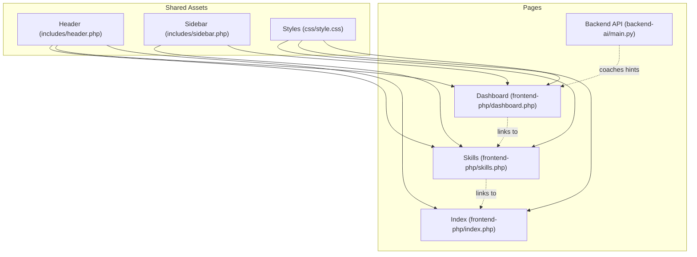

**Diagram sources**
- [header.php](file://frontend-php/includes/header.php#L1-L71)
- [sidebar.php](file://frontend-php/includes/sidebar.php#L1-L81)
- [style.css](file://frontend-php/css/style.css#L1-L289)
- [skills.php](file://frontend-php/skills.php#L1-L189)
- [dashboard.php](file://frontend-php/dashboard.php#L1-L279)
- [index.php](file://frontend-php/index.php#L1-L174)
- [main.py](file://backend-ai/main.py#L1-L30)

**Section sources**
- [header.php](file://frontend-php/includes/header.php#L1-L71)
- [sidebar.php](file://frontend-php/includes/sidebar.php#L1-L81)
- [style.css](file://frontend-php/css/style.css#L1-L289)
- [skills.php](file://frontend-php/skills.php#L1-L189)
- [dashboard.php](file://frontend-php/dashboard.php#L1-L279)
- [index.php](file://frontend-php/index.php#L1-L174)
- [main.py](file://backend-ai/main.py#L1-L30)

## Core Components
- Skills Radar: Hexagonal visualization with six axes representing categories such as Technical Proficiency, Soft Skills, Practical, Theory Knowledge, Problem Solving, and Analytical.
- Top Skills Breakdown: A vertical list of skills with percentage labels and Bootstrap progress bars.
- Skills Being Tracked (Dashboard): Compact progress bars and percentages for skills under active learning.
- Skill Growth Trend: A horizontal bar chart showing skill improvement over time with visual markers.
- AI Career Prediction: A contextual recommendation panel based on proficiency clusters.
- Color-coded skill representations: Primary blue, primary orange, and secondary colors for different skill levels and targets.

Key implementation references:
- Skills Radar and Top Skills Breakdown: [skills.php](file://frontend-php/skills.php#L18-L153)
- Skills Being Tracked (Dashboard): [dashboard.php](file://frontend-php/dashboard.php#L168-L200)
- Progress bar styling: [style.css](file://frontend-php/css/style.css#L281-L288)

**Section sources**
- [skills.php](file://frontend-php/skills.php#L18-L153)
- [dashboard.php](file://frontend-php/dashboard.php#L168-L200)
- [style.css](file://frontend-php/css/style.css#L281-L288)

## Architecture Overview
The skill tracking UI is composed of static HTML/CSS/Bootstrap markup with PHP includes for layout and navigation. The backend exposes a minimal API for AI coaching hints, which complements the dashboard’s performance guidance.

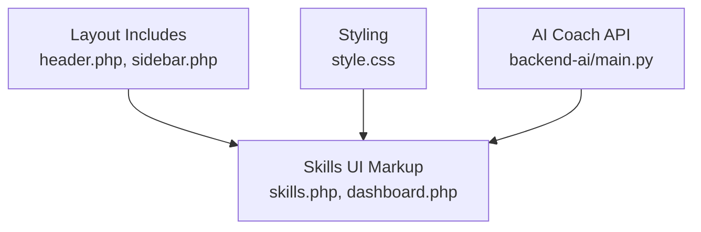

**Diagram sources**
- [skills.php](file://frontend-php/skills.php#L1-L189)
- [dashboard.php](file://frontend-php/dashboard.php#L1-L279)
- [header.php](file://frontend-php/includes/header.php#L1-L71)
- [sidebar.php](file://frontend-php/includes/sidebar.php#L1-L81)
- [style.css](file://frontend-php/css/style.css#L1-L289)
- [main.py](file://backend-ai/main.py#L1-L30)

## Detailed Component Analysis

### Skills Radar Visualization
The Skills Radar presents a hexagonal grid with six labeled axes and concentric rings. It includes:
- Axis labels for Technical Proficiency, Soft Skills, Practical, Theory Knowledge, Problem Solving, and Analytical
- A translucent polygon overlay representing current mastery
- A target benchmark indicator
- Glowing effects and gradient backgrounds for depth

Implementation highlights:
- Uses custom clip-path polygons for the hexagonal grid and overlay
- Applies opacity layers to create concentric rings
- Utilizes theme colors for axis labels and borders

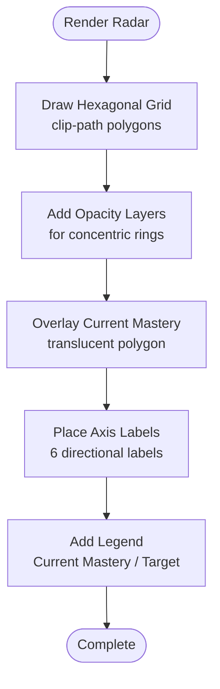

**Diagram sources**
- [skills.php](file://frontend-php/skills.php#L18-L56)

**Section sources**
- [skills.php](file://frontend-php/skills.php#L18-L56)

### Top Skills Breakdown
The Top Skills Breakdown displays a ranked list of skills with:
- Skill name
- Percentage value
- Bootstrap progress bar with rounded pill ends
- Color-coded bars (blue/orange/secondary) aligned with theme colors

Progress bar implementation:
- Outer container with light background and reduced height
- Inner progress-bar with rounded-pill and width set to the skill percentage
- Percentage shown adjacent to the bar

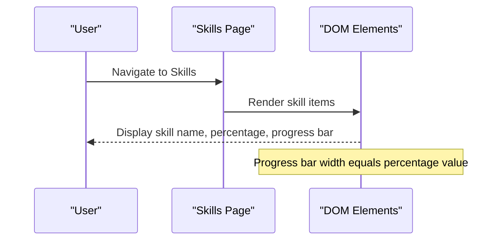

**Diagram sources**
- [skills.php](file://frontend-php/skills.php#L58-L96)

**Section sources**
- [skills.php](file://frontend-php/skills.php#L58-L96)

### Skills Being Tracked (Dashboard)
The Skills Being Tracked widget shows three skills currently under focus:
- CNN Architecture: 65%
- Python/PyTorch: 78%
- Problem Solving: 52%

Each entry includes:
- A compact progress bar (small height)
- A numeric percentage aligned to the bar

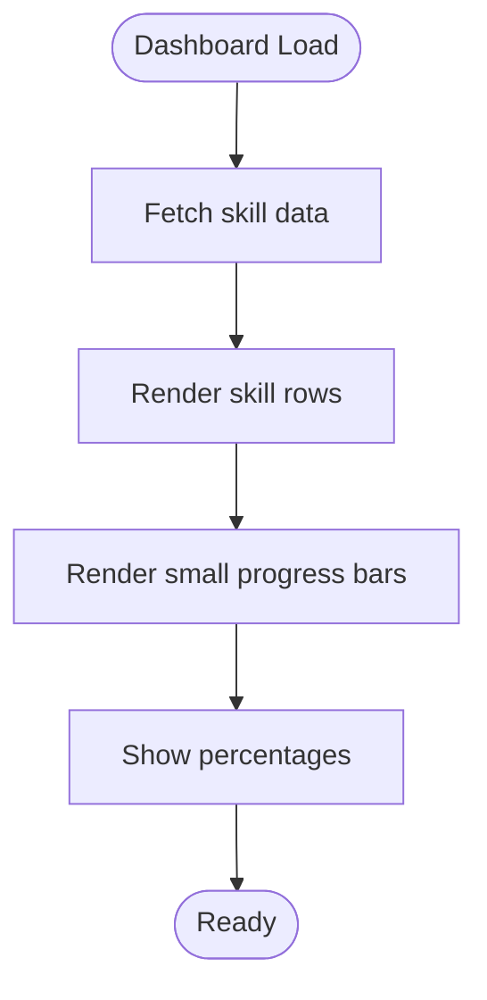

**Diagram sources**
- [dashboard.php](file://frontend-php/dashboard.php#L168-L200)

**Section sources**
- [dashboard.php](file://frontend-php/dashboard.php#L168-L200)

### Skill Growth Trend
The Skill Growth Trend section visualizes improvement over time:
- Six bars representing monthly progress
- Increasing heights indicate improvement
- A highlighted marker on the peak bar indicates recent progress
- Horizontal grid lines for readability

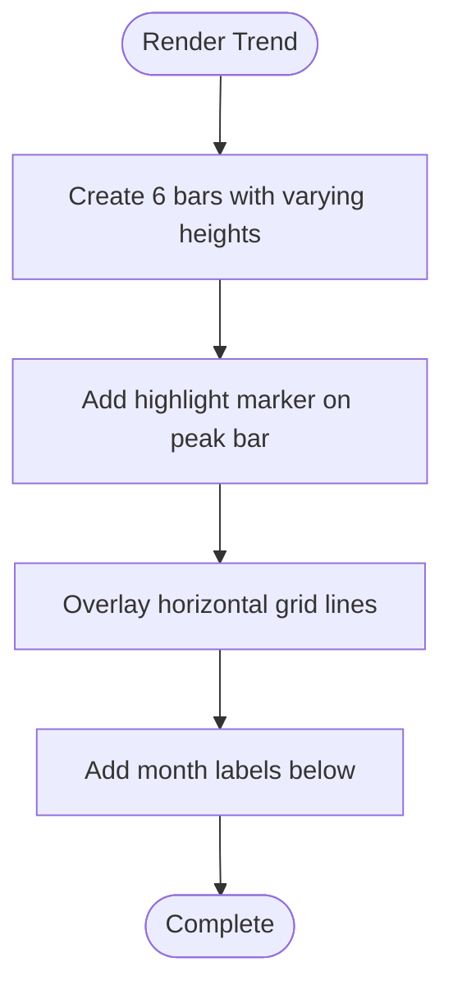

**Diagram sources**
- [skills.php](file://frontend-php/skills.php#L124-L153)

**Section sources**
- [skills.php](file://frontend-php/skills.php#L124-L153)

### AI Career Prediction
The AI Career Prediction panel suggests roles based on proficiency clusters:
- Displays role badges with confidence percentages
- Uses gradient backgrounds and backdrop blur for depth
- Integrates with the radar’s category insights

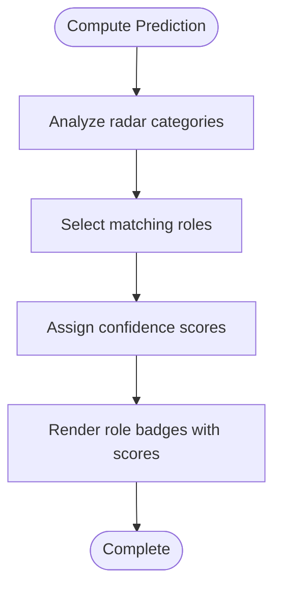

**Diagram sources**
- [skills.php](file://frontend-php/skills.php#L98-L122)

**Section sources**
- [skills.php](file://frontend-php/skills.php#L98-L122)

### Progress Bar Implementation and Percentage Calculation
Progress bars are implemented using Bootstrap utilities:
- Container div with class for background and reduced height
- Inner progress-bar with width equal to the percentage value
- Rounded pill ends via Bootstrap classes

Percentage calculation method:
- Percentage values are embedded directly in the markup
- Example: width set to 88% for Python Development, 72% for Algorithm Design, 45% for Cloud Infrastructure

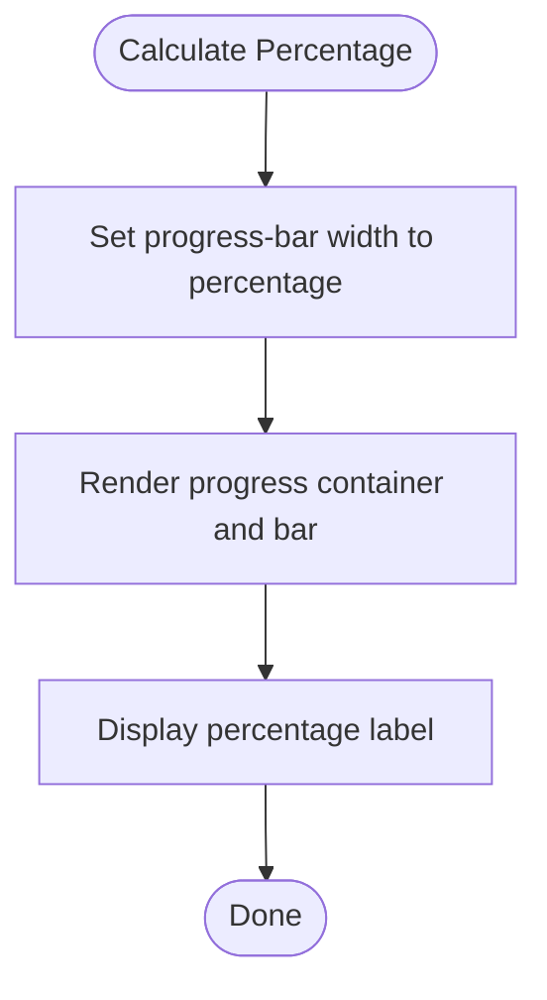

**Diagram sources**
- [skills.php](file://frontend-php/skills.php#L66-L94)
- [dashboard.php](file://frontend-php/dashboard.php#L171-L199)

**Section sources**
- [skills.php](file://frontend-php/skills.php#L66-L94)
- [dashboard.php](file://frontend-php/dashboard.php#L171-L199)
- [style.css](file://frontend-php/css/style.css#L281-L288)

### Color-Coded Skill Representations
Color coding is applied consistently:
- Primary blue for current mastery and primary skill emphasis
- Primary orange for target benchmarks and highlights
- Secondary for neutral or baseline skill levels
- Theme variables define brand-safe colors used across components

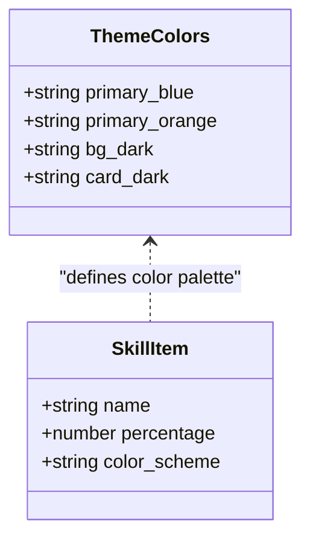

**Diagram sources**
- [style.css](file://frontend-php/css/style.css#L1-L11)
- [skills.php](file://frontend-php/skills.php#L66-L94)

**Section sources**
- [style.css](file://frontend-php/css/style.css#L1-L11)
- [skills.php](file://frontend-php/skills.php#L66-L94)

### Skill Ranking and Threshold-Based Indicators
Ranking:
- Top Skills Breakdown lists skills in descending order of percentage
- Dashboard’s Skills Being Tracked shows current focus skills

Threshold-based indicators:
- Color intensity and bar prominence can imply proficiency tiers
- The trend chart’s peak marker highlights significant improvement

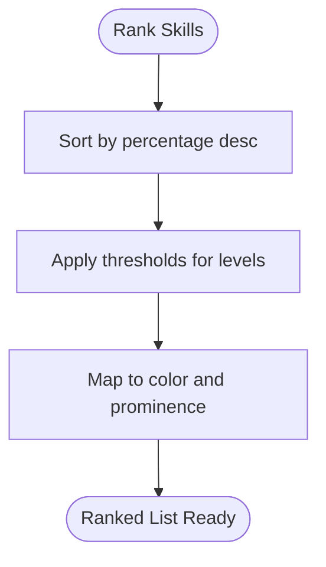

**Diagram sources**
- [skills.php](file://frontend-php/skills.php#L58-L96)
- [dashboard.php](file://frontend-php/dashboard.php#L168-L200)

**Section sources**
- [skills.php](file://frontend-php/skills.php#L58-L96)
- [dashboard.php](file://frontend-php/dashboard.php#L168-L200)

### Responsive Design Patterns for Skill Cards
Responsive patterns observed:
- Flexbox containers for alignment and spacing
- Aspect-ratio utilities for the radar container
- Gap utilities for consistent spacing between items
- Small and compact progress bars for constrained widths
- Mobile-first layout with sidebar toggle for dashboard pages

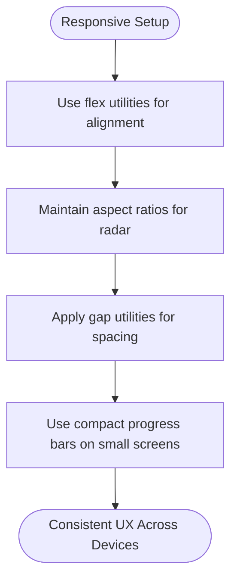

**Diagram sources**
- [skills.php](file://frontend-php/skills.php#L18-L96)
- [dashboard.php](file://frontend-php/dashboard.php#L168-L200)
- [header.php](file://frontend-php/includes/header.php#L22-L26)

**Section sources**
- [skills.php](file://frontend-php/skills.php#L18-L96)
- [dashboard.php](file://frontend-php/dashboard.php#L168-L200)
- [header.php](file://frontend-php/includes/header.php#L22-L26)

### Integration with User Skill Assessments and AI Coach
Integration points:
- Dashboard’s Skills Being Tracked pulls in current skill percentages during learning
- AI Coach API provides hints and tips that complement skill development
- Skills Radar and Growth Trend offer visual feedback loops for assessments

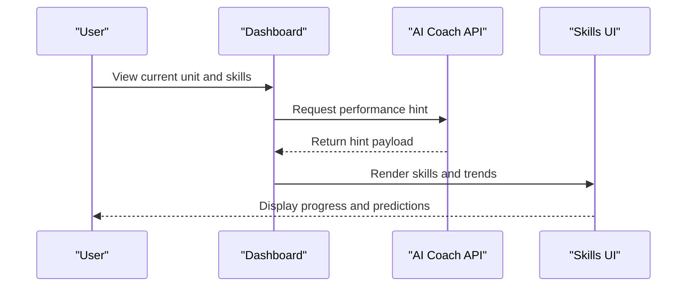

**Diagram sources**
- [dashboard.php](file://frontend-php/dashboard.php#L104-L213)
- [main.py](file://backend-ai/main.py#L23-L29)
- [skills.php](file://frontend-php/skills.php#L98-L153)

**Section sources**
- [dashboard.php](file://frontend-php/dashboard.php#L104-L213)
- [main.py](file://backend-ai/main.py#L23-L29)
- [skills.php](file://frontend-php/skills.php#L98-L153)

## Dependency Analysis
- Layout dependencies: The skills and dashboard pages rely on shared header and sidebar includes for navigation and responsive behavior.
- Styling dependencies: Custom CSS defines theme variables and progress bar tweaks; Bootstrap 5 CSS provides base utilities.
- Data dependencies: Skill percentages are embedded in the UI markup; future enhancements could fetch data from backend APIs.

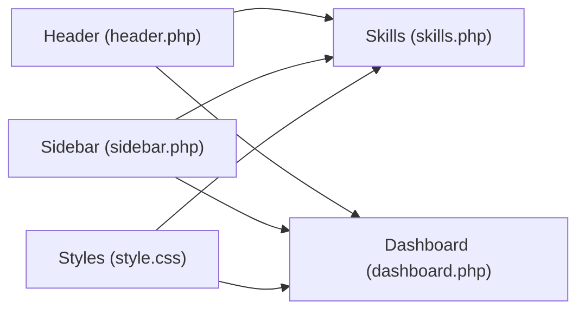

**Diagram sources**
- [header.php](file://frontend-php/includes/header.php#L1-L71)
- [sidebar.php](file://frontend-php/includes/sidebar.php#L1-L81)
- [style.css](file://frontend-php/css/style.css#L1-L289)
- [skills.php](file://frontend-php/skills.php#L1-L189)
- [dashboard.php](file://frontend-php/dashboard.php#L1-L279)

**Section sources**
- [header.php](file://frontend-php/includes/header.php#L1-L71)
- [sidebar.php](file://frontend-php/includes/sidebar.php#L1-L81)
- [style.css](file://frontend-php/css/style.css#L1-L289)
- [skills.php](file://frontend-php/skills.php#L1-L189)
- [dashboard.php](file://frontend-php/dashboard.php#L1-L279)

## Performance Considerations
- Keep progress bar widths simple percentages to minimize reflows.
- Prefer CSS transforms for animations; the existing UI relies on static widths.
- Consolidate repeated color classes to reduce CSS bloat.
- Lazy-load images in trend visuals if content grows.

## Troubleshooting Guide
Common issues and resolutions:
- Progress bars not rendering: Verify Bootstrap classes are loaded and progress container has sufficient height.
- Color inconsistencies: Ensure theme variables are defined and used consistently across components.
- Radar layout distortion: Confirm clip-path polygons and aspect-ratio utilities are applied correctly.
- Sidebar overlap on mobile: Check sidebar toggle logic and overlay visibility classes.

**Section sources**
- [style.css](file://frontend-php/css/style.css#L1-L289)
- [skills.php](file://frontend-php/skills.php#L18-L153)
- [header.php](file://frontend-php/includes/header.php#L22-L26)

## Conclusion
The skill progress tracking system combines a visually rich Skills Radar, a concise Top Skills Breakdown, and a growth trend visualization to present user proficiency clearly. Bootstrap utilities power the progress bars, while theme-driven color coding communicates mastery levels. The dashboard integrates AI coach hints to guide learning, and the responsive layout ensures usability across devices. Future enhancements can include dynamic data binding and backend APIs for real-time skill updates.