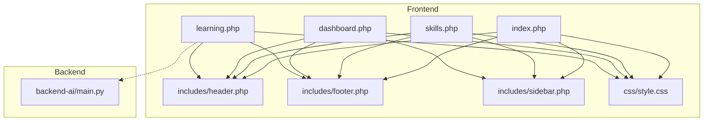
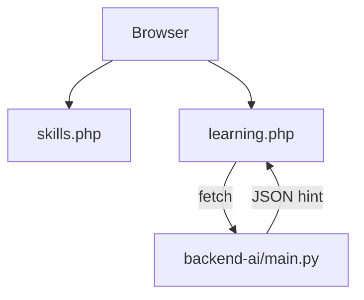
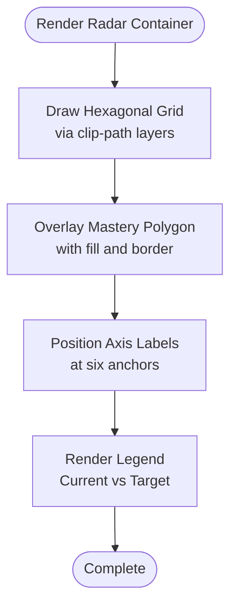
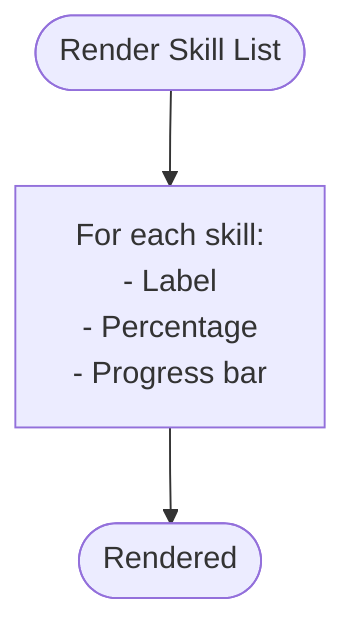
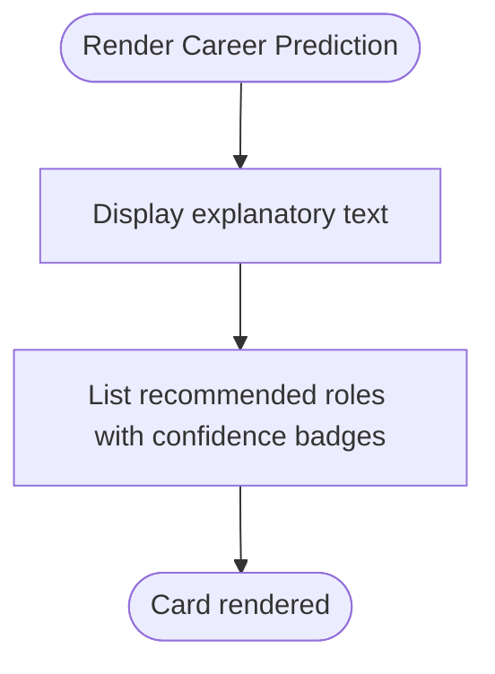
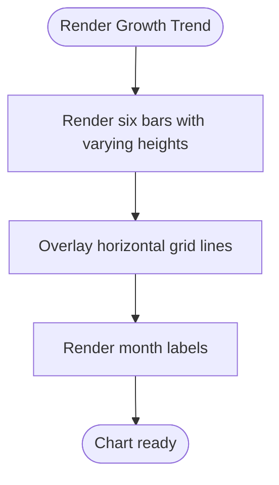
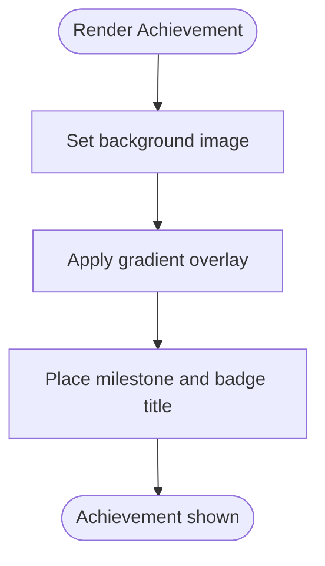
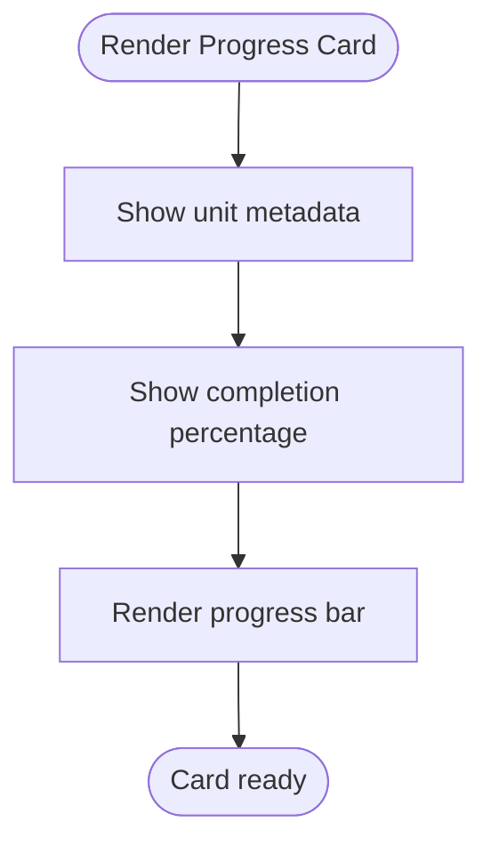
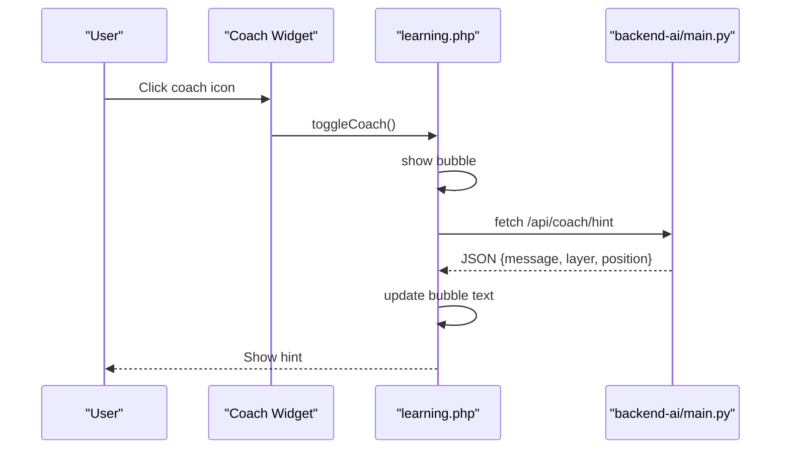
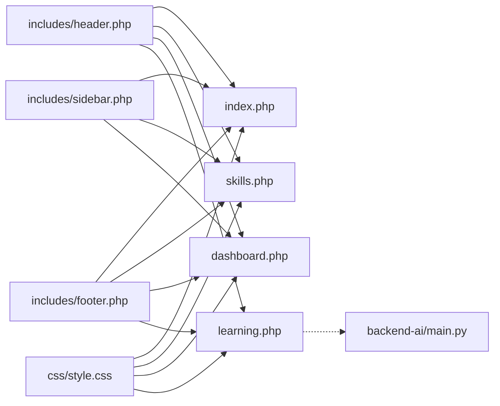

# Skills Assessment & Visualization

<cite>
**Referenced Files in This Document**
- [frontend-php/index.php](file://frontend-php/index.php)
- [frontend-php/skills.php](file://frontend-php/skills.php)
- [frontend-php/learning.php](file://frontend-php/learning.php)
- [frontend-php/dashboard.php](file://frontend-php/dashboard.php)
- [frontend-php/css/style.css](file://frontend-php/css/style.css)
- [frontend-php/includes/header.php](file://frontend-php/includes/header.php)
- [frontend-php/includes/footer.php](file://frontend-php/includes/footer.php)
- [frontend-php/includes/sidebar.php](file://frontend-php/includes/sidebar.php)
- [backend-ai/main.py](file://backend-ai/main.py)
</cite>

## Table of Contents
1. [Introduction](#introduction)
2. [Project Structure](#project-structure)
3. [Core Components](#core-components)
4. [Architecture Overview](#architecture-overview)
5. [Detailed Component Analysis](#detailed-component-analysis)
6. [Dependency Analysis](#dependency-analysis)
7. [Performance Considerations](#performance-considerations)
8. [Troubleshooting Guide](#troubleshooting-guide)
9. [Conclusion](#conclusion)
10. [Appendices](#appendices)

## Introduction
This document describes the Skills Assessment and Visualization system within the Octal Foundry platform. It focuses on the radar chart implementation for skills visualization, progress tracking components, AI-driven career predictions, and achievement displays. It also explains data visualization patterns, interactive rendering, skills scoring mechanisms, responsive design for skill displays, and the integration with backend data sources and real-time skill updates.

## Project Structure
The system comprises a PHP-based frontend with a cohesive dashboard and skills visualization page, a CSS theme for dark mode and glass effects, and a minimal FastAPI backend for AI coaching hints. The frontend pages share common header and footer includes, and a sidebar navigation for dashboard and skills views.

**Diagram sources**
- [frontend-php/index.php](file://frontend-php/index.php#L1-L174)
- [frontend-php/skills.php](file://frontend-php/skills.php#L1-L189)
- [frontend-php/dashboard.php](file://frontend-php/dashboard.php#L1-L279)
- [frontend-php/learning.php](file://frontend-php/learning.php#L1-L215)
- [frontend-php/includes/header.php](file://frontend-php/includes/header.php#L1-L71)
- [frontend-php/includes/footer.php](file://frontend-php/includes/footer.php#L1-L31)
- [frontend-php/includes/sidebar.php](file://frontend-php/includes/sidebar.php#L1-L81)
- [frontend-php/css/style.css](file://frontend-php/css/style.css#L1-L114)
- [backend-ai/main.py](file://backend-ai/main.py#L1-L30)

**Section sources**
- [frontend-php/index.php](file://frontend-php/index.php#L1-L174)
- [frontend-php/skills.php](file://frontend-php/skills.php#L1-L189)
- [frontend-php/dashboard.php](file://frontend-php/dashboard.php#L1-L279)
- [frontend-php/learning.php](file://frontend-php/learning.php#L1-L215)
- [frontend-php/includes/header.php](file://frontend-php/includes/header.php#L1-L71)
- [frontend-php/includes/footer.php](file://frontend-php/includes/footer.php#L1-L31)
- [frontend-php/includes/sidebar.php](file://frontend-php/includes/sidebar.php#L1-L81)
- [frontend-php/css/style.css](file://frontend-php/css/style.css#L1-L114)
- [backend-ai/main.py](file://backend-ai/main.py#L1-L30)

## Core Components
- Skills Radar Visualization: Hexagonal grid with a filled polygon representing current mastery and optional target benchmark overlay. Labels and glow effects enhance readability and aesthetics.
- Top Skills Breakdown: Vertical progress bars with percentage labels for key skills.
- AI Career Prediction: Prominent card displaying predicted career matches with confidence percentages.
- Skill Growth Trend: Horizontal bar chart with grid lines and labeled time periods.
- Latest Achievement: Full-width banner showcasing recent milestone badges.
- Progress Tracking: Dashboard progress cards and skill progress bars for tracked skills.
- AI Performance Coach Integration: Floating widget that fetches hints from the backend.

**Section sources**
- [frontend-php/skills.php](file://frontend-php/skills.php#L19-L165)
- [frontend-php/dashboard.php](file://frontend-php/dashboard.php#L11-L200)
- [frontend-php/learning.php](file://frontend-php/learning.php#L152-L212)
- [backend-ai/main.py](file://backend-ai/main.py#L23-L29)

## Architecture Overview
The frontend renders static visualizations and interactive widgets. The AI coach hint widget performs a client-side fetch against the backend FastAPI service. The backend exposes a simple endpoint returning a coaching suggestion payload.

**Diagram sources**
- [frontend-php/skills.php](file://frontend-php/skills.php#L1-L189)
- [frontend-php/learning.php](file://frontend-php/learning.php#L177-L212)
- [backend-ai/main.py](file://backend-ai/main.py#L23-L29)

## Detailed Component Analysis

### Skills Radar Visualization
The radar visualization uses a hexagonal grid created via CSS clip-path polygons and layered divs. A filled polygon overlays the grid to represent current mastery. Labels are positioned around the perimeter, and a legend distinguishes current vs target benchmarks.

Key implementation aspects:
- Hexagonal grid: six layered clip-path polygons at different scales.
- Mastery shape: a polygon with a semi-transparent fill and border.
- Labels: absolute-positioned spans rotated to align with axes.
- Legend: colored dots and labels for current mastery and target benchmark.

Responsive behavior:
- Aspect-ratio maintained via container sizing and max-width constraints.
- Grid scales proportionally to the container.

Data visualization pattern:
- The shape coordinates define radial segments for six axes.
- Values are not explicitly bound in the HTML; the shape acts as a static visualization aid.

**Diagram sources**
- [frontend-php/skills.php](file://frontend-php/skills.php#L20-L56)

**Section sources**
- [frontend-php/skills.php](file://frontend-php/skills.php#L19-L56)

### Top Skills Breakdown
Each skill item displays:
- Name label
- Percentage value
- Thin horizontal progress bar aligned to the percentage

Responsive behavior:
- Flex layout adapts to narrow screens.
- Progress bar height is minimal for dense lists.

**Diagram sources**
- [frontend-php/skills.php](file://frontend-php/skills.php#L58-L96)

**Section sources**
- [frontend-php/skills.php](file://frontend-php/skills.php#L58-L96)

### AI Career Prediction
The prediction card:
- Displays a headline and explanatory text
- Lists recommended roles with confidence badges
- Uses gradient backgrounds and backdrop blur for depth

Responsive behavior:
- Flex wrap allows badges to stack on smaller screens.
- Badge sizes are fixed to maintain legibility.

**Diagram sources**
- [frontend-php/skills.php](file://frontend-php/skills.php#L98-L122)

**Section sources**
- [frontend-php/skills.php](file://frontend-php/skills.php#L98-L122)

### Skill Growth Trend
The growth trend bar chart:
- Six bars representing monthly progress
- Horizontal grid lines for readability
- Timestamp labels below the chart
- Optional highlighted data point marker

Responsive behavior:
- Flexible bars with percentage heights.
- Grid lines and labels align across bars.

**Diagram sources**
- [frontend-php/skills.php](file://frontend-php/skills.php#L124-L153)

**Section sources**
- [frontend-php/skills.php](file://frontend-php/skills.php#L124-L153)

### Latest Achievement
The achievement banner:
- Full-width image container with gradient overlay
- Milestone and badge title displayed inside

Responsive behavior:
- Aspect-ratio container maintains visual balance.
- Overlay text remains readable via contrast.

**Diagram sources**
- [frontend-php/skills.php](file://frontend-php/skills.php#L155-L165)

**Section sources**
- [frontend-php/skills.php](file://frontend-php/skills.php#L155-L165)

### Progress Tracking Components
Dashboard progress card:
- Unit metadata and completion percentage
- Thin progress bar aligned to percentage

Skills being tracked:
- Three tracked skills with progress bars and percentages

Responsive behavior:
- Compact layout with stacked labels and bars.

**Diagram sources**
- [frontend-php/dashboard.php](file://frontend-php/dashboard.php#L11-L29)
- [frontend-php/dashboard.php](file://frontend-php/dashboard.php#L168-L200)

**Section sources**
- [frontend-php/dashboard.php](file://frontend-php/dashboard.php#L11-L29)
- [frontend-php/dashboard.php](file://frontend-php/dashboard.php#L168-L200)

### AI Performance Coach Integration
The floating coach widget:
- Toggle button opens a tooltip bubble
- On open, fetches a hint from the backend
- Displays message and arrow pointer

Backend integration:
- Endpoint returns a JSON payload with a message and suggested layer
- Frontend handles errors gracefully

**Diagram sources**
- [frontend-php/learning.php](file://frontend-php/learning.php#L177-L212)
- [backend-ai/main.py](file://backend-ai/main.py#L23-L29)

**Section sources**
- [frontend-php/learning.php](file://frontend-php/learning.php#L152-L212)
- [backend-ai/main.py](file://backend-ai/main.py#L23-L29)

## Dependency Analysis
- Frontend pages depend on shared header and footer includes.
- Sidebar is included conditionally for dashboard and skills pages.
- The learning page depends on the backend for AI hints.
- CSS defines global theme tokens and reusable utilities.

**Diagram sources**
- [frontend-php/includes/header.php](file://frontend-php/includes/header.php#L1-L71)
- [frontend-php/includes/footer.php](file://frontend-php/includes/footer.php#L1-L31)
- [frontend-php/includes/sidebar.php](file://frontend-php/includes/sidebar.php#L1-L81)
- [frontend-php/css/style.css](file://frontend-php/css/style.css#L1-L114)
- [frontend-php/index.php](file://frontend-php/index.php#L1-L174)
- [frontend-php/skills.php](file://frontend-php/skills.php#L1-L189)
- [frontend-php/dashboard.php](file://frontend-php/dashboard.php#L1-L279)
- [frontend-php/learning.php](file://frontend-php/learning.php#L1-L215)
- [backend-ai/main.py](file://backend-ai/main.py#L1-L30)

**Section sources**
- [frontend-php/includes/header.php](file://frontend-php/includes/header.php#L22-L31)
- [frontend-php/css/style.css](file://frontend-php/css/style.css#L1-L114)
- [frontend-php/learning.php](file://frontend-php/learning.php#L177-L212)
- [backend-ai/main.py](file://backend-ai/main.py#L1-L30)

## Performance Considerations
- Radar grid uses CSS clip-path and layered borders; keep the number of layers reasonable to avoid layout thrash.
- Progress bars are lightweight; ensure minimal reflows by avoiding frequent DOM updates.
- The AI coach fetch is asynchronous; cache results per session to reduce repeated network requests.
- Use CSS transforms and opacity for animations to leverage GPU acceleration.
- Keep images for achievements and backgrounds optimized for fast loading.

## Troubleshooting Guide
Common issues and resolutions:
- Radar labels misaligned: Verify absolute positioning and rotation transforms; ensure parent container has correct aspect-ratio and sizing.
- Progress bars not filling: Confirm width percentages and progress bar role attributes; check for overriding styles.
- Coach widget not showing hint: Ensure the backend endpoint is reachable and CORS settings allow the origin; inspect browser console for fetch errors.
- Sidebar toggle not working: Confirm event listeners are attached after DOMContentLoaded and that overlay elements exist.

**Section sources**
- [frontend-php/learning.php](file://frontend-php/learning.php#L177-L212)
- [frontend-php/includes/footer.php](file://frontend-php/includes/footer.php#L8-L28)

## Conclusion
The Skills Assessment and Visualization system combines static visualizations with lightweight interactivity. The radar chart provides a strong visual metaphor for skills, while progress tracking and career predictions offer actionable insights. The AI coach integration demonstrates a clean separation between frontend UX and backend assistance. Future enhancements could include dynamic data binding for the radar, real-time skill updates, and persistent storage of user progress.

## Appendices

### Data Formatting Examples
- Radar chart data points: six axes with normalized scores mapped to radial distances. Coordinates are defined in the mastery shape to reflect current scores.
- Skills breakdown: array of items with name, percentage, and optional target percentage.
- Career prediction: array of recommendations with role names and confidence percentages.
- Achievement: image URL, milestone title, and badge text.
- Growth trend: array of monthly progress values; labels correspond to calendar months.

[No sources needed since this section provides general guidance]

### Skills Scoring Mechanisms
- Normalize raw skill scores to a 0–100 scale.
- Map normalized scores to polygon vertices for radar rendering.
- Use progress bars to reflect normalized scores visually.
- Compute career match scores based on weighted axis contributions.

[No sources needed since this section provides general guidance]

### Visualization Updates
- Radar: update polygon coordinates dynamically using JavaScript when new scores arrive.
- Progress bars: adjust width and percentage text upon receiving updated scores.
- Career prediction: replace recommendation list with new suggestions.
- Achievement: swap image and text when milestones are earned.

[No sources needed since this section provides general guidance]

### Backend Integration Notes
- Endpoint: GET /api/coach/hint returns a JSON object with a message and suggested layer.
- Origin policy: ensure CORS allows the frontend origin during development and production.
- Error handling: display fallback messages when the backend is unreachable.

**Section sources**
- [backend-ai/main.py](file://backend-ai/main.py#L23-L29)