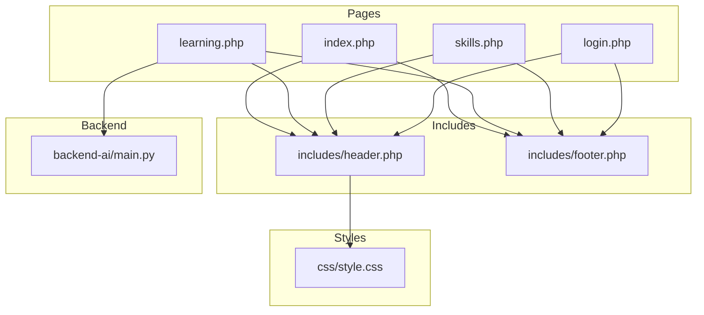
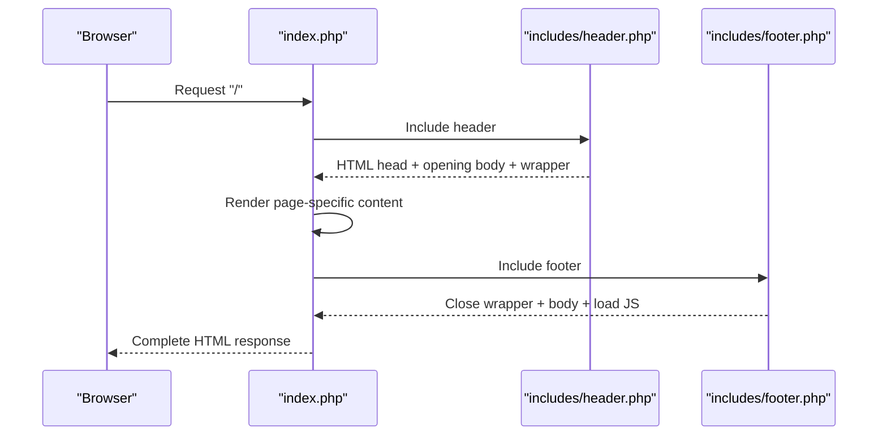
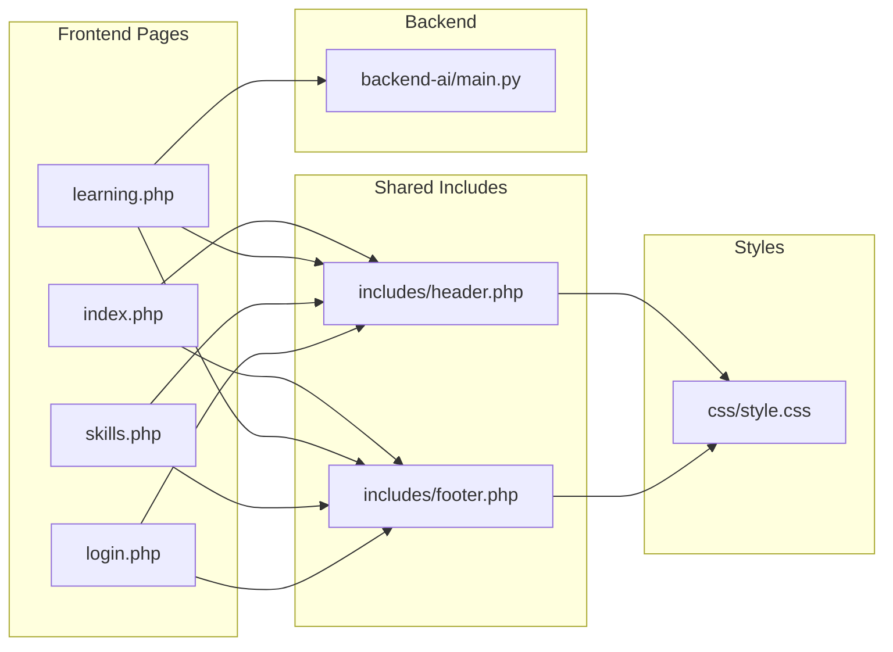

# Template System & Component Architecture

<cite>
**Referenced Files in This Document**
- [header.php](file://frontend-php/includes/header.php)
- [footer.php](file://frontend-php/includes/footer.php)
- [index.php](file://frontend-php/index.php)
- [learning.php](file://frontend-php/learning.php)
- [skills.php](file://frontend-php/skills.php)
- [login.php](file://frontend-php/login.php)
- [style.css](file://frontend-php/css/style.css)
- [main.py](file://backend-ai/main.py)
</cite>

## Table of Contents
1. [Introduction](#introduction)
2. [Project Structure](#project-structure)
3. [Core Components](#core-components)
4. [Architecture Overview](#architecture-overview)
5. [Detailed Component Analysis](#detailed-component-analysis)
6. [Dependency Analysis](#dependency-analysis)
7. [Performance Considerations](#performance-considerations)
8. [Troubleshooting Guide](#troubleshooting-guide)
9. [Conclusion](#conclusion)

## Introduction
This document explains the Octal Foundry PHP template system and component architecture. It focuses on the shared component pattern using header.php and footer.php includes, how the system enforces separation between views and logic, and how pages extend a base layout. It also covers the template inclusion mechanism, variable passing between master pages and content pages, component reusability, navigation structure, responsive design integration via Bootstrap classes, Material Symbols icon usage, and the template inheritance pattern demonstrated by index.php, learning.php, and skills.php.

## Project Structure
The frontend is organized around a simple PHP include-based template system:
- Includes: header.php and footer.php define the HTML skeleton and global assets.
- Pages: index.php, learning.php, skills.php, and login.php include the header and footer and render page-specific content.
- Styles: style.css defines theme variables, typography, and reusable utility classes.

**Diagram sources**
- [header.php](file://frontend-php/includes/header.php#L1-L23)
- [footer.php](file://frontend-php/includes/footer.php#L1-L7)
- [index.php](file://frontend-php/index.php#L1-L174)
- [learning.php](file://frontend-php/learning.php#L1-L215)
- [skills.php](file://frontend-php/skills.php#L1-L189)
- [login.php](file://frontend-php/login.php#L1-L94)
- [style.css](file://frontend-php/css/style.css#L1-L114)
- [main.py](file://backend-ai/main.py#L1-L30)

**Section sources**
- [header.php](file://frontend-php/includes/header.php#L1-L23)
- [footer.php](file://frontend-php/includes/footer.php#L1-L7)
- [index.php](file://frontend-php/index.php#L1-L174)
- [learning.php](file://frontend-php/learning.php#L1-L215)
- [skills.php](file://frontend-php/skills.php#L1-L189)
- [login.php](file://frontend-php/login.php#L1-L94)
- [style.css](file://frontend-php/css/style.css#L1-L114)

## Core Components
- Shared Layout Includes
  - header.php: Defines the HTML head, global CSS and fonts, and opens the body and main wrapper div.
  - footer.php: Closes the main wrapper and body, and loads Bootstrap JS bundle.
- Page Templates
  - index.php, learning.php, skills.php, login.php: Each includes header.php at the top and footer.php at the bottom, rendering page-specific content in between.
- Global Styling
  - style.css: Provides CSS custom properties for theming, typography, glass effects, and utility classes for consistent styling across pages.

Key separation of concerns:
- Views (PHP pages) handle presentation and local markup.
- Logic (where present) is minimal; pages include the shared layout and focus on content.
- Assets and global structure are centralized in includes.

**Section sources**
- [header.php](file://frontend-php/includes/header.php#L1-L23)
- [footer.php](file://frontend-php/includes/footer.php#L1-L7)
- [index.php](file://frontend-php/index.php#L1-L174)
- [learning.php](file://frontend-php/learning.php#L1-L215)
- [skills.php](file://frontend-php/skills.php#L1-L189)
- [login.php](file://frontend-php/login.php#L1-L94)
- [style.css](file://frontend-php/css/style.css#L1-L114)

## Architecture Overview
The system follows a template inheritance pattern:
- Base layout: header.php and footer.php form the base template.
- Derived pages: index.php, learning.php, skills.php, and login.php extend the base by inserting content between the includes.

**Diagram sources**
- [index.php](file://frontend-php/index.php#L1-L174)
- [header.php](file://frontend-php/includes/header.php#L1-L23)
- [footer.php](file://frontend-php/includes/footer.php#L1-L7)

## Detailed Component Analysis

### Shared Layout Includes
- header.php
  - Declares DOCTYPE and html attributes.
  - Loads Google Fonts (Space Grotesk, Inter), Material Symbols Outlined, Bootstrap 5 CSS, and custom style.css.
  - Opens the body with dark theme and a main wrapper div.
- footer.php
  - Closes the wrapper and body.
  - Loads Bootstrap 5 JS bundle.

These files act as the base template for all pages, ensuring consistent assets, fonts, and structure.

**Section sources**
- [header.php](file://frontend-php/includes/header.php#L1-L23)
- [footer.php](file://frontend-php/includes/footer.php#L1-L7)

### Page Templates and Template Inheritance
- index.php
  - Includes header.php, renders a profile header, tabs, project cards, certifications, and endorsements, then includes footer.php.
  - Demonstrates top and bottom navigation bars, responsive grid layouts, and Material Symbols icons.
- learning.php
  - Includes header.php, renders a media player, transcript, task area, and an AI coach widget, then includes footer.php.
  - Integrates with the backend AI coach service via JavaScript.
- skills.php
  - Includes header.php, renders a radar chart visualization, skill breakdown, career prediction, growth trend, and achievement tile, then includes footer.php.
  - Uses custom CSS for shapes and gradients.
- login.php
  - Includes header.php, renders a hero section and login form, then includes footer.php.
  - Uses form controls styled via style.css.

Template inheritance pattern:
- Each page includes header.php at the top and footer.php at the bottom.
- Content is inserted between the includes, enabling reuse of the base layout across pages.

Variable passing between master and content:
- There is no variable passing in the traditional MVC sense. Instead, the shared includes define global assets and structure, while each page injects its own content. This achieves separation of concerns without requiring inter-page data exchange.

Responsive design integration:
- Bootstrap 5 CSS is included globally, enabling responsive utilities and grid classes used throughout pages (e.g., container, flex utilities, ratios).

Material Symbols usage:
- Material Symbols Outlined and filled styles are loaded globally and applied via CSS classes on span elements across pages.

Navigation structure:
- Pages implement sticky top bars, tab navigation, and bottom navigation bars using Bootstrap utilities and custom classes.

**Section sources**
- [index.php](file://frontend-php/index.php#L1-L174)
- [learning.php](file://frontend-php/learning.php#L1-L215)
- [skills.php](file://frontend-php/skills.php#L1-L189)
- [login.php](file://frontend-php/login.php#L1-L94)

### Global Styling and Theming
- style.css
  - Defines CSS custom properties for primary colors and backgrounds.
  - Provides typography classes for display and body fonts.
  - Offers utility classes for backgrounds, glass effects, rounded corners, scrollbars, and Material Symbols variants.
  - Includes form overrides for dark mode.

These utilities enable consistent styling across pages and reduce duplication.

**Section sources**
- [style.css](file://frontend-php/css/style.css#L1-L114)

### Backend Integration (AI Coach)
- backend-ai/main.py
  - FastAPI server exposing two endpoints:
    - GET /: Returns a status message.
    - GET /api/coach/hint: Returns a JSON hint used by learning.php’s AI coach widget.
  - CORS middleware configured to allow development requests.

The learning.php page fetches hints from this endpoint to power interactive coaching.

**Section sources**
- [main.py](file://backend-ai/main.py#L1-L30)
- [learning.php](file://frontend-php/learning.php#L177-L212)

## Dependency Analysis
- Frontend-to-Includes: All pages depend on header.php and footer.php for structure and assets.
- Frontend-to-Styles: All pages rely on style.css for theming and utilities.
- Frontend-to-Backend: learning.php depends on backend-ai/main.py for AI coach hints.
- Backend-to-Frontend: The backend serves JSON consumed by the frontend.

**Diagram sources**
- [index.php](file://frontend-php/index.php#L1-L174)
- [learning.php](file://frontend-php/learning.php#L1-L215)
- [skills.php](file://frontend-php/skills.php#L1-L189)
- [login.php](file://frontend-php/login.php#L1-L94)
- [header.php](file://frontend-php/includes/header.php#L1-L23)
- [footer.php](file://frontend-php/includes/footer.php#L1-L7)
- [style.css](file://frontend-php/css/style.css#L1-L114)
- [main.py](file://backend-ai/main.py#L1-L30)

**Section sources**
- [index.php](file://frontend-php/index.php#L1-L174)
- [learning.php](file://frontend-php/learning.php#L1-L215)
- [skills.php](file://frontend-php/skills.php#L1-L189)
- [login.php](file://frontend-php/login.php#L1-L94)
- [header.php](file://frontend-php/includes/header.php#L1-L23)
- [footer.php](file://frontend-php/includes/footer.php#L1-L7)
- [style.css](file://frontend-php/css/style.css#L1-L114)
- [main.py](file://backend-ai/main.py#L1-L30)

## Performance Considerations
- Asset loading: Fonts and CSS are loaded from CDNs; ensure caching and preloading strategies are considered for production.
- Minimizing DOM: Reuse of includes reduces duplication and improves maintainability.
- JavaScript: Keep frontend scripts lightweight and defer non-critical ones when possible.
- Backend latency: The AI coach endpoint should be monitored for response times; consider caching or rate limiting in production.

## Troubleshooting Guide
- Missing assets
  - Verify that header.php includes the correct paths for fonts, Material Symbols, Bootstrap CSS, and style.css.
- Bootstrap classes not applying
  - Confirm that Bootstrap CSS is loaded before custom styles and that class names match Bootstrap conventions.
- Material Symbols not rendering
  - Ensure Material Symbols stylesheet is loaded and that CSS classes are applied correctly.
- AI coach widget not working
  - Check that the backend server is running and accessible from the frontend origin.
  - Validate CORS configuration and endpoint availability.

**Section sources**
- [header.php](file://frontend-php/includes/header.php#L8-L18)
- [style.css](file://frontend-php/css/style.css#L89-L114)
- [main.py](file://backend-ai/main.py#L6-L17)
- [learning.php](file://frontend-php/learning.php#L177-L212)

## Conclusion
The Octal Foundry template system leverages PHP includes to implement a clean, reusable layout pattern. header.php and footer.php centralize global assets and structure, while individual pages focus on content-specific markup. The approach enforces separation between views and logic, supports responsive design via Bootstrap, and integrates Material Symbols for consistent iconography. The system scales across pages like index.php, learning.php, skills.php, and login.php, promoting component reusability and maintainability.