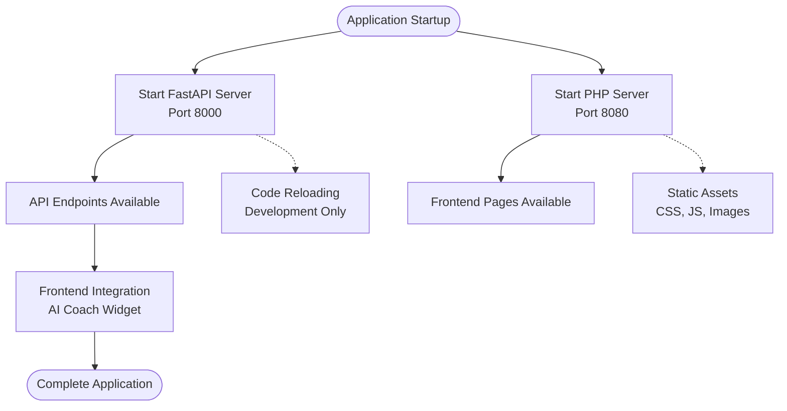

# Getting Started

<cite>
**Referenced Files in This Document**
- [requirements.txt](file://backend/requirements.txt)
- [main.py](file://backend/main.py)
- [index.php](file://frontend/index.php)
- [learning.php](file://frontend/learning.php)
- [skills.php](file://frontend/skills.php)
- [header.php](file://frontend/includes/header.php)
- [footer.php](file://frontend/includes/footer.php)
- [style.css](file://frontend/css/style.css)
</cite>

## Table of Contents
1. [Introduction](#introduction)
2. [Prerequisites](#prerequisites)
3. [Installation](#installation)
4. [Development Setup](#development-setup)
5. [Running the Application](#running-the-application)
6. [Basic Usage](#basic-usage)
7. [Verification Steps](#verification-steps)
8. [Troubleshooting](#troubleshooting)
9. [Common Issues](#common-issues)
10. [Conclusion](#conclusion)

## Introduction

Octal Foundry is an AI-powered learning platform designed to help developers enhance their skills through interactive learning experiences. The platform consists of two main components: a FastAPI backend that provides AI coaching functionality and a PHP-based frontend that delivers the user interface for portfolio management, learning content, and skills assessment.

The platform features a modern dark-themed interface with responsive design, integrated AI coaching capabilities, and interactive learning modules. Users can explore portfolios, access learning materials, track skill progress, and receive personalized AI guidance.

## Prerequisites

Before installing Octal Foundry, ensure you have the following prerequisites installed on your system:

### Python Environment
- **Python 3.x**: The backend requires Python 3.6 or higher
- **pip**: Package installer for Python
- **Virtual Environment**: Recommended for dependency isolation

### Web Server Environment
- **PHP 7.0 or higher**: Required for frontend execution
- **Web Server**: Apache or Nginx with PHP support
- **Local Development Server**: XAMPP, WAMP, or MAMP recommended for local development

### Development Tools
- **Git**: For version control and cloning repositories
- **Text Editor**: VS Code, Sublime Text, or any preferred editor
- **Browser**: Modern browser with JavaScript enabled

**Section sources**
- [requirements.txt](file://backend/requirements.txt#L1-L3)
- [main.py](file://backend/main.py#L1-L30)

## Installation

### Backend Dependencies Installation

1. **Navigate to the backend directory**:
   ```bash
   cd backend
   ```

2. **Install Python dependencies**:
   ```bash
   pip install -r requirements.txt
   ```

3. **Verify installation**:
   - FastAPI should be installed
   - Uvicorn ASGI server should be available
   - No dependency conflicts should be reported

### Frontend Asset Configuration

1. **Directory Structure Verification**:
   ```
   frontend/
   ├── index.php          # Portfolio dashboard
   ├── learning.php       # Learning interface
   ├── skills.php         # Skills assessment
   ├── login.php          # Login page
   ├── includes/          # Shared components
   │   ├── header.php     # HTML head and navigation
   │   └── footer.php     # Footer scripts
   ├── css/               # Stylesheets
   │   └── style.css      # Custom styles
   ```

2. **Asset Dependencies**:
   - Bootstrap 5 CSS/JS from CDN
   - Google Fonts (Space Grotesk, Inter)
   - Material Symbols Outlined icons
   - Local custom CSS file

**Section sources**
- [requirements.txt](file://backend/requirements.txt#L1-L3)
- [header.php](file://frontend/includes/header.php#L1-L23)
- [style.css](file://frontend/css/style.css#L1-L114)

## Development Setup

### Backend Development Server

1. **Start the FastAPI development server**:
   ```bash
   uvicorn backend.main:app --reload --host 0.0.0.0 --port 8000
   ```

2. **Server Configuration**:
   - Host: `0.0.0.0` (accessible from external devices)
   - Port: `8000` (default FastAPI port)
   - Reload: Enabled for automatic code reloading during development

3. **CORS Configuration**:
   - Development allows all origins (`*`)
   - Credentials and headers are permitted
   - Methods are unrestricted for development

### Frontend Development Server

1. **Using Built-in PHP Server**:
   ```bash
   php -S localhost:8080 -t frontend
   ```

2. **Alternative Web Servers**:
   - Apache Virtual Host pointing to frontend directory
   - Nginx configuration with PHP-FPM
   - XAMPP/WAMP integration

3. **File Serving**:
   - PHP files are served directly
   - Static assets (CSS, images) are served from the same directory
   - Includes are processed server-side

**Section sources**
- [main.py](file://backend/main.py#L1-L30)
- [learning.php](file://frontend/learning.php#L177-L212)

## Running the Application

### Step-by-Step Startup Process

#### Method 1: Separate Processes (Recommended for Development)

1. **Terminal 1: Start Backend Server**
   ```bash
   cd backend
   uvicorn backend.main:app --reload --host 0.0.0.0 --port 8000
   ```

2. **Terminal 2: Start Frontend Server**
   ```bash
   cd frontend
   php -S localhost:8080 -t .
   ```

3. **Access the Application**:
   - Backend API: `http://localhost:8000`
   - Frontend: `http://localhost:8080`

#### Method 2: Single Process with PHP Built-in Server

1. **Start PHP Server in Backend Directory**:
   ```bash
   cd backend
   php -S localhost:8080 ../frontend
   ```

2. **Note**: This method serves frontend files from the parent directory

### Process Management



**Diagram sources**
- [main.py](file://backend/main.py#L19-L30)
- [learning.php](file://frontend/learning.php#L177-L212)

**Section sources**
- [main.py](file://backend/main.py#L1-L30)
- [learning.php](file://frontend/learning.php#L177-L212)

## Basic Usage

### Portfolio Dashboard

1. **Access Portfolio Page**:
   - URL: `http://localhost:8080/index.php`
   - Features:
     - User profile with verification badge
     - Project showcase with interactive cards
     - Skills tabs navigation
     - Bottom navigation bar

2. **Navigation Elements**:
   - Top navigation: Share and Settings buttons
   - Tab navigation: Projects, Certificates, Skills
   - Bottom navigation: Profile, Explore, Learning, Alerts

### Learning Interface

1. **Access Learning Page**:
   - URL: `http://localhost:8080/learning.php`
   - Features:
     - Video player with progress controls
     - Transcript section with highlighted current content
     - Foundry Task coding exercise
     - AI Performance Coach widget

2. **AI Coach Integration**:
   - Floating action button triggers coach
   - Fetches hints from backend API endpoint
   - Displays helpful suggestions for coding tasks

### Skills Assessment

1. **Access Skills Page**:
   - URL: `http://localhost:8080/skills.php`
   - Features:
     - Interactive radar chart visualization
     - Skill breakdown with progress bars
     - Career prediction insights
     - Skill growth trends

2. **Key Components**:
   - Technical Proficiency radar
     - Current mastery vs target benchmark comparison
     - Six-dimensional skill assessment
   - Progress tracking with monthly intervals

**Section sources**
- [index.php](file://frontend/index.php#L1-L174)
- [learning.php](file://frontend/learning.php#L1-L215)
- [skills.php](file://frontend/skills.php#L1-L189)

## Verification Steps

### Backend API Verification

1. **Health Check Endpoint**:
   ```bash
   curl http://localhost:8000/
   ```
   Expected response:
   ```json
   {"status": "Octal Foundry AI Backend Online"}
   ```

2. **AI Coach Hint Endpoint**:
   ```bash
   curl http://localhost:8000/api/coach/hint
   ```
   Expected response:
   ```json
   {
     "message": "Your code is missing a BatchNorm2d layer after the first convolution.",
     "layer": "BatchNorm2d",
     "position": "after first Conv2d"
   }
   ```

### Frontend Integration Verification

1. **Page Loading Test**:
   - Open `http://localhost:8080/index.php`
   - Verify all CSS styles are applied correctly
   - Confirm navigation elements are functional

2. **AI Coach Widget Test**:
   - Click the floating AI coach button
   - Verify hint appears from backend API
   - Check for proper error handling if API is unavailable

3. **Cross-Origin Resource Sharing**:
   - Verify frontend can communicate with backend
   - Check browser console for CORS-related errors

### Asset Loading Verification

1. **CSS Stylesheet Loading**:
   - Verify custom styles are applied
   - Check dark theme implementation
   - Confirm responsive design elements

2. **External Resources**:
   - Google Fonts should load without errors
   - Material Symbols should render correctly
   - Bootstrap components should function

**Section sources**
- [main.py](file://backend/main.py#L19-L30)
- [learning.php](file://frontend/learning.php#L177-L212)
- [header.php](file://frontend/includes/header.php#L8-L18)

## Troubleshooting

### Common Backend Issues

#### Python Environment Problems
1. **Virtual Environment Setup**:
   ```bash
   python -m venv octal_env
   source octal_env/bin/activate  # On Windows: octal_env\Scripts\activate
   pip install -r requirements.txt
   ```

2. **Dependency Conflicts**:
   - Uninstall conflicting packages
   - Use clean virtual environment
   - Check Python version compatibility

#### Port Conflicts
1. **Change Backend Port**:
   ```bash
   uvicorn backend.main:app --port 8001
   ```

2. **Check Port Availability**:
   ```bash
   lsof -i :8000  # Linux/Mac
   netstat -ano | findstr :8000  # Windows
   ```

### Frontend Issues

#### PHP Server Problems
1. **Permission Issues**:
   ```bash
   chmod +x frontend/*.php
   ```

2. **Path Configuration**:
   - Ensure correct working directory
   - Verify file permissions
   - Check PHP configuration

#### Asset Loading Failures
1. **CSS Not Loading**:
   - Verify path in header includes `/css/style.css`
   - Check file permissions
   - Ensure web server has read access

2. **External Resources Blocked**:
   - Check browser console for CSP errors
   - Verify CDN accessibility
   - Consider local asset copies

### Cross-Origin Issues

#### CORS Configuration
1. **Development vs Production**:
   - Development allows all origins (`*`)
   - Production should restrict to specific domains
   - Update `origins` list in backend configuration

2. **Frontend API Calls**:
   ```javascript
   // Example fetch call from frontend
   fetch('http://localhost:8000/api/coach/hint')
   ```

### Network Connectivity

#### API Communication
1. **Backend Unavailable**:
   - Verify backend server is running
   - Check firewall settings
   - Confirm port accessibility

2. **Frontend API Integration**:
   - Verify API endpoint URLs
   - Check for mixed content warnings
   - Ensure HTTPS/HTTP consistency

**Section sources**
- [main.py](file://backend/main.py#L6-L17)
- [learning.php](file://frontend/learning.php#L177-L212)

## Common Issues

### Installation Problems

#### Python Dependencies
1. **Permission Denied**:
   ```bash
   pip install --user -r requirements.txt
   ```

2. **Outdated pip**:
   ```bash
   python -m pip install --upgrade pip
   ```

#### PHP Configuration
1. **Missing Extensions**:
   - Ensure PHP has required extensions
   - Check php.ini configuration
   - Verify extension loading

### Development Workflow Issues

#### Hot Reload Problems
1. **File Watching Issues**:
   - Verify file permissions
   - Check for symlinks
   - Ensure correct working directory

2. **Browser Caching**:
   - Clear browser cache
   - Disable cache in developer tools
   - Force refresh with Ctrl+F5

### Performance Issues

#### Slow Page Loads
1. **Asset Optimization**:
   - Minimize CSS/JS files
   - Enable compression
   - Use CDN for static resources

2. **Database Queries**:
   - Optimize API endpoints
   - Implement caching
   - Monitor response times

### Security Considerations

#### Development Security
1. **Environment Variables**:
   - Never commit secrets
   - Use environment-specific configs
   - Restrict CORS in production

2. **Input Validation**:
   - Sanitize user inputs
   - Implement proper error handling
   - Log security events

**Section sources**
- [requirements.txt](file://backend/requirements.txt#L1-L3)
- [main.py](file://backend/main.py#L11-L17)

## Conclusion

Octal Foundry provides a comprehensive learning platform combining modern web technologies with AI-powered coaching capabilities. The platform is designed for easy setup and development, allowing educators and learners to focus on creating engaging educational content.

### Key Success Factors

1. **Proper Environment Setup**: Ensure Python 3.x and PHP environments are correctly configured
2. **Development Workflow**: Use separate processes for backend and frontend during development
3. **API Integration**: Verify backend API availability before frontend integration
4. **Asset Management**: Confirm all CSS, fonts, and icons are properly loaded
5. **Cross-Origin Configuration**: Understand CORS settings for development and production

### Next Steps

1. **Explore Learning Modules**: Navigate through the learning interface to understand content delivery
2. **Test AI Coaching**: Interact with the AI coach widget to experience intelligent assistance
3. **Customize Content**: Modify PHP files to add new learning materials
4. **Extend Functionality**: Add new API endpoints in the backend for additional features
5. **Deployment Preparation**: Review security configurations and optimize for production deployment

The platform's modular architecture makes it easy to extend and customize while maintaining the core learning experience. Whether you're an educator looking to create interactive courses or a learner seeking personalized guidance, Octal Foundry provides the foundation for building meaningful educational experiences.