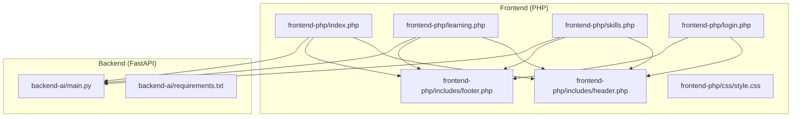
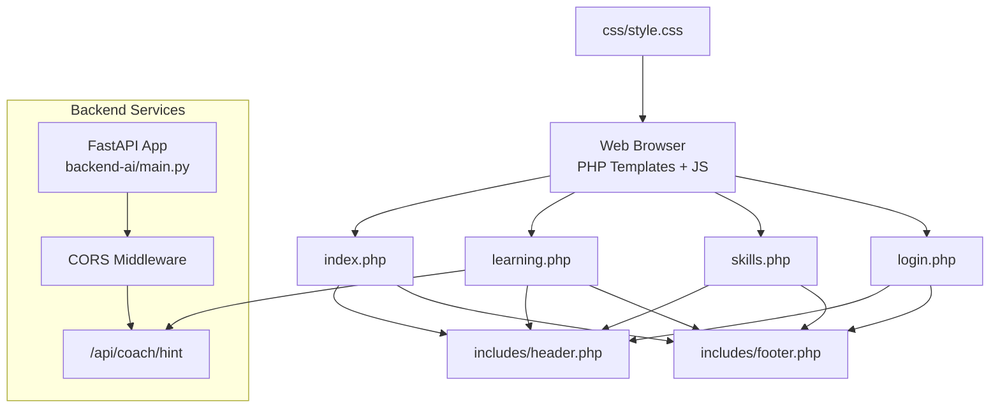
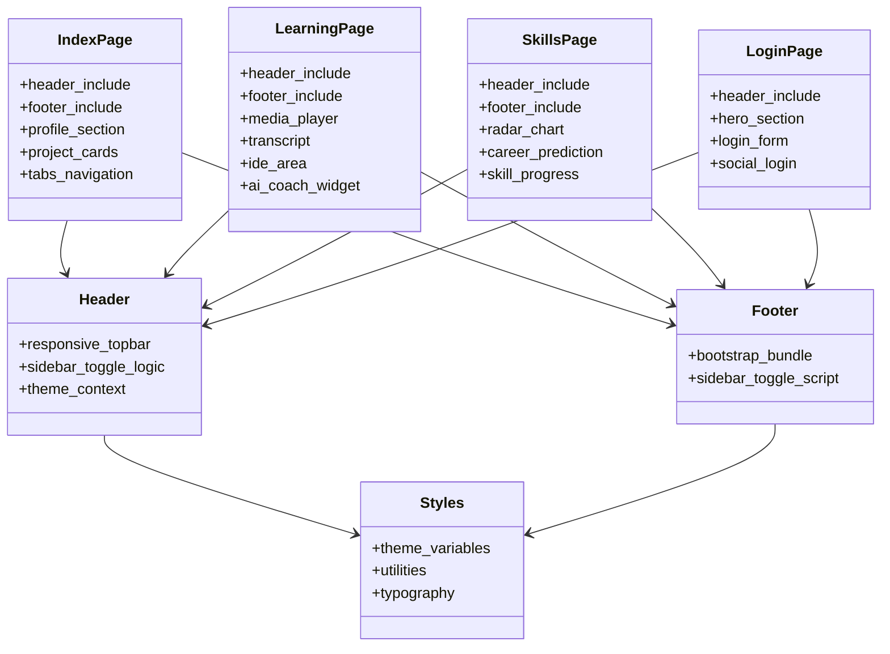
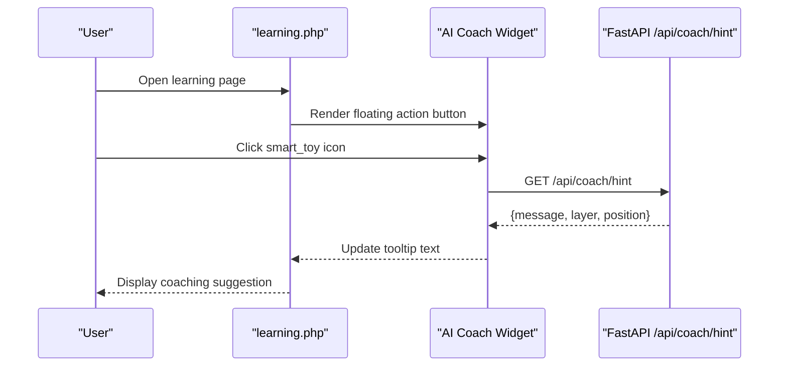
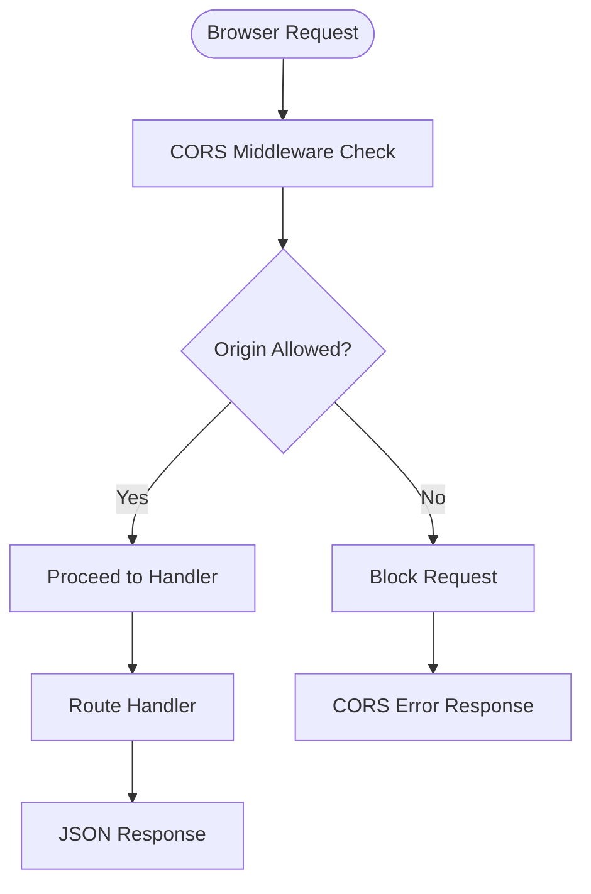
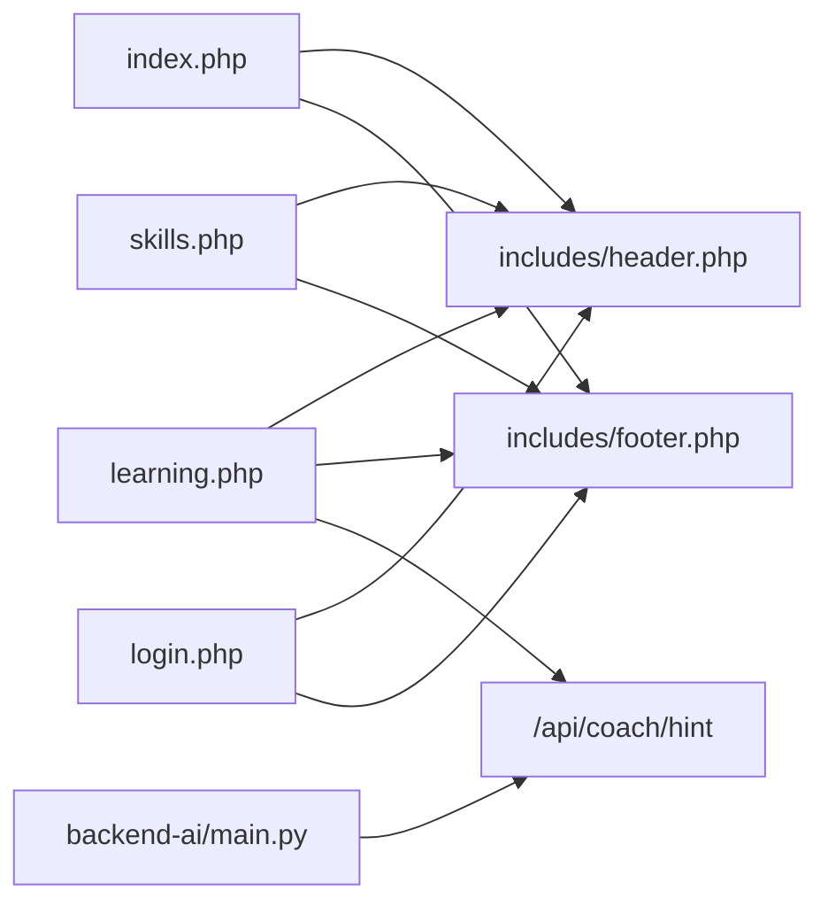

# Architecture Overview

<cite>
**Referenced Files in This Document**
- [index.php](file://frontend-php/index.php)
- [learning.php](file://frontend-php/learning.php)
- [skills.php](file://frontend-php/skills.php)
- [login.php](file://frontend-php/login.php)
- [header.php](file://frontend-php/includes/header.php)
- [footer.php](file://frontend-php/includes/footer.php)
- [style.css](file://frontend-php/css/style.css)
- [main.py](file://backend-ai/main.py)
- [requirements.txt](file://backend-ai/requirements.txt)
</cite>

## Table of Contents
1. [Introduction](#introduction)
2. [Project Structure](#project-structure)
3. [Core Components](#core-components)
4. [Architecture Overview](#architecture-overview)
5. [Detailed Component Analysis](#detailed-component-analysis)
6. [Dependency Analysis](#dependency-analysis)
7. [Performance Considerations](#performance-considerations)
8. [Troubleshooting Guide](#troubleshooting-guide)
9. [Conclusion](#conclusion)
10. [Appendices](#appendices)

## Introduction
This document describes the hybrid architecture of the Octal Foundry platform, which combines a PHP-based frontend (using an MVC-like structure with template includes) and a Python FastAPI backend. The frontend renders pages and UI components, while the backend exposes RESTful APIs for AI coaching, portfolio management, and skills assessment. Cross-cutting concerns such as CORS, session management, theme consistency, and responsive design are addressed to maintain a cohesive user experience across technologies.

## Project Structure
The repository is organized into two primary areas:
- frontend-php: PHP templates and assets implementing the UI and interactive widgets
- backend-ai: Python FastAPI server exposing REST endpoints

**Diagram sources**
- [index.php](file://frontend-php/index.php#L1-L174)
- [learning.php](file://frontend-php/learning.php#L1-L215)
- [skills.php](file://frontend-php/skills.php#L1-L189)
- [login.php](file://frontend-php/login.php#L1-L94)
- [header.php](file://frontend-php/includes/header.php#L1-L71)
- [footer.php](file://frontend-php/includes/footer.php#L1-L31)
- [style.css](file://frontend-php/css/style.css#L1-L114)
- [main.py](file://backend-ai/main.py#L1-L30)
- [requirements.txt](file://backend-ai/requirements.txt#L1-L3)

**Section sources**
- [index.php](file://frontend-php/index.php#L1-L174)
- [learning.php](file://frontend-php/learning.php#L1-L215)
- [skills.php](file://frontend-php/skills.php#L1-L189)
- [login.php](file://frontend-php/login.php#L1-L94)
- [header.php](file://frontend-php/includes/header.php#L1-L71)
- [footer.php](file://frontend-php/includes/footer.php#L1-L31)
- [style.css](file://frontend-php/css/style.css#L1-L114)
- [main.py](file://backend-ai/main.py#L1-L30)
- [requirements.txt](file://backend-ai/requirements.txt#L1-L3)

## Core Components
- PHP Frontend Templates
  - index.php: Portfolio and project showcase page with navigation and tabs
  - learning.php: Interactive learning page with media player, transcript, and AI coach widget
  - skills.php: Skills radar visualization and career prediction panel
  - login.php: Authentication entry point with social login options
  - includes/header.php: Shared layout, responsive top bar, and sidebar toggle logic
  - includes/footer.php: Shared layout wrapper and JavaScript initialization
  - css/style.css: Theme variables, typography, and utility classes for consistent UI

- FastAPI Backend
  - main.py: CORS-enabled FastAPI app with endpoints for AI coaching
  - requirements.txt: Python dependencies (FastAPI, Uvicorn)

Key integration points:
- Frontend pages include header.php and footer.php to share layout and scripts
- learning.php embeds an AI coach widget that calls http://localhost:8000/api/coach/hint via fetch
- backend-ai/main.py configures CORS to allow cross-origin requests from development origins

**Section sources**
- [index.php](file://frontend-php/index.php#L1-L174)
- [learning.php](file://frontend-php/learning.php#L1-L215)
- [skills.php](file://frontend-php/skills.php#L1-L189)
- [login.php](file://frontend-php/login.php#L1-L94)
- [header.php](file://frontend-php/includes/header.php#L1-L71)
- [footer.php](file://frontend-php/includes/footer.php#L1-L31)
- [style.css](file://frontend-php/css/style.css#L1-L114)
- [main.py](file://backend-ai/main.py#L1-L30)
- [requirements.txt](file://backend-ai/requirements.txt#L1-L3)

## Architecture Overview
The system follows a hybrid architecture:
- Presentation layer: PHP templates render HTML and manage UI state
- Interaction layer: JavaScript in pages initiates REST calls to the backend
- Business logic layer: FastAPI endpoints provide AI coaching suggestions and status checks

**Diagram sources**
- [index.php](file://frontend-php/index.php#L1-L174)
- [learning.php](file://frontend-php/learning.php#L1-L215)
- [skills.php](file://frontend-php/skills.php#L1-L189)
- [login.php](file://frontend-php/login.php#L1-L94)
- [header.php](file://frontend-php/includes/header.php#L1-L71)
- [footer.php](file://frontend-php/includes/footer.php#L1-L31)
- [style.css](file://frontend-php/css/style.css#L1-L114)
- [main.py](file://backend-ai/main.py#L1-L30)

## Detailed Component Analysis

### PHP Frontend Template System
The frontend uses a minimal MVC-like structure:
- Controllers: PHP files act as page controllers (index.php, learning.php, skills.php, login.php)
- Views: Each page composes reusable header and footer includes
- Layout: includes/header.php centralizes responsive navigation and sidebar toggle logic
- Styling: css/style.css defines theme tokens and utility classes applied across views

**Diagram sources**
- [index.php](file://frontend-php/index.php#L1-L174)
- [learning.php](file://frontend-php/learning.php#L1-L215)
- [skills.php](file://frontend-php/skills.php#L1-L189)
- [login.php](file://frontend-php/login.php#L1-L94)
- [header.php](file://frontend-php/includes/header.php#L1-L71)
- [footer.php](file://frontend-php/includes/footer.php#L1-L31)
- [style.css](file://frontend-php/css/style.css#L1-L114)

**Section sources**
- [index.php](file://frontend-php/index.php#L1-L174)
- [learning.php](file://frontend-php/learning.php#L1-L215)
- [skills.php](file://frontend-php/skills.php#L1-L189)
- [login.php](file://frontend-php/login.php#L1-L94)
- [header.php](file://frontend-php/includes/header.php#L1-L71)
- [footer.php](file://frontend-php/includes/footer.php#L1-L31)
- [style.css](file://frontend-php/css/style.css#L1-L114)

### AI Coaching Integration Pattern
The AI coaching widget in learning.php demonstrates a RESTful integration:
- On open, the widget triggers a fetch to http://localhost:8000/api/coach/hint
- The backend responds with a JSON payload containing a coaching hint
- The UI updates dynamically to display the suggestion

**Diagram sources**
- [learning.php](file://frontend-php/learning.php#L177-L212)
- [main.py](file://backend-ai/main.py#L23-L29)

**Section sources**
- [learning.php](file://frontend-php/learning.php#L177-L212)
- [main.py](file://backend-ai/main.py#L23-L29)

### CORS Middleware and Cross-Origin Requests
The backend enables cross-origin requests to support local development:
- Origins configured to accept "*" for development convenience
- Credentials, methods, and headers allowed broadly during development

**Diagram sources**
- [main.py](file://backend-ai/main.py#L6-L17)

**Section sources**
- [main.py](file://backend-ai/main.py#L6-L17)

### Theme Consistency and Responsive Design
Theme consistency is achieved through:
- CSS custom properties in style.css defining primary colors and backgrounds
- Utility classes for glass effects, rounded corners, and typography
- Bootstrap integration for responsive grid and component behavior

Responsive design elements:
- Sticky headers and bottom navigation bars
- Flexible grids for project cards and skill progress bars
- Sidebar toggle logic in header.php for mobile-friendly navigation

**Section sources**
- [style.css](file://frontend-php/css/style.css#L1-L114)
- [header.php](file://frontend-php/includes/header.php#L22-L26)
- [index.php](file://frontend-php/index.php#L23-L102)
- [skills.php](file://frontend-php/skills.php#L18-L166)

## Dependency Analysis
High-level dependencies:
- Frontend depends on shared includes and CSS for consistent rendering
- learning.php depends on backend endpoint for AI coaching
- Backend depends on FastAPI and CORS middleware for cross-origin support

**Diagram sources**
- [index.php](file://frontend-php/index.php#L1-L174)
- [learning.php](file://frontend-php/learning.php#L1-L215)
- [skills.php](file://frontend-php/skills.php#L1-L189)
- [login.php](file://frontend-php/login.php#L1-L94)
- [header.php](file://frontend-php/includes/header.php#L1-L71)
- [footer.php](file://frontend-php/includes/footer.php#L1-L31)
- [main.py](file://backend-ai/main.py#L23-L29)

**Section sources**
- [index.php](file://frontend-php/index.php#L1-L174)
- [learning.php](file://frontend-php/learning.php#L1-L215)
- [skills.php](file://frontend-php/skills.php#L1-L189)
- [login.php](file://frontend-php/login.php#L1-L94)
- [header.php](file://frontend-php/includes/header.php#L1-L71)
- [footer.php](file://frontend-php/includes/footer.php#L1-L31)
- [main.py](file://backend-ai/main.py#L1-L30)

## Performance Considerations
- Minimize frontend JavaScript fetch calls; batch or debounce as needed
- Use lazy loading for images and media players to reduce initial load
- Keep CORS configuration restrictive in production to avoid unnecessary overhead
- Cache static assets and leverage browser caching headers

## Troubleshooting Guide
Common issues and resolutions:
- AI coach widget shows offline or connection failed
  - Verify backend is running on http://localhost:8000
  - Confirm CORS allows the origin in development
  - Check network tab for blocked requests due to CORS policy

- Theme inconsistencies across pages
  - Ensure header.php and footer.php are included on each page
  - Verify style.css is linked and loaded before interactive scripts

- Sidebar toggle not working on mobile
  - Confirm sidebar and overlay elements exist in the DOM
  - Check that sidebar toggle script runs after DOMContentLoaded

**Section sources**
- [learning.php](file://frontend-php/learning.php#L177-L212)
- [main.py](file://backend-ai/main.py#L6-L17)
- [header.php](file://frontend-php/includes/header.php#L8-L18)
- [footer.php](file://frontend-php/includes/footer.php#L7-L28)

## Conclusion
The Octal Foundry platform employs a pragmatic hybrid architecture: PHP templates deliver a responsive, theme-consistent UI, while FastAPI provides lightweight REST endpoints for AI coaching. CORS middleware enables seamless cross-origin communication during development. By maintaining shared layouts and CSS utilities, the system achieves cohesion across technologies and supports future extensions for portfolio management and skills assessment.

## Appendices
- Development setup
  - Backend: Install dependencies from requirements.txt and run the FastAPI app
  - Frontend: Serve PHP files via a local web server; ensure CORS is configured for development origins

**Section sources**
- [requirements.txt](file://backend-ai/requirements.txt#L1-L3)
- [main.py](file://backend-ai/main.py#L1-L30)