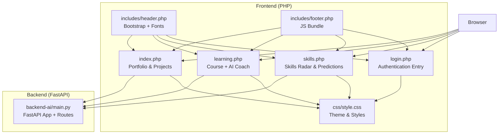
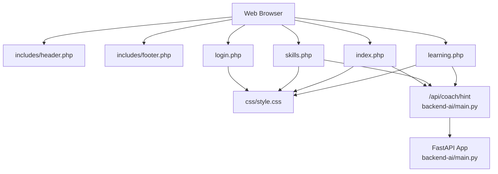
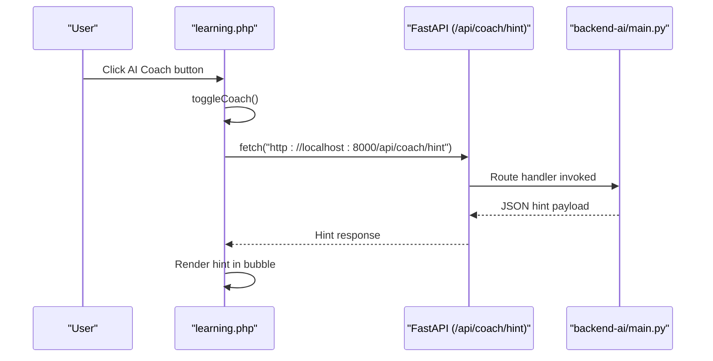
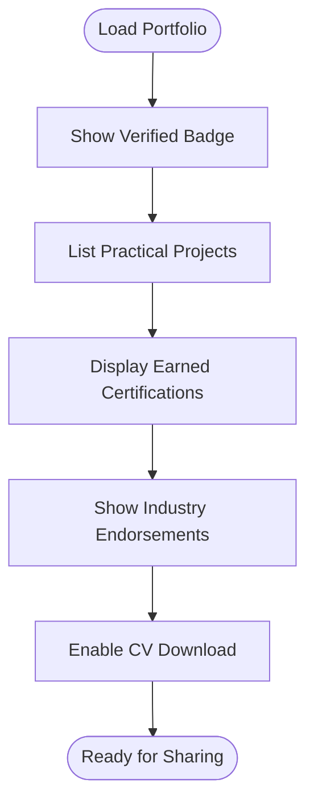
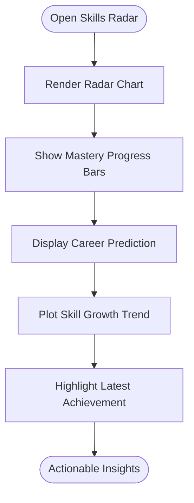
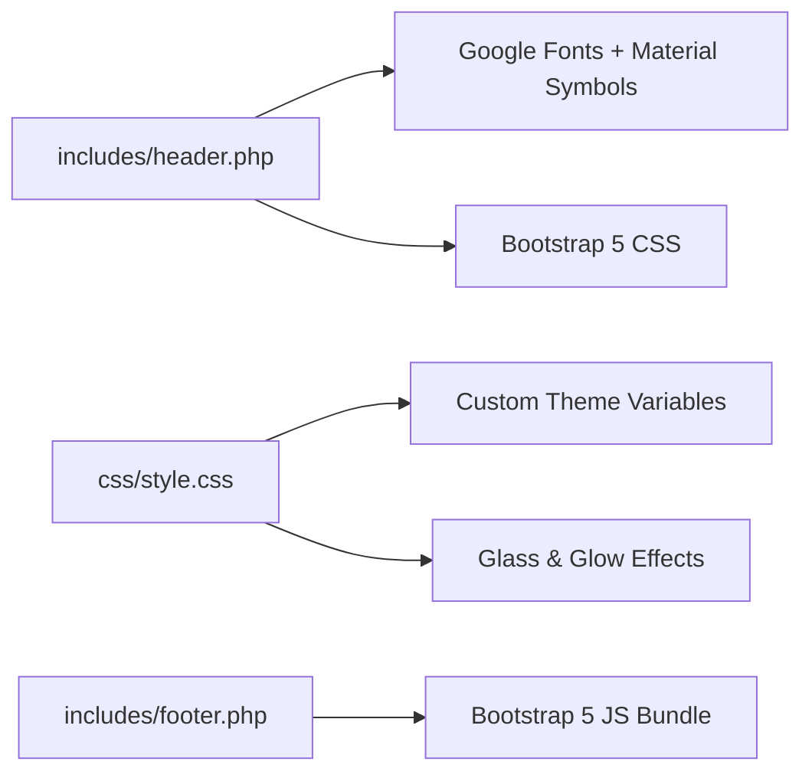
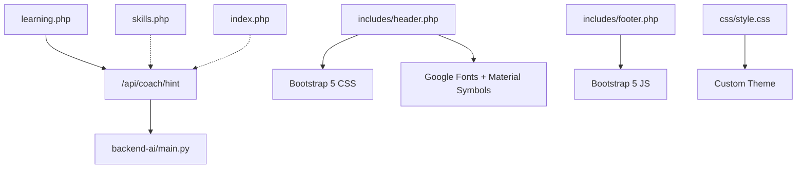

# Introduction and Purpose

<cite>
**Referenced Files in This Document**
- [backend-ai/main.py](file://backend-ai/main.py)
- [frontend-php/index.php](file://frontend-php/index.php)
- [frontend-php/learning.php](file://frontend-php/learning.php)
- [frontend-php/skills.php](file://frontend-php/skills.php)
- [frontend-php/login.php](file://frontend-php/login.php)
- [frontend-php/css/style.css](file://frontend-php/css/style.css)
- [frontend-php/includes/header.php](file://frontend-php/includes/header.php)
- [frontend-php/includes/footer.php](file://frontend-php/includes/footer.php)
</cite>

## Table of Contents
1. [Introduction](#introduction)
2. [Project Structure](#project-structure)
3. [Core Components](#core-components)
4. [Architecture Overview](#architecture-overview)
5. [Detailed Component Analysis](#detailed-component-analysis)
6. [Dependency Analysis](#dependency-analysis)
7. [Performance Considerations](#performance-considerations)
8. [Troubleshooting Guide](#troubleshooting-guide)
9. [Conclusion](#conclusion)

## Introduction
Octal Foundry is an AI-powered educational ecosystem designed to bridge the gap between theoretical AI knowledge and industry-ready practical skills. It targets AI engineering students and professionals transitioning into AI, offering a modern learning platform that combines interactive instruction, real-time AI coaching, and professional portfolio building. Unlike conventional learning management systems, Octal Foundry integrates an AI performance coach directly into the learning interface, enabling personalized, contextual guidance during hands-on tasks. The platform emphasizes competency-driven outcomes, with learners constructing a verifiable portfolio of projects, certifications, and endorsements that reflect real-world AI engineering capabilities.

Key value propositions:
- Personalized AI coaching integrated into the learning workflow
- Hands-on project development with immediate feedback loops
- Industry-recognized certifications and verification badges
- Real-time AI assistance for problem-solving and skill reinforcement

How Octal Foundry differs from conventional LMS platforms:
- AI coaching is embedded as a persistent, actionable assistant rather than a static helpdesk
- Learning is task-centric with live IDE-like environments for experimentation
- Portfolio and skills visualization emphasize practical mastery and career alignment
- Verified credentials and industry endorsements reinforce employability

## Project Structure
The repository is organized into two primary layers:
- Frontend (PHP-based web application) implementing UI pages for login, learning, skills visualization, and portfolio
- Backend (FastAPI service) exposing lightweight APIs for AI coaching hints and future integrations

**Diagram sources**
- [frontend-php/index.php](file://frontend-php/index.php#L1-L174)
- [frontend-php/learning.php](file://frontend-php/learning.php#L1-L215)
- [frontend-php/skills.php](file://frontend-php/skills.php#L1-L189)
- [frontend-php/login.php](file://frontend-php/login.php#L1-L94)
- [frontend-php/css/style.css](file://frontend-php/css/style.css#L1-L114)
- [frontend-php/includes/header.php](file://frontend-php/includes/header.php#L1-L23)
- [frontend-php/includes/footer.php](file://frontend-php/includes/footer.php#L1-L7)
- [backend-ai/main.py](file://backend-ai/main.py#L1-L30)

**Section sources**
- [frontend-php/index.php](file://frontend-php/index.php#L1-L174)
- [frontend-php/learning.php](file://frontend-php/learning.php#L1-L215)
- [frontend-php/skills.php](file://frontend-php/skills.php#L1-L189)
- [frontend-php/login.php](file://frontend-php/login.php#L1-L94)
- [frontend-php/css/style.css](file://frontend-php/css/style.css#L1-L114)
- [frontend-php/includes/header.php](file://frontend-php/includes/header.php#L1-L23)
- [frontend-php/includes/footer.php](file://frontend-php/includes/footer.php#L1-L7)
- [backend-ai/main.py](file://backend-ai/main.py#L1-L30)

## Core Components
- AI Coaching API (FastAPI):
  - Provides a single endpoint delivering contextual hints to learners during tasks
  - Designed to be extended for richer AI assistance and adaptive guidance
- Learning Page (learning.php):
  - Course media player, transcript, resources, and a code editor area
  - Integrated AI coach widget that fetches hints from the backend
- Portfolio Page (index.php):
  - Learner profile, verified badge, project showcase, certificates, and industry endorsements
- Skills Visualization (skills.php):
  - Skills radar chart, mastery progress bars, career prediction insights, and growth trends
- Authentication Entry (login.php):
  - University email login, social login option, and onboarding messaging

These components collectively support the platform’s mission by combining structured learning, practical tasks, and AI-assisted guidance, while showcasing learner achievements and competencies.

**Section sources**
- [backend-ai/main.py](file://backend-ai/main.py#L19-L30)
- [frontend-php/learning.php](file://frontend-php/learning.php#L152-L212)
- [frontend-php/index.php](file://frontend-php/index.php#L23-L151)
- [frontend-php/skills.php](file://frontend-php/skills.php#L18-L166)
- [frontend-php/login.php](file://frontend-php/login.php#L11-L91)

## Architecture Overview
The platform follows a thin-client architecture:
- Frontend pages are rendered server-side with PHP and styled via a shared CSS theme
- A lightweight FastAPI backend exposes an AI coaching endpoint consumed by the learning interface
- Bootstrap and custom styles provide a cohesive UI framework

**Diagram sources**
- [frontend-php/includes/header.php](file://frontend-php/includes/header.php#L1-L23)
- [frontend-php/includes/footer.php](file://frontend-php/includes/footer.php#L1-L7)
- [frontend-php/index.php](file://frontend-php/index.php#L1-L174)
- [frontend-php/learning.php](file://frontend-php/learning.php#L1-L215)
- [frontend-php/skills.php](file://frontend-php/skills.php#L1-L189)
- [frontend-php/login.php](file://frontend-php/login.php#L1-L94)
- [frontend-php/css/style.css](file://frontend-php/css/style.css#L1-L114)
- [backend-ai/main.py](file://backend-ai/main.py#L1-L30)

## Detailed Component Analysis

### AI Coaching Integration (learning.php + backend-ai/main.py)
The learning page embeds an AI coach widget that fetches hints from the backend. On open, the client requests a hint from the backend and displays it in a tooltip bubble. This demonstrates the platform’s commitment to integrating AI assistance directly into the learning process.

**Diagram sources**
- [frontend-php/learning.php](file://frontend-php/learning.php#L177-L212)
- [backend-ai/main.py](file://backend-ai/main.py#L23-L30)

**Section sources**
- [frontend-php/learning.php](file://frontend-php/learning.php#L152-L212)
- [backend-ai/main.py](file://backend-ai/main.py#L23-L30)

### Portfolio and Verification (index.php)
The portfolio page showcases a learner’s projects, verified badge, downloadable CV, earned certifications, and industry endorsements. This serves as a professional portfolio that validates practical AI engineering skills and real-world impact.

**Diagram sources**
- [frontend-php/index.php](file://frontend-php/index.php#L23-L151)

**Section sources**
- [frontend-php/index.php](file://frontend-php/index.php#L23-L151)

### Skills Visualization and Career Insights (skills.php)
The skills page presents a radar chart of technical proficiency, soft skills, theory knowledge, and problem-solving ability. It also includes mastery progress bars, a career prediction panel, and a skill growth trend. These features help learners track progress and align study paths with industry demands.

**Diagram sources**
- [frontend-php/skills.php](file://frontend-php/skills.php#L18-L166)

**Section sources**
- [frontend-php/skills.php](file://frontend-php/skills.php#L18-L166)

### Theme and UI Foundation (css/style.css + header.php + footer.php)
The UI leverages a dark theme with blue and orange accents, glass effects, and responsive layouts. Bootstrap 5 provides component scaffolding, while custom CSS defines typography, backgrounds, and interactive states. The header includes Google Fonts and Material Symbols, and the footer bundles Bootstrap JS.

**Diagram sources**
- [frontend-php/includes/header.php](file://frontend-php/includes/header.php#L1-L23)
- [frontend-php/css/style.css](file://frontend-php/css/style.css#L1-L114)
- [frontend-php/includes/footer.php](file://frontend-php/includes/footer.php#L1-L7)

**Section sources**
- [frontend-php/css/style.css](file://frontend-php/css/style.css#L1-L114)
- [frontend-php/includes/header.php](file://frontend-php/includes/header.php#L1-L23)
- [frontend-php/includes/footer.php](file://frontend-php/includes/footer.php#L1-L7)

## Dependency Analysis
- Frontend-to-backend coupling:
  - The learning page depends on the backend route for AI hints
  - The skills and portfolio pages do not currently call the backend, but are prepared for future integrations
- External dependencies:
  - Bootstrap 5 for UI components
  - Google Fonts and Material Symbols for typography and icons
- Internal cohesion:
  - Shared header and footer templates reduce duplication and maintain consistent styling
- Potential circular dependencies:
  - None observed; pages include shared templates rather than importing each other

**Diagram sources**
- [frontend-php/learning.php](file://frontend-php/learning.php#L177-L212)
- [frontend-php/skills.php](file://frontend-php/skills.php#L1-L189)
- [frontend-php/index.php](file://frontend-php/index.php#L1-L174)
- [backend-ai/main.py](file://backend-ai/main.py#L23-L30)
- [frontend-php/includes/header.php](file://frontend-php/includes/header.php#L1-L23)
- [frontend-php/includes/footer.php](file://frontend-php/includes/footer.php#L1-L7)
- [frontend-php/css/style.css](file://frontend-php/css/style.css#L1-L114)

**Section sources**
- [frontend-php/learning.php](file://frontend-php/learning.php#L177-L212)
- [frontend-php/skills.php](file://frontend-php/skills.php#L1-L189)
- [frontend-php/index.php](file://frontend-php/index.php#L1-L174)
- [backend-ai/main.py](file://backend-ai/main.py#L23-L30)
- [frontend-php/includes/header.php](file://frontend-php/includes/header.php#L1-L23)
- [frontend-php/includes/footer.php](file://frontend-php/includes/footer.php#L1-L7)
- [frontend-php/css/style.css](file://frontend-php/css/style.css#L1-L114)

## Performance Considerations
- Lightweight backend: The current AI hint endpoint is minimal and suitable for rapid iteration; as features scale, consider caching and rate limiting
- Frontend responsiveness: The use of CSS variables and glass effects is performant; keep JavaScript logic minimal to preserve smooth interactions
- Network efficiency: The AI coach fetch occurs on demand; ensure the endpoint remains fast and resilient under load
- Asset delivery: Serve fonts and icons efficiently; consider preloading critical resources

## Troubleshooting Guide
Common issues and resolutions:
- AI coach not loading:
  - Verify the backend is running and reachable at the configured host/port
  - Confirm CORS settings allow the frontend origin
- UI rendering inconsistencies:
  - Ensure the shared header and footer are included on all pages
  - Check that CSS and Bootstrap assets are loaded without errors
- Styling anomalies:
  - Validate custom CSS variables and theme overrides
  - Confirm Material Symbols and Google Fonts are accessible

**Section sources**
- [backend-ai/main.py](file://backend-ai/main.py#L6-L17)
- [frontend-php/learning.php](file://frontend-php/learning.php#L177-L212)
- [frontend-php/includes/header.php](file://frontend-php/includes/header.php#L1-L23)
- [frontend-php/includes/footer.php](file://frontend-php/includes/footer.php#L1-L7)
- [frontend-php/css/style.css](file://frontend-php/css/style.css#L1-L114)

## Conclusion
Octal Foundry positions itself as an AI-first educational ecosystem that transforms traditional AI learning into a dynamic, competency-focused journey. By embedding an AI coach into the learning workflow, providing hands-on project development, and enabling professional portfolio building with verified credentials and endorsements, the platform addresses the critical gap between academic theory and industry readiness. Its modular frontend and lightweight backend architecture offer a scalable foundation for future enhancements, ensuring learners receive personalized, real-time support while building a portfolio that speaks to employers and peers alike.