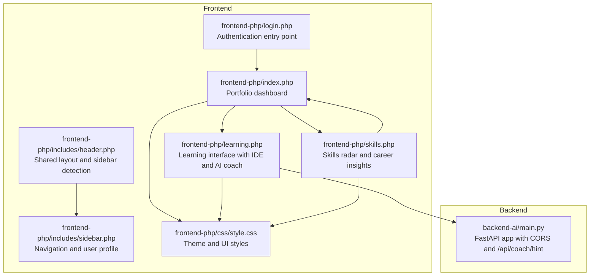
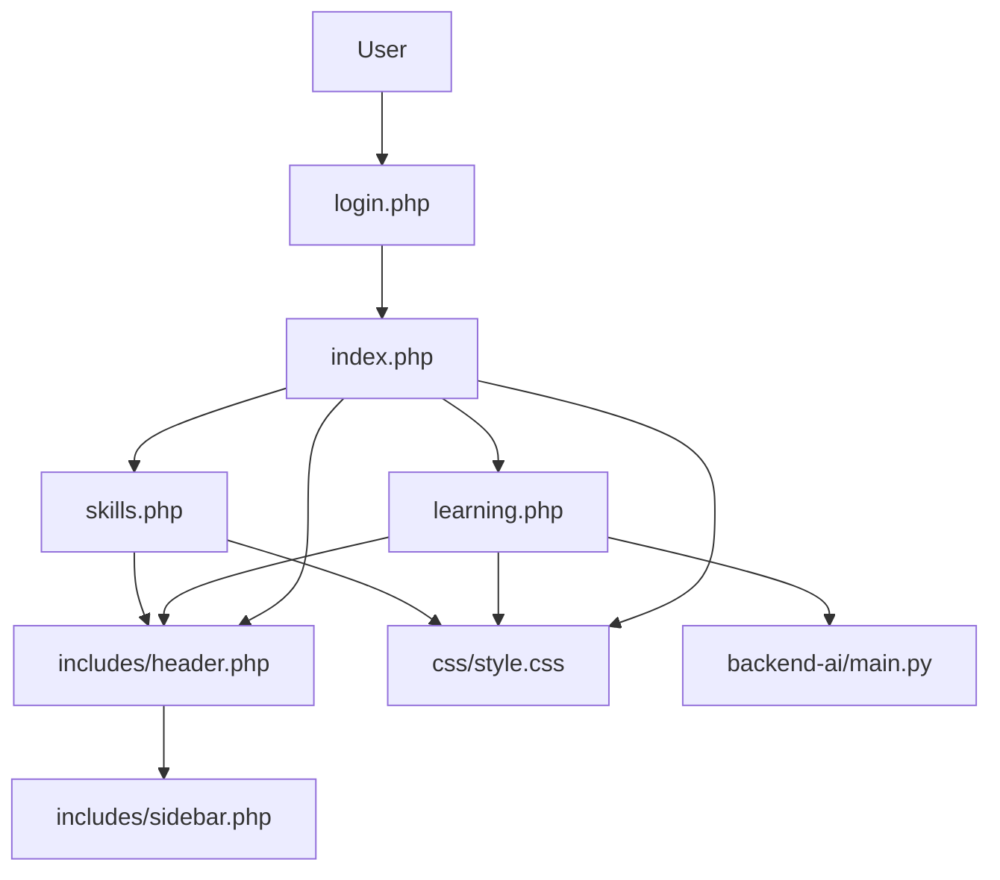
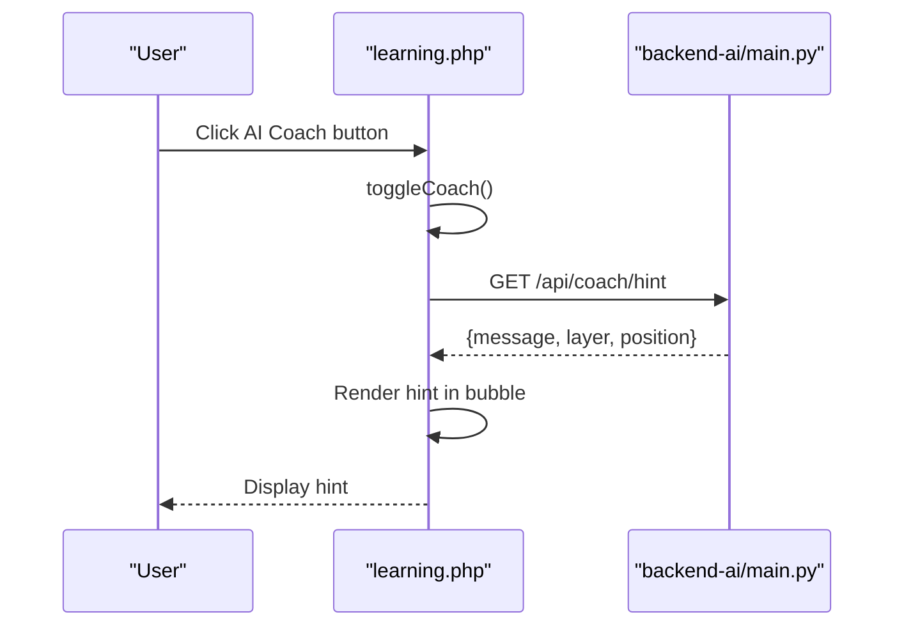
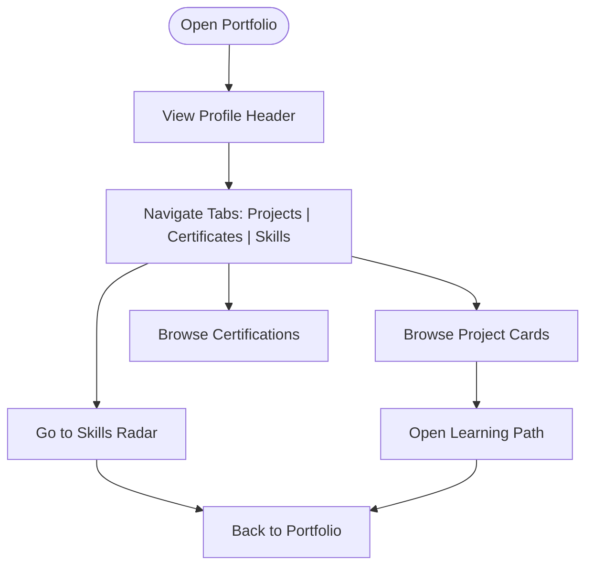
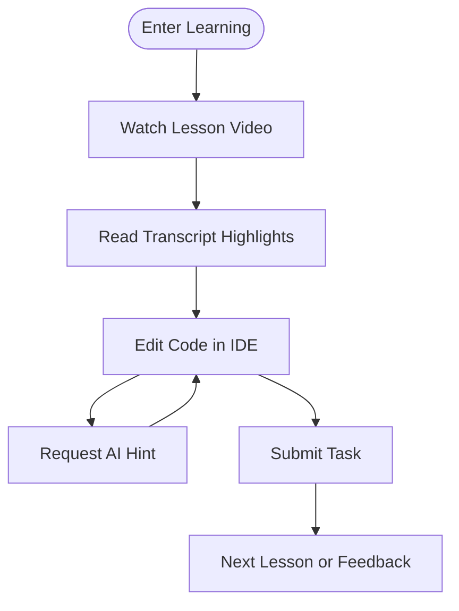
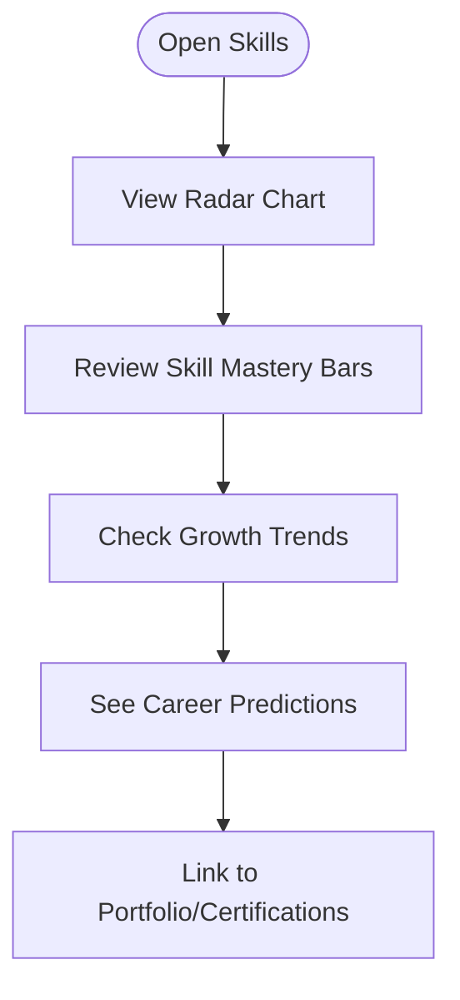
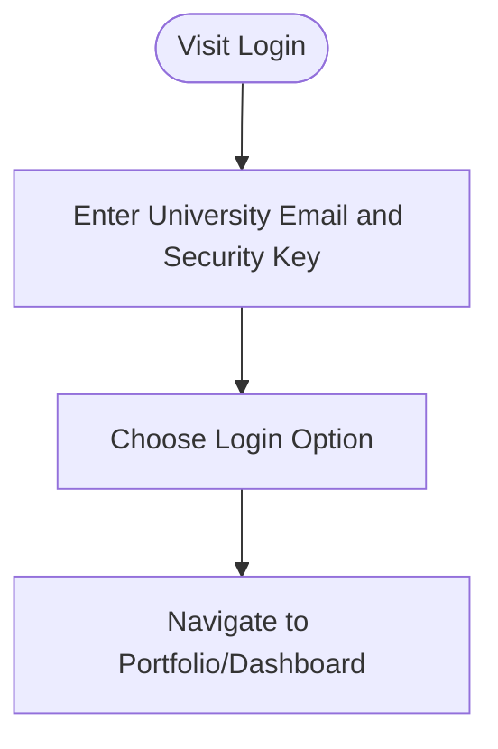
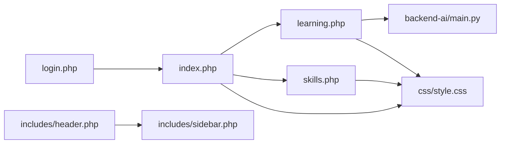

# Key Features Overview

<cite>
**Referenced Files in This Document**
- [backend-ai/main.py](file://backend-ai/main.py)
- [frontend-php/index.php](file://frontend-php/index.php)
- [frontend-php/learning.php](file://frontend-php/learning.php)
- [frontend-php/login.php](file://frontend-php/login.php)
- [frontend-php/skills.php](file://frontend-php/skills.php)
- [frontend-php/includes/header.php](file://frontend-php/includes/header.php)
- [frontend-php/includes/sidebar.php](file://frontend-php/includes/sidebar.php)
- [frontend-php/css/style.css](file://frontend-php/css/style.css)
</cite>

## Table of Contents
1. [Introduction](#introduction)
2. [Project Structure](#project-structure)
3. [Core Components](#core-components)
4. [Architecture Overview](#architecture-overview)
5. [Detailed Component Analysis](#detailed-component-analysis)
6. [Dependency Analysis](#dependency-analysis)
7. [Performance Considerations](#performance-considerations)
8. [Troubleshooting Guide](#troubleshooting-guide)
9. [Conclusion](#conclusion)

## Introduction
This document presents a comprehensive overview of the five core features of Octal Foundry: AI Coaching System, Portfolio Management, Learning Interface, Skills Assessment, and Authentication. It explains each feature’s primary functionality, user benefits, and technical implementation approach, and demonstrates how they integrate to deliver a cohesive educational experience. Concrete examples from the codebase illustrate implementation patterns, including the AI coaching hint endpoint, portfolio showcase, learning interface with integrated IDE and hints, skills radar visualization, and session-based navigation.

## Project Structure
Octal Foundry is organized into two primary layers:
- Backend: A minimal FastAPI server exposing an AI coaching endpoint.
- Frontend: PHP-based pages implementing the user interface for portfolio, learning, skills assessment, and authentication flows, styled with a custom CSS theme.

**Diagram sources**
- [backend-ai/main.py](file://backend-ai/main.py#L1-L30)
- [frontend-php/includes/header.php](file://frontend-php/includes/header.php#L22-L35)
- [frontend-php/includes/sidebar.php](file://frontend-php/includes/sidebar.php#L1-L81)
- [frontend-php/css/style.css](file://frontend-php/css/style.css#L1-L114)
- [frontend-php/login.php](file://frontend-php/login.php#L1-L94)
- [frontend-php/index.php](file://frontend-php/index.php#L1-L174)
- [frontend-php/learning.php](file://frontend-php/learning.php#L1-L215)
- [frontend-php/skills.php](file://frontend-php/skills.php#L1-L189)

**Section sources**
- [backend-ai/main.py](file://backend-ai/main.py#L1-L30)
- [frontend-php/includes/header.php](file://frontend-php/includes/header.php#L22-L35)
- [frontend-php/includes/sidebar.php](file://frontend-php/includes/sidebar.php#L1-L81)
- [frontend-php/css/style.css](file://frontend-php/css/style.css#L1-L114)
- [frontend-php/login.php](file://frontend-php/login.php#L1-L94)
- [frontend-php/index.php](file://frontend-php/index.php#L1-L174)
- [frontend-php/learning.php](file://frontend-php/learning.php#L1-L215)
- [frontend-php/skills.php](file://frontend-php/skills.php#L1-L189)

## Core Components
- AI Coaching System: Exposes a single endpoint returning contextual hints to learners during hands-on tasks.
- Portfolio Management: Displays projects, certifications, endorsements, and profile actions in a responsive dashboard.
- Learning Interface: Combines video lessons, transcripts, resources, and an embedded IDE with an AI coach widget.
- Skills Assessment: Visualizes competency via a radar chart and provides progress insights and career predictions.
- Authentication: Provides a login entry point and navigates users into the platform.

Each component is implemented with clear separation of concerns: backend APIs for data/state, frontend pages for presentation and UX, and shared layout/components for consistency.

**Section sources**
- [backend-ai/main.py](file://backend-ai/main.py#L23-L29)
- [frontend-php/index.php](file://frontend-php/index.php#L23-L151)
- [frontend-php/learning.php](file://frontend-php/learning.php#L19-L175)
- [frontend-php/skills.php](file://frontend-php/skills.php#L18-L166)
- [frontend-php/login.php](file://frontend-php/login.php#L1-L94)

## Architecture Overview
The system follows a thin-client architecture:
- Frontend pages render UI and orchestrate user workflows.
- The AI coaching widget triggers asynchronous requests to the backend endpoint.
- Shared layout and sidebar enable consistent navigation across pages.
- Theme and styles unify the visual language.

**Diagram sources**
- [frontend-php/login.php](file://frontend-php/login.php#L1-L94)
- [frontend-php/index.php](file://frontend-php/index.php#L1-L174)
- [frontend-php/learning.php](file://frontend-php/learning.php#L1-L215)
- [frontend-php/skills.php](file://frontend-php/skills.php#L1-L189)
- [frontend-php/includes/header.php](file://frontend-php/includes/header.php#L22-L35)
- [frontend-php/includes/sidebar.php](file://frontend-php/includes/sidebar.php#L1-L81)
- [frontend-php/css/style.css](file://frontend-php/css/style.css#L1-L114)
- [backend-ai/main.py](file://backend-ai/main.py#L1-L30)

## Detailed Component Analysis

### AI Coaching System
- Primary Functionality: Provides contextual hints to learners working on tasks. The frontend opens a floating coach widget and requests a hint from the backend endpoint.
- User Benefits: Real-time, targeted guidance reduces friction during coding tasks and accelerates problem resolution.
- Technical Implementation Approach:
  - Backend: FastAPI app exposes a GET endpoint returning structured hint data.
  - Frontend: On widget open, a fetch call retrieves the hint and displays it in a tooltip bubble.
  - CORS: Middleware configured to allow cross-origin requests for development.

**Diagram sources**
- [frontend-php/learning.php](file://frontend-php/learning.php#L177-L212)
- [backend-ai/main.py](file://backend-ai/main.py#L23-L29)

**Section sources**
- [backend-ai/main.py](file://backend-ai/main.py#L23-L29)
- [frontend-php/learning.php](file://frontend-php/learning.php#L177-L212)

### Portfolio Management
- Primary Functionality: Showcases a student’s profile, projects, certifications, and industry endorsements in a unified dashboard.
- User Benefits: Centralized view of accomplishments and social proof supports applications and self-reflection.
- Technical Implementation Approach:
  - Responsive layout with tabs for Projects, Certificates, and Skills.
  - Interactive bottom navigation linking to key sections.
  - Verified badges and share/settings actions enhance engagement.

**Diagram sources**
- [frontend-php/index.php](file://frontend-php/index.php#L23-L151)

**Section sources**
- [frontend-php/index.php](file://frontend-php/index.php#L23-L151)

### Learning Interface
- Primary Functionality: Delivers video lessons, transcripts, resources, and an integrated IDE for hands-on tasks, with optional AI coaching hints.
- User Benefits: Immersive, guided learning with immediate feedback and contextual support.
- Technical Implementation Approach:
  - Media player with progress bar and controls.
  - Transcript panel highlighting current time and key moments.
  - IDE area with syntax-highlighted template and “Submit Task” action.
  - Floating AI coach widget integrates with backend endpoint for hints.

**Diagram sources**
- [frontend-php/learning.php](file://frontend-php/learning.php#L19-L175)

**Section sources**
- [frontend-php/learning.php](file://frontend-php/learning.php#L19-L175)

### Skills Assessment
- Primary Functionality: Visualizes competency across domains using a radar chart and provides mastery breakdown, trends, and career predictions.
- User Benefits: Clear visibility into strengths and gaps, actionable growth signals, and aligned career suggestions.
- Technical Implementation Approach:
  - Hexagonal radar grid with labeled axes and a filled polygon representing current mastery.
  - Progress bars per skill and trend bars over time.
  - Career prediction cards derived from proficiency metrics.

**Diagram sources**
- [frontend-php/skills.php](file://frontend-php/skills.php#L18-L166)

**Section sources**
- [frontend-php/skills.php](file://frontend-php/skills.php#L18-L166)

### Authentication
- Primary Functionality: Provides a login entry point with university email and security key, plus social login options.
- User Benefits: Secure, streamlined access to the platform with optional “remember me” persistence.
- Technical Implementation Approach:
  - Login form with icons and placeholders.
  - Navigation to portfolio/dashboard upon successful login.
  - Consistent header and sidebar layout for subsequent navigation.

**Diagram sources**
- [frontend-php/login.php](file://frontend-php/login.php#L1-L94)

**Section sources**
- [frontend-php/login.php](file://frontend-php/login.php#L1-L94)

## Dependency Analysis
- Frontend-to-Backend:
  - The learning interface depends on the backend endpoint for AI hints.
- Frontend-to-Layout:
  - All pages rely on shared header and sidebar components for consistent navigation and branding.
- Styling:
  - Global CSS variables and utility classes unify the visual theme across pages.

**Diagram sources**
- [frontend-php/login.php](file://frontend-php/login.php#L1-L94)
- [frontend-php/index.php](file://frontend-php/index.php#L1-L174)
- [frontend-php/learning.php](file://frontend-php/learning.php#L1-L215)
- [frontend-php/skills.php](file://frontend-php/skills.php#L1-L189)
- [frontend-php/includes/header.php](file://frontend-php/includes/header.php#L22-L35)
- [frontend-php/includes/sidebar.php](file://frontend-php/includes/sidebar.php#L1-L81)
- [frontend-php/css/style.css](file://frontend-php/css/style.css#L1-L114)
- [backend-ai/main.py](file://backend-ai/main.py#L1-L30)

**Section sources**
- [frontend-php/includes/header.php](file://frontend-php/includes/header.php#L22-L35)
- [frontend-php/includes/sidebar.php](file://frontend-php/includes/sidebar.php#L1-L81)
- [frontend-php/css/style.css](file://frontend-php/css/style.css#L1-L114)
- [backend-ai/main.py](file://backend-ai/main.py#L1-L30)

## Performance Considerations
- Network Requests:
  - Minimize redundant AI hint requests by caching responses client-side until the user closes the widget.
- Rendering:
  - Keep radar chart and progress bars lightweight; defer heavy computations to backend if needed.
- Assets:
  - Lazy-load media assets in the learning interface to reduce initial load time.
- Styling:
  - Reuse CSS variables and avoid excessive DOM nesting to maintain smooth scrolling and transitions.

## Troubleshooting Guide
- AI Coach Not Responding:
  - Verify the backend endpoint is reachable and CORS allows requests from the frontend origin.
  - Confirm the fetch call uses the correct host/port and handles non-OK responses gracefully.
- Login Issues:
  - Ensure the login form links to the portfolio/dashboard and that navigation is intact.
- Visual Discrepancies:
  - Check that global CSS variables and theme classes are applied consistently across pages.

**Section sources**
- [backend-ai/main.py](file://backend-ai/main.py#L11-L17)
- [frontend-php/learning.php](file://frontend-php/learning.php#L177-L212)
- [frontend-php/login.php](file://frontend-php/login.php#L57-L60)
- [frontend-php/css/style.css](file://frontend-php/css/style.css#L1-L114)

## Conclusion
Octal Foundry’s five core features form a cohesive learning ecosystem. The AI Coaching System augments hands-on learning with contextual hints, Portfolio Management centralizes achievements, the Learning Interface blends theory and practice with an integrated IDE, Skills Assessment offers deep competency insights, and Authentication provides secure access. Together, they create a modern, immersive educational experience grounded in practical implementation patterns visible in the codebase.