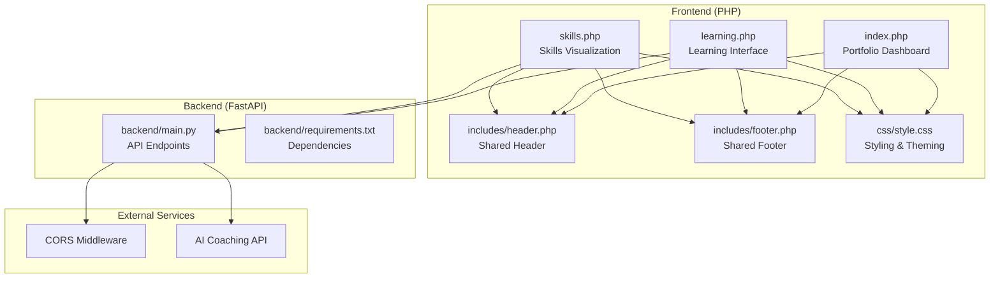
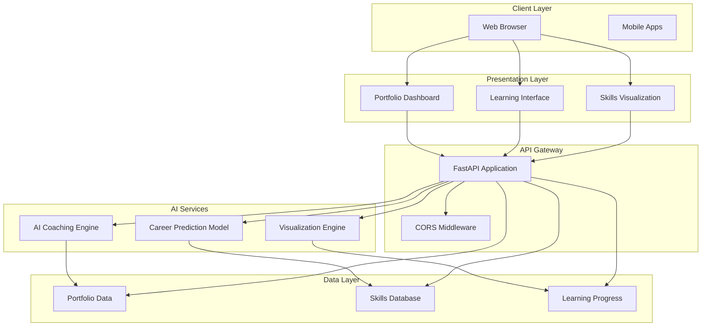
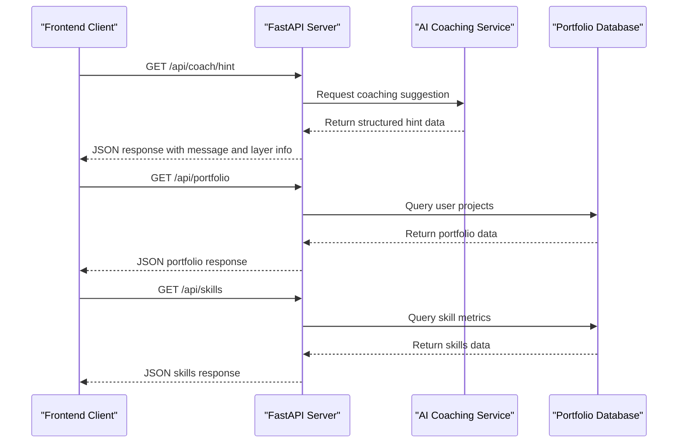
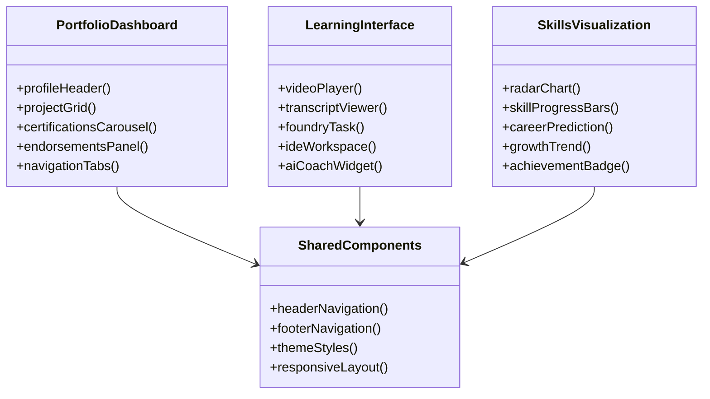
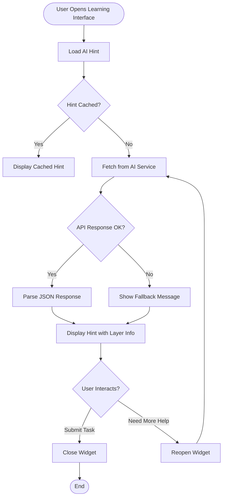
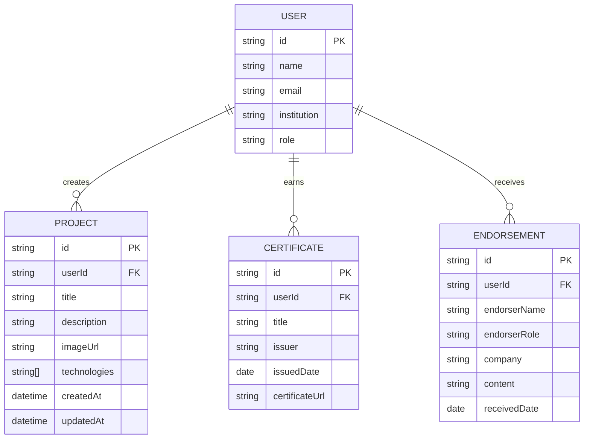
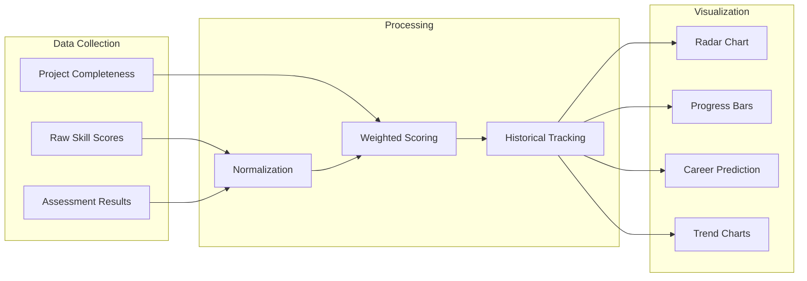
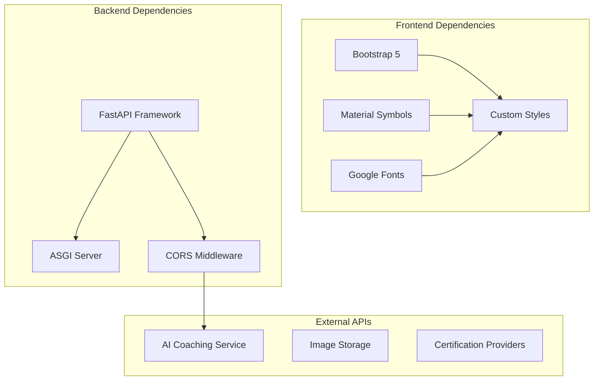

# Project Overview

<cite>
**Referenced Files in This Document**
- [backend/main.py](file://backend/main.py)
- [backend/requirements.txt](file://backend/requirements.txt)
- [frontend/index.php](file://frontend/index.php)
- [frontend/learning.php](file://frontend/learning.php)
- [frontend/skills.php](file://frontend/skills.php)
- [frontend/includes/header.php](file://frontend/includes/header.php)
- [frontend/includes/footer.php](file://frontend/includes/footer.php)
- [frontend/css/style.css](file://frontend/css/style.css)
</cite>

## Table of Contents
1. [Introduction](#introduction)
2. [Project Structure](#project-structure)
3. [Core Components](#core-components)
4. [Architecture Overview](#architecture-overview)
5. [Detailed Component Analysis](#detailed-component-analysis)
6. [Dependency Analysis](#dependency-analysis)
7. [Performance Considerations](#performance-considerations)
8. [Troubleshooting Guide](#troubleshooting-guide)
9. [Conclusion](#conclusion)
10. [Appendices](#appendices)

## Introduction
Octal Foundry is an AI-powered learning platform designed for AI engineering education. It combines a PHP-based frontend with a FastAPI backend to deliver an immersive learning experience centered around AI coaching, portfolio management, and skills visualization. The platform enables students to engage with AI-assisted learning workflows, track personal progress, and receive intelligent guidance during hands-on tasks.

Key capabilities include:
- AI coaching system that provides contextual hints and suggestions during learning tasks
- Portfolio dashboard showcasing projects, certifications, and industry endorsements
- Skills visualization through interactive charts and career prediction insights
- API-first backend design enabling scalable integration of AI services

## Project Structure
The project follows a clear separation of concerns with distinct frontend and backend components:

**Diagram sources**
- [frontend/index.php](file://frontend/index.php#L1-L174)
- [frontend/learning.php](file://frontend/learning.php#L1-L215)
- [frontend/skills.php](file://frontend/skills.php#L1-L189)
- [backend/main.py](file://backend/main.py#L1-L30)

**Section sources**
- [frontend/index.php](file://frontend/index.php#L1-L174)
- [frontend/learning.php](file://frontend/learning.php#L1-L215)
- [frontend/skills.php](file://frontend/skills.php#L1-L189)
- [backend/main.py](file://backend/main.py#L1-L30)

## Core Components
The platform consists of three primary UI components that work together to support the AI engineering learning journey:

### Portfolio Dashboard (index.php)
The portfolio dashboard serves as the central hub for learners, featuring:
- Personal profile with verification badge and download CV functionality
- Project showcase with technology tags and source code access
- Certifications carousel highlighting earned credentials
- Industry endorsements from professionals
- Navigation to learning and skills sections

### Learning Interface (learning.php)
The learning interface provides an immersive educational environment:
- Video player with progress tracking and interactive controls
- Transcript viewer with highlighted current position
- Foundry Task assignments with critical importance indicators
- Integrated IDE/workspace for code development
- AI Performance Coach widget with floating action button

### Skills Visualization (skills.php)
The skills dashboard offers comprehensive competency tracking:
- Interactive radar chart displaying technical proficiencies
- Progress bars for top skills with mastery percentages
- AI Career Prediction insights based on skill profiles
- Skill growth trend visualization over time
- Latest achievement recognition

**Section sources**
- [frontend/index.php](file://frontend/index.php#L23-L151)
- [frontend/learning.php](file://frontend/learning.php#L19-L149)
- [frontend/skills.php](file://frontend/skills.php#L18-L166)

## Architecture Overview
Octal Foundry implements a modern API-first architecture with clear separation between presentation and service layers:

**Diagram sources**
- [backend/main.py](file://backend/main.py#L1-L30)
- [frontend/learning.php](file://frontend/learning.php#L177-L212)
- [frontend/skills.php](file://frontend/skills.php#L100-L121)

The architecture follows these key principles:
- **API-first design**: All frontend interactions are handled through RESTful endpoints
- **Component-based UI**: Each page serves a distinct functional purpose
- **Separation of concerns**: Clear boundaries between presentation, business logic, and data layers
- **Scalable backend**: FastAPI provides efficient asynchronous processing capabilities

## Detailed Component Analysis

### Backend API Implementation
The FastAPI backend provides essential endpoints for AI coaching and data management:

**Diagram sources**
- [backend/main.py](file://backend/main.py#L19-L30)
- [frontend/learning.php](file://frontend/learning.php#L177-L212)

The backend implementation demonstrates:
- Minimal endpoint design focused on core functionality
- CORS middleware configuration for cross-origin requests
- Structured JSON responses for frontend consumption
- Scalable foundation for future AI service integration

**Section sources**
- [backend/main.py](file://backend/main.py#L1-L30)
- [backend/requirements.txt](file://backend/requirements.txt#L1-L3)

### Frontend Component Architecture
Each PHP page implements a cohesive component with shared header and footer:

**Diagram sources**
- [frontend/index.php](file://frontend/index.php#L25-L151)
- [frontend/learning.php](file://frontend/learning.php#L21-L149)
- [frontend/skills.php](file://frontend/skills.php#L19-L166)

**Section sources**
- [frontend/includes/header.php](file://frontend/includes/header.php#L1-L23)
- [frontend/includes/footer.php](file://frontend/includes/footer.php#L1-L7)
- [frontend/css/style.css](file://frontend/css/style.css#L1-L114)

### AI Coaching System Integration
The AI coaching system provides contextual assistance during learning tasks:

**Diagram sources**
- [frontend/learning.php](file://frontend/learning.php#L177-L212)
- [backend/main.py](file://backend/main.py#L23-L29)

The AI coaching integration features:
- Asynchronous API calls for non-blocking user experience
- Structured hint data with technical layer information
- Floating action button with tooltip bubble interface
- Automatic loading for demonstration purposes

**Section sources**
- [frontend/learning.php](file://frontend/learning.php#L152-L212)
- [backend/main.py](file://backend/main.py#L23-L29)

### Portfolio Management System
The portfolio dashboard manages user projects and achievements:

**Diagram sources**
- [frontend/index.php](file://frontend/index.php#L67-L102)
- [frontend/index.php](file://frontend/index.php#L109-L134)

**Section sources**
- [frontend/index.php](file://frontend/index.php#L25-L151)

### Skills Assessment and Visualization
The skills system tracks proficiency and provides career insights:

**Diagram sources**
- [frontend/skills.php](file://frontend/skills.php#L21-L56)
- [frontend/skills.php](file://frontend/skills.php#L100-L122)

**Section sources**
- [frontend/skills.php](file://frontend/skills.php#L18-L166)

## Dependency Analysis
The project maintains minimal external dependencies while leveraging modern web technologies:

**Diagram sources**
- [backend/requirements.txt](file://backend/requirements.txt#L1-L3)
- [frontend/includes/header.php](file://frontend/includes/header.php#L8-L18)

**Section sources**
- [backend/requirements.txt](file://backend/requirements.txt#L1-L3)
- [frontend/includes/header.php](file://frontend/includes/header.php#L8-L18)

## Performance Considerations
The platform is designed with performance optimization in mind:

### Frontend Performance
- **Lazy loading**: Images use responsive backgrounds with lazy loading
- **Minimal JavaScript**: Only essential scripts for AI coaching functionality
- **CSS-in-JS patterns**: Custom CSS variables for theme consistency
- **Responsive design**: Mobile-first approach with Bootstrap 5

### Backend Performance
- **Lightweight framework**: FastAPI provides high-performance async capabilities
- **Minimal endpoints**: Focused API surface reduces overhead
- **CORS optimization**: Configured for development flexibility
- **JSON responses**: Lightweight data transfer format

### Scalability Considerations
- **Microservice ready**: Clear separation between frontend and backend
- **API versioning**: Foundation for future endpoint evolution
- **Caching potential**: AI coaching responses suitable for caching strategies
- **Database abstraction**: Clean separation enables database migration

## Troubleshooting Guide

### Common Issues and Solutions

#### AI Coaching Not Loading
**Symptoms**: AI coach widget shows "offline" or "connection failed"
**Causes**: 
- Backend server not running on port 8000
- CORS configuration blocking requests
- Network connectivity issues

**Solutions**:
1. Verify backend is running: `python3 backend/main.py`
2. Check CORS configuration in FastAPI app
3. Ensure network connectivity between frontend and backend
4. Review browser console for detailed error messages

#### Portfolio Data Not Displaying
**Symptoms**: Empty project cards or missing certification information
**Causes**:
- Missing image URLs or broken links
- PHP include path issues
- CSS styling conflicts

**Solutions**:
1. Verify image URLs are accessible
2. Check file inclusion paths in PHP files
3. Inspect CSS specificity conflicts
4. Validate HTML structure integrity

#### Skills Visualization Issues
**Symptoms**: Radar chart not rendering or progress bars not updating
**Causes**:
- Canvas rendering problems
- JavaScript errors in chart initialization
- Missing data points

**Solutions**:
1. Check browser console for JavaScript errors
2. Verify SVG/CSS clip-path compatibility
3. Validate data structure format
4. Test with sample data points

**Section sources**
- [frontend/learning.php](file://frontend/learning.php#L177-L212)
- [backend/main.py](file://backend/main.py#L11-L17)

## Conclusion
Octal Foundry represents a well-architected AI-powered learning platform that successfully combines PHP frontend components with a FastAPI backend to deliver an engaging educational experience. The platform's modular design, API-first approach, and component-based UI provide a solid foundation for scaling and extending AI engineering education capabilities.

Key strengths include:
- Clear separation between presentation and service layers
- Practical implementation of AI coaching integration
- Comprehensive skills visualization system
- Responsive design optimized for learning workflows
- Scalable architecture supporting future AI service integration

The platform demonstrates effective use of modern web technologies while maintaining simplicity and focus on core educational objectives. Future enhancements could include expanded AI service integration, advanced analytics capabilities, and enhanced collaboration features.

## Appendices

### API Endpoint Reference
- `GET /`: Health check endpoint
- `GET /api/coach/hint`: AI coaching suggestion endpoint

### Technology Stack Summary
- **Frontend**: PHP, Bootstrap 5, Material Symbols, Custom CSS
- **Backend**: FastAPI, Uvicorn, CORS Middleware
- **Deployment**: Local development server configuration

### Development Setup
1. Install Python dependencies: `pip install -r backend/requirements.txt`
2. Start backend server: `python3 backend/main.py`
3. Access frontend through local web server
4. Configure CORS for development environment