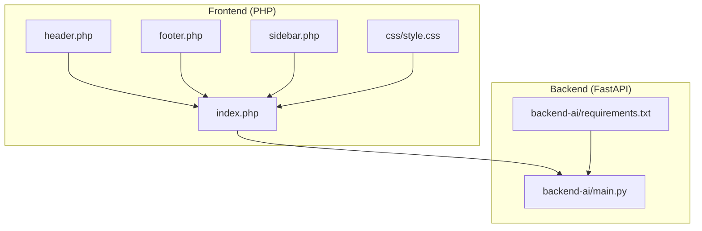
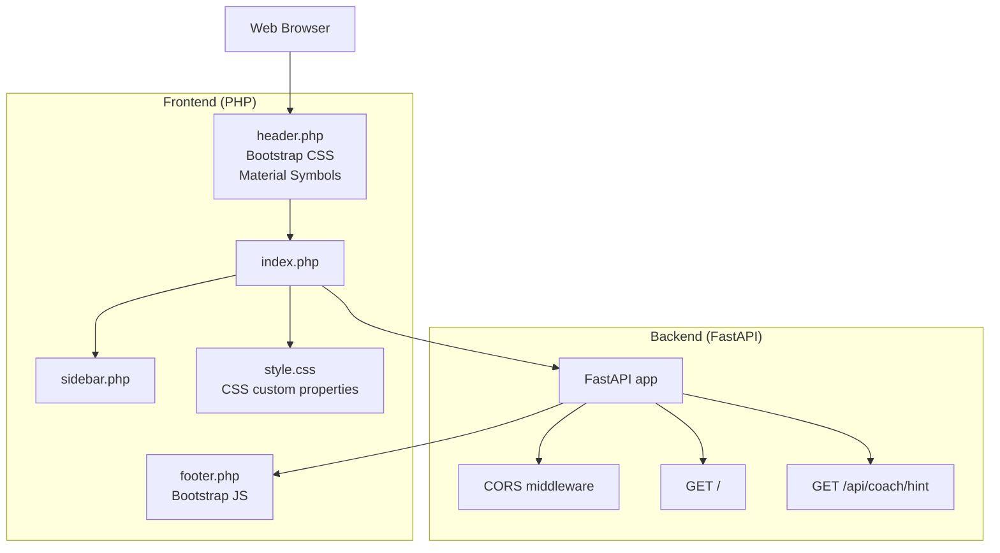
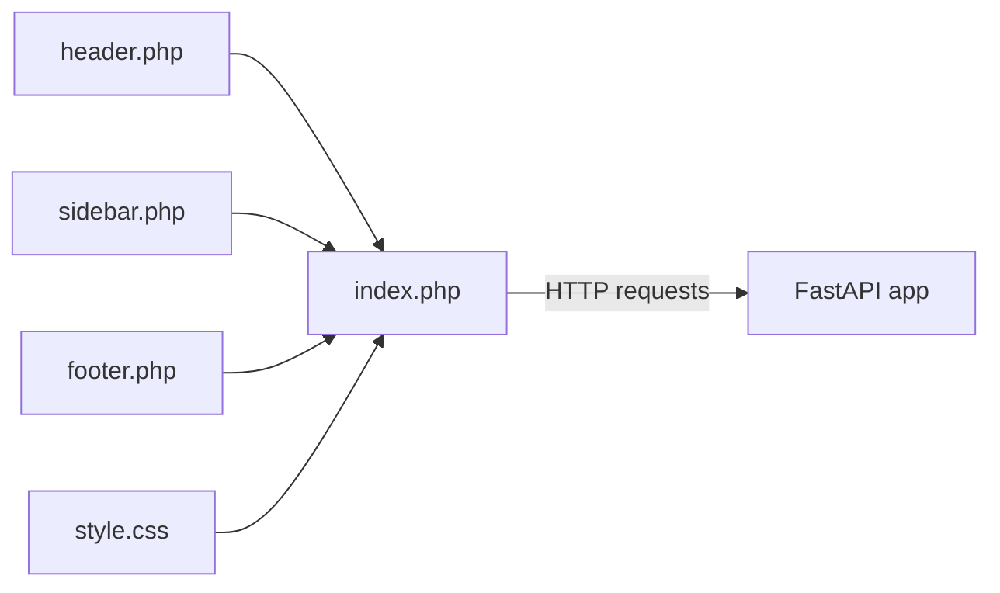
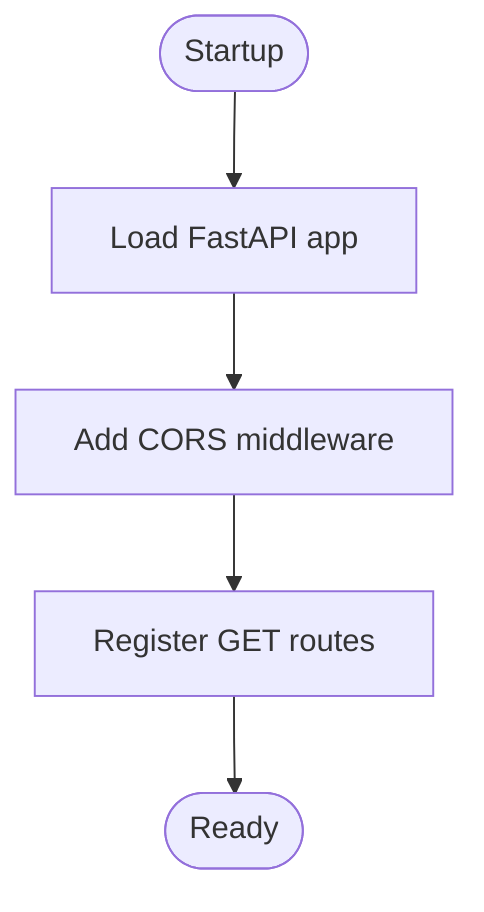
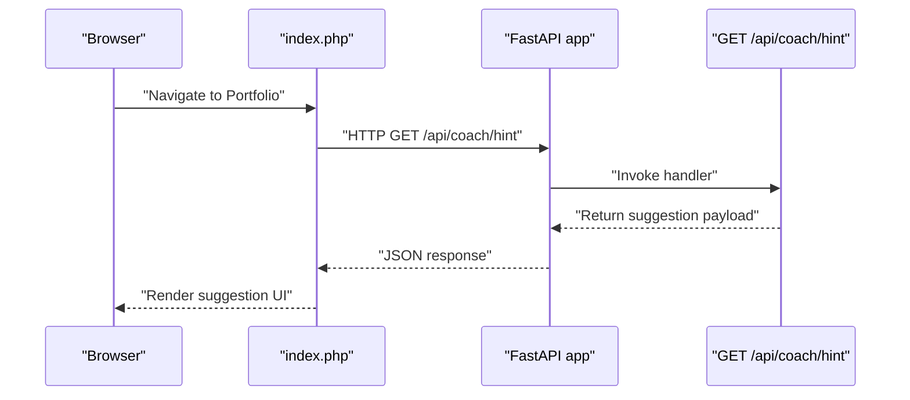
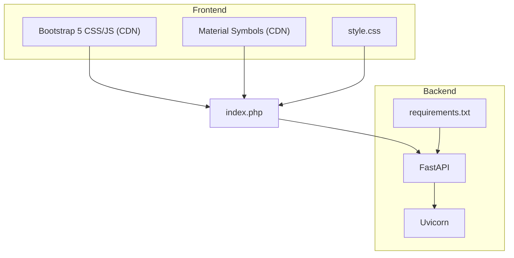

# Technology Stack

<cite>
**Referenced Files in This Document**
- [backend-ai/main.py](file://backend-ai/main.py)
- [backend-ai/requirements.txt](file://backend-ai/requirements.txt)
- [frontend-php/index.php](file://frontend-php/index.php)
- [frontend-php/css/style.css](file://frontend-php/css/style.css)
- [frontend-php/includes/header.php](file://frontend-php/includes/header.php)
- [frontend-php/includes/footer.php](file://frontend-php/includes/footer.php)
- [frontend-php/includes/sidebar.php](file://frontend-php/includes/sidebar.php)
</cite>

## Table of Contents
1. [Introduction](#introduction)
2. [Project Structure](#project-structure)
3. [Core Components](#core-components)
4. [Architecture Overview](#architecture-overview)
5. [Detailed Component Analysis](#detailed-component-analysis)
6. [Dependency Analysis](#dependency-analysis)
7. [Performance Considerations](#performance-considerations)
8. [Troubleshooting Guide](#troubleshooting-guide)
9. [Conclusion](#conclusion)

## Introduction
This document describes the technology stack used by Octal Foundry, focusing on the frontend and backend components, their integration, and the rationale behind each technology choice. It also outlines development environment setup, browser compatibility, and performance characteristics tailored for an educational platform that emphasizes responsive design, modern UI, and scalable API services.

## Project Structure
The project is organized into two primary areas:
- Frontend: PHP-based server-side rendered pages with shared includes for header, footer, and sidebar, styled via custom CSS and Bootstrap 5.
- Backend: A FastAPI service exposing REST endpoints, served by Uvicorn in production.

**Diagram sources**
- [frontend-php/includes/header.php](file://frontend-php/includes/header.php#L1-L71)
- [frontend-php/includes/footer.php](file://frontend-php/includes/footer.php#L1-L31)
- [frontend-php/includes/sidebar.php](file://frontend-php/includes/sidebar.php#L1-L81)
- [frontend-php/index.php](file://frontend-php/index.php#L1-L174)
- [frontend-php/css/style.css](file://frontend-php/css/style.css#L1-L114)
- [backend-ai/main.py](file://backend-ai/main.py#L1-L30)
- [backend-ai/requirements.txt](file://backend-ai/requirements.txt#L1-L3)

**Section sources**
- [frontend-php/index.php](file://frontend-php/index.php#L1-L174)
- [frontend-php/css/style.css](file://frontend-php/css/style.css#L1-L114)
- [frontend-php/includes/header.php](file://frontend-php/includes/header.php#L1-L71)
- [frontend-php/includes/footer.php](file://frontend-php/includes/footer.php#L1-L31)
- [frontend-php/includes/sidebar.php](file://frontend-php/includes/sidebar.php#L1-L81)
- [backend-ai/main.py](file://backend-ai/main.py#L1-L30)
- [backend-ai/requirements.txt](file://backend-ai/requirements.txt#L1-L3)

## Core Components
- Frontend rendering engine: PHP for server-side rendering, enabling dynamic content generation per request.
- UI framework: Bootstrap 5 for responsive grid, components, and JavaScript utilities.
- Iconography: Material Symbols for consistent, scalable icons across the interface.
- Theming and styling: Custom CSS with CSS custom properties for theme tokens and dark-mode styling.
- Backend API: FastAPI for building high-performance REST APIs with automatic OpenAPI documentation.
- Production server: Uvicorn ASGI server for serving the FastAPI app in production environments.
- Dependencies: Managed via pip requirements pinned to package names.

**Section sources**
- [frontend-php/index.php](file://frontend-php/index.php#L1-L174)
- [frontend-php/css/style.css](file://frontend-php/css/style.css#L1-L114)
- [frontend-php/includes/header.php](file://frontend-php/includes/header.php#L12-L18)
- [backend-ai/main.py](file://backend-ai/main.py#L1-L30)
- [backend-ai/requirements.txt](file://backend-ai/requirements.txt#L1-L3)

## Architecture Overview
The frontend is composed of PHP-rendered pages that include shared header, footer, and sidebar templates. Styling is centralized in a single stylesheet using CSS custom properties for theming. The backend exposes REST endpoints via FastAPI, with CORS configured for development flexibility. Requests from the frontend reach the backend through HTTP endpoints.

**Diagram sources**
- [frontend-php/includes/header.php](file://frontend-php/includes/header.php#L12-L18)
- [frontend-php/includes/footer.php](file://frontend-php/includes/footer.php#L4-L5)
- [frontend-php/includes/sidebar.php](file://frontend-php/includes/sidebar.php#L1-L81)
- [frontend-php/index.php](file://frontend-php/index.php#L1-L174)
- [frontend-php/css/style.css](file://frontend-php/css/style.css#L1-L114)
- [backend-ai/main.py](file://backend-ai/main.py#L1-L30)

## Detailed Component Analysis

### Frontend Technologies
- PHP server-side rendering: Pages are included via PHP includes, enabling reusable layouts and dynamic content selection based on the current page.
- Bootstrap 5: Used for responsive layout, navigation components, and interactive elements. The JS bundle is loaded from a CDN.
- Material Symbols: Icons are integrated via the Material Symbols web font and used consistently across headers, buttons, and navigation.
- Custom CSS and CSS custom properties: Centralized theming tokens define primary colors, backgrounds, and component styles. Utilities encapsulate common patterns like glass effects and dark-mode styling.

**Diagram sources**
- [frontend-php/includes/header.php](file://frontend-php/includes/header.php#L1-L71)
- [frontend-php/includes/footer.php](file://frontend-php/includes/footer.php#L1-L31)
- [frontend-php/includes/sidebar.php](file://frontend-php/includes/sidebar.php#L1-L81)
- [frontend-php/index.php](file://frontend-php/index.php#L1-L174)
- [frontend-php/css/style.css](file://frontend-php/css/style.css#L1-L114)
- [backend-ai/main.py](file://backend-ai/main.py#L1-L30)

**Section sources**
- [frontend-php/index.php](file://frontend-php/index.php#L1-L174)
- [frontend-php/css/style.css](file://frontend-php/css/style.css#L1-L114)
- [frontend-php/includes/header.php](file://frontend-php/includes/header.php#L12-L18)
- [frontend-php/includes/footer.php](file://frontend-php/includes/footer.php#L4-L5)
- [frontend-php/includes/sidebar.php](file://frontend-php/includes/sidebar.php#L1-L81)

### Backend Technologies
- FastAPI: Provides a modern, fast (ASGI) web framework for building APIs with automatic OpenAPI/Swagger documentation.
- Uvicorn: ASGI server used to serve the FastAPI application in production-like environments.
- CORS middleware: Configured to allow cross-origin requests during development; origins are set to localhost variants.

**Diagram sources**
- [backend-ai/main.py](file://backend-ai/main.py#L1-L30)

**Section sources**
- [backend-ai/main.py](file://backend-ai/main.py#L1-L30)
- [backend-ai/requirements.txt](file://backend-ai/requirements.txt#L1-L3)

### AI Integration Layer
The backend currently exposes a coaching hint endpoint intended to surface AI-driven suggestions. While the endpoint returns example content, the broader AI integration layer is designed around RESTful endpoints that can be extended to call external AI services. This approach allows the platform to remain flexible as AI capabilities evolve.

**Diagram sources**
- [backend-ai/main.py](file://backend-ai/main.py#L23-L29)
- [frontend-php/index.php](file://frontend-php/index.php#L1-L174)

**Section sources**
- [backend-ai/main.py](file://backend-ai/main.py#L23-L29)

## Dependency Analysis
- Frontend dependencies:
  - Bootstrap 5 CSS and JS bundles are loaded from a CDN.
  - Material Symbols font is loaded from a CDN.
  - Custom CSS depends on CSS custom properties defined in the stylesheet.
- Backend dependencies:
  - FastAPI and Uvicorn are declared in the requirements file.
  - The application registers CORS middleware and defines a few GET endpoints.

**Diagram sources**
- [frontend-php/includes/header.php](file://frontend-php/includes/header.php#L12-L18)
- [frontend-php/includes/footer.php](file://frontend-php/includes/footer.php#L4-L5)
- [frontend-php/css/style.css](file://frontend-php/css/style.css#L1-L114)
- [frontend-php/index.php](file://frontend-php/index.php#L1-L174)
- [backend-ai/requirements.txt](file://backend-ai/requirements.txt#L1-L3)
- [backend-ai/main.py](file://backend-ai/main.py#L1-L30)

**Section sources**
- [frontend-php/includes/header.php](file://frontend-php/includes/header.php#L12-L18)
- [frontend-php/includes/footer.php](file://frontend-php/includes/footer.php#L4-L5)
- [frontend-php/css/style.css](file://frontend-php/css/style.css#L1-L114)
- [backend-ai/requirements.txt](file://backend-ai/requirements.txt#L1-L3)
- [backend-ai/main.py](file://backend-ai/main.py#L1-L30)

## Performance Considerations
- Frontend performance:
  - Using a CDN for Bootstrap and Material Symbols reduces local asset overhead and benefits from global caching.
  - CSS custom properties enable efficient theming without duplicating styles.
  - Minimal JavaScript (Bootstrap bundle plus a small sidebar toggle script) keeps initial load low.
- Backend performance:
  - FastAPI’s ASGI nature enables high concurrency and efficient I/O handling.
  - Uvicorn is optimized for production deployments and integrates well with containerized environments.
- Scalability:
  - REST endpoints keep the frontend-backend contract simple and testable.
  - The AI integration layer remains modular and can be extended to offload heavy computation to external services.

[No sources needed since this section provides general guidance]

## Troubleshooting Guide
- CORS issues during development:
  - The backend allows all origins and headers for convenience in development. For production, restrict origins to trusted domains.
- Missing assets:
  - Verify CDN URLs for Bootstrap and Material Symbols are reachable from your environment.
- Styling anomalies:
  - Confirm CSS custom properties match the theme tokens defined in the stylesheet.
- Endpoint not found:
  - Ensure the route handlers are registered and the server is running on the expected port.

**Section sources**
- [backend-ai/main.py](file://backend-ai/main.py#L6-L17)
- [frontend-php/includes/header.php](file://frontend-php/includes/header.php#L12-L18)
- [frontend-php/css/style.css](file://frontend-php/css/style.css#L1-L114)

## Conclusion
Octal Foundry combines a pragmatic PHP-based frontend with a modern FastAPI backend to deliver a responsive, themed UI suitable for an educational platform. The stack balances developer productivity (PHP includes, Bootstrap utilities) with future extensibility (RESTful AI endpoints, Uvicorn deployment). By leveraging CDNs, CSS custom properties, and minimal JavaScript, the platform achieves a clean, maintainable foundation for growth.