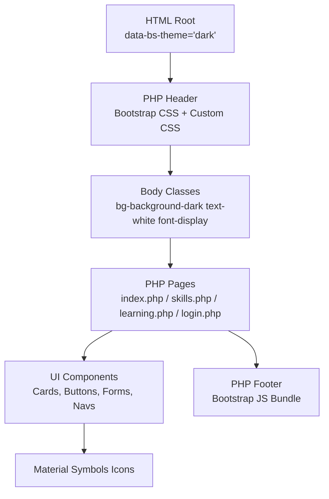
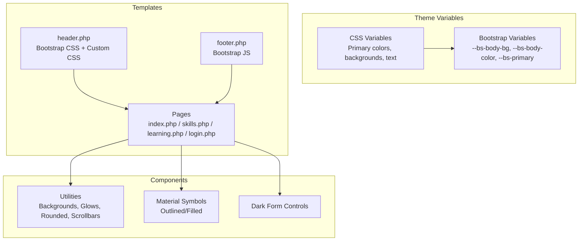
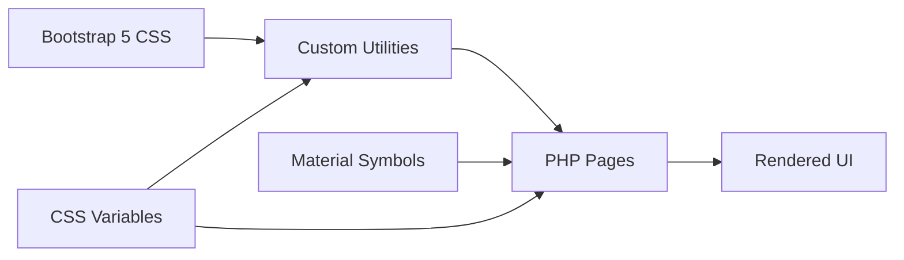

# Styling and Theming

<cite>
**Referenced Files in This Document**
- [style.css](file://frontend/css/style.css)
- [header.php](file://frontend/includes/header.php)
- [footer.php](file://frontend/includes/footer.php)
- [index.php](file://frontend/index.php)
- [skills.php](file://frontend/skills.php)
- [learning.php](file://frontend/learning.php)
- [login.php](file://frontend/login.php)
</cite>

## Table of Contents
1. [Introduction](#introduction)
2. [Project Structure](#project-structure)
3. [Core Components](#core-components)
4. [Architecture Overview](#architecture-overview)
5. [Detailed Component Analysis](#detailed-component-analysis)
6. [Dependency Analysis](#dependency-analysis)
7. [Performance Considerations](#performance-considerations)
8. [Troubleshooting Guide](#troubleshooting-guide)
9. [Conclusion](#conclusion)

## Introduction
This document describes the Octal Foundry styling and theming system. It explains how CSS custom properties are used for consistent theming, how Bootstrap 5 is integrated, and how Material Symbols icons are implemented. It also documents responsive design patterns, the utility class system, component styling approaches, and guidelines for maintaining design consistency across devices. Finally, it outlines integration with the PHP template system and provides cross-browser compatibility and performance optimization recommendations.

## Project Structure
The styling system is organized around a central custom stylesheet and shared PHP templates. Bootstrap 5 is included via CDN, and Material Symbols are loaded from Google Fonts. The PHP pages compose UI components using Bootstrap utility classes and custom CSS utilities.

**Diagram sources**
- [header.php](file://frontend/includes/header.php#L1-L23)
- [footer.php](file://frontend/includes/footer.php#L1-L7)
- [index.php](file://frontend/index.php#L1-L174)
- [skills.php](file://frontend/skills.php#L1-L189)
- [learning.php](file://frontend/learning.php#L1-L215)
- [login.php](file://frontend/login.php#L1-L94)

**Section sources**
- [header.php](file://frontend/includes/header.php#L1-L23)
- [footer.php](file://frontend/includes/footer.php#L1-L7)

## Core Components
- CSS custom properties define the theme palette and Bootstrap integration variables.
- Utility classes encapsulate common styles for backgrounds, typography, shadows, and spacing.
- Material Symbols classes provide consistent icon rendering across the app.
- Bootstrap 5 integration is achieved via CDN and custom overrides for dark mode.

Key implementation references:
- Theme variables and Bootstrap integration: [style.css](file://frontend/css/style.css#L1-L11)
- Typography utilities: [style.css](file://frontend/css/style.css#L18-L24)
- Background utilities: [style.css](file://frontend/css/style.css#L26-L37)
- Glass effect utilities: [style.css](file://frontend/css/style.css#L39-L50)
- Color utilities and glows: [style.css](file://frontend/css/style.css#L52-L75)
- Rounded and scrollbar utilities: [style.css](file://frontend/css/style.css#L77-L87)
- Material Symbols classes: [style.css](file://frontend/css/style.css#L89-L97)
- Dark form controls: [style.css](file://frontend/css/style.css#L99-L113)
- Page-level usage of utilities and components: [index.php](file://frontend/index.php#L4-L171), [skills.php](file://frontend/skills.php#L4-L186), [learning.php](file://frontend/learning.php#L4-L214), [login.php](file://frontend/login.php#L4-L91)

**Section sources**
- [style.css](file://frontend/css/style.css#L1-L114)
- [index.php](file://frontend/index.php#L1-L174)
- [skills.php](file://frontend/skills.php#L1-L189)
- [learning.php](file://frontend/learning.php#L1-L215)
- [login.php](file://frontend/login.php#L1-L94)

## Architecture Overview
The theming architecture centers on CSS custom properties that mirror Bootstrap’s theme variables. The PHP templates load Bootstrap and the custom stylesheet, then render UI components using Bootstrap utility classes and custom utilities. Material Symbols are rendered consistently through dedicated CSS classes.

**Diagram sources**
- [style.css](file://frontend/css/style.css#L1-L114)
- [header.php](file://frontend/includes/header.php#L1-L23)
- [footer.php](file://frontend/includes/footer.php#L1-L7)
- [index.php](file://frontend/index.php#L1-L174)
- [skills.php](file://frontend/skills.php#L1-L189)
- [learning.php](file://frontend/learning.php#L1-L215)
- [login.php](file://frontend/login.php#L1-L94)

## Detailed Component Analysis

### CSS Custom Properties and Bootstrap Integration
- Theme variables define primary colors, backgrounds, and text colors.
- Bootstrap variables are mapped to theme variables to ensure consistent theming across Bootstrap components.
- The root element sets the Bootstrap theme to dark, enabling dark mode styling.

Implementation references:
- Theme variables: [style.css](file://frontend/css/style.css#L1-L11)
- Bootstrap theme attribute: [header.php](file://frontend/includes/header.php#L2-L2)

Guidelines:
- Use theme variables for all colors to maintain consistency.
- Prefer Bootstrap utility classes for layout and spacing; override selectively with custom utilities.

**Section sources**
- [style.css](file://frontend/css/style.css#L1-L11)
- [header.php](file://frontend/includes/header.php#L1-L23)

### Material Symbols Icon Usage
- Dedicated CSS classes normalize icon rendering for outlined and filled variants.
- Icons are embedded as inline SVG spans or via Material Symbols classes depending on the component.

Implementation references:
- Material Symbols classes: [style.css](file://frontend/css/style.css#L89-L97)
- Usage in navigation and buttons: [index.php](file://frontend/index.php#L7-L18), [skills.php](file://frontend/skills.php#L6-L16), [learning.php](file://frontend/learning.php#L5-L16), [login.php](file://frontend/login.php#L5-L60)

Best practices:
- Prefer the Material Symbols classes for consistent sizing and weight.
- Use filled vs outlined variants to convey emphasis or state.

**Section sources**
- [style.css](file://frontend/css/style.css#L89-L97)
- [index.php](file://frontend/index.php#L1-L174)
- [skills.php](file://frontend/skills.php#L1-L189)
- [learning.php](file://frontend/learning.php#L1-L215)
- [login.php](file://frontend/login.php#L1-L94)

### Utility Class System
- Background utilities: dark backgrounds and card backgrounds.
- Text and background color utilities: primary blue and orange.
- Glows and rounded utilities for visual effects.
- Scrollbar hiding utility for mobile-friendly scrolling.

Implementation references:
- Background utilities: [style.css](file://frontend/css/style.css#L26-L37)
- Color utilities and glows: [style.css](file://frontend/css/style.css#L52-L75)
- Rounded and scrollbars: [style.css](file://frontend/css/style.css#L77-L87)

Usage examples:
- Apply background utilities to containers and cards: [index.php](file://frontend/index.php#L4-L171), [skills.php](file://frontend/skills.php#L4-L186), [learning.php](file://frontend/learning.php#L4-L214), [login.php](file://frontend/login.php#L4-L91)

**Section sources**
- [style.css](file://frontend/css/style.css#L26-L87)
- [index.php](file://frontend/index.php#L1-L174)
- [skills.php](file://frontend/skills.php#L1-L189)
- [learning.php](file://frontend/learning.php#L1-L215)
- [login.php](file://frontend/login.php#L1-L94)

### Responsive Design Patterns
- Flexbox utilities drive responsive layouts across breakpoints.
- Sticky and fixed positioning are used for persistent UI elements.
- Scrollable horizontal sections use overflow and custom scrollbar utilities.

Implementation references:
- Flex utilities and sticky/fixed bars: [index.php](file://frontend/index.php#L4-L21), [skills.php](file://frontend/skills.php#L4-L169), [learning.php](file://frontend/learning.php#L4-L175)
- Horizontal scrolling cards: [index.php](file://frontend/index.php#L109-L134), [skills.php](file://frontend/skills.php#L169-L186)

Responsive guidelines:
- Use Bootstrap’s flex utilities for alignment and wrapping.
- Apply overflow and hidden utilities for scrollable content.
- Test sticky/fixed elements on smaller screens to ensure usability.

**Section sources**
- [index.php](file://frontend/index.php#L1-L174)
- [skills.php](file://frontend/skills.php#L1-L189)
- [learning.php](file://frontend/learning.php#L1-L215)

### Component Styling Approaches
- Cards: dark backgrounds, borders, rounded corners, and shadows.
- Buttons: themed colors, rounded shapes, shadows, and hover states.
- Badges: colored backgrounds with uppercase labels and tight spacing.
- Progress bars and gradients: layered visual indicators.

Implementation references:
- Cards and badges: [index.php](file://frontend/index.php#L68-L101)
- Buttons and tabs: [index.php](file://frontend/index.php#L44-L58), [skills.php](file://frontend/skills.php#L64-L96)
- Progress and gradients: [skills.php](file://frontend/skills.php#L64-L96, file://frontend/skills.php#L100-L122)

**Section sources**
- [index.php](file://frontend/index.php#L1-L174)
- [skills.php](file://frontend/skills.php#L1-L189)

### Form Overrides and Dark Mode
- Dark form controls override default Bootstrap styles with custom backgrounds, borders, and focus states.
- Placeholder colors and focus glow use theme variables.

Implementation references:
- Dark form controls: [style.css](file://frontend/css/style.css#L99-L113)
- Usage in login page: [login.php](file://frontend/login.php#L26-L60)

**Section sources**
- [style.css](file://frontend/css/style.css#L99-L113)
- [login.php](file://frontend/login.php#L1-L94)

### PHP Template Integration
- The header loads Bootstrap CSS and the custom stylesheet, sets the dark theme attribute, and applies global body classes.
- Footer includes the Bootstrap JS bundle.
- Pages include the header and footer and compose UI using Bootstrap utilities and custom classes.

Implementation references:
- Header and footer: [header.php](file://frontend/includes/header.php#L1-L23), [footer.php](file://frontend/includes/footer.php#L1-L7)
- Page composition: [index.php](file://frontend/index.php#L1-L174), [skills.php](file://frontend/skills.php#L1-L189), [learning.php](file://frontend/learning.php#L1-L215), [login.php](file://frontend/login.php#L1-L94)

**Section sources**
- [header.php](file://frontend/includes/header.php#L1-L23)
- [footer.php](file://frontend/includes/footer.php#L1-L7)
- [index.php](file://frontend/index.php#L1-L174)
- [skills.php](file://frontend/skills.php#L1-L189)
- [learning.php](file://frontend/learning.php#L1-L215)
- [login.php](file://frontend/login.php#L1-L94)

## Dependency Analysis
The styling system depends on:
- Bootstrap 5 CSS for base components and utilities.
- Custom CSS for theme variables, utilities, and overrides.
- Material Symbols fonts for iconography.
- PHP templates to assemble UI and apply classes.

**Diagram sources**
- [header.php](file://frontend/includes/header.php#L14-L18)
- [style.css](file://frontend/css/style.css#L1-L114)
- [index.php](file://frontend/index.php#L1-L174)
- [skills.php](file://frontend/skills.php#L1-L189)
- [learning.php](file://frontend/learning.php#L1-L215)
- [login.php](file://frontend/login.php#L1-L94)

**Section sources**
- [header.php](file://frontend/includes/header.php#L1-L23)
- [style.css](file://frontend/css/style.css#L1-L114)
- [index.php](file://frontend/index.php#L1-L174)
- [skills.php](file://frontend/skills.php#L1-L189)
- [learning.php](file://frontend/learning.php#L1-L215)
- [login.php](file://frontend/login.php#L1-L94)

## Performance Considerations
- Load order: Bootstrap CSS before custom CSS to ensure overrides take effect.
- Minimize inline styles: Prefer utility classes and custom CSS for maintainability and caching.
- Font loading: Preconnect and preload fonts to reduce render-blocking.
- Icon delivery: Use Material Symbols classes to avoid extra assets while ensuring consistent rendering.
- Lazy loading: Defer non-critical images and scripts where appropriate.

[No sources needed since this section provides general guidance]

## Troubleshooting Guide
- Theme not applying: Verify the root element has the dark theme attribute and custom variables are defined.
- Icons not rendering: Confirm Material Symbols stylesheet is loaded and classes are applied correctly.
- Form controls not styled: Ensure the dark form control class is present and custom overrides are loaded.
- Layout shifts: Check for missing utility classes causing unexpected wrapping or overflow.

Common checks:
- Bootstrap theme attribute: [header.php](file://frontend/includes/header.php#L2-L2)
- Custom variables: [style.css](file://frontend/css/style.css#L1-L11)
- Material Symbols classes: [style.css](file://frontend/css/style.css#L89-L97)
- Dark form controls: [style.css](file://frontend/css/style.css#L99-L113)

**Section sources**
- [header.php](file://frontend/includes/header.php#L1-L23)
- [style.css](file://frontend/css/style.css#L1-L114)

## Conclusion
Octal Foundry’s styling and theming system leverages CSS custom properties to unify the design language, integrates Bootstrap 5 for robust component utilities, and standardizes iconography with Material Symbols. The PHP templates consistently apply these styles across pages, enabling responsive, maintainable UI composition. Following the guidelines here ensures design consistency across devices and improves performance and accessibility.